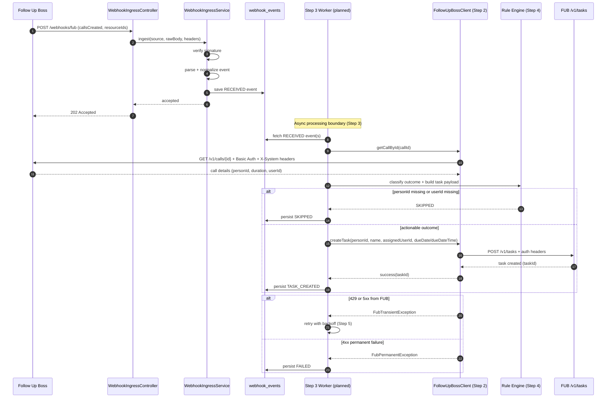
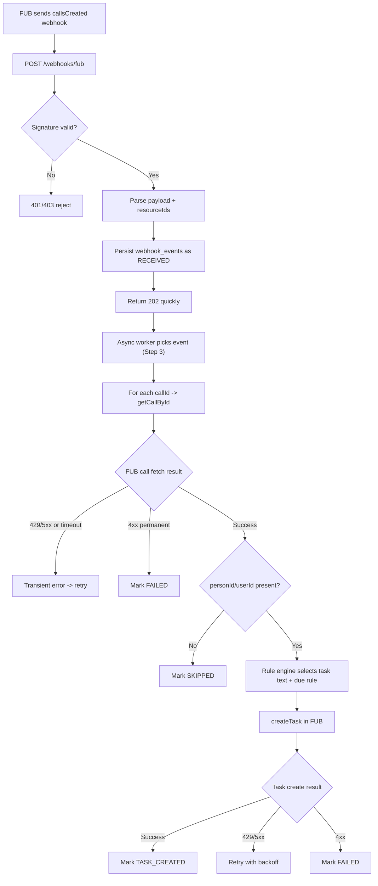

# Scenario 1 Step 2 Runtime Flow Diagrams

## Sequence diagram

```mermaid
sequenceDiagram
    autonumber
    participant FUB as Follow Up Boss
    participant API as WebhookIngressController
    participant Ingress as WebhookIngressService
    participant DB as webhook_events
    participant Worker as Step 3 Worker (planned)
    participant Client as FollowUpBossClient (Step 2)
    participant Rules as Rule Engine (Step 4)
    participant Tasks as FUB /v1/tasks

    FUB->>API: POST /webhooks/fub (callsCreated, resourceIds)
    API->>Ingress: ingest(source, rawBody, headers)
    Ingress->>Ingress: verify signature
    Ingress->>Ingress: parse + normalize event
    Ingress->>DB: save RECEIVED event
    Ingress-->>API: accepted
    API-->>FUB: 202 Accepted

    Note over Worker: Async processing boundary (Step 3)
    Worker->>DB: fetch RECEIVED event(s)
    Worker->>Client: getCallById(callId)
    Client->>FUB: GET /v1/calls/{id} + Basic Auth + X-System headers
    FUB-->>Client: call details (personId, duration, userId)

    Worker->>Rules: classify outcome + build task payload
    alt personId missing or userId missing
        Rules-->>Worker: SKIPPED
        Worker->>DB: persist SKIPPED
    else actionable outcome
        Worker->>Client: createTask(personId, name, assignedUserId, dueDate/dueDateTime)
        Client->>Tasks: POST /v1/tasks + auth headers
        Tasks-->>Client: task created (taskId)
        Client-->>Worker: success(taskId)
        Worker->>DB: persist TASK_CREATED
    end

    alt 429 or 5xx from FUB
        Client-->>Worker: FubTransientException
        Worker->>Worker: retry with backoff (Step 5)
    else 4xx permanent failure
        Client-->>Worker: FubPermanentException
        Worker->>DB: persist FAILED
    end
```

## Flowchart diagram

```mermaid
flowchart TD
    A["FUB sends callsCreated webhook"] --> B["POST /webhooks/fub"]
    B --> C{"Signature valid?"}
    C -- "No" --> C1["401/403 reject"]
    C -- "Yes" --> D["Parse payload + resourceIds"]
    D --> E["Persist webhook_events as RECEIVED"]
    E --> F["Return 202 quickly"]
    F --> G["Async worker picks event (Step 3)"]
    G --> H["For each callId -> getCallById"]
    H --> I{"FUB call fetch result"}
    I -- "429/5xx or timeout" --> I1["Transient error -> retry"]
    I -- "4xx permanent" --> I2["Mark FAILED"]
    I -- "Success" --> J{"personId/userId present?"}
    J -- "No" --> J1["Mark SKIPPED"]
    J -- "Yes" --> K["Rule engine selects task text + due rule"]
    K --> L["createTask in FUB"]
    L --> M{"Task create result"}
    M -- "Success" --> M1["Mark TASK_CREATED"]
    M -- "429/5xx" --> M2["Retry with backoff"]
    M -- "4xx" --> M3["Mark FAILED"]
```
