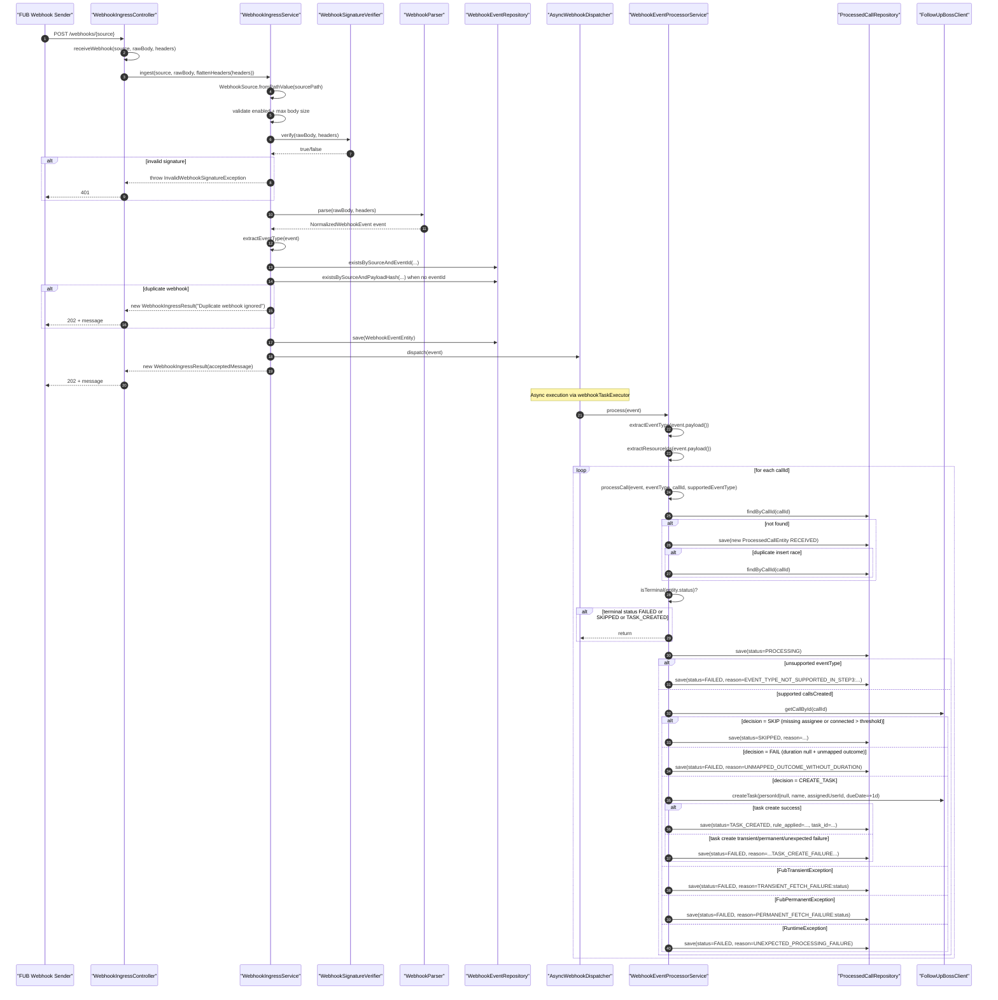

# Step 3 Method-Mapped Sequence Diagram

This diagram maps the runtime flow directly to methods in the current implementation:
- `WebhookIngressController.receiveWebhook(...)`
- `WebhookIngressService.ingest(...)`
- `AsyncWebhookDispatcher.dispatch(...)`
- `WebhookEventProcessorService.process(...)` / `processCall(...)`

