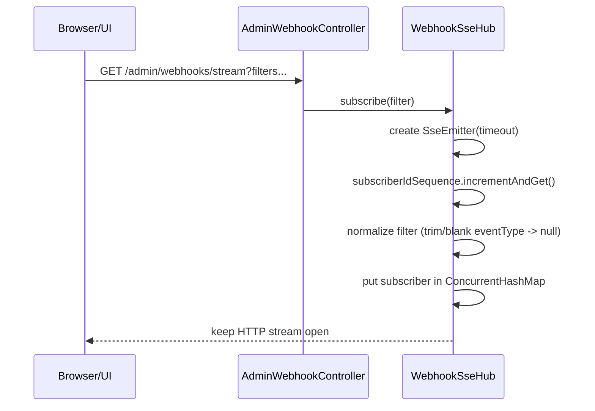
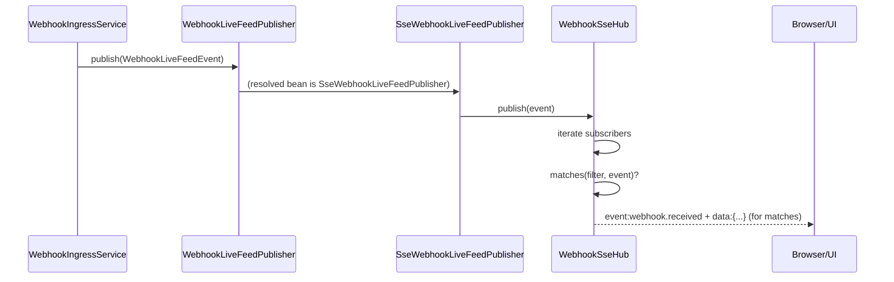
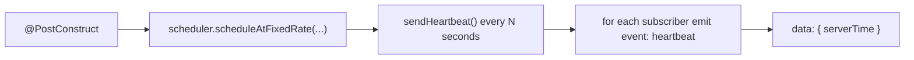

# Phase 3 Technical Deep-Dive: Webhook SSE Internal Mechanism

## Purpose
This document explains how the webhook live stream works internally, including:
- Spring lifecycle and singleton scope
- `WebhookSseHub` internals
- SSE connection and publish flows
- Threading/concurrency behavior
- Failure handling and cleanup

This combines the implementation view with your mental model, with precise corrections where needed.

## Key Classes
- `WebhookSseHub`  
  `/src/main/java/com/fuba/automation_engine/service/webhook/live/WebhookSseHub.java`
- `SseWebhookLiveFeedPublisher`  
  `/src/main/java/com/fuba/automation_engine/service/webhook/live/SseWebhookLiveFeedPublisher.java`
- `AdminWebhookController` (`/admin/webhooks/stream`)  
  `/src/main/java/com/fuba/automation_engine/controller/AdminWebhookController.java`
- `WebhookIngressService` (post-save publish hook)  
  `/src/main/java/com/fuba/automation_engine/service/webhook/WebhookIngressService.java`
- `WebhookProperties` (`webhook.live-feed.*`)  
  `/src/main/java/com/fuba/automation_engine/config/WebhookProperties.java`

## High-Level Architecture

```mermaid
flowchart LR
  A["Webhook Source (FUB)"] --> B["POST /webhooks/fub"]
  B --> C["WebhookIngressService"]
  C --> D["Persist webhook_events row"]
  D --> E["WebhookLiveFeedPublisher.publish(...)"]
  E --> F["SseWebhookLiveFeedPublisher"]
  F --> G["WebhookSseHub.publish(...)"]
  G --> H["Active SSE Subscribers (SseEmitter map)"]
  H --> I["Browser Live Feed UI"]
```


## Spring Lifecycle and Scope
1. Application starts and Spring component scanning finds `@Component` beans.
2. `WebhookSseHub` is a singleton bean (default Spring scope): one instance per app process.
3. Its fields are initialized once:
- `subscribers` (`ConcurrentHashMap<Long, Subscriber>`)
- `subscriberIdSequence` (`AtomicLong`)
- `scheduler` (`ScheduledExecutorService`, single daemon thread)
4. `@PostConstruct` runs and starts heartbeat scheduling.

Important scope note:
- This is per application instance/JVM.
- In multi-instance deployment, each instance has its own local subscriber map and heartbeat scheduler.

## Internal State Objects
### `subscribers`
- Type: `ConcurrentHashMap<Long, Subscriber>`
- Holds all active stream clients for this app instance.
- Each value stores:
- `id`
- `filter` (`source`, `status`, `eventType`)
- `emitter` (`SseEmitter`)

### `subscriberIdSequence`
- Type: `AtomicLong`
- Monotonic id generator for subscription entries.
- Used for map keying and log correlation.

### `scheduler`
- Type: single-thread `ScheduledExecutorService` (daemon thread).
- Sends `heartbeat` events periodically.

## Concurrency Model (Important Correction)
Your understanding was close; this is the exact behavior:
- `ConcurrentHashMap` means multiple threads **can** access map safely in parallel.
- It does **not** block all other threads from access.
- Access is thread-safe for concurrent reads/writes and iteration during fanout.

Likely participating threads:
- HTTP request thread for `/admin/webhooks/stream` subscribe
- HTTP request thread for webhook ingest publish path
- Background heartbeat thread (`webhook-sse-heartbeat`)

## SSE Transport Basics
SSE uses one long-lived HTTP response:
- Endpoint: `GET /admin/webhooks/stream`
- Content type: `text/event-stream`
- Connection remains open

Server emits blocks like:
```text
event: webhook.received
data: {"id":123,"eventId":"evt-1","source":"FUB","eventType":"callsCreated","status":"RECEIVED","receivedAt":"2026-03-18T...Z"}

event: heartbeat
data: {"serverTime":"2026-03-18T...Z"}
```

## Subscription Flow (Detailed)


`subscribe(...)` also attaches lifecycle callbacks:
- `onCompletion` -> remove subscriber
- `onTimeout` -> remove + complete
- `onError` -> remove subscriber

## Publish Flow (Detailed)


Filtering logic:
- If filter `source` is set, event source must match.
- If filter `status` is set, event status must match.
- If filter `eventType` is set, eventType string must match.

## Heartbeat Flow


Configured by:
- `webhook.live-feed.heartbeat-seconds` (default `15`)
- `webhook.live-feed.emitter-timeout-ms` (default `1800000`)

## Failure Handling
### Ingress publish safety
`WebhookIngressService.publishLiveFeed(...)` wraps publisher call in `try/catch`.
- If publish fails, ingest still succeeds (best-effort live delivery).

### Per-subscriber send failure
Inside `WebhookSseHub.sendToSubscriber(...)`:
- catches `IOException` / `IllegalStateException`
- removes that subscriber from map
- completes emitter with error

This prevents one bad client from affecting others.

## No Subscriber Case
When there are zero subscribers:
- `publish(...)` runs and iterates over empty map (no emit)
- heartbeat runs and emits to nobody
- no errors and no retries
- data is still available in history API (`GET /admin/webhooks`)

## Validated Understanding (Combined)
Your explanation is correct with these precise statements:
1. `WebhookSseHub` is discovered by Spring and created as a singleton bean.
2. Hub state (`subscribers`, `subscriberIdSequence`, `scheduler`) is per app instance.
3. `ConcurrentHashMap` is thread-safe for concurrent access (not single-thread exclusive).
4. `@PostConstruct` starts heartbeat daemon scheduling in background.
5. On browser connect, a new `SseEmitter` is created, callbacks attached, and stored in map.
6. On publish, hub matches subscribers by filter and emits SSE named events.
7. On disconnect/error/timeout/send failure, subscriber is removed.

## Current Observability
Stream logs now include:
- subscriber connected/disconnected with active count
- event publish fanout summary (`deliveredSubscribers`, `activeSubscribers`)

## Testing Coverage (Phase 3)
- `WebhookSseHubTest`:
- filter fanout behavior
- send failure cleanup
- heartbeat emission
- `AdminWebhooksStreamFlowTest`:
- subscribe -> ingest -> receive `webhook.received`
- heartbeat observation
- duplicate ingest does not duplicate stream event
- disconnect cleanup

