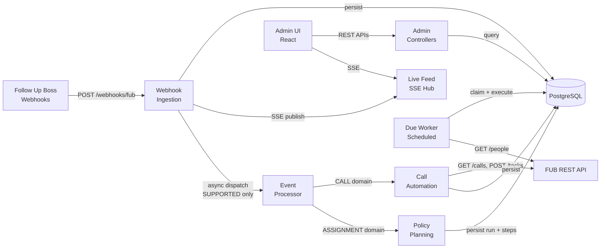

# Architecture Overview (Backend)

## Layered architecture pattern

The backend follows a **hexagonal / ports-and-adapters** pattern layered as:

```
Controller (HTTP concerns)
    ↓
Service (orchestration / business logic)
    ↓
Port (interface contract)
    ↓
Adapter (provider-specific implementation)
    ↓
Repository / External API
```

## Package structure

```
com.fuba.automation_engine/
├── AutomationEngineApplication.java          ← Spring Boot entry point
├── config/                                    ← Configuration beans and property classes
│   ├── FubClientProperties                   ← FUB API connection config
│   ├── WebhookProperties                     ← Webhook ingestion config
│   ├── CallOutcomeRulesProperties            ← Call decision rules config
│   ├── PolicyWorkerProperties                ← Due worker config
│   ├── FubRetryProperties                    ← Retry policy config
│   ├── HttpClientConfig                      ← RestClient.Builder bean
│   ├── JacksonConfig                         ← ObjectMapper bean
│   ├── TimeConfig                            ← Clock.systemUTC() bean
│   ├── WebhookAsyncConfig                    ← Async thread pool for webhook dispatch
│   └── PolicyWorkerSchedulingConfig          ← Enables @Scheduled
├── controller/                                ← HTTP endpoints
│   ├── WebhookIngressController              ← POST /webhooks/{source}
│   ├── AdminWebhookController                ← GET /admin/webhooks, stream
│   ├── ProcessedCallAdminController          ← GET/POST /admin/processed-calls
│   ├── AdminPolicyController                 ← CRUD /admin/policies
│   ├── AdminPolicyExecutionController        ← GET /admin/policy-executions
│   ├── HealthController                      ← GET /health
│   ├── TasksController                       ← POST /tasks (manual)
│   └── dto/                                  ← Request/response DTOs (13 classes)
├── service/
│   ├── FollowUpBossClient                    ← Port interface for FUB API
│   ├── model/                                ← Domain models (CallDetails, PersonDetails, etc.)
│   ├── webhook/
│   │   ├── WebhookIngressService             ← Main ingestion orchestrator
│   │   ├── WebhookEventProcessorService      ← Domain routing + call/assignment processing
│   │   ├── AdminWebhookService               ← Webhook feed queries
│   │   ├── ProcessedCallAdminService         ← Processed call queries + replay
│   │   ├── WebhookFeedCursorCodec            ← Cursor encoding for pagination
│   │   ├── parse/                            ← WebhookParser interface + FubWebhookParser
│   │   ├── security/                         ← WebhookSignatureVerifier + FubWebhookSignatureVerifier
│   │   ├── support/                          ← WebhookEventSupportResolver + StaticResolver
│   │   ├── dispatch/                         ← WebhookDispatcher + AsyncWebhookDispatcher
│   │   ├── live/                             ← WebhookLiveFeedPublisher + WebhookSseHub
│   │   └── model/                            ← NormalizedWebhookEvent, enums
│   └── policy/
│       ├── AutomationPolicyService           ← Policy CRUD + activation
│       ├── PolicyExecutionManager            ← Planning orchestrator
│       ├── PolicyStepExecutionService        ← Step execution + transitions
│       ├── PolicyExecutionDueWorker          ← Scheduled worker
│       ├── AdminPolicyExecutionService       ← Execution feed queries
│       ├── PolicyBlueprintValidator          ← Blueprint JSON validation
│       ├── PolicyExecutionMaterializationContract ← Step template definitions
│       ├── PolicyStepTransitionContract      ← Transition map
│       ├── PolicyExecutionCursorCodec        ← Cursor encoding
│       ├── WaitAndCheckClaimStepExecutor     ← Claim check executor
│       ├── WaitAndCheckCommunicationStepExecutor ← Communication check executor
│       ├── OnCommunicationMissActionStepExecutor ← Action executor (target-validated, log-only adapter execution in dev)
│       └── (context, result, request, outcome records)
├── client/fub/
│   ├── FubFollowUpBossClient                 ← Adapter: FUB REST API client
│   └── dto/                                  ← FUB API request/response DTOs
├── rules/
│   ├── CallPreValidationService              ← Call data validation
│   ├── CallDecisionEngine                    ← Call outcome decision rules
│   ├── CallbackTaskCommandFactory            ← Task creation command builder
│   └── (ValidatedCallContext, CallDecision, etc.)
├── persistence/
│   ├── entity/                               ← JPA entities (5) + enums (4)
│   └── repository/                           ← JPA repositories (5) + JDBC impls (2)
└── exception/                                ← Custom exception classes (7)
```

## High-level system flow


