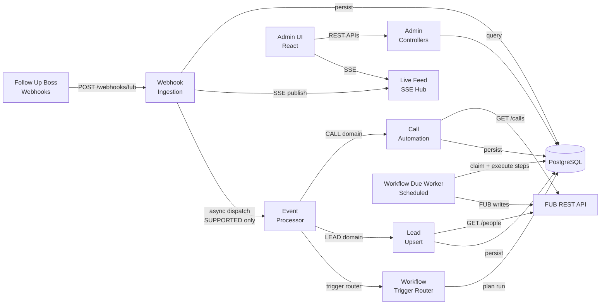

# Architecture Overview (Backend)

> ⚠️ **Staleness banner (2026-06-03).** This deep-dive set predates the **Lead→Person rename (V21)** and the **domain-events feature** (typed domain events / Rail 2, the `events` table V22, `workflow_runs.domain_event_id` V23, the engine-echo gate, and run-supersede). Where it describes webhooks triggering workflows directly, a `leads` table / `sourceLeadId`, a 5-method FUB client, or the legacy policy engine as live, treat it as historical. Current sources: [`../features/domain-events/overview.md`](../features/domain-events/overview.md), [`../features/domain-events/current-wiring.md`](../features/domain-events/current-wiring.md), and the latest Flyway migrations (V23). A full content refresh of this set is pending.

## Layered architecture pattern

The backend follows a **hexagonal / ports-and-adapters** pattern layered as:

```
Controller (HTTP concerns)
    ↓
Service (orchestration / business logic)
    ↓
Port (interface contract)
    ↓
Adapter (provider-specific implementation)
    ↓
Repository / External API
```

## Package structure

```
com.fuba.automation_engine/
├── AutomationEngineApplication.java          ← Spring Boot entry point
├── config/                                    ← Configuration beans and property classes
│   ├── FubClientProperties                   ← FUB API connection config
│   ├── WebhookProperties                     ← Webhook ingestion config
│   ├── CallOutcomeRulesProperties            ← Call decision rules config
│   ├── FubRetryProperties                    ← Retry policy config
│   ├── HttpClientConfig                      ← RestClient.Builder bean
│   ├── JacksonConfig                         ← ObjectMapper bean
│   ├── TimeConfig                            ← Clock.systemUTC() bean
│   └── WebhookAsyncConfig                    ← Async thread pool for webhook dispatch
├── controller/                                ← HTTP endpoints
│   ├── WebhookIngressController              ← POST /webhooks/{source}
│   ├── AdminWebhookController                ← GET /admin/webhooks, stream
│   ├── ProcessedCallAdminController          ← GET/POST /admin/processed-calls
│   ├── HealthController                      ← GET /health
│   └── dto/                                  ← Request/response DTOs (13 classes)
├── service/
│   ├── FollowUpBossClient                    ← Port interface for FUB API
│   ├── model/                                ← Domain models (CallDetails, PersonDetails, etc.)
│   ├── webhook/
│   │   ├── WebhookIngressService             ← Main ingestion orchestrator
│   │   ├── WebhookEventProcessorService      ← Domain routing + call/assignment processing
│   │   ├── AdminWebhookService               ← Webhook feed queries
│   │   ├── ProcessedCallAdminService         ← Processed call queries + replay
│   │   ├── WebhookFeedCursorCodec            ← Cursor encoding for pagination
│   │   ├── parse/                            ← WebhookParser interface + FubWebhookParser
│   │   ├── security/                         ← WebhookSignatureVerifier + FubWebhookSignatureVerifier
│   │   ├── support/                          ← WebhookEventSupportResolver + StaticResolver
│   │   ├── dispatch/                         ← WebhookDispatcher + AsyncWebhookDispatcher
│   │   ├── live/                             ← WebhookLiveFeedPublisher + WebhookSseHub
│   │   └── model/                            ← NormalizedWebhookEvent, enums
├── client/fub/
│   ├── FubFollowUpBossClient                 ← Adapter: FUB REST API client
│   └── dto/                                  ← FUB API request/response DTOs
├── rules/
│   ├── CallPreValidationService              ← Call data validation
│   ├── CallDecisionEngine                    ← Call outcome decision rules
│   ├── CallbackTaskCommandFactory            ← Task creation command builder
│   └── (ValidatedCallContext, CallDecision, etc.)
├── persistence/
│   ├── entity/                               ← JPA entities (5) + enums (4)
│   └── repository/                           ← JPA repositories (5) + JDBC impls (2)
└── exception/                                ← Custom exception classes (7)
```

## High-level system flow


```mermaid
flowchart LR
    FUB["Follow Up Boss
    Webhooks"] -->|"POST /webhooks/fub"| ING["Webhook
    Ingestion"]
    ING -->|persist| DB[(PostgreSQL)]
    ING -->|"SSE publish"| SSE["Live Feed
    SSE Hub"]
    ING -->|"async dispatch
    SUPPORTED only"| PROC["Event
    Processor"]
    PROC -->|"CALL domain"| CALL["Call
    Automation"]
    PROC -->|"LEAD domain"| LEADUP["Lead
    Upsert"]
    PROC -->|"trigger router"| WFR["Workflow
    Trigger Router"]
    CALL -->|"GET /calls"| FUB_API["FUB REST API"]
    CALL -->|persist| DB
    LEADUP -->|"GET /people"| FUB_API
    LEADUP -->|persist| DB
    WFR -->|"plan run"| DB
    WORKER["Workflow Due Worker
    Scheduled"] -->|"claim + execute steps"| DB
    WORKER -->|"FUB writes"| FUB_API
    ADMIN["Admin UI
    React"] -->|"REST APIs"| CTRL["Admin
    Controllers"]
    ADMIN -->|SSE| SSE
    CTRL -->|query| DB
```

> The earlier policy-execution branch (PROC → ASSIGNMENT → Policy Planning → Due Worker) was the V5–V11 architecture. It was dropped in V12; active automation now goes through the workflow engine via the trigger router.
