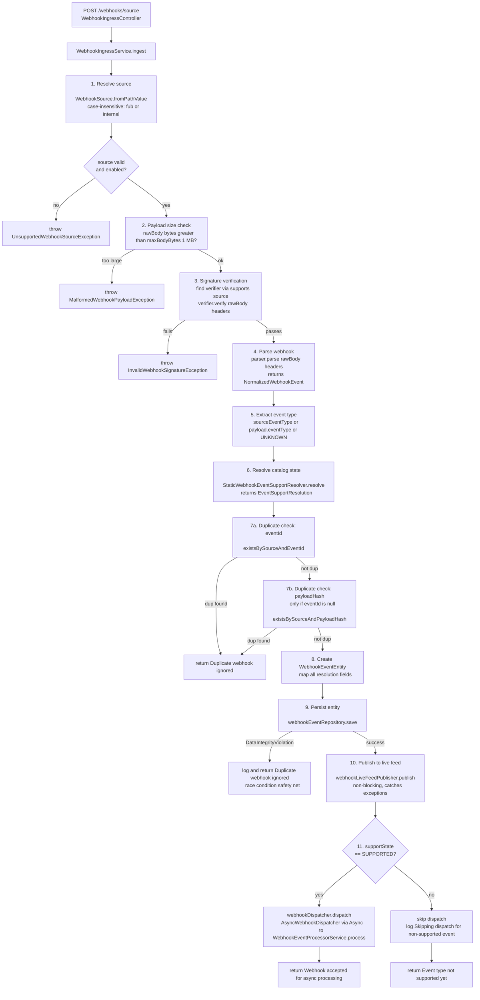

# Flow A: Webhook Ingestion and Dispatch Gating

## Entry point

```
POST /webhooks/{source}  →  WebhookIngressController.receiveWebhook(source, rawBody, headers)
```

The controller flattens multi-value HTTP headers to single-value (takes first value), then delegates to `WebhookIngressService.ingest()`. Returns **HTTP 202 ACCEPTED** on success.

**Exception mapping at controller level:**

| Exception | HTTP Status |
|-----------|-------------|
| `InvalidWebhookSignatureException` | 401 UNAUTHORIZED |
| `MalformedWebhookPayloadException` | 400 BAD REQUEST |
| `UnsupportedWebhookSourceException` | 400 BAD REQUEST |

## Full ingestion flow



## Subflow A.1: FUB signature verification

**Implementation:** `FubWebhookSignatureVerifier.verify(rawBody, headers)`

**Why it works this way:** FUB signs webhooks with HMAC-SHA256 over a Base64-encoded body. The verifier must handle both raw hex signatures and `key=value` formatted signatures (e.g. `sha256=abc123`) that FUB may send.

1. Read signing key from `webhook.sources.fub.signing-key` config
2. Extract `FUB-Signature` header (case-insensitive lookup)
3. Compute expected signature:
   - Base64-encode the raw body: `Base64.encode(rawBody.getBytes(UTF_8))`
   - HMAC-SHA256 the Base64 string with signing key → hex string (lowercase)
4. Compare using **constant-time equals** (`MessageDigest.isEqual`) to prevent timing attacks
5. If direct match fails, try parsing `key=value` format: extract value after `=` and compare again
6. Returns `true` if either comparison matches, `false` otherwise

## Subflow A.2: FUB webhook parsing

**Implementation:** `FubWebhookParser.parse(rawBody, headers)`

1. Parse raw body as JSON via `ObjectMapper.readTree()` — throws `MalformedWebhookPayloadException` if invalid JSON
2. Extract `event` field (required, non-blank) — throws if missing
3. For `callsCreated` events: validate `resourceIds` array exists
4. Extract `eventId` if present (nullable)
5. **Compute payload hash:** SHA-256 of raw body → Base64-encoded string

   **Why:** The hash provides a deduplication fallback when `eventId` is absent. Two identical payloads produce the same hash, preventing duplicate processing.

6. Map domain and action (parser-owned, marked for future deprecation to resolver):
   - `callsCreated` → `CALL / CREATED`
   - `peopleCreated` → `ASSIGNMENT / CREATED`
   - `peopleUpdated` → `ASSIGNMENT / UPDATED`
   - default → `UNKNOWN / UNKNOWN`
7. Build payload JSON containing: `eventType`, `resourceIds` (or empty array), `uri`, selected `headers` (`FUB-Signature`, `User-Agent`, `Content-Type`), and `rawBody`
8. Build provider metadata with: `resourceIds`, `uri`, selected headers
9. Return `NormalizedWebhookEvent` record with `sourceSystem=FUB`, `status=RECEIVED`, `receivedAt=now()`

**Note:** `sourceLeadId` is currently always `null` from the parser (TODO: derive for `peopleCreated`/`peopleUpdated` in future).

## Subflow A.3: Catalog state resolution

**Implementation:** `StaticWebhookEventSupportResolver.resolve(source, eventType)`

Current mapping:

| Source | Event Type | Support State | Domain | Action |
|--------|-----------|---------------|--------|--------|
| `FUB` | `callsCreated` | `SUPPORTED` | `CALL` | `CREATED` |
| `FUB` | `peopleCreated` | `SUPPORTED` | `ASSIGNMENT` | `CREATED` |
| `FUB` | `peopleUpdated` | `SUPPORTED` | `ASSIGNMENT` | `UPDATED` |
| *any* | *unmapped* | `IGNORED` | `UNKNOWN` | `UNKNOWN` |

**Why this matters:** Only `SUPPORTED` events are dispatched for processing. `STAGED` events are persisted and observable but not acted upon. `IGNORED` events are persisted for observability only.

## Files in this flow

| Role | File |
|------|------|
| Controller | `controller/WebhookIngressController.java` |
| Orchestrator | `service/webhook/WebhookIngressService.java` |
| Parser | `service/webhook/parse/FubWebhookParser.java` |
| Verifier | `service/webhook/security/FubWebhookSignatureVerifier.java` |
| Resolver | `service/webhook/support/StaticWebhookEventSupportResolver.java` |
| Dispatcher | `service/webhook/dispatch/AsyncWebhookDispatcher.java` |
| Repository | `persistence/repository/WebhookEventRepository.java` |
| Live feed | `service/webhook/live/SseWebhookLiveFeedPublisher.java` → `WebhookSseHub.java` |
