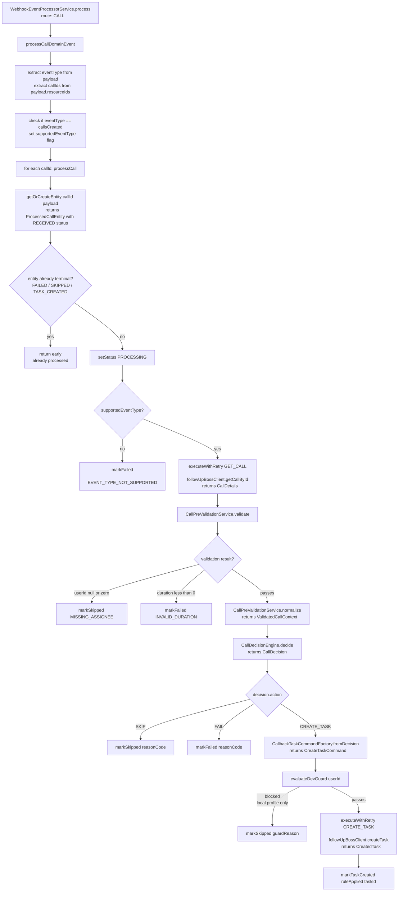

# Flow B: CALL-Domain Automation

## Entry and domain routing

After async dispatch, `WebhookEventProcessorService.process(event)` routes by `normalizedDomain`:
- `CALL` → `processCallDomainEvent()`
- `ASSIGNMENT` → `processAssignmentDomainEvent()` (see [08-flow-assignment-policy.md](08-flow-assignment-policy.md))
- `UNKNOWN` → `processUnknownDomainEvent()` (logs warning, no action)

## Call processing — full flow



**Exception handling in `processCall()` (call fetch phase):**

| Exception | Terminal State | Reason Code |
|-----------|--------------|-------------|
| `FubTransientException` | `FAILED` | `TRANSIENT_FETCH_FAILURE:{statusCode}` |
| `FubPermanentException` | `FAILED` | `PERMANENT_FETCH_FAILURE:{statusCode}` |
| `RuntimeException` | `FAILED` | `UNEXPECTED_PROCESSING_FAILURE` |

**Exception handling in `executeDecision()` (task creation phase):**

| Exception | Terminal State | Reason Code |
|-----------|--------------|-------------|
| `FubTransientException` | `FAILED` | `TRANSIENT_TASK_CREATE_FAILURE:{statusCode}` |
| `FubPermanentException` | `FAILED` | `PERMANENT_TASK_CREATE_FAILURE:{statusCode}` |
| `RuntimeException` | `FAILED` | `UNEXPECTED_TASK_CREATE_FAILURE` |

## Subflow B.1: Call decision engine

**Implementation:** `CallDecisionEngine.decide(ValidatedCallContext)`

**Why it's ordered this way:** Outcome check runs first for backward compatibility. Future plan is to switch to duration-first to prevent stale outcome labels from creating unnecessary tasks on connected calls (TODO in code).

Decision rules evaluated in order (short-circuits on first match):

| # | Condition | Action | Rule / Reason |
|---|-----------|--------|---------------|
| 1 | `normalizedOutcome == "no answer"` | `CREATE_TASK` | `OUTCOME_NO_ANSWER` |
| 2 | `duration == null` | `FAIL` | `UNMAPPED_OUTCOME_WITHOUT_DURATION` |
| 3 | `duration > shortCallThresholdSeconds` (default 30) | `SKIP` | `CONNECTED_NO_FOLLOWUP` |
| 4 | `duration == 0` | `CREATE_TASK` | `MISSED` |
| 5 | `0 < duration ≤ shortCallThresholdSeconds` | `CREATE_TASK` | `SHORT` |

## Subflow B.2: Task creation

**Implementation:** `CallbackTaskCommandFactory.fromDecision(decision, context)`

Task name mapping:

| Rule Applied | Task Name |
|-------------|-----------|
| `MISSED` or `OUTCOME_NO_ANSWER` | `"Call back - previous attempt not answered"` |
| `SHORT` | `"Follow up - previous call was very short"` |

The `CreateTaskCommand` includes:
- `personId` from validated context (null if original was ≤ 0)
- `name` mapped from rule
- `assignedUserId` from call context
- `dueDate` = today + `taskDueInDays` (default 1 day)
- `dueDateTime` = null

## Subflow B.3: Retry logic (`executeWithRetry`)

**Implementation:** `WebhookEventProcessorService.executeWithRetry(entity, operation, action)`

```
maxAttempts = max(1, fubRetryProperties.maxAttempts)  // default 3
for attempt = 1 to ∞:
    try:
        return action.get()
    catch FubTransientException:
        if attempt >= maxAttempts → rethrow (no more retries)
        increment entity.retryCount in DB
        delay = calculateDelayWithJitter(attempt)  // see backoff formula in 04-configuration-and-schema.md
        Thread.sleep(delay)
        attempt++
    catch other → rethrow immediately (no retry)
```

**Why retry count is persisted:** It provides observability — the admin can see how many FUB API retries a particular call required, helping diagnose flaky upstream issues.

## Subflow B.4: Dev guard

**Implementation:** `WebhookEventProcessorService.evaluateDevGuard(assignedUserId)`

Only active when Spring profile is `local`. Prevents accidental task creation during local development:
- If `devTestUserId` is not configured (0 or negative) → blocks with `DEV_MODE_TEST_USER_NOT_CONFIGURED`
- If `assignedUserId != devTestUserId` → blocks with `DEV_MODE_USER_FILTERED`
- Otherwise → passes (task creation proceeds)

## Subflow B.5: Entity lifecycle (`getOrCreateEntity`)

Creates a new `ProcessedCallEntity` with status `RECEIVED`, `retryCount=0`, timestamps set to `now()`. If a `DataIntegrityViolationException` occurs (unique constraint on `call_id` from a concurrent delivery), it catches the exception and falls back to `findByCallId()`.

**Known issue:** The terminal-state check + PROCESSING update is NOT atomic. Two concurrent webhook deliveries for the same call can both pass the terminal check and execute downstream side effects. A future fix should use a single atomic claim transition (`RECEIVED → PROCESSING`).

## Files in this flow

| Role | File |
|------|------|
| Router + processor | `service/webhook/WebhookEventProcessorService.java` |
| Pre-validation | `rules/CallPreValidationService.java` |
| Decision engine | `rules/CallDecisionEngine.java` |
| Task factory | `rules/CallbackTaskCommandFactory.java` |
| FUB client | `client/fub/FubFollowUpBossClient.java` |
| Repository | `persistence/repository/ProcessedCallRepository.java` |
