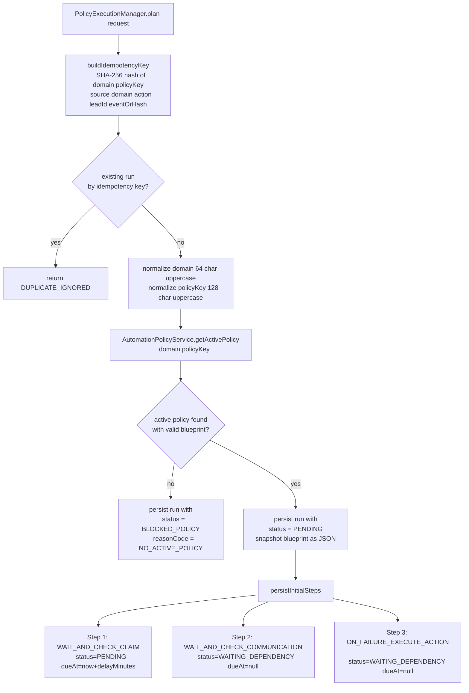

# Flow C: ASSIGNMENT-Domain Policy Planning and Materialization

## Entry: assignment event routing

When `WebhookEventProcessorService.process()` receives an event with `normalizedDomain == ASSIGNMENT`:

1. `processAssignmentDomainEvent(event)` is called
2. Extracts `resourceIds` from `event.payload()` as a list of lead IDs
3. For each lead ID, builds a `PolicyExecutionPlanRequest` containing:
   - `source`, `eventId`, `webhookEventId`, `sourceLeadId`
   - `normalizedDomain`, `normalizedAction`
   - `payloadHash`
   - `domain = "ASSIGNMENT"`, `policyKey = "FOLLOW_UP_SLA"`
4. Calls `PolicyExecutionManager.plan(request)` for each lead (fan-out). Each planning call is wrapped in try/catch — if one lead fails, the remaining leads still proceed. Planned/failed counts are logged at the end.

## Policy blueprint structure

The policy blueprint defines the step pipeline. Currently the only supported template is `ASSIGNMENT_FOLLOWUP_SLA_V1`:

```json
{
  "templateKey": "ASSIGNMENT_FOLLOWUP_SLA_V1",
  "steps": [
    {
      "type": "WAIT_AND_CHECK_CLAIM",
      "delayMinutes": 5
    },
    {
      "type": "WAIT_AND_CHECK_COMMUNICATION",
      "delayMinutes": 10,
      "dependsOn": "WAIT_AND_CHECK_CLAIM"
    },
    {
      "type": "ON_FAILURE_EXECUTE_ACTION",
      "dependsOn": "WAIT_AND_CHECK_COMMUNICATION"
    }
  ],
  "actionConfig": {
    "actionType": "REASSIGN"
  }
}
```

**Blueprint validation** (`PolicyBlueprintValidator`):
1. Blueprint must not be null or empty
2. `templateKey` must be `ASSIGNMENT_FOLLOWUP_SLA_V1`
3. Exactly 3 steps in exact type order
4. Steps 1 and 2 must have `delayMinutes ≥ 1`
5. Step 2 depends on Step 1; Step 3 depends on Step 2
6. `actionConfig.actionType` must be `REASSIGN` or `MOVE_TO_POND`

## Planning flow



## Idempotency key construction

**Why:** Prevents duplicate policy runs from the same webhook event for the same lead and policy scope.

```
prefix = "PEM1|"
raw = domain + "|" + policyKey + "|" + source + "|" + normalizedDomain
      + "|" + normalizedAction + "|" + sourceLeadId + "|"
      + (eventId != null ? "EVENT|" + eventId
         : payloadHash != null ? "PAYLOAD|" + payloadHash
         : "FALLBACK|NO_EVENT_OR_HASH")

idempotencyKey = prefix + SHA-256(raw).toHex()
```

**Duplicate detection is two-phase:**
1. Pre-insert: `runRepository.findByIdempotencyKey(key)` — if found, return `DUPLICATE_IGNORED`
2. Post-insert: if `DataIntegrityViolationException` matches the idempotency constraint, clear EntityManager, re-query, return `DUPLICATE_IGNORED`. If exception doesn't match constraint → rethrow.

## Step materialization contract

`PolicyExecutionMaterializationContract.initialTemplates()` returns three step templates:

| Step Order | Type | Initial Status | DueAt | Depends On |
|-----------|------|---------------|-------|------------|
| 1 | `WAIT_AND_CHECK_CLAIM` | `PENDING` | `now + delayMinutes` (from blueprint) | none |
| 2 | `WAIT_AND_CHECK_COMMUNICATION` | `WAITING_DEPENDENCY` | `null` (computed on activation) | Step 1 |
| 3 | `ON_FAILURE_EXECUTE_ACTION` | `WAITING_DEPENDENCY` | `null` (computed on activation) | Step 2 |

**Why `WAITING_DEPENDENCY` for steps 2 and 3:** These steps cannot execute until their predecessor completes. Their `dueAt` is calculated at activation time (when the predecessor's transition fires), relative to the activation moment — not the original plan time.

## Files in this flow

| Role | File |
|------|------|
| Assignment router | `service/webhook/WebhookEventProcessorService.java` |
| Planning orchestrator | `service/policy/PolicyExecutionManager.java` |
| Policy CRUD | `service/policy/AutomationPolicyService.java` |
| Blueprint validator | `service/policy/PolicyBlueprintValidator.java` |
| Step templates | `service/policy/PolicyExecutionMaterializationContract.java` |
| Run repository | `persistence/repository/PolicyExecutionRunRepository.java` |
| Step repository | `persistence/repository/PolicyExecutionStepRepository.java` |
