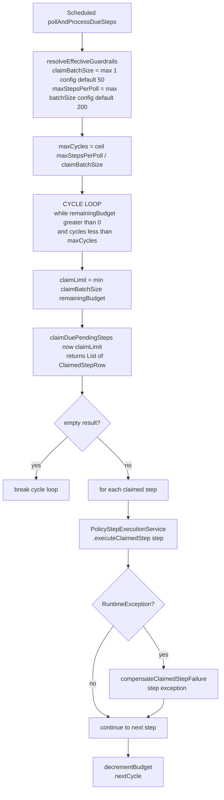
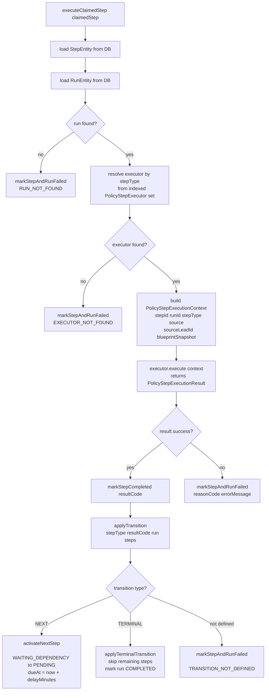

# Flow D: Policy Due-Worker Execution

## Worker polling loop

**Entry:** `PolicyExecutionDueWorker.pollAndProcessDueSteps()` — runs on `@Scheduled(fixedDelay)` with `policy.worker.poll-interval-ms` (default 2000ms). Conditional on `policy.worker.enabled=true`.



## Atomic claim query (SQL)

**Implementation:** `JdbcPolicyExecutionStepClaimRepository`

```sql
WITH due AS (
    SELECT id
    FROM policy_execution_steps
    WHERE status = 'PENDING'
      AND due_at <= :now
    ORDER BY due_at, id
    LIMIT :limit
    FOR UPDATE SKIP LOCKED
)
UPDATE policy_execution_steps steps
SET status = 'PROCESSING',
    updated_at = :now
FROM due
WHERE steps.id = due.id
RETURNING steps.id, steps.run_id, steps.step_type,
          steps.step_order, steps.due_at, steps.status
```

**Why `FOR UPDATE SKIP LOCKED`:** This enables concurrent worker instances without blocking. If two workers poll simultaneously, each claims a different batch — no contention, no deadlocks. The `ORDER BY due_at, id` ensures FIFO fairness.

## Step execution and transition engine

**Implementation:** `PolicyStepExecutionService.executeClaimedStep(claimedStep)`



## Transition contract

**Implementation:** `PolicyStepTransitionContract`

| Source Step Type | Result Code | Outcome Type | Target |
|-----------------|-------------|--------------|--------|
| `WAIT_AND_CHECK_CLAIM` | `CLAIMED` | `NEXT` | → activate `WAIT_AND_CHECK_COMMUNICATION` |
| `WAIT_AND_CHECK_CLAIM` | `NOT_CLAIMED` | `TERMINAL` | → `NON_ESCALATED_CLOSED` |
| `WAIT_AND_CHECK_COMMUNICATION` | `COMM_FOUND` | `TERMINAL` | → `COMPLIANT_CLOSED` |
| `WAIT_AND_CHECK_COMMUNICATION` | `COMM_NOT_FOUND` | `NEXT` | → activate `ON_FAILURE_EXECUTE_ACTION` |
| `ON_FAILURE_EXECUTE_ACTION` | `ACTION_SUCCESS` | `TERMINAL` | → `ACTION_COMPLETED` |
| `ON_FAILURE_EXECUTE_ACTION` | `ACTION_FAILED` | `TERMINAL` | → `ACTION_FAILED` |

**Terminal transition logic (`applyTerminalTransition`):**
1. Loop all steps ordered by `stepOrder`
2. Skip already-terminal steps (COMPLETED, FAILED, SKIPPED) and steps at or before current
3. Mark remaining steps `SKIPPED` with `dueAt=null`, `errorMessage=null`
4. Mark run `COMPLETED` with outcome name as `reasonCode`

**Next step activation (`activateNextStep`):**
1. Find next step by type with minimum order
2. Verify it's in `WAITING_DEPENDENCY` state
3. Calculate `dueAt = now + delayMinutes` (extracted from blueprint for that step type)
4. Transition to `PENDING`, clear `errorMessage`
5. The due worker will pick it up on next poll when `dueAt ≤ now`

## Subflow D.1: WAIT_AND_CHECK_CLAIM executor

**Implementation:** `WaitAndCheckClaimStepExecutor.execute(context)`

```
1. Validate sourceLeadId not null/blank
   → failure: SOURCE_LEAD_ID_MISSING
2. Parse sourceLeadId as Long personId
   → NumberFormatException: SOURCE_LEAD_ID_INVALID
3. executeWithRetry(() → followUpBossClient.getPersonById(personId))
4. Determine claim status:
   - If person.claimed() != null → use claimed boolean directly
   - If person.claimed() == null → fallback: assignedUserId > 0 means CLAIMED
5. Return CLAIMED or NOT_CLAIMED
```

**Why the fallback logic:** The `claimed` field on the FUB person object may be null in some cases. The fallback checks whether an `assignedUserId` exists as a proxy for claim status.

**Failure codes:** `SOURCE_LEAD_ID_MISSING`, `SOURCE_LEAD_ID_INVALID`, `PERSON_NOT_FOUND`, `FUB_PERSON_READ_TRANSIENT`, `FUB_PERSON_READ_PERMANENT`, `CLAIM_CHECK_EXECUTION_ERROR`

## Subflow D.2: WAIT_AND_CHECK_COMMUNICATION executor

**Implementation:** `WaitAndCheckCommunicationStepExecutor.execute(context)`

```
1. Validate sourceLeadId not null/blank
   → failure: SOURCE_LEAD_ID_MISSING
2. Parse sourceLeadId as Long personId
   → NumberFormatException: SOURCE_LEAD_ID_INVALID
3. executeWithRetry(() → followUpBossClient.checkPersonCommunication(personId))
4. If result is null → COMM_NOT_FOUND
5. If result.communicationFound() → COMM_FOUND
6. Otherwise → COMM_NOT_FOUND
```

**How `checkPersonCommunication` works in the FUB adapter:** It calls `getPersonById(personId)` and checks if `person.contacted != null && person.contacted > 0`. This is a derived check — there is no separate FUB API endpoint for communication history. The `contacted` field on the FUB person object indicates whether communication has occurred.

**Failure codes:** `SOURCE_LEAD_ID_MISSING`, `SOURCE_LEAD_ID_INVALID`, `FUB_COMM_CHECK_TRANSIENT`, `FUB_COMM_CHECK_PERMANENT`, `COMM_CHECK_EXECUTION_ERROR`

## Subflow D.3: ON_FAILURE_EXECUTE_ACTION executor

**Implementation:** `OnCommunicationMissActionStepExecutor.execute(context)`

```
1. Extract actionConfig.actionType from blueprint snapshot
   → null config: ACTION_CONFIG_MISSING
   → blank type: ACTION_TYPE_MISSING
   → not REASSIGN or MOVE_TO_POND: ACTION_TYPE_UNSUPPORTED
2. CURRENT BEHAVIOR: always returns failure with ACTION_TARGET_UNCONFIGURED
```

**Why it fails deliberately:** Target semantics (which user to reassign to, which pond to move to) are not yet finalized in the policy contract. The executor validates the action type to ensure the blueprint is structurally correct, but defers actual execution until the target wiring is implemented.

## Worker exception compensation

**Implementation:** `PolicyExecutionDueWorker.compensateClaimedStepFailure(step, exception)`

```
COMPENSATION_MAX_ATTEMPTS = 3
COMPENSATION_RETRY_BACKOFF_MS = 25

for attempt = 1 to COMPENSATION_MAX_ATTEMPTS:
    try:
        markClaimedStepFailedAfterWorkerException(step, ex)  // @Transactional(REQUIRES_NEW)
        return
    catch RuntimeException:
        if attempt == max → log error, return (orphan accepted)
        Thread.sleep(25ms)
```

**Why `REQUIRES_NEW`:** If the step execution threw mid-transaction, the original transaction is rolled back. The compensation must run in a **new** transaction to successfully mark the step and run as `FAILED`. Without this, the step would remain in `PROCESSING` state indefinitely.

**`markClaimedStepFailedAfterWorkerException`:** Checks if step still exists and is in `PROCESSING` status. If not, skips compensation (idempotent). Otherwise marks step `FAILED` with `WORKER_UNHANDLED_EXCEPTION` and marks the run `FAILED`.

**Known gap:** There is no stale `PROCESSING` watchdog/reaper. If compensation also fails (all 3 attempts), the step remains in `PROCESSING` forever. A future reaper should detect and recover these orphaned rows.

## Files in this flow

| Role | File |
|------|------|
| Worker | `service/policy/PolicyExecutionDueWorker.java` |
| Step executor orchestrator | `service/policy/PolicyStepExecutionService.java` |
| Claim repository | `persistence/repository/JdbcPolicyExecutionStepClaimRepository.java` |
| Transition contract | `service/policy/PolicyStepTransitionContract.java` |
| Claim executor | `service/policy/WaitAndCheckClaimStepExecutor.java` |
| Communication executor | `service/policy/WaitAndCheckCommunicationStepExecutor.java` |
| Action executor | `service/policy/OnCommunicationMissActionStepExecutor.java` |
