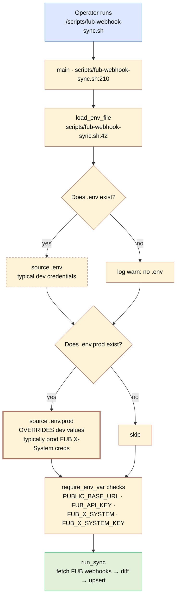

# Plan — Deploy Runbook + Sync Script Env Overlay

## Context

Two related deliverables, both shaken loose during the first Railway
deploy:

1. **A runbook** (`Docs/hosting-decision/dev/deploy-runbook.md`) capturing
   the operational steps and the actual gotchas we hit, so the next deploy
   is friction-free.
2. **A small ergonomics tweak to `scripts/fub-webhook-sync.sh`** so it
   automatically reads a `.env.prod` overlay (gitignored) and targets the
   prod FUB X-System credentials by default.

The runbook is the user-facing artifact; the script change is the small
lever that makes one of the runbook's steps trivial instead of error-prone.

## Approach

### Runbook

Lives next to the existing security checklist at
`Docs/hosting-decision/dev/`. Operationally focused, not a design doc.
Sections:

- **Pre-flight** — what must be true on `dev` and locally before clicking
  Deploy.
- **Railway one-time setup** — service from GitHub, Postgres add-on, env
  vars (with Railway's variable-substitution syntax).
- **Per-deploy steps** — watch logs, smoke-check curls, FUB sync, kill-
  switch verification.
- **Failure-mode reference** — the four errors we actually hit, each with
  its symptom signature and fix.
- **Operational scripts** — pointer to `fub-webhook-sync.sh` with the
  `.env` precedence rule.

### Script overlay

In `scripts/fub-webhook-sync.sh`:

- Add `ENV_OVERRIDE_FILE="${ROOT_DIR}/.env.prod"`.
- After sourcing `.env`, if `.env.prod` exists, source it too. Variables
  set in the overlay win because `set -a` re-exports them.
- Update the script's inline `usage()` text to document the new precedence.
- No change to the contract test (`FubWebhookSyncScriptTest`) — it tests
  shape and dependencies, not env-loading behaviour. Backwards-compatible.

### README

Single-line link to the new runbook from the existing "Hosted dev
environment" section.

## Lifecycle — env-file precedence the script applies at startup

Per the AGENTS.md rule, every plan needs a vertical lifecycle diagram.
There's no runtime user-facing flow here (it's a documentation +
operational-script feature), but the script's env-file precedence is the
one piece of runtime behaviour worth picturing:



The diagram makes the single load-bearing fact visible: shell env >
`.env.prod` > `.env`. Anyone confused about why their override isn't
taking effect can follow the flow.

## Critical files

**New:**
- `Docs/hosting-decision/dev/deploy-runbook.md` — the runbook.
- `Docs/features/deploy-runbook/research.md` (already done).
- `Docs/features/deploy-runbook/plan.md` — this file.

**Modified (already, uncommitted):**
- `scripts/fub-webhook-sync.sh` — `.env.prod` overlay logic and updated
  `usage()` text.

**Modified:**
- `README.md` — single-line link to the runbook from the "Hosted dev
  environment" section.

## Verification

Doc-only feature mostly:

```bash
# Script still passes its existing contract test
./mvnw -Dtest=FubWebhookSyncScriptTest test

# Help text shows the new precedence
./scripts/fub-webhook-sync.sh --help

# With .env.prod present, script logs the override line
./scripts/fub-webhook-sync.sh --dry-run
# expect: "[INFO] Applying overrides from .../.env.prod"

# Without .env.prod, script behaves exactly as before
mv .env.prod .env.prod.bak
./scripts/fub-webhook-sync.sh --dry-run
# expect: no "Applying overrides" line; uses .env values only
mv .env.prod.bak .env.prod
```

Markdown rendering: GitHub previews the runbook and renders the Mermaid
diagram in this plan correctly.

## Repo decisions impact

`No` — operational documentation + a backwards-compatible script tweak.
Doesn't change any architectural contract. Doesn't add or modify any
repo-wide rule. RD-004's auth contract, the workflow engine's behaviour,
and every existing feature are untouched.

## Out of scope

- Replacing the runbook with an automated deploy (Railway CLI script,
  GitHub Actions workflow, Spring `ApplicationRunner` for FUB sync).
  Worth doing once the runbook reveals the right automation candidates;
  premature now.
- A "production" runbook (vs dev). Production raises requirements that
  belong in their own design (HA, monitoring, on-call, secrets rotation,
  audit log retention). Dev host stays scoped to the dev envelope.
