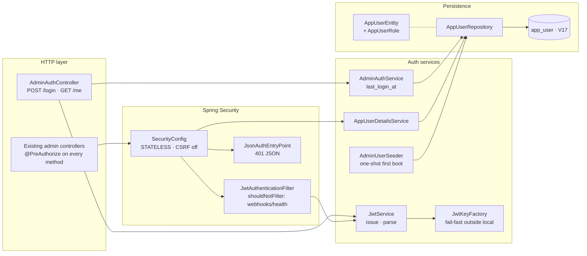

# Phase 2 — Backend auth foundation (A1a)

## Status
`DONE` (2026-05-01)

## What I was thinking

Phase 2 is the whole reason the host can't go public yet: every `/admin/**` endpoint was anonymous. The goal was to land a real auth layer in one cohesive backend commit — schema, JWT, security config, login endpoint, role-based authorization, plus all the test churn that comes with introducing security to a previously-open codebase. The SPA stays unchanged for this phase; Phase 3 picks that up.

I split the work into five slices but treated them as one delivery — leaving the suite half-broken between slices would have made review harder, not easier.

## Component view

## Decisions taken

- **DB-backed users from day one, not env-var creds.** A throwaway `ADMIN_AUTH_USERNAME`/`PASSWORD` admin would have been cheaper for Phase 2, but the user wanted multiple users + roles. Building the table now means future user-management features (invite flow, password reset, audit log) drop in without an auth-scheme rewrite.
- **JWT bearer over session cookie.** User-requested. Stateless, no server-side session table, role claim travels with the token. CSRF is moot because no cookies. Trade-off accepted: token revocation is best-effort (TTL only). For an 8 h dev session that's fine.
- **HS256 with environment-driven secret, fail-fast outside `local`.** A short or blank `JWT_SECRET` is the most common JWT footgun. `JwtKeyFactory` rejects it at startup in any non-local profile. In `local` it generates an ephemeral random key and logs a `WARN` so dev-loop ergonomics aren't ruined for fresh checkouts.
- **`@PreAuthorize` per method, with class-level baseline.** Every admin controller gets a class-level `hasAnyRole('ADMIN','OPERATOR','VIEWER')` (the read baseline) and method-level overrides where state-changing endpoints need stricter roles (replay/cancel → OPERATOR+, workflow activate/deactivate/rollback → ADMIN). Reads as the role table without needing to look at SecurityConfig.
- **One-shot env-var seed, not a self-service registration endpoint.** The seeder runs on first boot only. Subsequent password rotation goes through SQL or a future admin UI. This keeps the boot path simple and makes the security implication explicit: the first admin's credentials live in env vars; everyone else is added intentionally.

## Surprises

| Surprise | Why it mattered | Resolution |
|---|---|---|
| `V16` was already taken in `db/migration/`. Plan said V16. | Flyway would refuse to apply two migrations with the same version. | Used `V17`; logged as a plan correction for Phase 4. |
| Adding `spring-boot-starter-security` exploded the test suite (83 errors / 3 failures from a baseline of 0). | Two stacking causes: blank `JWT_SECRET` in test props, and Spring's default lock-down on every endpoint until I landed `SecurityConfig`. | Added a 32+ char `JWT_SECRET` to `src/test/resources/application.properties`, then folded slices 2C/2E into the same commit so the suite never observed a half-configured state. |
| `@WithMockUser(roles = "ADMIN")` annotations had **no effect**. Admin tests still 401'd. | Spring Boot 4 dropped the `MockMvcSecurityConfiguration` auto-config that bridged `@WithMockUser` → MockMvc. With `STATELESS` session policy, the test thread's context is never read by the request. | Added `support/MockMvcSecurityTestConfig` — a `MockMvcBuilderCustomizer` bean that re-applies `SecurityMockMvcConfigurers.springSecurity()` for every `@AutoConfigureMockMvc` instance. Single test-only file; works for the whole suite. |
| `AdminWebhooksStreamFlowTest` uses `RANDOM_PORT` + a real HTTP client. `@WithMockUser` doesn't help there because the SSE request never goes through MockMvc. | The two SSE tests would have permanently 401'd. | Autowired `JwtService`, mint a real ADMIN token in `@BeforeEach`, thread it through `StreamReader.open(url, bearerToken)`. |
| `PolicyAdminApiCutoverIntegrationTest` expects 404 on legacy `/admin/policies/...` URLs. With auth required, anonymous would now 401 instead. | The test's intent (URL is gone) still holds, but the status check would flip semantics. | Added `@WithMockUser(roles = "ADMIN")` so the request gets past auth and reaches the missing-route 404. The test still proves the legacy URLs are gone. |

## Validation

- Full backend suite: **395 / 0F / 0E / 36 skipped**, `BUILD SUCCESS`.
- 30 net-new tests (4 repo + 6 JWT + 9 security matrix + 6 auth controller + 5 seeder).
- All new tests pass individually, not just in the aggregate run.

## Repo decisions impact

`Yes` — promoted to **[`RD-004-admin-auth-uses-jwt-bearer.md`](../../repo-decisions/RD-004-admin-auth-uses-jwt-bearer.md)**.

The pattern here (DB-backed users in `app_user`, BCrypt 12, JWT HS256, three-role enum, `STATELESS` Spring Security, `@PreAuthorize` per method, env-var first-boot seeder) is the auth baseline for any future admin tooling in this repo. Future work (refresh tokens, MFA, user CRUD endpoints, password reset) builds on this foundation — don't add a parallel auth scheme.

## Plan corrections logged for Phase 4

1. V16 → V17 in `plan.md § A1.1` and the file list.
2. `JwtAuthenticationFilterTest` deferred — covered end-to-end by `SecurityConfigTest` + `AdminAuthControllerTest`. Update `plan.md § A1.10`.
3. `MockMvcSecurityTestConfig` is a hard requirement on Spring Boot 4. Mention in `plan.md`.
4. The lingering `./mvnw -P prod ...` snippets (Phase 1 carry-over).
