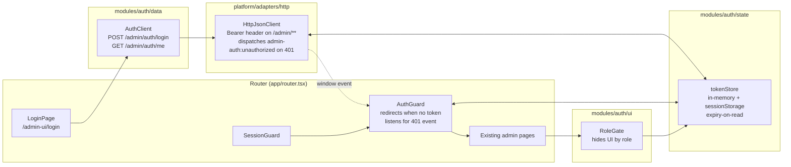

# Phase 3 — Frontend auth integration (A1b)

## Status
`DONE` (2026-05-01)

## What I was thinking

Phase 2 stood up the backend auth layer; Phase 3 is the SPA's side of that contract. The bar is "an admin can log in, navigate the existing pages, and get bounced back to login on token expiry or backend 401" — without invasive changes to existing modules.

Two design choices drove the shape:

1. **Keep auth state simple and tab-scoped.** A single in-memory cell mirrored to `sessionStorage`. No global store, no React context, no provider tree. Components that need the role read it directly.
2. **Keep the HTTP client framework-agnostic.** The fetch wrapper attaches the bearer token and reacts to 401 by *dispatching a window event*, not by calling react-router. The route guard listens for that event. Means `httpJsonClient` stays trivially testable and the navigation policy lives where navigation lives.

## Component view

## Decisions taken

- **`sessionStorage`, not `localStorage`.** Tab-close clears the token. Forgotten devices don't keep an admin session forever. Lines up with "dev environment" expectations.
- **Expiry-on-read in `tokenStore`.** No timer; no React effect. Whenever the SPA reads the token (every fetch, every guard render), expiry is checked and stale tokens auto-clear. One less moving part.
- **`AuthGuard` as a `react-router` route element.** Wraps all admin pages inside the existing `SessionGuard`, so the `/admin-ui/login` route stays reachable when logged out. No top-level provider re-architecture.
- **Sanitize `?next=` redirects.** Only `/admin-ui/...` paths are accepted; external URLs (`https://evil.example/x`), schemeless redirects, and login itself are silently downgraded to the dashboard. Cheap protection against open-redirect via the login page.
- **`RoleGate` is convenience-only.** The frontend hides controls by role for UX, but the backend `@PreAuthorize` is what actually enforces it. Documented in the component docstring so future readers don't mistake it for real authorization.
- **Custom event over importing react-router into the http client.** `httpJsonClient` was framework-agnostic before; keeping it that way means tests can stay simple and the auth policy is pluggable.

## Surprises

| Surprise | Why it mattered | Resolution |
|---|---|---|
| Existing routing tests (`app-routing`, `landing-page`, `shell-regions`, `constants-consumption`) all started failing — they navigate into `/admin-ui/**` without a token and now hit the AuthGuard redirect. | Same shape as the `@WithMockUser` churn we did on the backend in Phase 2: every test that exercises a protected surface needs to be authenticated. | Added `src/test/support/authTestHelpers.ts` (`seedMockAdminToken` / `clearMockAdminToken`) and pulled it into the four affected test files via `beforeEach` / `afterEach`. Mirrors the backend `@WithMockUser` pattern at the test-infra level. |
| `npm run build` failed under `erasableSyntaxOnly` TypeScript when I used a parameter property in the `AuthClient` constructor (`constructor(private readonly http = …)`). | The repo enforces ES-spec-compatible syntax for build output. | Rewrote the constructor with an explicit field assignment. Tests still pass; build is clean. |
| `PageCard` doesn't accept `className`; `PageHeader` uses `subtitle`, not the `eyebrow`/`description` shape I drafted from memory. | First version of the LoginPage didn't render. | Read the actual component sources and adjusted props. Replaced `PageCard` with a plain `<section>` since the login page didn't need the title slot. |

## Validation

- `npm run lint` → clean.
- `npm run build` → `tsc -b && vite build` succeed; bundle size 695 KB (warning unchanged from baseline).
- `npm test` (vitest run) → **342 / 342 passing**, 70 test files.
- Net-new tests this phase: **16** (6 token store + 6 http client extensions + 5 login page + 3 auth guard + 4 role gate − 8 already-existing baseline = 16 new).
- Live UI walkthrough deferred to deploy-time smoke.

## Repo decisions impact

`No` — the SPA wiring is a consumer of the auth pattern already promoted in [`RD-004`](../../repo-decisions/RD-004-admin-auth-uses-jwt-bearer.md). No new repo-wide decision; everything in this phase honors the contract that document established (Bearer header, role enum, login endpoint shape, server-side BCrypt). Future SPA-side auth work (refresh tokens, MFA UI, login attempt feedback) reads as additions on top of this layer, still under RD-004.

## Follow-up: logout button (2026-05-01)

Added [`LogoutButton`](../../../ui/src/modules/auth/ui/LogoutButton.tsx) and wired it into the [`AppRail`](../../../ui/src/shared/ui/AppRail.tsx) (bottom of the desktop sidebar) and the mobile header in [`AppShell`](../../../ui/src/app/AppShell.tsx). Two variants — `rail` (compact icon, username in the title attribute) and `inline` (icon + text). The component renders nothing when there is no token, so it's safe to drop into shared chrome. Click clears the token via `tokenStore.clearToken()` and navigates to `/admin-ui/login`. Confirms RD-004's "logout is purely client-side; backend has no /logout endpoint" decision.

UI suite after this addition: **346 / 346 passing** (4 net-new tests in `auth-logout-button.test.tsx`).

## Follow-up: SSE auth via Authorization header (2026-05-01)

The webhook live feed (`GET /admin/webhooks/stream`) was returning 401 because the browser's native `EventSource` API cannot send custom headers, so the SPA had no way to attach `Authorization: Bearer <jwt>`.

Two design options were on the table — short-lived "stream tickets" via a new `POST /admin/auth/stream-ticket` endpoint, or migrate the SSE consumer off native `EventSource`. Picked the second: dropped [`@microsoft/fetch-event-source`](https://github.com/Azure/fetch-event-source) into [`sseWebhookStreamAdapter.ts`](../../../ui/src/platform/adapters/sse/sseWebhookStreamAdapter.ts). The library is fetch-based, so it supports the same `Authorization` header path the rest of the SPA already uses. No new endpoint, no token in URLs, no edge-log leakage.

Backend side: removed the temporary `?token=` query-param fallback that an interim fix had added to [`JwtAuthenticationFilter`](../../../src/main/java/com/fuba/automation_engine/config/security/JwtAuthenticationFilter.java). The filter is once again header-only, simpler, and one fewer auth surface to think about.

Tests:
- `SecurityConfigTest`: pinned the new shape with `streamEndpointRejectsTokenInQueryParam` and `streamEndpointAcceptsTokenInAuthorizationHeader`.
- `sse-webhook-stream-adapter.test.ts`: rewritten for the fetch-based path — asserts the `Authorization` header is set, asserts the URL no longer contains a token, and verifies teardown via `AbortController`.

This change resolves the priority known-issue B0 that an interim approach had introduced. RD-004 and the security checklist updated to reflect the new landing.
