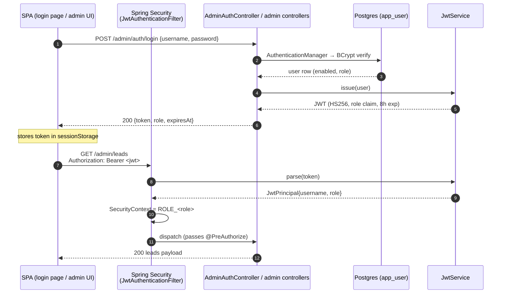
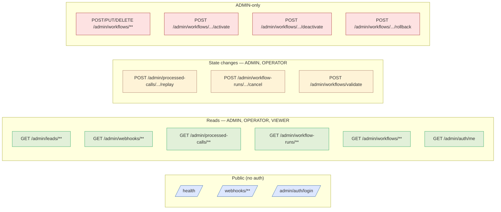

# Plan — Dev Hosting Security Hardening

> Approved plan for items A1, A3, A5, A6, A7 from
> [`Docs/hosting-decision/dev/dev-hosting-security-checklist.md`](../../hosting-decision/dev/dev-hosting-security-checklist.md).
> A2 and A4 are deferred and tracked as accepted known issues — see [research.md](./research.md) for the reasoning.
>
> Implementation is sequenced and tracked in [`phases.md`](./phases.md).

## Context

The Automation Engine is being moved to a publicly reachable dev URL (Render free tier or similar) so that Follow Up Boss can deliver real webhooks. Today the app runs only behind a Cloudflare quick tunnel for showcase use, and `/admin/**` is wide open. Before exposing the host to the internet — even as a dev environment — close the gaps that an unauthenticated attacker can exploit, and make explicit which gaps we are deliberately deferring.

In scope: A1 (auth + RBAC), A3 (Tomcat body cap), A5 (gitignore — already done), A6 (devtools verify), A7 (disable `show-sql`).
Out of scope (accepted): A2 (SSRF guard), A4 (bounded HTTP reads). Tracked in the security checklist under "Known issues".

## Approach summary

- **A1**: Spring Security in stateless mode + JWT bearer tokens (HS256, jjwt). DB-backed users in a new `app_user` table with BCrypt-hashed passwords. Three roles — `ADMIN`, `OPERATOR`, `VIEWER` — enforced per endpoint via `@PreAuthorize`. Custom JSON login endpoint at `POST /admin/auth/login` issues a JWT; SPA stores it in `sessionStorage` and sends `Authorization: Bearer <token>` on every admin call. New SPA login page. First-boot seeding of one ADMIN user from env vars.
- **A3**: 10 MB body cap in a new `application-prod.properties` (Tomcat-level outer wall). Existing 1 MB application-level cap on `/webhooks/fub` stays as the inner wall — defense in depth; both serve different purposes.
- **A5/A6/A7**: verification + properties only.

### Why JWT bearer (vs session cookie)
User-requested. Stateless (no server-side session table), role claim travels with the token, and CSRF is moot because cookies aren't used. Trade-off: token revocation is best-effort (TTL-based) without a denylist; for an 8 h dev session this is acceptable.

### Auth flow at a glance

Login then admin call:



Webhook traffic bypasses the JWT filter entirely (`shouldNotFilter` matches `/webhooks/**` and `/health`); it remains anonymous and is gated by the existing FUB HMAC signature check.

### Role / endpoint matrix (visual)



## Architecture / pattern compliance

- Module boundaries from `developer-rules.md`: controller → service → client/persistence preserved.
- New code lands in:
  - `controller/AdminAuthController` — HTTP only.
  - `service/auth/*` — JWT, user-details, seeder, auth orchestration.
  - `persistence/entity/AppUserEntity` + `repository/AppUserRepository` + Flyway migration.
  - `config/SecurityConfig`, `config/JwtProperties`, `config/security/JwtAuthenticationFilter`, `config/security/JsonAuthEntryPoint`.
- Reuses existing patterns (entity/repo, `@ConfigurationProperties` + Lombok, `MockMvc` test style, frontend module-per-feature). Detail in [research.md](./research.md).

## Work items

### A1 — DB-backed users + JWT auth + role-based authz

#### A1.1 — Schema (Flyway migration)

`src/main/resources/db/migration/V16__create_app_user_table.sql`:

```sql
CREATE TABLE app_user (
    id              BIGSERIAL    PRIMARY KEY,
    username        VARCHAR(64)  NOT NULL UNIQUE,
    password_hash   VARCHAR(255) NOT NULL,           -- bcrypt
    role            VARCHAR(32)  NOT NULL,           -- ADMIN | OPERATOR | VIEWER
    enabled         BOOLEAN      NOT NULL DEFAULT TRUE,
    created_at      TIMESTAMPTZ  NOT NULL DEFAULT NOW(),
    updated_at      TIMESTAMPTZ  NOT NULL DEFAULT NOW(),
    last_login_at   TIMESTAMPTZ
);

CREATE UNIQUE INDEX uq_app_user_username_lower ON app_user (LOWER(username));
ALTER TABLE app_user ADD CONSTRAINT chk_app_user_role
    CHECK (role IN ('ADMIN', 'OPERATOR', 'VIEWER'));
```

#### A1.2 — JPA entity + repository

- `persistence/entity/AppUserEntity.java` — `@Entity @Table(name="app_user")`, Lombok `@Getter @Setter`. `role` mapped `@Enumerated(EnumType.STRING)` over a new `enum AppUserRole { ADMIN, OPERATOR, VIEWER }`.
- `persistence/repository/AppUserRepository.java`:
  - `Optional<AppUserEntity> findByUsernameIgnoreCase(String username)`
  - `@Modifying @Query("update AppUserEntity u set u.lastLoginAt = :ts where u.id = :id") int touchLastLogin(...)`

#### A1.3 — JWT plumbing

`pom.xml` adds:

```xml
<dependency>
  <groupId>org.springframework.boot</groupId>
  <artifactId>spring-boot-starter-security</artifactId>
</dependency>
<dependency>
  <groupId>io.jsonwebtoken</groupId>
  <artifactId>jjwt-api</artifactId>
  <version>0.12.6</version>
</dependency>
<dependency>
  <groupId>io.jsonwebtoken</groupId>
  <artifactId>jjwt-impl</artifactId>
  <version>0.12.6</version>
  <scope>runtime</scope>
</dependency>
<dependency>
  <groupId>io.jsonwebtoken</groupId>
  <artifactId>jjwt-jackson</artifactId>
  <version>0.12.6</version>
  <scope>runtime</scope>
</dependency>
```

- `config/JwtProperties.java` — `@ConfigurationProperties(prefix = "admin.auth.jwt")`, Lombok-style. Fields: `secret: String` (HS256 — must be ≥32 chars / 256 bits), `issuer: String` (default `automation-engine`), `expiry: Duration` (default `8h`).
- `service/auth/JwtService.java`:
  - `String issue(AppUserEntity user)` — claims: `sub=username`, `role=<…>`, `iat`, `exp`, `iss`. HS256-signed.
  - `JwtPrincipal parse(String token)` — validates signature, expiry, issuer; throws `JwtException` on failure. Returns `(username, role)`.
  - Single `SecretKey` built once via `Keys.hmacShaKeyFor(secret.getBytes(UTF_8))`.
- `config/security/JwtAuthenticationFilter.java` — `extends OncePerRequestFilter`:
  - Read `Authorization: Bearer <token>`. Missing/blank → continue chain (anonymous). Valid → populate `SecurityContextHolder` with `UsernamePasswordAuthenticationToken` carrying authority `ROLE_<role>`. Malformed → 401 JSON `{"error":"invalid_token"}` and stop the chain.
  - Skip filter entirely for `/webhooks/**` and `/health`.

#### A1.4 — Spring Security config

`config/SecurityConfig.java`:

- `@Configuration @EnableWebSecurity @EnableMethodSecurity(prePostEnabled = true)`.
- `SecurityFilterChain` bean:
  - `.csrf(CsrfConfigurer::disable)` — stateless JWT, no cookies.
  - `.sessionManagement(s -> s.sessionCreationPolicy(STATELESS))`.
  - `.authorizeHttpRequests(auth -> auth
        .requestMatchers("/webhooks/**", "/health", "/admin/auth/login").permitAll()
        .requestMatchers("/admin/**").authenticated()
        .anyRequest().permitAll())`.
  - `.addFilterBefore(jwtAuthenticationFilter, UsernamePasswordAuthenticationFilter.class)`.
  - `.exceptionHandling(eh -> eh.authenticationEntryPoint(jsonAuthEntryPoint))` — 401 JSON, no redirect.
  - No `formLogin`, no `httpBasic`.
- `PasswordEncoder` bean: `BCryptPasswordEncoder(12)`.
- `AuthenticationManager` bean exposing `DaoAuthenticationProvider`.
- `service/auth/AppUserDetailsService.java` — `implements UserDetailsService`. Looks up via `AppUserRepository.findByUsernameIgnoreCase`, maps to a `User` with `enabled` and `ROLE_<role>`.

#### A1.5 — Login / session endpoints

`controller/AdminAuthController.java` at `@RequestMapping("/admin/auth")`:

- `POST /login` — body `{username, password}`. `authenticationManager.authenticate(...)` → on success, `repo.touchLastLogin(...)`, issue JWT, return:

  ```json
  { "token": "<jwt>", "tokenType": "Bearer", "expiresAt": "<ISO-8601>", "username": "...", "role": "ADMIN" }
  ```

  On failure → 401 with generic body (`{"error":"invalid_credentials"}`); never disclose whether the user exists.
- `GET /me` — returns `{username, role}` from `SecurityContextHolder` (no DB hit). 401 if anonymous.
- *No* server-side `/logout` for the basic version — the SPA discards the token. Documented as "best-effort revocation; tokens valid until expiry."

`service/auth/AdminAuthService.java` — owns `last_login_at` update and any future audit logging; keeps the controller thin.

#### A1.6 — Role-based endpoint authorization

`@PreAuthorize` per existing controller method:

| Endpoint | Roles allowed |
|---|---|
| `GET /admin/leads/**` | ADMIN, OPERATOR, VIEWER |
| `GET /admin/webhooks/**` (incl. `/stream`) | ADMIN, OPERATOR, VIEWER |
| `GET /admin/processed-calls/**` | ADMIN, OPERATOR, VIEWER |
| `POST /admin/processed-calls/{id}/replay` | ADMIN, OPERATOR |
| `GET /admin/workflow-runs/**`, `GET /admin/workflows/**` | ADMIN, OPERATOR, VIEWER |
| `POST /admin/workflow-runs/{id}/cancel` | ADMIN, OPERATOR |
| `POST /admin/workflows/validate` | ADMIN, OPERATOR |
| `POST /admin/workflows/{key}/activate \| /deactivate \| /rollback` | ADMIN |
| Workflow create/update/delete (any non-GET on `/admin/workflows`) | ADMIN |
| `GET /admin/auth/me` | any authenticated |

Pattern:

```java
@PreAuthorize("hasAnyRole('ADMIN','OPERATOR','VIEWER')")
@GetMapping(...) public ... ;

@PreAuthorize("hasRole('ADMIN')")
@PostMapping("/{key}/activate") public ... ;
```

Touch every method in: `AdminLeadController`, `AdminWebhookController`, `ProcessedCallAdminController`, `AdminWorkflowController`, `AdminWorkflowRunController`. `HealthController` and `WebhookIngressController` get nothing (`permitAll`).

#### A1.7 — Seed admin user on startup

`service/auth/AdminUserSeeder.java`, `ApplicationRunner`:
- If `app_user` is empty AND `ADMIN_AUTH_USERNAME` + `ADMIN_AUTH_PASSWORD` env vars are non-blank → insert one `ADMIN` user with the BCrypt hash.
- If empty AND env vars blank → in `prod` profile fail startup with a clear message; in `local` log a `WARN`.
- Never modify an existing user from env vars — seeding is one-shot. Password rotation goes through SQL or a future user-management endpoint.

#### A1.8 — Frontend (SPA)

Three additions to `ui/src`:

1. **Login page** at `/admin-ui/login` — new `src/modules/auth/ui/LoginPage.tsx`, mirroring `src/modules/dashboard/ui/DashboardPage.tsx`. Small form, POST `/admin/auth/login`, on success store the response and navigate to original target.
2. **Token store** `src/modules/auth/state/tokenStore.ts`:
   - In-memory variable + `sessionStorage` mirror so reloads keep session, but tab-close clears it.
   - `setToken({token, expiresAt, username, role})`, `getToken()`, `clearToken()`, `getRole()`.
   - `expiresAt` checked on read; expired tokens auto-cleared.
3. **`httpJsonClient` augmentation** ([httpJsonClient.ts](../../../ui/src/platform/adapters/http/httpJsonClient.ts)):
   - On every request: if `tokenStore.getToken()` exists and the path starts with `/admin/`, set `Authorization: Bearer <token>`.
   - On `401` from any `/admin/**` call (other than `/admin/auth/login`): `tokenStore.clearToken()`, navigate to `/admin-ui/login?next=<originalPath>`.
   - `credentials: 'omit'` (bearer tokens, not cookies).
4. **Route guard** in the top-level App component:
   - On mount, if current path under `/admin-ui/**` and token missing/expired → redirect to login.
   - `<RoleGate role="ADMIN">` component for menu items / buttons that only ADMIN should see (e.g. workflow activate/deactivate/rollback).

UI tests (Vitest) for `tokenStore` and `httpJsonClient` 401 redirect behavior.

#### A1.9 — Properties

Add to `application.properties`:

```
admin.auth.jwt.secret=${JWT_SECRET:}
admin.auth.jwt.issuer=${JWT_ISSUER:automation-engine}
admin.auth.jwt.expiry=${JWT_EXPIRY:8h}
admin.auth.seed-username=${ADMIN_AUTH_USERNAME:}
admin.auth.seed-password=${ADMIN_AUTH_PASSWORD:}
```

Validate at startup in `prod`: `secret.length() >= 32`. Fail fast with a clear message — short HMAC keys are the #1 JWT footgun.

Update `.env.example`:

```
JWT_SECRET=                   # ≥32 chars; generate with: openssl rand -base64 48
JWT_EXPIRY=8h
ADMIN_AUTH_USERNAME=
ADMIN_AUTH_PASSWORD=
```

#### A1.10 — Tests

- `AppUserRepositoryTest` (`@DataJpaTest`) — case-insensitive lookup, `touchLastLogin`.
- `JwtServiceTest` (plain JUnit) — issue/parse round-trip, expired-token rejection, tampered-signature rejection, wrong-issuer rejection, role claim preserved.
- `JwtAuthenticationFilterTest` — valid token populates context; missing header → anonymous; malformed → 401 JSON; tokens for `/webhooks/**` skipped.
- `AdminAuthControllerTest` (`@SpringBootTest` + `MockMvc`) — login OK, login bad-creds, login disabled-user, `/me` anonymous (401), `/me` authenticated (200).
- `SecurityConfigTest` — anonymous `/admin/leads` → 401; `VIEWER` `GET /admin/leads` → 200; `VIEWER` `POST /admin/workflows/foo/activate` → 403; `ADMIN` same → 200; `/health` anonymous → 200; `/webhooks/fub` not 401-blocked.
- `AdminUserSeederTest` — seeds when empty; no-op when populated; fails fast in `prod` when env blank.
- Existing admin controller tests — add `@WithMockUser(roles = "ADMIN")` at class level + targeted role-based tests where authz logic differs.

#### A1.11 — Out of scope (deliberate)

See [research.md § Non-goals](./research.md#non-goals-explicit). Highlights: no logout/denylist, no refresh tokens, no user CRUD, no rate limiting, no MFA.

### A3 — Tomcat body-size cap (10 MB)

New `src/main/resources/application-prod.properties`:

```
# Body-size cap (A3): reject before full buffering. Outer wall — the per-source
# in-app cap (e.g. webhook.max-body-bytes) remains as the inner wall.
server.tomcat.max-http-form-post-size=10MB
server.tomcat.max-swallow-size=10MB
spring.servlet.multipart.max-request-size=10MB
spring.servlet.multipart.max-file-size=10MB

# Logging hardening (A7)
spring.jpa.show-sql=false
spring.jpa.properties.hibernate.format_sql=false
```

`scripts/run-app.sh prod` already activates `prod`.

**Defense in depth.** The existing application-level cap at [WebhookIngressService.java:71](../../../src/main/java/com/fuba/automation_engine/service/webhook/WebhookIngressService.java) stays at the env-driven default of 1 MB (`webhook.max-body-bytes`). Tomcat's 10 MB outer wall protects the JVM from buffering huge bodies; the 1 MB inner wall keeps the actual webhook contract tight. Keep both.

**Known gap (documented).** Spring's `@RequestBody` for JSON isn't gated by `multipart` props directly. The real defense is `server.tomcat.max-swallow-size`. Full enforcement on a streaming filter is over-scope for dev; documented in the checklist.

### A5 — `.gitignore`

Already covered (`.gitignore:38,41-43`). Visual confirm + tick the checklist.

### A6 — Verify devtools is excluded from deployed jar

```
./mvnw -P prod clean package -DskipTests
jar tf target/automation-engine-*.jar | grep -i devtools
```

Expected empty. If not, add `<excludeDevtools>true</excludeDevtools>` to `spring-boot-maven-plugin`.

### A7 — Disable `show-sql` in deployed env

Covered by `application-prod.properties` above (lands with A3 in the same phase).

### Deferred — A2 and A4 (tracked as known issues)

- **A2 (SSRF guard on workflow HTTP steps)** — risk only materializes once a non-trusted user can create/edit workflows. Today only `ADMIN` can. Re-evaluate when adding a second user with workflow-edit rights.
- **A4 (bounded HTTP response reads)** — all workflow-step HTTP targets today are trusted (Slack, FUB, the AI service). Real risk is a buggy upstream returning a multi-GB body — low likelihood. Re-evaluate when integrating untrusted upstreams.

**Action:** update `Docs/hosting-decision/dev/dev-hosting-security-checklist.md` — move A2 and A4 from "Must-have" into a new "Known issues — accepted for dev, revisit when…" section. Each entry retains its description and proposed fix; adds an **Accepted because** and **Revisit when** line.

## Critical files

**New (backend):**
- `src/main/resources/db/migration/V16__create_app_user_table.sql`
- `src/main/java/com/fuba/automation_engine/persistence/entity/AppUserEntity.java`
- `src/main/java/com/fuba/automation_engine/persistence/entity/AppUserRole.java`
- `src/main/java/com/fuba/automation_engine/persistence/repository/AppUserRepository.java`
- `src/main/java/com/fuba/automation_engine/config/SecurityConfig.java`
- `src/main/java/com/fuba/automation_engine/config/JwtProperties.java`
- `src/main/java/com/fuba/automation_engine/config/security/JwtAuthenticationFilter.java`
- `src/main/java/com/fuba/automation_engine/config/security/JsonAuthEntryPoint.java`
- `src/main/java/com/fuba/automation_engine/service/auth/JwtService.java`
- `src/main/java/com/fuba/automation_engine/service/auth/JwtPrincipal.java` (record)
- `src/main/java/com/fuba/automation_engine/service/auth/AppUserDetailsService.java`
- `src/main/java/com/fuba/automation_engine/service/auth/AdminAuthService.java`
- `src/main/java/com/fuba/automation_engine/service/auth/AdminUserSeeder.java`
- `src/main/java/com/fuba/automation_engine/controller/AdminAuthController.java`
- `src/main/resources/application-prod.properties`
- Tests: `AppUserRepositoryTest`, `JwtServiceTest`, `JwtAuthenticationFilterTest`, `AdminAuthControllerTest`, `AdminUserSeederTest`, `SecurityConfigTest`.

**New (frontend):**
- `ui/src/modules/auth/ui/LoginPage.tsx` (+ test)
- `ui/src/modules/auth/state/tokenStore.ts` (+ test)
- `ui/src/modules/auth/ui/RoleGate.tsx`
- Route registration for `/admin-ui/login`.

**Modified (backend):**
- `pom.xml` — add `spring-boot-starter-security`, jjwt trio.
- `src/main/resources/application.properties` — `admin.auth.jwt.*`, seed creds.
- All five admin controllers — `@PreAuthorize` per method.
- `.env.example` — JWT + seed-creds placeholders.
- All existing `Admin*ControllerTest` classes — `@WithMockUser` + targeted role tests.

**Modified (frontend):**
- `ui/src/platform/adapters/http/httpJsonClient.ts` — Bearer header, 401 redirect.
- `ui/src/App.tsx` (or root router) — login route, route guard.
- `ui/src/shared/constants/routes.ts` — add `login`.
- Workflow admin UI surfaces — wrap ADMIN-only controls in `<RoleGate role="ADMIN">`.

**Docs:**
- `Docs/hosting-decision/dev/dev-hosting-security-checklist.md` — mark A1, A3, A5, A6, A7 done; move A2 and A4 to a new "Known issues — accepted for dev" section with revisit triggers.
- `README.md` — add a short "Hosted dev environment" section with the env-var contract (`JWT_SECRET`, `ADMIN_AUTH_USERNAME`, `ADMIN_AUTH_PASSWORD`).

## Verification (end-to-end, post-A1)

```bash
export JWT_SECRET="$(openssl rand -base64 48)"
export ADMIN_AUTH_USERNAME=admin
export ADMIN_AUTH_PASSWORD=devpass
./mvnw -P prod spring-boot:run -Dspring-boot.run.profiles=prod
```

```bash
# A1 — admin route requires JWT
curl -i http://localhost:8080/admin/leads                                # 401

# Log in, capture token
TOKEN=$(curl -s -X POST -H 'Content-Type: application/json' \
  -d '{"username":"admin","password":"devpass"}' \
  http://localhost:8080/admin/auth/login | jq -r .token)

curl -i -H "Authorization: Bearer $TOKEN" http://localhost:8080/admin/leads          # 200
curl -i -H "Authorization: Bearer $TOKEN" http://localhost:8080/admin/auth/me        # 200
curl -i -H "Authorization: Bearer ${TOKEN}xx" http://localhost:8080/admin/leads      # 401

# Role check: seed an OPERATOR via SQL, log in, try ADMIN-only call → 403
psql ... -c "INSERT INTO app_user(username, password_hash, role) VALUES ('op', '<bcrypt>', 'OPERATOR');"
OPTOKEN=$(curl -s -X POST -H 'Content-Type: application/json' \
  -d '{"username":"op","password":"pass"}' http://localhost:8080/admin/auth/login | jq -r .token)
curl -i -X POST -H "Authorization: Bearer $OPTOKEN" \
  http://localhost:8080/admin/workflows/foo/activate                                 # 403
curl -i -X POST -H "Authorization: Bearer $OPTOKEN" \
  http://localhost:8080/admin/workflow-runs/123/cancel                               # 200

# Webhooks/health stay open
curl -i http://localhost:8080/health                                                 # 200
curl -i -X POST -H 'Content-Type: application/json' -d '{}' \
  http://localhost:8080/webhooks/fub                                                 # 401 from signature, NOT auth

# A3 — body cap (10 MB outer wall)
head -c 20000000 /dev/urandom | base64 | curl -i -X POST \
  -H 'Content-Type: application/json' --data-binary @- \
  http://localhost:8080/webhooks/fub                                                 # 413/400, low memory
```

UI check (post-frontend phase):
- Open `http://localhost:5173/admin-ui/webhooks` while logged out → redirect to `/admin-ui/login`.
- Log in as admin → land on original page; activate/deactivate buttons visible.
- Log in as VIEWER → activate/deactivate hidden (`<RoleGate>`).
- Wait past JWT expiry → next admin call → redirect to login.

Tests:
```bash
./mvnw -P prod clean test
cd ui && npm test
```

Devtools verify (A6):
```bash
./mvnw -P prod clean package -DskipTests
jar tf target/automation-engine-*.jar | grep -i devtools                             # empty
```

Once all green, mark A1, A3, A5, A6, A7 as done in the security checklist, and A2/A4 as accepted-deferred. Dev host is safe to expose publicly.
