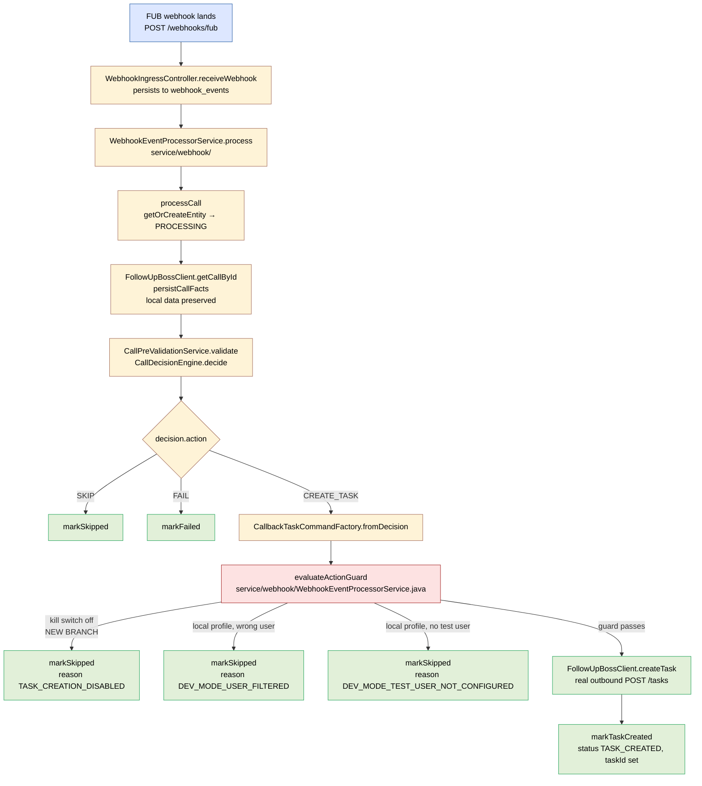

# Plan — Disable hardcoded task creation in deployed environments

## Context

The legacy "call → task" automation in `WebhookEventProcessorService` is
being retired in favour of workflow-engine-driven automations. Until the
replacement (`fub_fetch_call` step + author-built workflows) lands, we
need to stop the hardcoded action path from firing in deployed
environments — otherwise the first FUB webhook to land on Railway would
trigger a real `POST /tasks` call against the production FUB account.

This feature adds a kill switch and turns it on for the `prod` profile.
No removal of code, no behaviour change for tests or local dev. See
[research.md](./research.md) for the rationale.

## Approach summary

- **One new property** `rules.call-outcome.task-creation-enabled`,
  default `true`, env var `TASK_CREATION_ENABLED`.
- **One field** added to `CallOutcomeRulesProperties`.
- **One check** added inside `WebhookEventProcessorService` (renaming
  `evaluateDevGuard` → `evaluateActionGuard` and adding a leading
  kill-switch branch).
- **One line** added to `application-prod.properties` to set the switch
  to `false` for the deployed environment.
- **One new test** verifying the kill-switch branch.

## End-to-end lifecycle



The new branch is the leftmost one out of `evaluateActionGuard`. Every
other branch is unchanged from current behaviour.

## Work items

### 1. Property surface

`CallOutcomeRulesProperties.java` — add field:

```java
private boolean enabled = true;   // task-creation kill switch
```

`application.properties` — add:

```
rules.call-outcome.task-creation-enabled=${TASK_CREATION_ENABLED:true}
```

`application-prod.properties` — add:

```
# Hardcoded call → task automation is being retired in favour of the
# workflow engine. Turn it off in deployed environments so no FUB tasks
# are created until the workflow-based replacement is built.
rules.call-outcome.task-creation-enabled=false
```

### 2. Processor change

In `WebhookEventProcessorService`:

- Rename `evaluateDevGuard` → `evaluateActionGuard`. The old name is
  inaccurate now that it covers more than dev.
- Add a leading branch:

  ```java
  if (!callOutcomeRulesProperties.isEnabled()) {
      return Optional.of("TASK_CREATION_DISABLED");
  }
  ```

  before the existing local-profile checks.
- Add `TASK_CREATION_DISABLED` as a private constant alongside
  `DEV_MODE_USER_FILTERED` etc.
- Update the call site in `executeDecision` to use the renamed method.

### 3. Test

Single new test in
`src/test/java/.../service/webhook/WebhookProcessorActionGuardTest.java`
(or extend an existing test class — see "tests" below):

- Given: `rules.call-outcome.task-creation-enabled=false` (via
  `@TestPropertySource`).
- When: a webhook arrives that would normally produce a `CREATE_TASK`
  decision (use the same fixture as
  `WebhookProcessingFlowTest#shouldCreateTaskOnSuccessfulFlow`).
- Then: the row's status is `SKIPPED`, reason is
  `TASK_CREATION_DISABLED`, no FUB `createTask` call was made (mock
  asserts zero invocations).

Existing tests (`WebhookProcessingFlowTest`,
`WebhookProcessingDevGuardFlowTest`,
`WebhookProcessingDevGuardMissingConfigFlowTest`) don't need changes:
they all run with the default `enabled=true` and therefore continue to
exercise the existing dev-guard / task-create paths.

## Critical files

**Modified:**
- `src/main/java/.../config/CallOutcomeRulesProperties.java` — add
  `enabled` field.
- `src/main/resources/application.properties` — wire env var.
- `src/main/resources/application-prod.properties` — set to `false`.
- `src/main/java/.../service/webhook/WebhookEventProcessorService.java` —
  rename guard, add leading kill-switch branch, add constant.

**New:**
- `src/test/java/.../integration/WebhookProcessorActionGuardTest.java`
  (or chosen home) — single kill-switch test.
- `Docs/features/disable-hardcoded-task-creation/research.md` (done).
- `Docs/features/disable-hardcoded-task-creation/plan.md` (this file).
- `.env.example` — add `TASK_CREATION_ENABLED=true` with a comment.

**Not modified:**
- The `rules/` package (CallDecisionEngine, CallbackTaskCommandFactory,
  CallPreValidationService) — kept intact.
- Existing call-flow tests.
- The dev guard property `dev-test-user-id` — kept (still used by the
  local-profile guard).

## Verification

```bash
# 1. Default (kill switch on, behaviour unchanged)
./mvnw clean test
# expect: 403 / 0F / 0E / 36 skipped, no test-suite changes

# 2. Kill switch off (the new behaviour)
./mvnw -Dtest=WebhookProcessorActionGuardTest test
# expect: 1 / 0F / 0E

# 3. Local smoke (kill switch active, real call)
TASK_CREATION_ENABLED=false SPRING_PROFILES_ACTIVE=local ./mvnw spring-boot:run
# Trigger a callsCreated webhook (cloudflared + real FUB call):
#   - expect: processed_calls row goes RECEIVED → PROCESSING → SKIPPED
#   - expect: no FUB POST /tasks observed
#   - expect: failure_reason = "TASK_CREATION_DISABLED"
```

After Railway deploy, the `prod` profile sets the switch to `false`
automatically — no env var needed on the host. The first real call
through the deployed instance should land in `processed_calls` with
status `SKIPPED:TASK_CREATION_DISABLED`.

## Repo decisions impact

`No` — this is an in-feature kill switch with explicit revert path. The
broader retirement of the hardcoded path (deleting CallDecisionEngine
etc.) happens in a later feature and *will* warrant an RD because it
codifies "all FUB-side automations live in the workflow engine." Out of
scope here.

## Out of scope

- Deleting `CallDecisionEngine`, `CallbackTaskCommandFactory`,
  `CallPreValidationService`, the `rules/` package.
- Removing `dev-test-user-id` (still useful for local dev).
- Building the `fub_fetch_call` workflow step (next feature).
- Any UI change — the admin processed-calls UI handles
  `SKIPPED:TASK_CREATION_DISABLED` via its existing reason-display path.
