# Domain Events — the plain-language overview

> **Read this first.** It's the map for the whole feature: what the system does, why this feature exists, what it changes, and how the pieces (collapse, echo-suppression, trigger filter, cancel-on-collision) fit together. No prior context assumed. For the formal spec see [`plan.md`](./plan.md); for the phase-by-phase build see [`README.md`](./README.md). If this doc and those ever disagree, those win — but this is the one to re-read when you've lost the thread.
>
> Diagrams are Mermaid — open in any Mermaid-capable viewer (GitHub, VS Code preview, IntelliJ).

---

## 1. What the system is

An **automation engine** bolted onto **Follow Up Boss (FUB)**, a real-estate CRM. FUB holds *people* (leads, agents, clients), their *calls*, *notes*, *tags*, and *assignments*. The engine watches what happens in FUB and **runs workflows** in response.

Today one workflow matters: **`agent_followup_enforcement`**. In plain English:

> When a lead is assigned to an agent, wait a few minutes, then check: did the agent actually contact the lead? If **not**, post a nudge note and/or reassign the lead.

That's the product. The engine enforces "agents must follow up fast."

---

## 2. How FUB talks to the engine: webhooks

FUB notifies the engine via **webhooks** — small HTTP messages like `peopleUpdated`, `callsCreated`, `notesCreated`. When a person changes, FUB sends `peopleUpdated`.

The **original design** was literal: *webhook arrives → run the workflow.*

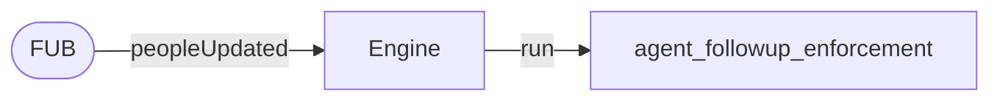

Simple — and that simplicity is exactly what broke.

---

## 3. Why it broke — the bad-run problem

This design produced **46–64% "bad runs"**: workflow runs that should never have happened. Three causes, all from the same root flaw — **the webhook carries no idea of *what* changed.**

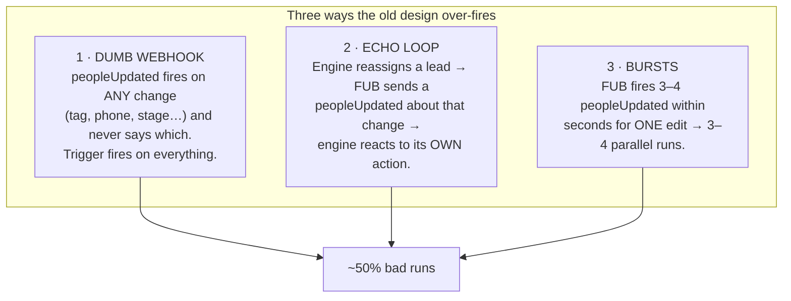

The **echo loop** is the nastiest — the engine triggering itself:

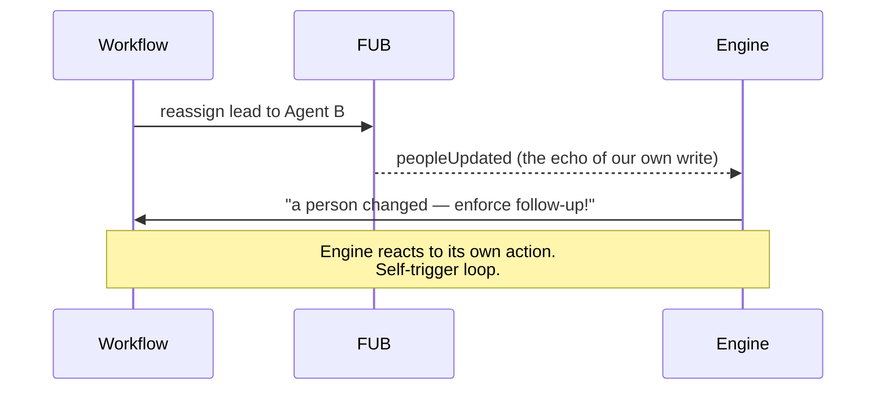

**What the damage looked like in the field:** nudge notes posted on a lead who was mid–11-minute real conversation with their agent; one lead (20235) reassigned to the same person **three times** back-to-back from three parallel runs; runs where the correct count was zero. The system only stayed "safe" by accident — a 5-minute buffer that happened to absorb some over-fires. Not production-credible, and impossible to add a second workflow to without inheriting every bug.

---

## 4. The key insight — the reframe

The entire feature rests on one shift in thinking:

> **A webhook is not an event to react to. It's a *signal that some state might have changed.***

Old way: *three webhooks = three reactions.*
New way: when a webhook arrives, the engine **fetches the current state, compares it to what it already knew (a "diff"), and emits a real event only if something *meaningful actually changed*.**

That turns FUB's noisy webhook stream into a clean, typed stream of **domain events** — the engine's *own* truth about what changed:

- `person.created` — a new person appeared
- `person.state_changed` — **carries exactly which fields changed** (e.g. `assignedUserId: 10 → 11`)
- `call.created`, `note.created` — things that happened

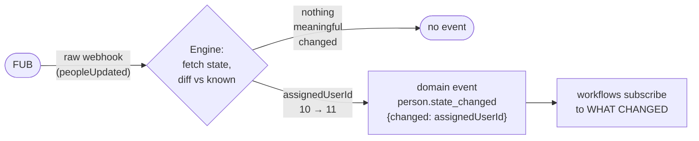

Workflows now subscribe to **domain events**, not raw webhooks. The trigger goes from *"fire when a person is updated"* to *"fire when `assignedUserId` actually changed, and I didn't cause it."*

This kills all three bugs:

| Old bug | Killed by |
|---|---|
| **Over-fire** (dumb webhook) | The event says *what* changed; the workflow only watches its one field. |
| **Bursts** | First webhook diffs → event; the rest see "no change" → **one** event, not three. *(event collapse)* |
| **Echo loop** | Engine writes update its **local copy first** → FUB's echo diffs to *empty* → no event. And the change is **tagged `source=ENGINE`** so workflows can filter out "things I caused." |

Here's the echo loop **after** the fix:

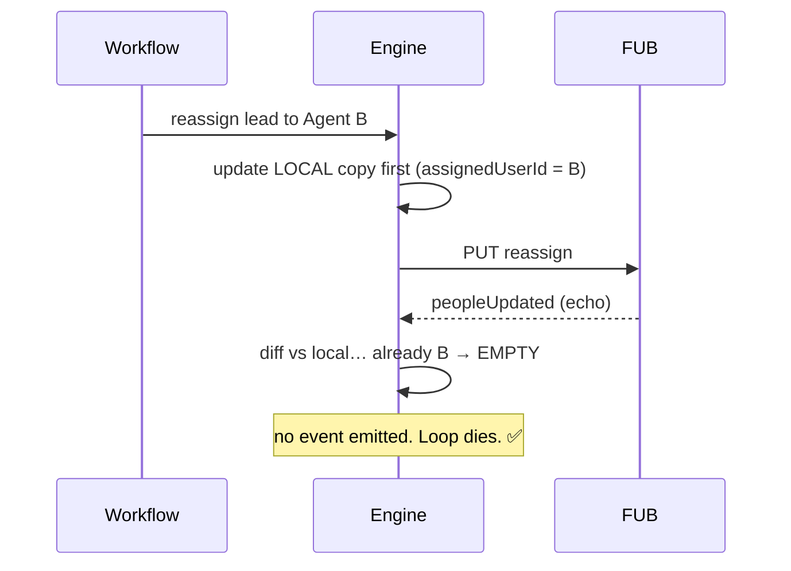

---

## 5. The promises the feature makes (the invariants)

- **I1** — the engine's local copy mirrors FUB for every field a workflow references.
- **I2** — an event is emitted *only* when something meaningful happened.
- **I3** — the engine never phantom-triggers on its own writes.
- **I4** — at most **one active run** per (workflow, person) at a time.  ← *Phase 5*
- **I5** — every run records both the webhook *and* the logical event that caused it (so it's debuggable).

---

## 6. How it's being built — the phases

Staged so each step is safe and reviewable on its own.

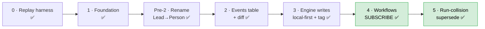

| Phase | What it does | State |
|---|---|---|
| 0 | Replay harness — replays recorded real incidents to prove fixes | done |
| 1 | Foundation plumbing | done |
| Pre-2 | Rename `Lead`→`Person` (FUB calls them people) | done |
| 2 | Build the events table + diff machinery. Events get **written** on every webhook — but **nothing reads them yet** | done |
| 3 | Engine writes update local state first + tag themselves `source=ENGINE` — the echo-killer | done |
| **4** | **Workflows actually subscribe to domain events.** The old webhook trigger is retired. *The bad-run-rate win lands here.* | done |
| 5 | Run-collision handling — field-aware supersede-at-plan-time (#29) | done |

**Subtlety worth holding onto:** because of Phase 2, **events are already being written on every webhook right now** — they just pile up with no reader. So Phase 4's real job is **attaching the first reader**. (That's why the order of "attach reader" vs. "turn on the engine's own event emission" matters during cutover.)

---

## 7. The layered defenses — and where Phase 5 fits

After Phases 2–4 there are **several defenses against duplicate/unwanted runs**, each sitting at a different point in the pipeline. This is the part that's easy to tangle — keep the *positions* straight:

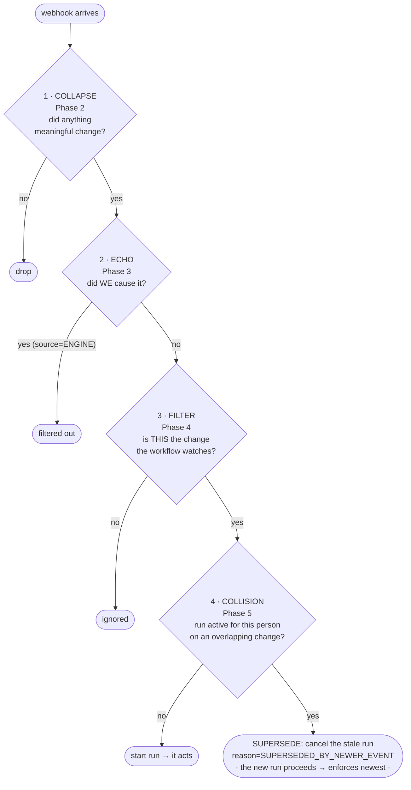

Read top to bottom — each gate answers a different question:

1. **Collapse** *(Phase 2)* — "did anything meaningful change?" Kills bursts (3 webhooks → 1 event).
2. **Echo** *(Phase 3)* — "did *we* cause this?" Tagged `source=ENGINE` → filtered.
3. **Filter** *(Phase 4)* — "is this the specific change the workflow watches?" The front door.
4. **Collision** *(Phase 5, supersede)* — "is a run already active for this person on an *overlapping* change?" If yes → **cancel the stale run; the newer run proceeds and enforces the newest state**.

### What Phase 5 is actually for

After gates 1–3, almost all duplicates are gone. **One case survives:** two *genuinely different, meaningful* changes for the **same lead**, **close in time**.

> Example: lead assigned to **Agent A** → a run starts and begins its wait. 90 seconds later, the lead is reassigned to **Agent B**. Both changes are real. The first run is now waiting to nudge about a stale assignment.

**The decision (2026-06-03): supersede-at-plan-time, field-aware.** When Event 2 arrives it **already spawns its own run** (it passed the filter). So at plan time we cancel the *stale* run (Agent A) and let the *new* run (Agent B) proceed — the engine enforces the **newest** state with exactly one run. The stale run is cancelled before its waited actions fire, so it never acts on Agent-A state; no freshness re-check is needed. **Field-aware:** the cancel fires only when Event 2's `changed_fields` overlap the in-flight run's, so an unrelated change (e.g. a phone edit) never cancels an assignment-premised run.

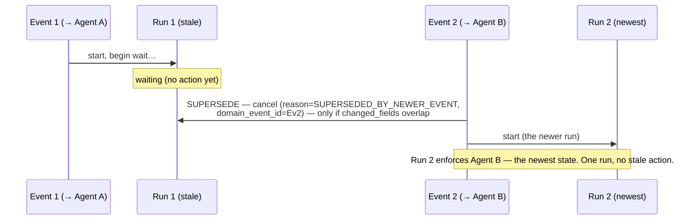

The options we weighed:

| Option | Behavior | Verdict |
|---|---|---|
| Let both run | Two nudge cycles | ❌ the original bug |
| Hard-suppress | Ignore #2, keep #1 | ❌ #1 acts on stale info (Agent A, already replaced) |
| Cancel-only | Cancel #1, start nothing | ⚠️ safe, but #2 (newest) goes unenforced |
| **Supersede** *(chosen)* | **Cancel #1, #2 proceeds** | ✅ one run, enforces the newest state. Free here — #2's run already exists |

**Why supersede (not cancel-only):** under Rail 2 the replacement run already exists (Event 2 created it), so the "supersede ideal" — act once, on the newest state — costs no more than cancel-only, and it *enforces* the newest change instead of dropping it. The freshness re-check the original ideal needed is unnecessary because the stale run is cancelled before it acts. The only residual is a truly-simultaneous race (both runs miss each other) — rare, tracked in known-issue #29.

After this, the domain-events feature is **complete**.

### The words that keep blurring — pinned down

- **Filter** *(Phase 4, built)* = "is this event worth reacting to at all?" — at the front door.
- **Supersede-on-collision** *(Phase 5, built)* = "a newer event whose change-set *overlaps* an in-flight run cancels that run; the newer run proceeds and enforces the newest state." — when runs collide.
- **Freshness re-check** *(not needed / not built)* = "re-read live state right before acting." Unnecessary under supersede because the stale run is cancelled before it acts; would only matter if a cancelled run could have already acted.

---

## 8. One-paragraph summary

The engine enforces agent follow-up. FUB's webhooks are dumb — they say "something changed" but not *what* — so the old "webhook → run" design fired wrongly about half the time, including triggering on the engine's own writes. The fix is to stop treating webhooks as events and start treating them as *signals*: the engine diffs the new state against what it knew and emits a clean, typed **domain event** only when something meaningful changed, tagging its own writes so it never reacts to itself. Workflows subscribe to those events ("fire when `assignedUserId` changed and I didn't cause it") instead of raw webhooks. That removes the over-fires, the bursts, and the echo loop. The last remaining case — two *genuinely different* changes for the same lead racing each other — is handled in Phase 5 by **superseding**: a newer event whose change-set overlaps an in-flight run cancels that stale run, and the newer run (which the event already spawned) proceeds to enforce the newest state. One run, on the freshest data, no stale action.

---

## Domain Events — Phases

> **Plan-lock changelog (2026-06-03, later):** Phase 5 **re-rescoped from cancel-only → supersede-at-plan-time (field-aware)**, and built. The cancel-only entry below is preserved as the record of the earlier same-day decision. What changed and why:
> - **Under Rail 2 the newer event already spawns its own run** (it passed the trigger filter), so the "ideal" supersede outcome — cancel the stale run, the newer run enforces the newest state — costs the same as cancel-only but **enforces the newest change instead of dropping it**. The deferred "supersede + restart" machinery is unnecessary: the restart is free because the replacement run already exists.
> - **No freshness gate needed.** The stale run is cancelled *before* its gated actions fire (they sit behind 3-/30-min waits), so it never acts on stale state. The freshness gate was only for "already acted then cancelled," which doesn't arise here.
> - **Field-aware.** Supersede fires only when the newer event's `changed_fields` overlap the in-flight run's — a phone change never cancels an assignment-premised run. Scoped to `(workflow_key, source_person_id)`; cross-workflow runs are independent. Implemented in a dedicated `RunSupersedePolicy` (keeps `plan()` thin; documents the entity-generalization seam — person is the only stateful entity today).
> - **Accepted limitation:** truly-simultaneous same-person events can both miss each other's run (no lock / no partial unique index) → two runs proceed. Rare; documented in known-issue #29 with a revisit-trigger. The cancel-only-era "newer change unenforced" limitation is **resolved** by supersede.
> - Feature still declared complete after Phase 5.

> **Plan-lock changelog (2026-06-03):** Phase 5 rescoped, and `suppressed_by_run_id` dropped from Phase 4a. After deliberation on the run-collision case (two genuinely-distinct meaningful changes for the same person while a run is active — rare, since Phases 2–4 already remove duplicates/echoes/over-fires):
> - **Phase 5 → cancel-only, experimental.** On collision, **cancel the in-flight run** (reason `SUPERSEDED_BY_NEWER_EVENT` + the causing `domain_event_id`); do **not** start a replacement. Conservative "miss it rather than mis-fire" posture. Reuses the existing `WorkflowRunControlService` cancel (step-skip + executor-stop already give safe cancel) with a relaxed status guard; no partial unique index, no supersede/restart, no separate instrumentation. Frequency is self-reported via `reason_code` counts.
> - **The "ideal" collision policy (supersede + freshness gate) is deferred to a known issue**, not a Phase 5 deliverable. The accepted limitation: the *newer* change goes unenforced when a collision is cancelled. Revisit if cancelled-run counts get high.
> - **`suppressed_by_run_id` dropped from 4a.** It was a run-to-run link; cancel-only attributes the cancel to an *event* (`reason_code` + `domain_event_id`), so that column is the wrong shape. Re-add in a future phase only if supersede (run-to-run) is actually built. 4a now ships only `domain_event_id`.
> - **Domain-events feature is declared complete after Phase 5** (cancel-only). The frequent bad-run causes are already closed by Phases 2–4; this is the rare residual, handled safely.

> **Plan-lock changelog (2026-06-02):** Fresh-eyes verification before starting Phase 4. Intent confirmed unchanged — workflows subscribe to domain events, `agent_followup_enforcement` is re-authored against the new shape, and the bad-run-rate win lands here. Five accuracy corrections, all in the Phase 4 section below:
> - **`engine.write.emit-events` reframed as a platform config, not a dormancy flag.** The `events` table is *already* populated and dispatched on every webhook today — Phase 2 emission (`PersonUpsertService` / `CallUpsertService` / `NoteEmissionService` → `DomainEventEmitter.emit`) is ungated. The flag gates only the engine's emission of *its own* `person.state_changed` event (`DefaultEngineWriteCoordinator:180`); annotation (`source=ENGINE`) is always on regardless. Target state is **ON**, surfaced as a platform-level toggle on the future config page (workflows that want to act on engine writes vs. exclude them is a per-workflow filter concern, not a global one). Cutover **sequencing** is now explicit so the listener registration and the flag don't flip in the wrong order.
> - **Validator generalized to a per-event-kind field-schema check.** The silent-no-fire bug (a filter references a path the event payload never carries → predicate never true → trigger never fires, no error) is universal across event kinds, not `change.*`-specific. The validator checks every filter reference against the declaring event kind's field set. We own the person schema (full guard now); append-event payloads (`call`, `note`) are FUB-shaped and get the registry seam but stay explicitly unvalidated until a consumer exists.
> - **Dispatch crash-window: decision lands in Phase 4, build does not.** The in-memory dispatcher loses an event if the process dies between commit and after-commit dispatch. Phase 4 records the accepted dev-phase gap + adds one observability log; the durable-outbox poller is a separate tracked follow-up (per `plan.md` Out-of-scope).
> - **Re-authored filter uses `person.kind = 'LEAD'`** (normalized enum), reconciling the stale `person.stage = 'Lead'` example in `plan.md` §3.
> - **Note-channel echo filtering explicitly deferred.** `notesCreated` is not ingested (`config/fub-webhook-events.txt` subscribes to `callsCreated` / `peopleCreated` / `peopleUpdated` only), so the note-annotation channel is dormant by definition — no note event ever arrives to filter. Revisit when note ingestion is enabled; tracked in known-issue #27.

> **Plan-lock changelog (2026-05-29):** Fresh-eyes race-matrix audit before starting Phase 3. See [`plan.md`](./plan.md) for the cell-by-cell evaluation that drove these revisions; commit-level plan in [`plan.md`](./plan.md).
> - **Phase 3 restructured around three operation modes**, not one wrap pattern. `fub_reassign` and `fub_move_to_pond` use `SCALAR_FIELD_UPDATE` (local-state-first); `fub_add_tag` uses `ENTITY_APPEND_TRACKED_ONLY` (no local write — eliminates phantom-removal class); `fub_create_note` uses `ENTITY_CREATE_TRACKED_ONLY` (annotates the `note.created` echo). _(2026-06-01: 3e reduced to a single channel — the originally-planned person-side `peopleUpdated` echo was confirmed not to exist; note creation fires only `notesCreated`. See `plan.md` §3e changelog.)_
> - **Revert dropped entirely.** `RetryPolicy.DEFAULT_FUB` already handles transient FUB failures; permanent failures accept drift until next webhook re-syncs. Plan.md §5's "restore prior snapshot" semantics are reversed. Removes a whole code path. Accepted cost: misleading echo on next webhook after a permanent failure (known issue #26).
> - **`EngineWriteCoordinator` service** owns the multi-tx discipline (lock + tracker + emitter annotation) across all three modes. Steps stay thin. The originally-floated `FubMutatingStep` SPI is dropped — three different mechanisms don't fit one interface.
> - **`REQUIRES_NEW` is a pattern requirement, not a footnote.** The outer `@Transactional` on `WorkflowStepExecutionService.executeClaimedStep` (line 68) would otherwise pin the row lock across the FUB HTTP call. Coordinator's inner write uses `TransactionTemplate(REQUIRES_NEW)` to escape it. Mirrors `PersonUpsertService` DIVE-recovery discipline.
> - **Tags become tracker-only**, not local-state-first. The C2 phantom-removal class (concurrent external tag-add lands before our FUB PUT → diff vs. optimistic local fabricates a "removal" event) is structurally unfixable with optimistic local writes. Cost: one annotated event per engine tag-add.
> - **Race harness is a Phase 3 deliverable**, distributed across sub-phases: A1–A7 in 3b, B subset in 3c, C1–C3 in 3d, D1–D4 in 3e. Skeleton + `FakeFollowUpBossClient` in 3a. Existing harnesses (`ReplayHarnessTest`, `PersonUpsertConcurrencyStressTest`) can't drive engine-write × external-webhook timing races.
> - **Redis-backed tracker promoted to Phase 4 prerequisite.** Phase 3 ships `InMemoryEngineWriteTracker`; the 30s crash window of phantom events is dev-acceptable until Phase 4 consumers exist.
> - **Tracker match semantics locked** at `engineRecord.changedFields ⊆ diffFields` → hit. Loosest reasonable match; annotates A4-style concurrent-external scenarios as `ENGINE` (annotation-over-detection bias). Trade-off documented; strict equality would miss A4 entirely.
> - **`change.source` annotation lives in `event.payload`** (JSON), not as a new field on the `DomainEvent` record. Avoids churning every listener signature; Phase 4 consumers read `event.payload.source` directly.

> **Plan-lock changelog (2026-05-28, late-day):** Final fresh-eyes audit before starting Phase 2. This is the last revision to the roadmap; subsequent surprises go into phase implementation logs, not this file.
> - **Phase 2 restructured into 5 sub-phases.** A new **2b (pure refactor, no behaviour change)** is inserted between scaffold and emission: extracts `CallUpsertService.persistCallFacts` so the call/note emission paths are `@Transactional` by construction; restructures `PersonUpsertService` to capture-old / apply-new shape; uses `findBy…ForUpdate` at **both** the primary finder and the `DataIntegrityViolationException` recovery re-read (closes the brand-new-row insert-race window). 2c/2d/2e land on a structure where the previously-uncaught defects are impossible to write. See [`plan.md`](./plan.md).
> - **Phase 2 replay-harness assertions changed from `min*` to `expected*` (exact counts)** for collapse fixtures. `min: 1` silently accepts a broken collapse that produces 3 events. Append events keep `min` (no uniqueness claim).
> - **Phase 3 wraps `fub_add_tag` too** — five FUB-mutating step types exist in the codebase; the original list of three missed `fub_add_tag`, which mutates `person.tags` and produces an echo. Without wrapping it, every tag-adding workflow self-triggers.
> - **Phase 3 revert semantics clarified** in `plan.md` §5: revert means *restore the captured prior snapshot of affected fields*, not *undo the delta we applied*. Equivalent for scalars; materially different for accumulating fields (`tags`, `phones`, `emails`).
> - **Phase 4 adds a new `DomainEventTriggerType`** alongside the retiring `FubWebhookTriggerType`; `WorkflowTriggerRouter` gains a `route(DomainEvent)` overload registered as a listener on `DomainEventDispatcher`. The "hard cut" framing was under-scoped — these are concrete new classes, not just a rewire.
> - **Phase 4 validator warns (not refuses) on missing `change.source` predicate** for `person.state_changed` triggers. The `excludeEngineEchoes` opt-in default is per-`plan.md` policy; the warning prevents the silent regression of issue #23 when a future workflow author forgets the predicate.
> - **Phase 5 partial unique index includes `source_system`** (now `(workflow_key, source_system, source_person_id)`). The `events` table already carries `source_system` from day 1 for future CRM adapters; the run-uniqueness index has to match.
>
> **Earlier changelog (2026-05-28, morning):** Architecture review before starting Phase 2.
> - Pre-Phase-2 rename was under-scoped: the admin read-feed surface (controller, DTOs, read-repo, exception package, HTTP/UI routes) was never enumerated and was still `Lead`-named. Added to deliverables below. The app is not deployed anywhere, so renaming the `/admin/leads` route + admin-ui paths is free.
> - Phase 2 gains two correctness deliverables surfaced by the review: **per-person upsert serialization** (the diff-collapse invariant is not safe under the 2–4 thread async webhook pool without it) and **after-commit event dispatch** (emit row in-tx, fan out after commit — not inline in the write transaction).
> - The durable outbox poller (a `dispatched` flag + crash-recovery job) is explicitly **deferred to a Phase 4 decision** — there are no event consumers until then, and the app isn't running anywhere, so the crash-between-commit-and-dispatch window carries no risk today.

Each phase is independently shippable and reviewable. Complete in order. The phase order has been chosen so that **Phase 3 (local-state-first writes) lands before Phase 4 (trigger schema migration)** — otherwise the deployment window between the two would leave engine echoes producing phantom events under the new trigger shape, briefly making the system *worse* than today.

The "app is in dev phase" framing applies — drain protocols, in-flight migration shims, and reconciliation are deferred (see plan.md "Out of scope"). Each phase is verifiable in isolation but the bad-run-rate win arrives at Phase 4.

---

### Phase 0 — Replay harness
Status: `DONE` — framework + one synthesized fixture + four real DB-extracted fixtures (lead 20123, 20207, 20231, 20235) all passing in 132s. See [implementation-log.md](./implementation-log.md) for details.

**Goal:** A tool that takes a recorded sequence of webhook events (live or synthesized) and plays it through a test instance of the engine, asserting on the resulting workflow runs, domain events emitted, and FUB writes attempted.

Without this, Phases 2–5 are nearly impossible to validate. The field-observations.md learnings on 05-08, 05-11, 05-12 are exactly the kind of multi-event-in-time interactions unit tests miss.

#### Deliverables
- A CLI / test harness that ingests a JSON / JSONL file of recorded webhook payloads with relative timing
- The harness drives `WebhookIngressService` directly (or a test seam just above it), respecting the inter-event gaps
- Mock FUB client that records outbound calls and returns canned responses
- Assertions: events emitted (kinds, payloads), workflow runs created/suppressed, FUB calls made
- Recorded fixtures for the three high-signal field-obs incidents:
  - Lead 20123 cascade (05-08)
  - Lead 20207 triple-run (05-11)
  - Lead 20235 FUB-burst (05-12)
  - Lead 20231 4-webhook burst (05-12)

#### Verification
- Each recorded fixture plays back deterministically against the *current* engine and reproduces the documented bad behaviour (proves the harness has fidelity)
- Failing assertions are reported with enough context to debug (event timeline + expected-vs-actual)

#### Exit criteria
- Harness can be invoked via `./mvnw` or a dedicated script
- README documents the fixture format and how to add new ones
- Three reproductions of historical incidents pass deterministically

#### Why this is Phase 0
- Phases 2–5 each need it for credible verification
- Currently the project's only safety net against this class of bug is live production observation (field-observations learning #9); the harness moves that safety net into CI

---

### Phase 1 — Foundation
Status: `DONE` — webhook_event_id populated end-to-end (known-issue #25 resolved), `leads.previous_state` column added, validator refuses unknown `lead.*` references at save time. 528 tests pass; replay harness's Phase 1 invariant assertion holds across all 5 fixtures. See [implementation-log.md](./implementation-log.md) for details.

> **Note:** Phase 1 was implemented under the older `Lead` naming. The Pre-Phase-2 rename pass (next entry) sweeps everything to `Person`. Phase 1's implementation log preserves the original `Lead` wording as a historical record.

**Goal:** Cheap groundwork that has no behaviour change but unblocks everything downstream.

#### Deliverables
- **Populate `workflow_runs.webhook_event_id` on every run** — the line at [WorkflowExecutionManager.java:~117](../../../src/main/java/com/flux/service/workflow/WorkflowExecutionManager.java) already calls `run.setWebhookEventId(request.webhookEventId())`; trace the caller chain and ensure `request.webhookEventId()` is populated (resolves known-issue #25)
- **Thread `webhookEventId` through `RunContext`** — already present per Wave 2; verify and tighten if needed
- **Add `leads.previous_state` JSONB column** via Flyway migration; default `NULL`; populated by the diff layer in Phase 2
- **Workflow-creation-time field-reference validator** — runs at `POST /admin/workflows` and `PUT /admin/workflows/{id}`; refuses to save workflows that reference fields not captured in `leads.lead_details` or `leads.previous_state`; covers `change.*`, `lead.*` references
- **Audit `leads.lead_details` field coverage** — list every field referenced by today's workflows (just `agent_followup_enforcement` for now) plus product-discovery candidates; extend `LeadUpsertService.SNAPSHOT_FIELDS` if anything is missing

#### Verification
- Existing test suite green after migration
- New unit test: workflow with `lead.fakeField` reference is refused at validation time with a clear error
- All current `agent_followup_enforcement` runs continue to be created with `webhook_event_id` populated (spot-check via `SELECT id, webhook_event_id FROM workflow_runs ORDER BY id DESC LIMIT 20`)

#### Exit criteria
- Migration applied cleanly to dev DB
- Every new `workflow_runs` row has `webhook_event_id` set
- `leads.previous_state` column exists, all values `NULL`
- Validator refuses unknown field references at save time

#### Repo decisions impact
TBD at implementation-log.md time. Likely `No` — local feature concern.

---

### Pre-Phase-2 — Rename `Lead` → `Person` + drop ingest filter
Status: `DONE` — Java/backend admin read-feed, SPA routes/API/types, replay fixtures, and workflow JSON are swept to `Person`; `/admin/persons` and `/admin-ui/persons` are canonical. See [implementation-log.md](./implementation-log.md) for details.

**Goal:** Clean substrate for Phase 2's vocabulary. Strictly mechanical rename, plus one bundled behaviour change (drop the `isFubLeadPerson` ingestion filter).

Why this slot in the phase order: Phase 2 is about to introduce the `events` table, the `event_kind` enum (`person.state_changed`, etc.), the validator's `change.*` vocabulary, and emission code. Locking these around the existing `Lead` name would require a rename migration of the events table later. Doing the rename first means every downstream phase uses the right vocabulary from day one.

#### Why `Person` (not `Contact`, `Party`, or staying with `Lead`)

`Lead` conflates the CRM-contact entity with the FUB `stage` value `"Lead"`. They are different concepts: the entity is a human in the CRM; `stage` (Lead / Customer / Past Client / Trash / custom) is one of many attributes. FUB's own API calls them `/v1/people`.

- **`Person`** — matches FUB's API. No collision with any major CRM's named entity. Salesforce/HubSpot/Zoho/Dynamics adapters each translate their own term (`Lead`, `Contact`) into our `Person`. Workflows filter relationship type via `person.kind` (our normalized enum — see below) or `person.stage` (FUB's raw stage string).
- **`Contact`** rejected: collides with Salesforce's specific `Contact` entity (which is distinct from SF's `Lead`). Would be actively misleading in a multi-CRM context.
- **`Party`** rejected: most abstract, no CRM uses it natively, solves problems we don't have (organizations).
- Staying with `Lead` rejected: bakes the conceptual mismatch deeper with every phase.

#### Deliverables

**Schema (V21 migration — single file, single transaction):**
- Rename `leads` → `persons` (table name; plural form chosen for SQL clarity)
- Rename `source_lead_id` → `source_person_id` on `persons`, `workflow_runs`, `webhook_events`, `processed_calls`
- Rename `lead_details` → `person_details` (the JSONB column on `persons`)
- `previous_state` keeps its name (already generic)
- Rename constraints: `uk_leads_source_system_source_lead_id` → `uk_persons_source_system_source_person_id`; `chk_leads_status` → `chk_persons_status`
- Rename indexes: `idx_leads_*` → `idx_persons_*`; `idx_processed_calls_lead_started` → `idx_processed_calls_person_started`
- Update V19 `chk_webhook_events_normalized_domain` CHECK constraint: allow `PERSON` (renamed from `LEAD`) and `NOTE` (added for Phase 2's note handling). Existing rows updated via `UPDATE webhook_events SET normalized_domain='PERSON' WHERE normalized_domain='LEAD'` before constraint re-add.
- **Add `kind` column on `persons`** — `VARCHAR(32) NOT NULL DEFAULT 'UNKNOWN'` with CHECK constraint allowing `LEAD`/`AGENT`/`REALTOR`/`UNKNOWN`. Indexed (`idx_persons_kind`) for admin-query performance.
- Backfill `persons.kind` from existing `person_details.stage` via a case-insensitive mapping (`lead`→LEAD, `agent`→AGENT, `realtor`→REALTOR, else UNKNOWN).

**Java renames + new types:**
- `LeadEntity` → `PersonEntity` (also gains a `kind` field — `@Enumerated(EnumType.STRING) PersonKind kind`)
- `LeadRepository` → `PersonRepository` (method `findBySourceSystemAndSourceLeadId` → `findBySourceSystemAndSourcePersonId`)
- `LeadStatus` → `PersonStatus`
- `LeadUpsertService` → `PersonUpsertService` (package `service/lead/` → `service/person/`)
- `LeadSnapshotResolver` → `PersonSnapshotResolver` (also exposes `kind` in the JSONata scope map)
- `LeadAdminQueryService` → `PersonAdminQueryService`
- `LeadFeedCursorCodec` → `PersonFeedCursorCodec`
- `WebhookEventProcessorService.processLeadDomainEvent` → `processPersonDomainEvent`
- `upsertLeadFromAssignmentEvent` → `upsertPersonFromEvent` ("assignment" wording was always misleading)
- `NormalizedDomain.LEAD` → `PERSON`
- **New enum `PersonKind`** — `LEAD`, `AGENT`, `REALTOR`, `UNKNOWN`. Lives in `persistence/entity/`. Pattern matches existing `PersonStatus`.
- **New `PersonUpsertService.mapStageToKind(String stage) → PersonKind`** — case-insensitive mapping helper. Called during upsert; logs WARN when an unmapped stage hits UNKNOWN so unrecognised stages surface fast.
- **`PersonUpsertService.capturedFieldNames()`** updated — returns `SNAPSHOT_FIELDS + {"kind"}` so the workflow validator accepts `person.kind` as a known field.

**Runtime vocabulary:**
- `RunContext.lead` → `RunContext.person`
- `ExpressionScope` key `lead` → `person`
- `WorkflowGraphValidator.LEAD_EXPRESSION_PATTERN` / `LEAD_TEMPLATE_PATTERN` → `PERSON_*`
- `validateLeadFieldReferences` → `validatePersonFieldReferences` (error message updated)
- `LeadUpsertService.SNAPSHOT_FIELDS` → `PersonUpsertService.SNAPSHOT_FIELDS` (membership unchanged)

**Admin read-feed surface rename** (missed in the original scoping — added 2026-05-28):

The initial Pre-Phase-2 deliverable list covered the entity, repository, and core upsert layer, but missed the admin/read-feed surface entirely. `PersonAdminQueryService` was renamed but it still imported and returned `Lead*` types, leaving the substrate internally inconsistent. The app is not deployed anywhere, so renaming the HTTP route and SPA paths is free.

- Controller: `AdminLeadController` → `AdminPersonController`; `@RequestMapping("/admin/leads")` → `/admin/persons`
- DTOs (package `controller/dto/`):
  - `LeadFeedItemResponse` → `PersonFeedItemResponse`
  - `LeadFeedPageResponse` → `PersonFeedPageResponse`
  - `LeadSummaryResponse` → `PersonSummaryResponse`
  - `LeadActivityKind` → `PersonActivityKind`
  - `LeadActivityEventResponse` → `PersonActivityEventResponse`
  - `LeadLiveStatus` → `PersonLiveStatus`
  - `LeadRecentCallResponse` → `PersonRecentCallResponse`
  - `LeadRecentWorkflowRunResponse` → `PersonRecentWorkflowRunResponse`
  - `LeadRecentWebhookEventResponse` → `PersonRecentWebhookEventResponse`
- Read repository: `LeadFeedReadRepository` → `PersonFeedReadRepository`; `JdbcLeadFeedReadRepository` → `JdbcPersonFeedReadRepository`; inner types `LeadFeedReadQuery` → `PersonFeedReadQuery`, `LeadFeedRow` → `PersonFeedRow`
- Service inner type: `PersonAdminQueryService.LeadFeedQuery` → `PersonFeedQuery`
- Exception: package `exception/lead/` → `exception/person/`; `InvalidLeadFeedQueryException` → `InvalidPersonFeedQueryException`
- Admin UI: deep-link route `/admin-ui/leads/{id}` → `/admin-ui/persons/{id}` in `AdminUiController` + the SPA's fetch URLs and router config; the existing comment in `AdminUiController` referencing the old path
- Tests: `AdminLeadsFlowTest` → `AdminPersonsFlowTest` (+ all `/admin/leads` MockMvc paths); `JdbcLeadFeedReadRepositoryTest` → `JdbcPersonFeedReadRepositoryTest`; `LeadScopedTopNRepositoryTest` → `PersonScopedTopNRepositoryTest`
- Cosmetic: stale `leads.person_details` comment in [`PersonUpsertService.java:63`](../../../src/main/java/com/flux/service/person/PersonUpsertService.java)

**Workflow JSON sweep** (the one production workflow):
- `agent_followup_enforcement.workflow.json`:
  - `eventDomain: "LEAD"` → `eventDomain: "PERSON"`
  - `{{ lead.assignedUserId }}` → `{{ person.assignedUserId }}`
  - `{{ lead.assignedTo }}` → `{{ person.assignedTo }}`
  - `$boolean(lead.assignedUserId)` (in the `gate_assigned` node) → `$boolean(person.assignedUserId) and person.kind = "LEAD"`
  - **The `person.kind = "LEAD"` predicate is mandatory.** It compensates for the dropped `isFubLeadPerson` ingest filter. Uses our normalized `kind` enum rather than FUB's raw `stage` string.
  - **Known limitation (YAGNI — accepted 2026-05-28):** `mapStageToKind` does **exact** case-insensitive match on `lead` / `agent` / `realtor`. Custom FUB stage labels (`Hot Lead`, `Cold Lead`, `Buyer Lead`, etc.) map to `UNKNOWN` and will **not** fire this workflow. This preserves the pre-rename behaviour of the dropped `isFubLeadPerson` filter (which also matched exactly `"Lead"`). Broaden to token/substring matching only when a tenant actually adopts a custom stage label and needs the workflow to fire — at that point fix `PersonUpsertService.mapStageToKind` and the V21 backfill in lockstep.

**Replay harness sweep:**
- `personSnapshots` field already correctly named — no change
- `ReplayFixture.Expected.minWorkflowRunsForLead` → `minWorkflowRunsForPerson`
- All 5 fixture JSONs swept

**Docs sweep:**
- `plan.md` and `README.md` (this file) — `lead.*` → `person.*` throughout (already done in plan.md as part of this Pre-Phase-2 prep)
- `known-issues.md` — references to entity names updated; references to `lead.*` JSONata vocabulary updated
- `implementation-log.md` — keep as-is (historical record); top-line note added
- `field-observations.md` — keep as-is (historical record; "person" wording reflects what was observed)

**Bundled behaviour change — drop `isFubLeadPerson` filter:**
- Today's `LeadUpsertService` skips upsert if `personPayload.stage != "Lead"`.
- Post-rename `PersonUpsertService` removes this check; every person FUB sends a webhook for gets persisted, with the `kind` column populated via `mapStageToKind`.
- Trade-off: storage grows (agents, realtors, brokers all get rows); workflows must filter via `person.kind = "LEAD"` (or whatever kind they care about) in their trigger predicate. The single existing workflow gets this predicate added at the same time.
- Rationale: keeps the entity definition honest (`Person` is FUB's `/v1/people`, not a filtered subset) and unblocks future workflows that want to react to other kinds of persons.

#### Verification
- All 525+ tests green after the rename + filter drop (525 baseline after Part A's 3 policy-test deletions).
- Replay harness's 5 fixtures still pass (with the renamed files: `person-*.json`).
- `agent_followup_enforcement` workflow still functional end-to-end (with the new `person.kind = "LEAD"` predicate in the `gate_assigned` node's expression).
- Manual behaviour test: POST a `peopleUpdated` webhook for a stage=Agent person → row persists in `persons` with `kind = AGENT`; the workflow does NOT fire.
- POST a stage=Lead person → row persists with `kind = LEAD`; workflow fires (current behaviour preserved).
- `grep -rE 'Lead[A-Z]|\bleads\b|source_lead_id|lead_details|NormalizedDomain\.LEAD' src/main src/test` (excluding `src/main/resources/db/migration/` — historical migrations correctly keep their original names) returns zero matches in production code; in tests only intentional historical-record comments. The admin read-feed rename above is what closes this; without it, the grep currently reports ~128 matches in `src/main` alone.
- `GET /admin/persons` (renamed from `/admin/leads`) returns the expected shape; admin-ui deep links `/admin-ui/persons/{id}` resolve.

#### Exit criteria
- V21 migration applies cleanly to dev DB.
- `persons` table exists with `kind` column populated for every row (backfilled from `person_details.stage`).
- No production code references `LeadEntity`, `LeadRepository`, `LeadUpsertService`, `LeadSnapshotResolver`, `LeadAdminQueryService`, `LeadFeedCursorCodec`, or `NormalizedDomain.LEAD`.
- The `peopleUpdated` webhook arrives → `PersonUpsertService` runs regardless of `stage` value; `kind` is set per the mapping.
- Workflow validator accepts `person.kind` as a known field. (We do **not** add an explicit `lead.<field>` rejection rule: a repo-wide grep confirms no production code, test, or live workflow JSON emits the old `lead.*` vocabulary, so there is nothing to reject. The validator stays single-purpose — recognise the current `person.*` namespace, silently ignore everything else. Decided 2026-05-28 during the post-rename audit.)

#### Out of scope (deliberately deferred)
- FUB Users (`/v1/users`) ingestion as Persons — separate feature; closes #19 when done.
- Any actual diff / event-emission work — that's Phase 2.
- Any new behaviour beyond dropping the ingest filter.

#### Repo decisions impact
`No` — local feature concern. The rename aligns this feature's substrate with FUB's `/v1/people` terminology but does not introduce a new repo-wide architectural rule.

#### Size estimate
~35 files touched (entity/repo/core-service rename) + the new `PersonKind` enum + mapping helper + JSONata-scope wiring + ~15 additional files for the admin read-feed surface (controller, 9 DTOs, read-repo, exception package, admin-ui paths and SPA references, related tests). Mostly mechanical; ~2 days with proper testing including the manual stage=Agent behaviour check.

---

### Phase 2 — Domain events table + diff machinery
Status: `DONE` — all 5 sub-phases shipped (`a9dc258` 2a scaffold → `41044ba` 2b refactor → `26e8103` 2c person events + concurrency stress proof → `f3a8036` 2d call/note append events → `9b73759` 2e replay-harness asserts + `NoteEmissionService` extraction). Collapse claim verified at three levels: unit (`PersonDiffComputerTest`), concurrency on real Postgres (`PersonUpsertConcurrencyStressTest`), end-to-end (`ReplayHarnessTest`). 589 tests pass. One reasoned plan deviation — a `NoteEmissionService` was extracted in 2e to fix a Spring proxy self-invocation bug the harness caught; see [`implementation-log.md`](./implementation-log.md). See [`plan.md`](./plan.md) for the locked commit-level plan.

**Goal:** Webhooks produce typed `events` rows. Diff computed for state-change events. In-process dispatcher available; nothing subscribes yet. Lands on the renamed `Person` substrate (see Pre-Phase-2).

#### Deliverables

**1. V22 migration — `events` table**
Per the schema in [`plan.md`](./plan.md) §"The `events` table". `source_system` from day one. Indices on `(event_kind, created_at DESC)` and `(entity_type, entity_id, created_at DESC)`. FK to `webhook_events.id` (nullable, `ON DELETE SET NULL`).

**2. `EventEntity` + `EventRepository`**
JPA mapping with `@JdbcTypeCode(SqlTypes.JSON)` for payload per project convention.

**3. `PersonDiffComputer`** — per-field strategy:
- **Scalars** (`name`, `firstName`, `lastName`, `stage`, `stageId`, `type`, `source`, `assignedUserId`, `assignedTo`, `assignedPondId`, `assignedLenderId`, `claimed`, `contacted`) → `JsonNode.equals()`
- **Arrays of strings** (`tags`) → sort both arrays, then `equals`
- **Arrays of objects** (`phones`, `emails`) → `Set<JsonNode>` comparison (order-independent at element level)
- Returns `DiffResult { changedFields, previous, current }` containing **only changed fields** in `previous`/`current`.

**4. `DomainEventEmitter`** service
`emit(eventKind, sourceSystem, sourceEventId, entityType, entityId, payload)` — INSERT the events row inside the caller's transaction (atomic with the state change that produced it), then register an after-commit hook (`TransactionSynchronizationManager.registerSynchronization(...)`) that invokes `DomainEventDispatcher.dispatch(...)` once the transaction commits. **Dispatch must not run inline inside the write transaction** — that would extend lock-hold over the `persons` row across listener work and, in Phase 4, drag workflow planning into the upsert tx. After-commit dispatch keeps emission and consumption decoupled while keeping the event row durable from the moment the state change commits.

**5. `DomainEventDispatcher`** — interface + `InMemoryDomainEventDispatcher`
Single method `dispatch(DomainEvent)`. Holds `List<DomainEventListener>`. No listeners registered in Phase 2. Modeled on the existing `WebhookDispatcher` pattern (no Spring `ApplicationEventPublisher` introduced). Invoked only from the after-commit hook in (4) — never directly from inside a write transaction.

**5a. Per-person serialization of upserts** (correctness prerequisite for the collapse invariant):
- The current `PersonUpsertService.upsertFubPerson` does `findBy → save` with no row lock. Webhooks process on a 2–4 thread async pool ([`WebhookAsyncConfig.java:17`](../../../src/main/java/com/flux/config/WebhookAsyncConfig.java)), so a FUB burst of 3–4 `peopleUpdated` for the same person can run truly in parallel — every worker reads the same pre-burst state, every worker sees a non-empty diff, every worker emits. The headline collapse claim ("3 webhooks → 1 event") silently fails without a lock.
- Add a `findBySourceSystemAndSourcePersonIdForUpdate(...)` method on `PersonRepository` annotated with `@Lock(LockModeType.PESSIMISTIC_WRITE)`. Use it in `upsertFubPerson` **at both call sites**: the primary finder AND the `DataIntegrityViolationException` recovery re-read. Different persons still process fully in parallel (row-level lock, not table-level).
- For brand-new persons (no row to lock on yet) the existing `DataIntegrityViolationException` recovery path becomes correct only when the recovery re-read also uses the locking finder — otherwise concurrent losers of the unique-constraint race re-read without serializing and each emit independently. **Both call sites must use `findBy…ForUpdate`** for the collapse invariant to hold for brand-new persons.

**6. Emission in `PersonUpsertService`** (two event_kinds, decision Q1=B):
- Inside the existing `@Transactional`, holding the pessimistic lock from (5a), between save and return:
  - If `existingOptional.isEmpty()` (brand-new row): emit `person.created` with payload `{ current: <full snapshot> }`. Set `previousState = null`.
  - Else: compute diff via `PersonDiffComputer` against `existing.getPersonDetails()` (already in hand — no extra read). If `changedFields` non-empty: emit `person.state_changed` with payload `{ changed_fields, previous, current }` (only changed fields in `previous`/`current`). Set `previousState = oldDetails`.
  - If diff empty (echo / no-op upsert): no event emitted. `previousState` left alone.
- The lock from (5a) is what makes this correct under burst concurrency: the second worker's `findBy...ForUpdate` blocks until the first worker commits, then reads the already-updated state and finds no diff.

**7. `call.created` emission from extracted `CallUpsertService`**
Sub-phase 2b extracts `WebhookEventProcessorService.persistCallFacts` into a new `CallUpsertService` (in `service/call/`) marked `@Transactional`. Sub-phase 2d injects `DomainEventEmitter` into that service and emits `call.created` after `processedCallRepository.save(entity)`. `source_event_id` is the **webhook** id, not the FUB call id (that's already in `entity_id`). The extraction is surgical — only `persistCallFacts` moves; retry/decision-engine/task-creation stays in `WebhookEventProcessorService`.

**8. Note webhook handling** (decision Q3=B):
- `FubWebhookParser` learns `notesCreated`, `notesUpdated`, `notesDeleted` → maps to `NormalizedDomain.NOTE` + `NormalizedAction.CREATED/UPDATED/DELETED` (the CHECK constraint loosening lands in Pre-Phase-2's V21 migration).
- `WebhookEventProcessorService.process()` gets a `case NOTE -> processNoteDomainEvent(event)` branch.
- `processNoteDomainEvent` is a new **`@Transactional`** private method that emits `note.created` / `note.updated` / `note.deleted` with the webhook payload as the event payload. The `@Transactional` annotation is what makes the emitter's `MANDATORY`-propagation guard pass; without it, the first notes webhook crashes with `IllegalTransactionStateException`.
- **No `notes` table** in Phase 2. Note body content is not fetched from `/v1/notes/{id}`. Workflows that need note content can add a fetch path later. **No `NoteUpsertService`** — there's no state to own, so a service would be empty ceremony.

**9. Replay harness extensions:**
- New `ReplayFixture.Expected` fields:
  - `expectedStateChangeEventsForPerson` (Map<String, Integer>) — `sourcePersonId → **exact** event count`. Exact-count is the only assertion strong enough to catch a broken collapse (a `min: 1` silently passes when the bug produces 3).
  - `expectedCreatedEventsForPerson` (Map<String, Integer>) — `sourcePersonId → **exact** event count`.
  - `minAppendEvents` (Map<String, Integer>) — `event_kind → min count`, e.g. `{"call.created": 1, "note.created": 2}`. `min` is correct here because no uniqueness claim applies to append events.
- Update existing fixtures to assert collapse:
  - `person-20235-fub-burst-2026-05-12`: 3 `peopleUpdated` webhooks → assert `expectedStateChangeEventsForPerson: {"20235": 1}` (exact-1 proves collapse from 3 → 1).
  - `person-20231-fub-burst-2026-05-12`: 4 `peopleUpdated` → assert `expectedStateChangeEventsForPerson: {"20231": 1}`.
  - `person-20123-echo-cascade-2026-05-08`: still produces phantom events under Phase 2 alone (Phase 3 closes); assert `expectedStateChangeEventsForPerson: {"20123": 2}` (1 real + 1 phantom). Phase 3's harness change flips this to exact-1.
- Add one synthesized fixture for note webhooks (no real-DB note webhook in our extracted set yet).

**10. Phase 2 invariants for the harness:**
- For every webhook arrival where local state ends up unchanged → 0 events emitted (collapse).
- For every `peopleCreated` → exactly 1 `person.created` event.
- For every `peopleUpdated` with meaningful diff → exactly 1 `person.state_changed`.
- For every `callsCreated` → 1 `call.created`.
- For every `notesCreated/Updated/Deleted` → 1 corresponding event.
- **Collapse holds under burst concurrency**: when N webhooks for the same person arrive within the same scheduling window of the 2–4 thread async pool, exactly 1 `person.state_changed` event is emitted (proven by the pessimistic lock in deliverable 5a, not by timing luck).
- Engine echoes **still produce phantom `person.state_changed` events** in Phase 2 alone (Phase 3 closes this — the cascade fixtures will assert this is true today and switch the assertion in Phase 3).

**11. Deferred from Phase 2 — durable outbox poller** (revisit at Phase 4):
- A `dispatched` flag on `events` + a scheduled poller that picks up un-dispatched rows after a crash is NOT built in Phase 2.
- Justification: there are no event consumers until Phase 4 (the dispatcher's listener list is empty); the app is not deployed anywhere, so the crash-between-commit-and-dispatch window carries no operational risk today; the poller is cleanly additive (no rewrites of emission code to add it later).
- Decision point: at Phase 4, once `WorkflowTriggerRouter` actually subscribes to the dispatcher, evaluate whether the in-memory dispatcher's loss-on-crash semantics are tolerable for a real consumer. Build the poller then, or accept the gap.

#### Verification
- All 528+ tests green.
- All replay fixtures pass (5 existing + 1 new note fixture).
- Person 20235 FUB-burst fixture: 3 webhooks → 1 `person.state_changed` event (collapse proven).
- Person 20123 echo-cascade fixture: still produces a phantom `person.state_changed` event from the echo (Phase 3 will flip this assertion).
- Diff-computer unit tests for each per-field strategy: scalar change, scalar no-op, tag reorder (no-op), tag add, phone reorder (no-op), phone add, phone removal.
- **Concurrency stress test for the collapse invariant**: a deterministic test (separate from the timing-based replay harness) that fires N parallel `upsertFubPerson` calls for the same `sourcePersonId` against a real Postgres (Testcontainers) and asserts the events table contains exactly 1 `person.state_changed` row. Use `CountDownLatch` to release threads simultaneously so the pessimistic lock is genuinely exercised. Without this test, the collapse claim depends on scheduling luck in the replay harness.
- **Dispatch-after-commit unit test**: assert that when `DomainEventEmitter.emit` is called inside a transaction that subsequently *rolls back*, `DomainEventDispatcher.dispatch` is never invoked. And when the transaction commits, dispatch fires exactly once, after the events row is visible to a fresh transaction.

#### Exit criteria
- V22 migration applied.
- `events` table populated for every webhook the engine processes (with the right `event_kind` per the rules above).
- No subscribers consume events yet; the old `workflowTriggerRouter.route(event)` call at the end of `WebhookEventProcessorService.process()` still runs unchanged.
- Replay-harness fixtures show the FUB-burst collapse working.

#### Repo decisions impact
TBD at `implementation-log.md` time. Likely `No`.

---

### Phase 3 — Local-state-first engine writes
Status: `DONE` — all five sub-phases shipped: 3a (scaffold) + 3b (`fub_reassign` + A1–A7) + 3c (`fub_move_to_pond` + A1/A3/A4/A5) + 3d (`fub_add_tag` tracker-only append + C1–C3) + 3e (`fub_create_note` tracker-only **single-channel** + D1/D3/D4). 682 tests green. Wrap-up log: [implementation-log.md](./implementation-log.md); per-sub-phase decision narratives in [implementation-log.md](./implementation-log.md) and [implementation-log.md](./implementation-log.md). 3c reused 3b's scalar path verbatim; 3d is the first tracker-only append (FUB-first, record-on-success, no local write); 3e is the first entity-create wrap — reduced to a single `note.created` channel after the person-side echo was confirmed non-existent (FUB docs + empirical, 2026-06-01). All dormant behind `emit-events=false` until Phase 4.

**Goal:** Engine writes update local state before calling FUB. Echo webhooks see no diff. `EngineWriteTracker` is in place as race-window guard.

This phase must land **before** Phase 4 — otherwise re-authored workflows trip on their own echoes during the deployment window.

#### Deliverables
- **`EngineWriteTracker` interface** + `InMemoryEngineWriteTracker` impl
  - `ConcurrentHashMap<TrackerKey, EngineWriteRecord>`
  - Scheduled eviction (30s TTL by default; configurable)
- **Wrap engine-write step types** — the **four** FUB-mutating steps whose write produces an echo webhook the engine would otherwise re-trigger on: `fub_reassign`, `fub_move_to_pond`, `fub_add_tag` (all three echo as `peopleUpdated`), and `fub_create_note` (echoes as `notesCreated` — **not** `peopleUpdated`; creating a note does not change a snapshotted person field, confirmed 2026-06-01). (`fub_create_task` creates a separate task entity and does not echo as a person or note event, so is excluded.) The list was verified against `service/workflow/steps/Fub*WorkflowStep.java` at plan-lock time.
  - Before FUB call: capture current local Person state for the affected fields as a **prior-snapshot** value; update local state to intended new value; record in tracker
  - Call FUB
  - On FUB failure: **restore the captured prior snapshot of the affected fields** (not "undo our delta" — see `plan.md` §5 for why the distinction matters for accumulating fields like `tags`); mark tracker entry failed; propagate error to step machinery (step fails as today)
  - On FUB success: leave local + tracker in place; echo webhook will diff to empty
- **Diff annotation in Phase 2's emitter:** when `person.state_changed` would be emitted, consult the tracker — if a recent record matches the diff's fields and entity, annotate `payload.source = "ENGINE"`; emit the event anyway (filtering is the workflow's job per the opt-in default)
- **Tracker metrics exposed as structured logs at INFO**: on every engine-write `record` call, on every emission-time `findMatching` call (hit vs miss), and on every eviction. Phase 4's TTL tuning depends on having this data; building it now is cheaper than retrofitting under load.

#### Verification
- Replay 05-08 echo cascade: engine reassign → local state updated → echo webhook → diff = empty → no event emitted (verified by harness assertions)
- Replay 05-12 reassign-to-same-user case (person 20235): three back-to-back reassigns produce one tracker record sequence; second and third see local already at target and emit no event
- Failure path: synthesize a FUB-PUT failure in the harness; verify local state reverts and step fails

#### Exit criteria
- Echo webhooks (matched by tracker) produce `source = ENGINE` annotation OR no event (depending on diff)
- FUB write failures revert local state cleanly (prior-snapshot restore semantics)
- Tracker metrics logged for observability (hit rate, eviction rate, failed-write rate)
- **No user-visible behaviour change in `agent_followup_enforcement`**. The existing workflow still runs on the old webhook-shaped trigger and does not consume events, so the wrapping has zero effect on bad-run rate until Phase 4 lands. This phase is pure infrastructure for Phase 4 to consume — the bad-run-rate win arrives at Phase 4. A future reviewer asking "why did Phase 3 land if nothing improved?" should find this answer in the exit criteria.

#### Repo decisions impact
Probably `No`. The local-state-first write pattern is feature-internal; if it generalises to a project-wide rule for "engine writes always update local first," then promote.

---

### Phase 4 — Trigger schema migration + expression scope
Status: `DONE` — shipped as sub-phases 4a–4d.2 (Rail 1 deleted, workflows subscribe to domain events, the bad-run-rate win landed). Commit-level breakdown in [`plan.md`](./plan.md).

**Goal:** Workflows subscribe to domain events. New trigger schema in effect. `agent_followup_enforcement` re-authored against the new shape. Bad-run rate actually drops here.

This is the user-facing phase. Everything before it is plumbing.

> **Cutover sequencing (load-bearing — verified 2026-06-02).** The `events` table is already populated and after-commit-dispatched on every webhook today; the dispatcher's listener list is empty (`InMemoryDomainEventDispatcher`). The instant Phase 4 registers a listener, it consumes the already-flowing events **regardless of `engine.write.emit-events`**. So the flag flip and the listener registration must be sequenced, not bundled:
> 1. Register `WorkflowTriggerRouter` as a `DomainEventListener` **and** migrate `agent_followup_enforcement` to the new `{on, filter}` shape, with `engine.write.emit-events` still **OFF**. Verify on replay that the old workflow behaves and engine reassigns produce no event (pure echo-suppression — Phase 3 local-state-first).
> 2. Flip `engine.write.emit-events` **ON**. The engine's own (annotated `source=ENGINE` → `event.origin='ENGINE'`) `person.state_changed` events are now emitted/visible, but the **platform excludes them from every workflow by default** (the two-level engine-echo gate — see `plan.md` "Engine-echo exclusion"), so bad runs stay at 0 with no per-workflow predicate required.
> 3. Hard-cut the old webhook-shaped path (see exit criteria).
>
> `engine.write.emit-events` is a **platform-level config** (config-page toggle), not a temporary scaffold. Target state ON; it stays as an operational lever. It gates only the engine's *own* event emission — annotation of engine writes is always on irrespective of the flag.

#### Deliverables
- **New trigger schema** in workflow JSON: `{ "on": "<event_kind>", "filter": "<JSONata expression>" }`
- **New `DomainEventTriggerType`** (`service/workflow/trigger/DomainEventTriggerType.java`) — **clean, standalone** (does *not* implement the webhook `WorkflowTriggerType`, and is *not* in the webhook `WorkflowTriggerRegistry`). Reads `config.on` (event kind) and `config.filter` (JSONata). The webhook trigger path is **deleted** in 4d (dev-phase → no coexistence window; see [`plan.md`](./plan.md), the current sub-phase source of truth). *(Built in 4b ✅.)*
- **Workflow JSON validator — generalized per-event-kind field-reference check.** The silent-no-fire bug is universal: any filter reference to a path the subscribed event kind's payload does not carry makes the predicate never-true and the trigger silently never fires. The validator therefore checks every filter reference against the **declaring event kind's field set**, not against a `change.*`-specific allowlist:
  - **Each event kind declares the fields its payload exposes.** Person kinds (`person.created`, `person.state_changed`) populate from the captured/diffable set — keyed off `PersonDiffComputer`'s actual field list (not a duplicated constant) so the schema can't drift from what is really diffed. Append kinds (`call.created`, `note.*`) get the registry seam but are marked **unvalidated-payload** (FUB-shaped, no declared schema, no consumer yet) — an explicit documented gap, not a silent one. Populate them when a consumer arrives.
  - **Refuse at save-time:** `change.<field>` / `current.<field>` not in the person field set (clear "field not captured — trigger would never fire" message); the old `peopleUpdated`-typed trigger, with a migration hint.
  - **`event.*` (incl. `event.origin`) is always-valid metadata** — no special-casing needed. (`change.source` is also no longer special: `source` is a captured person field, so `change.source` validates like any field delta.)
  - **Cheap cross-checks:** `change.*` is valid only when `on = person.state_changed`; `current.*` only when `on ∈ {person.created, person.state_changed}`.
  - **No engine-echo warning** — engine-echo exclusion is now **platform-enforced and safe-by-default** (the two-level gate, `plan.md` "Engine-echo exclusion"), not an author-written predicate, so there is nothing to forget and nothing to warn about. The validator instead just accepts the optional `reactToEngineEvents` boolean in the trigger config.
- **`WorkflowTriggerRouter` gains a `route(DomainEvent)` overload** registered as a `DomainEventListener` on `DomainEventDispatcher` (Spring auto-wires the constructor-injected listener list — see Phase 2 dispatcher defaults). The new method:
  - Receives a `DomainEvent`
  - Looks up workflows whose trigger type is `DomainEventTriggerType` AND whose `on` field matches `event.eventKind`
  - Evaluates each workflow's filter expression against the new scope
  - On match, calls `WorkflowExecutionManager.plan` with `domain_event_id` and the proximate `webhook_event_id`
- **Old `route(NormalizedWebhookEvent)` path retires.** At the end of Phase 4, the webhook-shaped path and `FubWebhookTriggerType` are deleted in the hard cut (no production workflow remains on the old shape — `agent_followup_enforcement` is migrated as part of this phase). This is concretely 2 new classes (`DomainEventTriggerType` + listener wiring on the router) and 2 deletions; the deliverable list reflects that, not "router refactored" as a one-line tweak.
- **`workflow_runs.domain_event_id`** column (new, shipped in 4a). *(The originally-planned `suppressed_by_run_id` was dropped — Phase 5 is cancel-only; see the 2026-06-03 changelog.)*
- **Expression scope refactor:**
  - `event.*` now refers to the domain event, not the webhook
  - `change.*` sugar over `event.payload` for `person.state_changed` events
  - `current.*` sugar over `event.payload.current` for both `person.created` and `person.state_changed`
  - `webhook.*` exposes the proximate raw webhook payload (for steps that need source-system fields)
  - `person.*` available in trigger filter scope too (closes #17)
  - `WorkflowStepExecutionService.buildRunContext` updated accordingly
- **Re-author `agent_followup_enforcement`** workflow JSON:
  - Trigger becomes `{ "on": "person.state_changed", "filter": "person.kind = 'LEAD' AND change.assignedUserId.changed" }` — **no echo-exclusion predicate** (the platform excludes engine echoes by default; this workflow does not set `reactToEngineEvents`). The `person.kind = 'LEAD'` predicate was already added during the Pre-Phase-2 rename pass; Phase 4 adds the change-based predicate.
  - Any step expressions using `event.payload.*` migrate to `webhook.payload.*` if needed
  - Verify in field-observations replay that bad-run rate drops

#### Verification
- Replay the three high-signal incidents end-to-end:
  - **Person 20123 (05-08 echo cascade)** — under new architecture: one event for the real assignment, engine reassign produces no echo event (Phase 3), workflow does not self-trigger. Bad runs = 0.
  - **Person 20235 (05-12 FUB burst)** — one event for the burst (Phase 2 collapse), one run created, one reassign. Bad runs = 0.
  - **Person 20207 (05-11 triple-run)** — first event creates run; echo run suppressed by no-event-emission (Phase 3); unknown peopleUpdated either filtered semantically or absorbed by Phase 5's run dedup.
- Workflow JSON validation refuses old-shape triggers with a migration hint
- Validation refuses a `change.<field>` / `current.<field>` reference to an uncaptured field (silent-no-fire guard); `event.*` (incl. `event.origin`) is always valid; accepts the optional `reactToEngineEvents` flag (engine-echo exclusion is platform-enforced, not a filter predicate)
- All step expressions in the re-authored workflow resolve without error
- Cutover sequencing verified: step 1 (listener on, flag OFF) and step 2 (flag ON) each replay clean, per the Cutover sequencing note above

#### Exit criteria
- `agent_followup_enforcement` running entirely on the new pipeline
- Replay harness shows bad-run rate <5% on recorded field-obs traffic (residual = genuine multi-transition cases that supersede semantics would close)
- Old trigger path code paths can be deleted (hard cut)
- **Dispatch crash-window decision recorded.** With the first real consumer now live, the in-memory dispatcher's loss-on-crash window (event committed, process dies before the after-commit dispatch) is a live concern. Phase 4 **accepts the gap for dev phase** and adds one observability log/metric so a post-commit dispatch failure is visible rather than silent. The durable-outbox poller (a `dispatched` flag + crash-recovery job) is **not** built here — it is a separate tracked follow-up (`plan.md` Out-of-scope), cleanly additive when justified.
- **Note-channel echo filtering deferred (not regressed).** `notesCreated` is not ingested, so no `note.created` event reaches a consumer; the note-annotation channel and a `note`-trigger validator schema are revisited when note ingestion is enabled (known-issue #27). No Phase 4 work — recorded here so the deferral is explicit.

#### Repo decisions impact
Probably `Yes` — the trigger schema is part of the workflow JSON contract; document the new shape in a repo-decision. The `engine.write.emit-events` platform toggle is also a candidate to canonicalise once the config page exists (per `plan.md` linked-decisions).

---

### Phase 5 — Run-collision handling (supersede-at-plan-time, field-aware)
Status: `DONE`

> **Re-rescoped 2026-06-03** from cancel-only → **supersede-at-plan-time**. Under Rail 2 the newer event already spawns its own run, so superseding (cancel the stale run, the newer one enforces) costs the same as cancel-only but enforces the **newest** state instead of dropping it — the deferred "ideal" made cheap, since the replacement run already exists. No freshness gate: the stale run is cancelled before its waited actions fire. See the changelog at the top of this file.

**Goal:** When a newer triggering event arrives for a `(workflow, person)` that already has an in-flight run, **cancel the stale run and let the newer run proceed** — one run, enforcing the newest state. Phase 2 collapse + Phase 3 echo handling + Phase 4 filters already removed the frequent collision causes, so what reaches here is the rare genuine double-transition.

**Field-aware:** supersede fires only when the newer event's `changed_fields` **overlap** the in-flight run's. A phone-number change never cancels an assignment-premised run. Only `person.state_changed` carries `changed_fields`, so append events (call/note) and `person.created` never supersede or are superseded.

#### Deliverables (built)
- **`RunSupersedePolicy`** (new) — owns the collision decision: look up active (`PENDING`) runs for `(workflow_key, source_person_id)`, supersede each whose triggering `changed_fields` overlap the incoming event's. Keeps `WorkflowExecutionManager.plan` thin and documents the entity-generalization seam (person is the only stateful entity today).
- **`WorkflowExecutionManager.plan`** calls the policy after the idempotency check (so a replay never supersedes) and before creating the run; the new run then proceeds normally.
- **`WorkflowRunControlService.supersede(runId, domainEventId)`** — reuses the existing step-skip/cancel internals (factored into a shared `finalizeCanceled`); sets `reason_code = SUPERSEDED_BY_NEWER_EVENT` + `domain_event_id`. Operator `cancelRun` unchanged (`CANCELED_BY_OPERATOR`, `PENDING`-only). No `BLOCKED`-guard relaxation needed — `BLOCKED` is never set; active = `PENDING`, which the cancel path already permits.
- **`WorkflowRunRepository.findByWorkflowKeyAndSourcePersonIdAndStatus`** — the active-run lookup.
- **No migration** — `CANCELED`, `reason_code`, `domain_event_id` all already exist.

#### Verification (built)
- `RunSupersedePolicyTest` — overlap → supersede; no overlap → no supersede; no `changed_fields` / no person → no-op; only overlapping runs among many.
- `WorkflowRunControlServiceTest` — supersede cancels `PENDING` run with reason + `domain_event_id` + step-skip; no-ops on non-`PENDING`/missing.
- `WorkflowTriggerRouterIntegrationTest` (DB) — overlapping events supersede; non-overlapping both survive; per-`workflow_key` scoping (cross-workflow independent).
- Idempotency replay still `DUPLICATE_IGNORED` (supersede runs only after the idempotency check).

#### Exit criteria — met
- Newer event cancels the stale run with attributed reason + `domain_event_id`; the newer run enforces the newest state.
- Frequency queryable: `COUNT(*) … WHERE reason_code = 'SUPERSEDED_BY_NEWER_EVENT'`.
- Truly-simultaneous-events race recorded in `known-issues.md` #29 with a revisit-trigger.
- Domain-events feature complete.

#### Repo decisions impact
`No` — collision handling is feature-internal. (It flips the documented choice in known-issue #29 from cancel-only/deferred-supersede to adopted-supersede; #29 updated in place — no new RD.)

---

### Phase order rationale

| Order | Why |
|---|---|
| 0 → 1 | Harness before everything because every later phase needs it for honest verification |
| 1 → Pre-Phase-2 | Phase 1 had to land before the rename to avoid co-mingling foundation work with a refactor. Now that the foundation is in, the rename happens with a stable target. |
| Pre-Phase-2 → 2 | Phase 2 hardens vocabulary (`events.event_kind = 'person.state_changed'`, validator `change.*`). Renaming after Phase 2 would require a data migration of the `events` table. |
| 2 → 3 | Local-state-first writes need the diff layer in place to annotate `source = ENGINE` |
| **3 → 4** | **Critical**: if 4 ships before 3, re-authored workflows trip on their own echoes during the deployment window |
| 4 → 5 | Run-collision handling only matters once workflows actually subscribe to events |

### Non-goals across all phases

- Phase 5 ships **cancel-on-collision only** (cancel the in-flight run on a newer event, no replacement). Supersede/restart + the freshness gate are deferred — see known-issue #29 and plan.md "Out of scope"
- No reconciliation / catch-up for missed webhooks
- No drain protocol at deploy time (dev phase)
- No retention policy enforcement on `events` or `previous_state`
- No Redis backend for `EngineWriteTracker` (interface ready; swap when Redis lands)
- No multi-CRM adapters (schema is ready via `source_system`; no second source today)

---

## How it's wired today — the as-built pipeline

> **Companion to [`README.md`](./README.md).** That doc is the *why* (the story, the bug, the reframe). This one is the *how-it-actually-runs-right-now* — the concrete classes and the path a webhook takes through them today, so you can see exactly what Phase 4 rewires. Grounded in the code as of 2026-06-03 (post Phase 3, pre Phase 4b). File references are clickable.
>
> Diagrams are Mermaid.

---

### The one picture to hold

Today, a single webhook does **two independent things**, and seeing them as *two rails* is the key to understanding Phase 4:

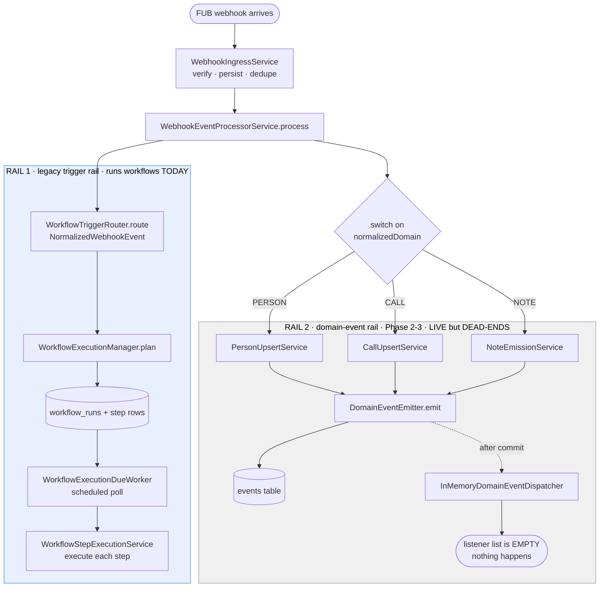

- **Rail 1 (blue)** — the *legacy* path. The router reads the raw webhook, finds matching workflows, and creates runs. **This is what runs `agent_followup_enforcement` today.**
- **Rail 2 (grey)** — the *domain-event* path built in Phases 2–3. It writes typed events and even dispatches them after commit… to an **empty listener list**. It works, but **nothing is listening**, so it dead-ends.

**Phase 4's whole job:** put a listener on Rail 2 (so workflows fire off domain events), migrate the one workflow over, then **delete Rail 1**.

Everything below is the detail of each box.

> **Extensibility: a second source (deliberately deferred — YAGNI).** Source-specificity lives at the **ingestion layer**, not the trigger layer. The `switch(domain)` → upsert → emit path is, in effect, the FUB ingestion *adapter*: it speaks FUB's webhook language and produces source-agnostic domain events. A second CRM (Salesforce, …) would be a **sibling adapter** emitting the **same** domain events tagged `source_system`, and every existing workflow would fire on them unchanged — because workflows subscribe to events, not sources. The load-bearing seam (the normalized domain-event model + `events.source_system`) is **already in place**; what's *not* built is the adapter interface / source-routing, because designing it from one example (FUB) would get it wrong. We add that the day a real second source exists — a contained refactor, cheap precisely because the seam already exists. There is **no second source today**; this is recorded so the deferral is a conscious choice, not an oversight. (See also `plan.md` Out-of-scope → multi-CRM adapters.)

---

### Stage 1 — Ingress: webhook → `webhook_events`

[`WebhookIngressService`](../../../src/main/java/com/flux/service/webhook/WebhookIngressService.java) verifies the signature, persists the raw webhook to the `webhook_events` table, dedupes replays, and hands off (async) to the processor. By the time we reach the processor the event is a **`NormalizedWebhookEvent`** — FUB's raw shape normalized into `{ sourceSystem, normalizedDomain (PERSON/CALL/NOTE/UNKNOWN), normalizedAction (CREATED/UPDATED/DELETED), payload, eventId, webhookEventId }`.

---

### Stage 2 — Processor: the fork where both rails start

[`WebhookEventProcessorService.process()`](../../../src/main/java/com/flux/service/webhook/WebhookEventProcessorService.java:96) is where both rails launch, in order:

```java
switch (domain) {
    case CALL   -> processCallDomainEvent(event);   // → CallUpsertService
    case PERSON -> processPersonDomainEvent(event);  // → PersonUpsertService
    case NOTE   -> noteEmissionService.emit(event);  // → NoteEmissionService
    case UNKNOWN-> processUnknownDomainEvent(event);
}
// ...then, separately:
workflowTriggerRouter.route(event);                  // RAIL 1
```

- The `switch` runs the domain handler — which **upserts local state and emits the domain event** (Rail 2).
- Then `route(event)` runs the **legacy trigger rail** (Rail 1).

Both happen on every webhook, today.

---

### Rail 2 — the domain-event rail (built, live, but dead-ends)

Inside each domain handler, after the local upsert, [`DomainEventEmitter.emit()`](../../../src/main/java/com/flux/service/event/DomainEventEmitter.java) does two things:

1. **INSERT a row into the `events` table** inside the same transaction as the state change (atomic).
2. Register an **after-commit hook** that calls [`InMemoryDomainEventDispatcher.dispatch()`](../../../src/main/java/com/flux/service/event/InMemoryDomainEventDispatcher.java) once the transaction commits.

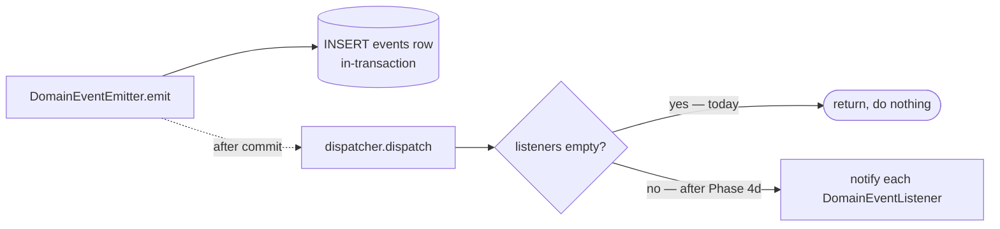

The dispatcher holds a Spring-injected `List<DomainEventListener>`. **Today that list is empty** ([`InMemoryDomainEventDispatcher.java:41`](../../../src/main/java/com/flux/service/event/InMemoryDomainEventDispatcher.java) — `if (listeners.isEmpty()) return`). So events are durably recorded and dispatched into the void.

This is why the cutover order matters: **registering the first listener is what turns Rail 2 on — not any flag.** The `engine.write.emit-events` flag only governs whether the *engine's own writes* emit their own event (Phase 3 echo handling); it does **not** gate this webhook-driven emission.

---

### Rail 1 — the legacy trigger rail (what runs workflows today)

#### 3a. Routing: `WorkflowTriggerRouter.route(NormalizedWebhookEvent)`

[`WorkflowTriggerRouter`](../../../src/main/java/com/flux/service/workflow/trigger/WorkflowTriggerRouter.java) is the heart of Rail 1:

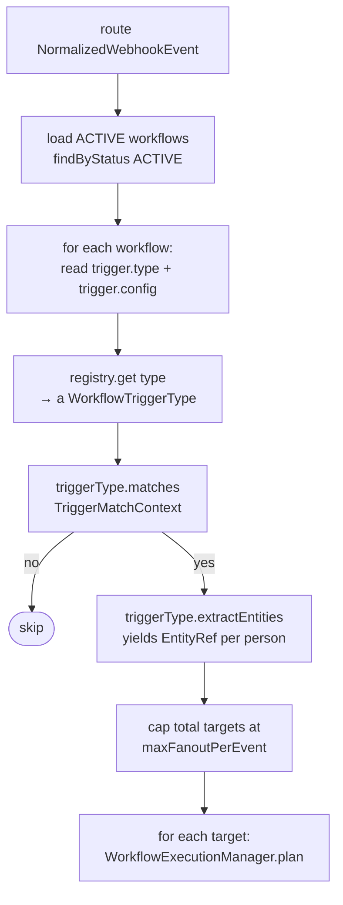

Key facts:
- It only considers workflows with `status = ACTIVE`.
- A workflow's trigger is JSON: `{ "type": "webhook_fub", "config": { ... } }`. The router pulls `type`, looks it up in the registry, and asks it to match.
- It builds a **`TriggerMatchContext`** — `{ source, eventType, normalizedDomain, normalizedAction, payload, triggerConfig }` — a **webhook-shaped** object.
- On match, `extractEntities` returns the person id(s); each becomes a plan target. Fan-out is capped.

#### 3b. The trigger types

The registry ([`WorkflowTriggerRegistry`](../../../src/main/java/com/flux/service/workflow/trigger/WorkflowTriggerRegistry.java)) maps `id → WorkflowTriggerType`. Today there is exactly one real type:

[`FubWebhookTriggerType`](../../../src/main/java/com/flux/service/workflow/trigger/FubWebhookTriggerType.java) (id `webhook_fub`):
- `matches()` checks the config's `eventDomain` / `eventAction` patterns against the event's normalized domain/action (e.g. `PERSON` / `UPDATED`), then optionally evaluates a JSONata `filter`.
- For the filter it builds a **tiny scope**: just `{ event: { payload } }` — the raw webhook payload, nothing else. No `person`, no `change`, no `current`.

The [`WorkflowTriggerType`](../../../src/main/java/com/flux/service/workflow/trigger/WorkflowTriggerType.java) interface itself is webhook-shaped — `matches(TriggerMatchContext)` / `extractEntities(TriggerMatchContext)`. **This interface and `TriggerMatchContext` are what get deleted in Phase 4e.**

#### 3c. Planning a run: `WorkflowExecutionManager.plan`

[`WorkflowExecutionManager.plan()`](../../../src/main/java/com/flux/service/workflow/WorkflowExecutionManager.java:68) turns a match into rows:

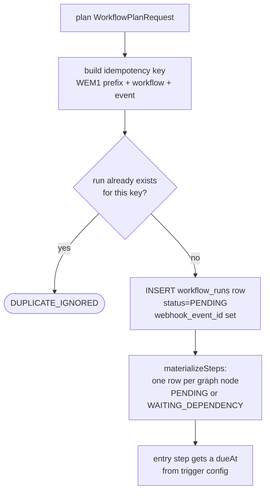

- The **idempotency key** (`uk_workflow_runs_idempotency_key`) is what catches "same webhook replayed forever."
- A run is created `PENDING` with `webhook_event_id` populated. (`domain_event_id` — the 4a column — exists but is **not populated** on this path; it stays null.)
- Each graph node becomes a `workflow_run_steps` row: `PENDING` if it has no unmet dependencies, else `WAITING_DEPENDENCY`. The entry step gets a `dueAt`.

#### 3d. Execution over time: `WorkflowExecutionDueWorker`

Runs don't execute inline — a scheduled poller drives them. [`WorkflowExecutionDueWorker`](../../../src/main/java/com/flux/service/workflow/WorkflowExecutionDueWorker.java) (`@Scheduled`, every `poll-interval-ms`, default 2s; gated by `workflow.worker.enabled`):

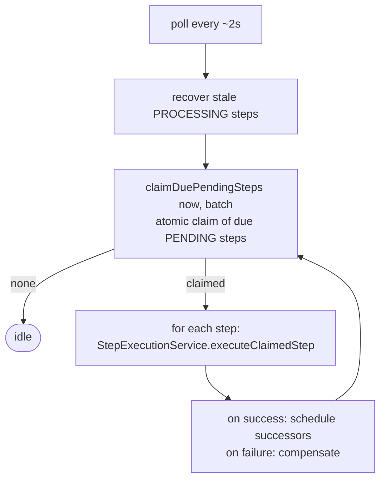

- It **atomically claims** due `PENDING` steps (`claimDuePendingSteps`) so multiple workers/threads don't double-execute.
- A `WAIT`-style step is what makes `agent_followup_enforcement` "wait a few minutes": the step sets a future `dueAt` and the worker picks it up later.
- Stale-recovery requeues steps stuck in `PROCESSING` (crashed mid-execution).

> **This is also why cancel is cheap** (relevant to Phase 5): a cancelled run's steps are set `SKIPPED`, and the claimer only picks up *due PENDING* steps — so a cancelled run simply stops being claimed. No interrupt needed.

#### 3e. Inside a step: the step-time scope + engine writes

[`WorkflowStepExecutionService.executeClaimedStep`](../../../src/main/java/com/flux/service/workflow/WorkflowStepExecutionService.java) builds the **step-time scope** and runs the step:

1. [`buildRunContext`](../../../src/main/java/com/flux/service/workflow/WorkflowStepExecutionService.java:211) gathers, **fresh per step**:
   - `person` — the live local snapshot via `PersonSnapshotResolver` (re-read each step, so a reassignment mid-wait is seen)
   - `now` — daytime/hour flags via `BusinessHoursService`
   - `steps.<id>.outputs` — prior step outputs
   - `event.payload` — the **frozen trigger payload** captured at plan time
2. [`ExpressionScope.from(runContext)`](../../../src/main/java/com/flux/service/workflow/expression/ExpressionScope.java) packs those into the bag JSONata reads. **Today's keys: `event.payload`, `sourcePersonId`, `person`, `now`, `steps`.**
3. Config templates (`{{ person.assignedUserId }}`, etc.) are resolved against that scope, then the step type executes.
4. Steps that write to FUB (`fub_reassign`, `fub_move_to_pond`, `fub_add_tag`, `fub_create_note`) go through the **`EngineWriteCoordinator`** (Phase 3) — local-state-first / tracker-tagged so the echo webhook doesn't re-trigger.

> **Two scopes, same evaluator.** The *trigger-time* scope (3b, tiny `{event:{payload}}`) and the *step-time* scope (3e, the full bag) are built in different places but feed the same JSONata `ExpressionEvaluator`. Phase 4 gives **both** the new vocabulary (`change.*`, `current.*`, `webhook.*`, richer `event.*`, `person.*` in triggers).

---

### The data shapes (today)

**Workflow trigger JSON** (on the workflow record):
```json
{ "type": "webhook_fub", "config": { "eventDomain": "PERSON", "eventAction": "UPDATED", "filter": "<optional JSONata>" } }
```

**`workflow_runs` row** (the columns that matter here): `workflow_key`, `source`, `event_id`, `webhook_event_id` (set), `domain_event_id` (4a — **null on the legacy path**), `source_person_id`, `status` (`PENDING`/`BLOCKED`/`DUPLICATE_IGNORED`/`CANCELED`/`COMPLETED`/`FAILED`), `idempotency_key`, `trigger_payload` (frozen).

**`events` row** (Rail 2): `event_kind` (`person.created` / `person.state_changed` / `call.created` / `note.*`), `source_system`, `source_event_id` (→ `webhook_events.id`), `entity_type`, `entity_id`, `payload` (for `person.state_changed`: `{ changed_fields, previous, current, source? }`), `created_at`.

---

### What Phase 4 changes against this map

| Stage today | Phase 4 change | Sub-phase |
|---|---|---|
| Rail 2 dispatcher has no listeners | Register `WorkflowTriggerRouter` as a `DomainEventListener` | 4d |
| `route(NormalizedWebhookEvent)` matches webhooks | Add `route(DomainEvent)` + `DomainEventTriggerType` matching events | 4b + 4d |
| Trigger-time scope is `{event:{payload}}` | Rich scope: `event.*` (incl. `event.origin`) `/ change.* / current.* / webhook.* / person.*` | 4b |
| `plan` sets only `webhook_event_id` | Also populate `domain_event_id` | 4d |
| No save-time field validation for `change.*` | Per-event-kind field-reference validator | 4c |
| `agent_followup_enforcement` triggers on `webhook_fub` | Re-author to `{ on: "person.state_changed", filter: … }` | 4e |
| Rail 1 (router + `FubWebhookTriggerType` + `TriggerMatchContext` + the `process()` call) | **Deleted** (hard cut) | 4e |

**4b specifically** builds the new trigger-time half — `DomainEventTriggerType` + the rich scope — and tests it in isolation, *without* attaching it to Rail 2 yet. That's why 4b is safe: Rail 1 keeps running untouched; the new code isn't wired to anything until 4d.
