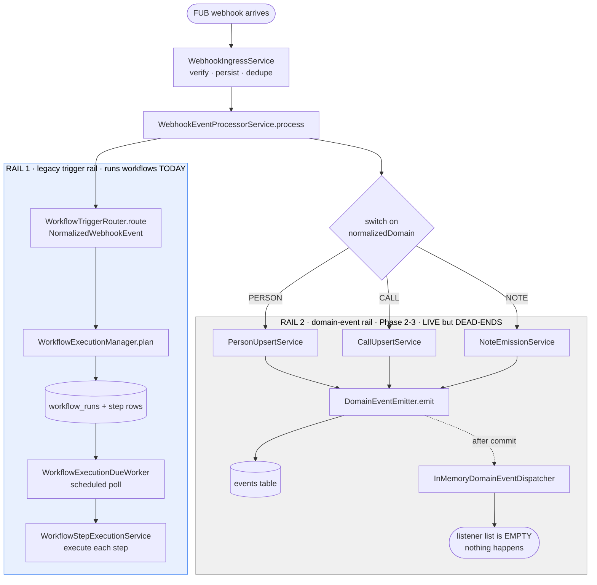
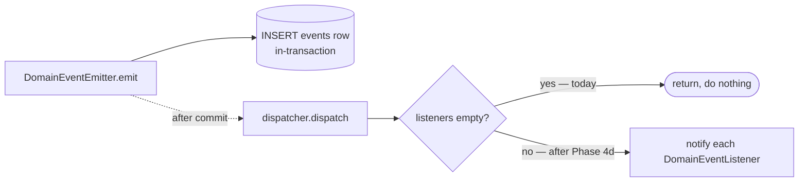
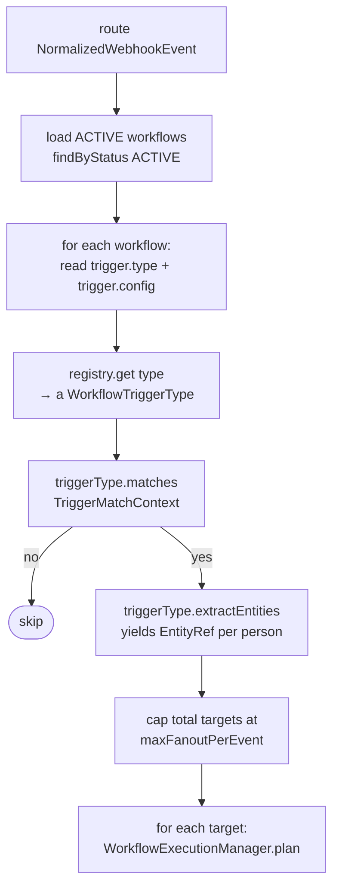
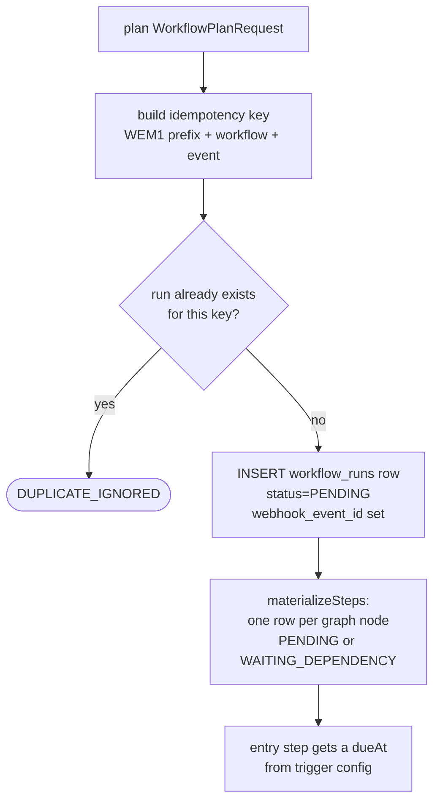
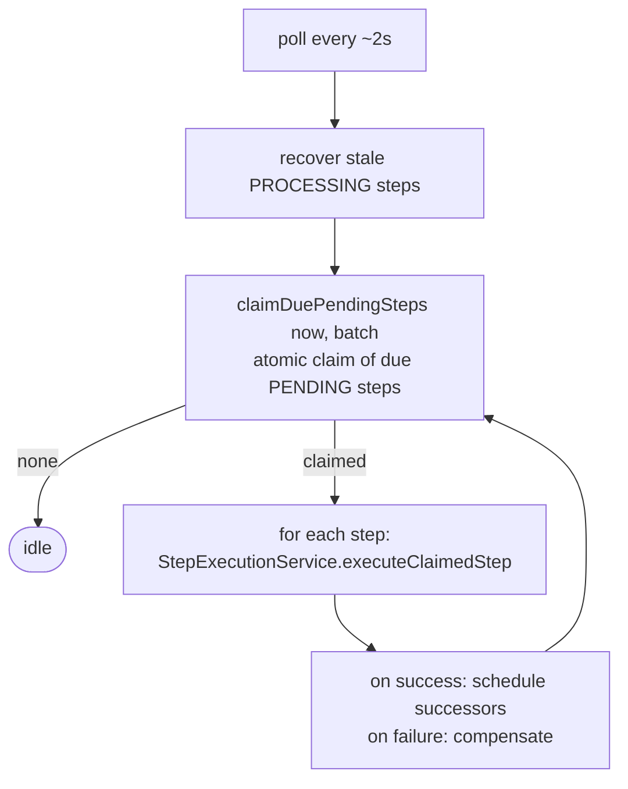

# How it's wired today — the as-built pipeline

> **Companion to [`overview.md`](./overview.md).** That doc is the *why* (the story, the bug, the reframe). This one is the *how-it-actually-runs-right-now* — the concrete classes and the path a webhook takes through them today, so you can see exactly what Phase 4 rewires. Grounded in the code as of 2026-06-03 (post Phase 3, pre Phase 4b). File references are clickable.
>
> Diagrams are Mermaid.

---

## The one picture to hold

Today, a single webhook does **two independent things**, and seeing them as *two rails* is the key to understanding Phase 4:



- **Rail 1 (blue)** — the *legacy* path. The router reads the raw webhook, finds matching workflows, and creates runs. **This is what runs `agent_followup_enforcement` today.**
- **Rail 2 (grey)** — the *domain-event* path built in Phases 2–3. It writes typed events and even dispatches them after commit… to an **empty listener list**. It works, but **nothing is listening**, so it dead-ends.

**Phase 4's whole job:** put a listener on Rail 2 (so workflows fire off domain events), migrate the one workflow over, then **delete Rail 1**.

Everything below is the detail of each box.

> **Extensibility: a second source (deliberately deferred — YAGNI).** Source-specificity lives at the **ingestion layer**, not the trigger layer. The `switch(domain)` → upsert → emit path is, in effect, the FUB ingestion *adapter*: it speaks FUB's webhook language and produces source-agnostic domain events. A second CRM (Salesforce, …) would be a **sibling adapter** emitting the **same** domain events tagged `source_system`, and every existing workflow would fire on them unchanged — because workflows subscribe to events, not sources. The load-bearing seam (the normalized domain-event model + `events.source_system`) is **already in place**; what's *not* built is the adapter interface / source-routing, because designing it from one example (FUB) would get it wrong. We add that the day a real second source exists — a contained refactor, cheap precisely because the seam already exists. There is **no second source today**; this is recorded so the deferral is a conscious choice, not an oversight. (See also `plan.md` Out-of-scope → multi-CRM adapters.)

---

## Stage 1 — Ingress: webhook → `webhook_events`

[`WebhookIngressService`](../../../src/main/java/com/fuba/automation_engine/service/webhook/WebhookIngressService.java) verifies the signature, persists the raw webhook to the `webhook_events` table, dedupes replays, and hands off (async) to the processor. By the time we reach the processor the event is a **`NormalizedWebhookEvent`** — FUB's raw shape normalized into `{ sourceSystem, normalizedDomain (PERSON/CALL/NOTE/UNKNOWN), normalizedAction (CREATED/UPDATED/DELETED), payload, eventId, webhookEventId }`.

---

## Stage 2 — Processor: the fork where both rails start

[`WebhookEventProcessorService.process()`](../../../src/main/java/com/fuba/automation_engine/service/webhook/WebhookEventProcessorService.java:96) is where both rails launch, in order:

```java
switch (domain) {
    case CALL   -> processCallDomainEvent(event);   // → CallUpsertService
    case PERSON -> processPersonDomainEvent(event);  // → PersonUpsertService
    case NOTE   -> noteEmissionService.emit(event);  // → NoteEmissionService
    case UNKNOWN-> processUnknownDomainEvent(event);
}
// ...then, separately:
workflowTriggerRouter.route(event);                  // RAIL 1
```

- The `switch` runs the domain handler — which **upserts local state and emits the domain event** (Rail 2).
- Then `route(event)` runs the **legacy trigger rail** (Rail 1).

Both happen on every webhook, today.

---

## Rail 2 — the domain-event rail (built, live, but dead-ends)

Inside each domain handler, after the local upsert, [`DomainEventEmitter.emit()`](../../../src/main/java/com/fuba/automation_engine/service/event/DomainEventEmitter.java) does two things:

1. **INSERT a row into the `events` table** inside the same transaction as the state change (atomic).
2. Register an **after-commit hook** that calls [`InMemoryDomainEventDispatcher.dispatch()`](../../../src/main/java/com/fuba/automation_engine/service/event/InMemoryDomainEventDispatcher.java) once the transaction commits.



The dispatcher holds a Spring-injected `List<DomainEventListener>`. **Today that list is empty** ([`InMemoryDomainEventDispatcher.java:41`](../../../src/main/java/com/fuba/automation_engine/service/event/InMemoryDomainEventDispatcher.java) — `if (listeners.isEmpty()) return`). So events are durably recorded and dispatched into the void.

This is why the cutover order matters: **registering the first listener is what turns Rail 2 on — not any flag.** The `engine.write.emit-events` flag only governs whether the *engine's own writes* emit their own event (Phase 3 echo handling); it does **not** gate this webhook-driven emission.

---

## Rail 1 — the legacy trigger rail (what runs workflows today)

### 3a. Routing: `WorkflowTriggerRouter.route(NormalizedWebhookEvent)`

[`WorkflowTriggerRouter`](../../../src/main/java/com/fuba/automation_engine/service/workflow/trigger/WorkflowTriggerRouter.java) is the heart of Rail 1:



Key facts:
- It only considers workflows with `status = ACTIVE`.
- A workflow's trigger is JSON: `{ "type": "webhook_fub", "config": { ... } }`. The router pulls `type`, looks it up in the registry, and asks it to match.
- It builds a **`TriggerMatchContext`** — `{ source, eventType, normalizedDomain, normalizedAction, payload, triggerConfig }` — a **webhook-shaped** object.
- On match, `extractEntities` returns the person id(s); each becomes a plan target. Fan-out is capped.

### 3b. The trigger types

The registry ([`WorkflowTriggerRegistry`](../../../src/main/java/com/fuba/automation_engine/service/workflow/trigger/WorkflowTriggerRegistry.java)) maps `id → WorkflowTriggerType`. Today there is exactly one real type:

[`FubWebhookTriggerType`](../../../src/main/java/com/fuba/automation_engine/service/workflow/trigger/FubWebhookTriggerType.java) (id `webhook_fub`):
- `matches()` checks the config's `eventDomain` / `eventAction` patterns against the event's normalized domain/action (e.g. `PERSON` / `UPDATED`), then optionally evaluates a JSONata `filter`.
- For the filter it builds a **tiny scope**: just `{ event: { payload } }` — the raw webhook payload, nothing else. No `person`, no `change`, no `current`.

The [`WorkflowTriggerType`](../../../src/main/java/com/fuba/automation_engine/service/workflow/trigger/WorkflowTriggerType.java) interface itself is webhook-shaped — `matches(TriggerMatchContext)` / `extractEntities(TriggerMatchContext)`. **This interface and `TriggerMatchContext` are what get deleted in Phase 4e.**

### 3c. Planning a run: `WorkflowExecutionManager.plan`

[`WorkflowExecutionManager.plan()`](../../../src/main/java/com/fuba/automation_engine/service/workflow/WorkflowExecutionManager.java:68) turns a match into rows:



- The **idempotency key** (`uk_workflow_runs_idempotency_key`) is what catches "same webhook replayed forever."
- A run is created `PENDING` with `webhook_event_id` populated. (`domain_event_id` — the 4a column — exists but is **not populated** on this path; it stays null.)
- Each graph node becomes a `workflow_run_steps` row: `PENDING` if it has no unmet dependencies, else `WAITING_DEPENDENCY`. The entry step gets a `dueAt`.

### 3d. Execution over time: `WorkflowExecutionDueWorker`

Runs don't execute inline — a scheduled poller drives them. [`WorkflowExecutionDueWorker`](../../../src/main/java/com/fuba/automation_engine/service/workflow/WorkflowExecutionDueWorker.java) (`@Scheduled`, every `poll-interval-ms`, default 2s; gated by `workflow.worker.enabled`):



- It **atomically claims** due `PENDING` steps (`claimDuePendingSteps`) so multiple workers/threads don't double-execute.
- A `WAIT`-style step is what makes `agent_followup_enforcement` "wait a few minutes": the step sets a future `dueAt` and the worker picks it up later.
- Stale-recovery requeues steps stuck in `PROCESSING` (crashed mid-execution).

> **This is also why cancel is cheap** (relevant to Phase 5): a cancelled run's steps are set `SKIPPED`, and the claimer only picks up *due PENDING* steps — so a cancelled run simply stops being claimed. No interrupt needed.

### 3e. Inside a step: the step-time scope + engine writes

[`WorkflowStepExecutionService.executeClaimedStep`](../../../src/main/java/com/fuba/automation_engine/service/workflow/WorkflowStepExecutionService.java) builds the **step-time scope** and runs the step:

1. [`buildRunContext`](../../../src/main/java/com/fuba/automation_engine/service/workflow/WorkflowStepExecutionService.java:211) gathers, **fresh per step**:
   - `person` — the live local snapshot via `PersonSnapshotResolver` (re-read each step, so a reassignment mid-wait is seen)
   - `now` — daytime/hour flags via `BusinessHoursService`
   - `steps.<id>.outputs` — prior step outputs
   - `event.payload` — the **frozen trigger payload** captured at plan time
2. [`ExpressionScope.from(runContext)`](../../../src/main/java/com/fuba/automation_engine/service/workflow/expression/ExpressionScope.java) packs those into the bag JSONata reads. **Today's keys: `event.payload`, `sourcePersonId`, `person`, `now`, `steps`.**
3. Config templates (`{{ person.assignedUserId }}`, etc.) are resolved against that scope, then the step type executes.
4. Steps that write to FUB (`fub_reassign`, `fub_move_to_pond`, `fub_add_tag`, `fub_create_note`) go through the **`EngineWriteCoordinator`** (Phase 3) — local-state-first / tracker-tagged so the echo webhook doesn't re-trigger.

> **Two scopes, same evaluator.** The *trigger-time* scope (3b, tiny `{event:{payload}}`) and the *step-time* scope (3e, the full bag) are built in different places but feed the same JSONata `ExpressionEvaluator`. Phase 4 gives **both** the new vocabulary (`change.*`, `current.*`, `webhook.*`, richer `event.*`, `person.*` in triggers).

---

## The data shapes (today)

**Workflow trigger JSON** (on the workflow record):
```json
{ "type": "webhook_fub", "config": { "eventDomain": "PERSON", "eventAction": "UPDATED", "filter": "<optional JSONata>" } }
```

**`workflow_runs` row** (the columns that matter here): `workflow_key`, `source`, `event_id`, `webhook_event_id` (set), `domain_event_id` (4a — **null on the legacy path**), `source_person_id`, `status` (`PENDING`/`BLOCKED`/`DUPLICATE_IGNORED`/`CANCELED`/`COMPLETED`/`FAILED`), `idempotency_key`, `trigger_payload` (frozen).

**`events` row** (Rail 2): `event_kind` (`person.created` / `person.state_changed` / `call.created` / `note.*`), `source_system`, `source_event_id` (→ `webhook_events.id`), `entity_type`, `entity_id`, `payload` (for `person.state_changed`: `{ changed_fields, previous, current, source? }`), `created_at`.

---

## What Phase 4 changes against this map

| Stage today | Phase 4 change | Sub-phase |
|---|---|---|
| Rail 2 dispatcher has no listeners | Register `WorkflowTriggerRouter` as a `DomainEventListener` | 4d |
| `route(NormalizedWebhookEvent)` matches webhooks | Add `route(DomainEvent)` + `DomainEventTriggerType` matching events | 4b + 4d |
| Trigger-time scope is `{event:{payload}}` | Rich scope: `event.*` (incl. `event.origin`) `/ change.* / current.* / webhook.* / person.*` | 4b |
| `plan` sets only `webhook_event_id` | Also populate `domain_event_id` | 4d |
| No save-time field validation for `change.*` | Per-event-kind field-reference validator | 4c |
| `agent_followup_enforcement` triggers on `webhook_fub` | Re-author to `{ on: "person.state_changed", filter: … }` | 4e |
| Rail 1 (router + `FubWebhookTriggerType` + `TriggerMatchContext` + the `process()` call) | **Deleted** (hard cut) | 4e |

**4b specifically** builds the new trigger-time half — `DomainEventTriggerType` + the rich scope — and tests it in isolation, *without* attaching it to Rail 2 yet. That's why 4b is safe: Rail 1 keeps running untouched; the new code isn't wired to anything until 4d.
