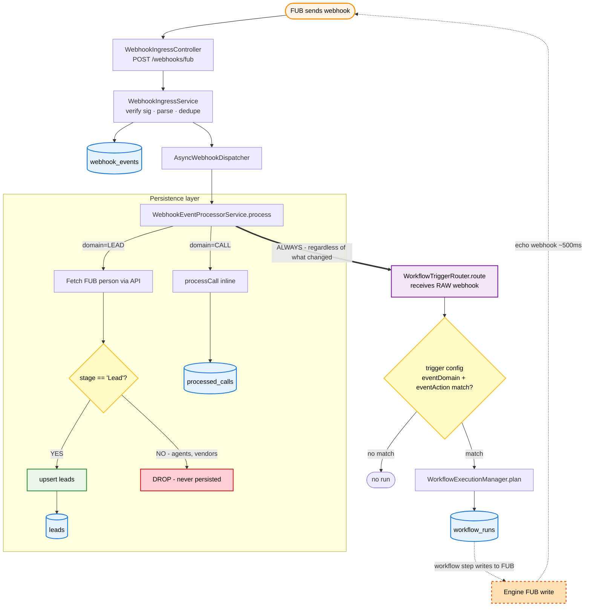
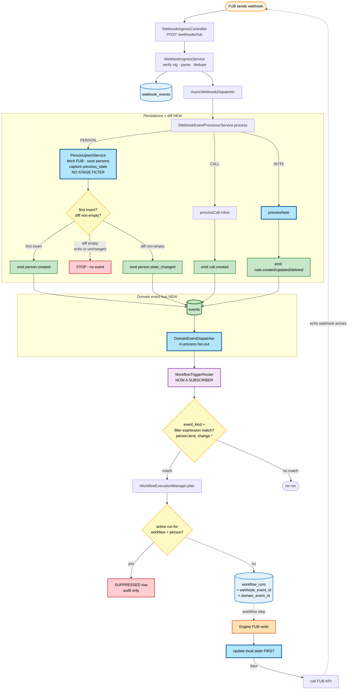

# Webhook → Workflow flow: today vs. after domain-events

Two visualisations of the webhook-arrival-to-workflow-run pipeline. Open this file in any Mermaid-capable viewer (VS Code with the Markdown Preview Mermaid Support extension, IntelliJ's markdown preview, or GitHub).

---

## TODAY — post-Phase-1, pre-rename

**Pain points visible:**
- Yellow `stage == 'Lead'?` diamond → red `DROP` branch eliminates non-Lead persons at ingest.
- Bold `ALWAYS` arrow from processor to trigger router → fires for every webhook, regardless of whether anything actually changed.
- Dashed orange echo loop in the lower right → engine writes cause FUB to emit echo webhooks that re-enter at the top, causing cascades.

---

## FUTURE — after all five domain-events phases land

**What's different (light-blue boxes are newly introduced):**
1. **No stage filter at ingest** — every FUB person gets persisted. Workflows handle stage filtering themselves via `person.kind`.
2. **Diff machinery** — the persistence diamond now asks `first insert? diff non-empty?` instead of `stage == 'Lead'?`. Three outcomes (created / no event / state_changed) instead of two (persist / drop).
3. **New `events` table + dispatcher** — domain events are persisted and fanned out in-process. The trigger router subscribes here instead of receiving raw webhooks.
4. **Rich trigger match** — workflows match by `event_kind + filter expression` (e.g. `change.assignedUserId.changed`) instead of just `eventDomain + eventAction`.
5. **Run uniqueness check** — before inserting `workflow_runs`, check for an active run on the same `(workflow_key, source_person_id)`. Conflicts produce a `SUPPRESSED` audit row.
6. **Echo loop closed** — engine writes now update local state *before* calling FUB. When the echo webhook arrives, the diff is empty and the cascade terminates at the `STOP - no event` node.

---

## Color legend (same across both diagrams)

| Color | Meaning |
|---|---|
| Orange | External system (FUB) |
| Yellow | Decision / branching point |
| Blue | Persistent storage (table) |
| Green (filled) | Write / emit operation |
| Green (dark, thick border) | New persistent storage introduced by this work |
| Red | Data dropped / suppressed |
| Light blue (thick border) | Code path / component newly introduced |
| Purple | Workflow trigger router |
| Dashed orange | Engine self-echo loop |
