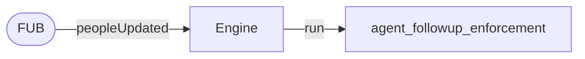
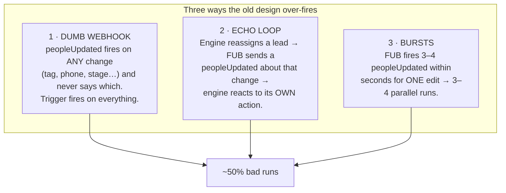
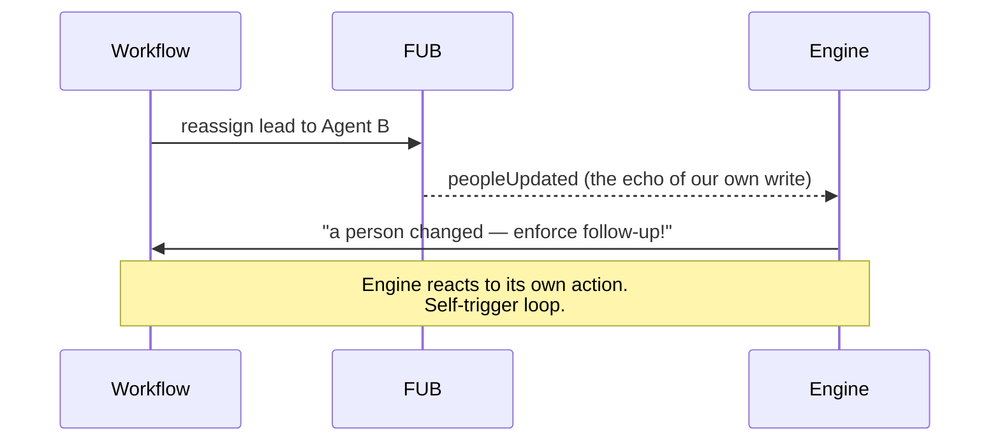
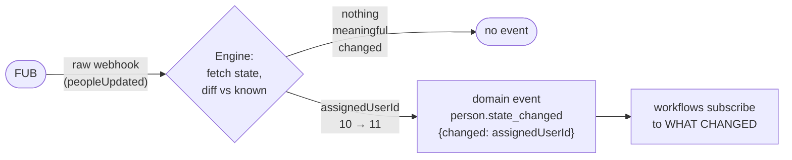
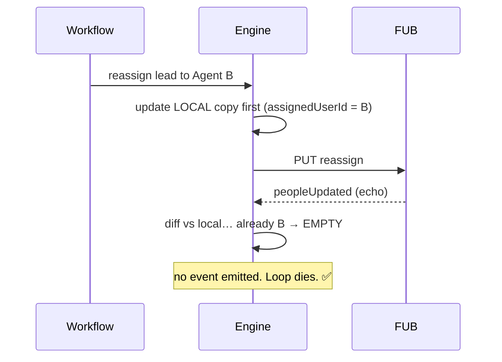
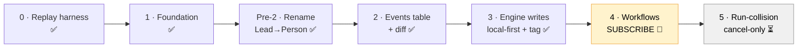
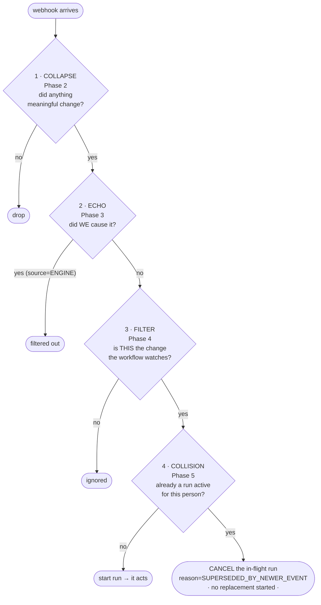
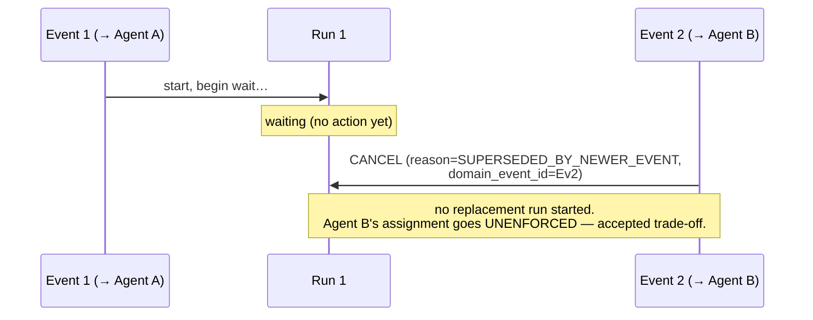

# Domain Events — the plain-language overview

> **Read this first.** It's the map for the whole feature: what the system does, why this feature exists, what it changes, and how the pieces (collapse, echo-suppression, trigger filter, cancel-on-collision) fit together. No prior context assumed. For the formal spec see [`plan.md`](./plan.md); for the phase-by-phase build see [`phases.md`](./phases.md). If this doc and those ever disagree, those win — but this is the one to re-read when you've lost the thread.
>
> Diagrams are Mermaid — open in any Mermaid-capable viewer (GitHub, VS Code preview, IntelliJ).

---

## 1. What the system is

An **automation engine** bolted onto **Follow Up Boss (FUB)**, a real-estate CRM. FUB holds *people* (leads, agents, clients), their *calls*, *notes*, *tags*, and *assignments*. The engine watches what happens in FUB and **runs workflows** in response.

Today one workflow matters: **`agent_followup_enforcement`**. In plain English:

> When a lead is assigned to an agent, wait a few minutes, then check: did the agent actually contact the lead? If **not**, post a nudge note and/or reassign the lead.

That's the product. The engine enforces "agents must follow up fast."

---

## 2. How FUB talks to the engine: webhooks

FUB notifies the engine via **webhooks** — small HTTP messages like `peopleUpdated`, `callsCreated`, `notesCreated`. When a person changes, FUB sends `peopleUpdated`.

The **original design** was literal: *webhook arrives → run the workflow.*

Simple — and that simplicity is exactly what broke.

---

## 3. Why it broke — the bad-run problem

This design produced **46–64% "bad runs"**: workflow runs that should never have happened. Three causes, all from the same root flaw — **the webhook carries no idea of *what* changed.**

The **echo loop** is the nastiest — the engine triggering itself:

**What the damage looked like in the field:** nudge notes posted on a lead who was mid–11-minute real conversation with their agent; one lead (20235) reassigned to the same person **three times** back-to-back from three parallel runs; runs where the correct count was zero. The system only stayed "safe" by accident — a 5-minute buffer that happened to absorb some over-fires. Not production-credible, and impossible to add a second workflow to without inheriting every bug.

---

## 4. The key insight — the reframe

The entire feature rests on one shift in thinking:

> **A webhook is not an event to react to. It's a *signal that some state might have changed.***

Old way: *three webhooks = three reactions.*
New way: when a webhook arrives, the engine **fetches the current state, compares it to what it already knew (a "diff"), and emits a real event only if something *meaningful actually changed*.**

That turns FUB's noisy webhook stream into a clean, typed stream of **domain events** — the engine's *own* truth about what changed:

- `person.created` — a new person appeared
- `person.state_changed` — **carries exactly which fields changed** (e.g. `assignedUserId: 10 → 11`)
- `call.created`, `note.created` — things that happened

Workflows now subscribe to **domain events**, not raw webhooks. The trigger goes from *"fire when a person is updated"* to *"fire when `assignedUserId` actually changed, and I didn't cause it."*

This kills all three bugs:

| Old bug | Killed by |
|---|---|
| **Over-fire** (dumb webhook) | The event says *what* changed; the workflow only watches its one field. |
| **Bursts** | First webhook diffs → event; the rest see "no change" → **one** event, not three. *(event collapse)* |
| **Echo loop** | Engine writes update its **local copy first** → FUB's echo diffs to *empty* → no event. And the change is **tagged `source=ENGINE`** so workflows can filter out "things I caused." |

Here's the echo loop **after** the fix:

---

## 5. The promises the feature makes (the invariants)

- **I1** — the engine's local copy mirrors FUB for every field a workflow references.
- **I2** — an event is emitted *only* when something meaningful happened.
- **I3** — the engine never phantom-triggers on its own writes.
- **I4** — at most **one active run** per (workflow, person) at a time.  ← *Phase 5*
- **I5** — every run records both the webhook *and* the logical event that caused it (so it's debuggable).

---

## 6. How it's being built — the phases

Staged so each step is safe and reviewable on its own.

| Phase | What it does | State |
|---|---|---|
| 0 | Replay harness — replays recorded real incidents to prove fixes | done |
| 1 | Foundation plumbing | done |
| Pre-2 | Rename `Lead`→`Person` (FUB calls them people) | done |
| 2 | Build the events table + diff machinery. Events get **written** on every webhook — but **nothing reads them yet** | done |
| 3 | Engine writes update local state first + tag themselves `source=ENGINE` — the echo-killer | done |
| **4** | **Workflows actually subscribe to domain events.** The old webhook trigger is retired. *The bad-run-rate win lands here.* | **in progress** |
| 5 | Run-collision handling — cancel-only; supersede + freshness deferred (#29) | not started |

**Subtlety worth holding onto:** because of Phase 2, **events are already being written on every webhook right now** — they just pile up with no reader. So Phase 4's real job is **attaching the first reader**. (That's why the order of "attach reader" vs. "turn on the engine's own event emission" matters during cutover.)

---

## 7. The layered defenses — and where Phase 5 fits

After Phases 2–4 there are **several defenses against duplicate/unwanted runs**, each sitting at a different point in the pipeline. This is the part that's easy to tangle — keep the *positions* straight:

Read top to bottom — each gate answers a different question:

1. **Collapse** *(Phase 2)* — "did anything meaningful change?" Kills bursts (3 webhooks → 1 event).
2. **Echo** *(Phase 3)* — "did *we* cause this?" Tagged `source=ENGINE` → filtered.
3. **Filter** *(Phase 4)* — "is this the specific change the workflow watches?" The front door.
4. **Collision** *(Phase 5, cancel-only)* — "is a run already active for this person?" If yes → **cancel the in-flight run, start nothing new**.

### What Phase 5 is actually for

After gates 1–3, almost all duplicates are gone. **One case survives:** two *genuinely different, meaningful* changes for the **same lead**, **close in time**.

> Example: lead assigned to **Agent A** → a run starts and begins its wait. 90 seconds later, the lead is reassigned to **Agent B**. Both changes are real. The first run is now waiting to nudge about a stale assignment.

**The decision (2026-06-03): cancel-only, experimental.** When the second event arrives and a run is already active, the engine **cancels the in-flight run** (so it never acts on the stale Agent-A state) and **does not start a replacement**. It's the conservative "miss it rather than mis-fire" choice for a rare case.

The options we weighed:

| Option | Behavior | Verdict |
|---|---|---|
| Let both run | Two nudge cycles | ❌ the original bug |
| Hard-suppress | Ignore #2, keep #1 | ❌ #1 acts on stale info (Agent A, already replaced) |
| **Cancel-only** *(chosen)* | **Cancel #1, start nothing** | ✅ no stale/duplicate action. ⚠️ #2 unenforced — accepted, rare, tracked |
| Supersede + freshness | Cancel #1, start #2, re-check before acting | ✅ most correct, but more machinery — **deferred to a known issue** |

**Why not supersede now:** it's the more complete answer (act once, on the newest state) but it needs run-restart + a freshness re-check before acting, and we don't yet know the case is frequent enough to justify it. Cancel-only is safe and tiny; the limitation (newer change unenforced) is recorded as a known issue and revisited only if cancelled-run counts get high. Frequency reports itself — every cancel writes a row tagged `SUPERSEDED_BY_NEWER_EVENT`.

After this, the domain-events feature is **complete**.

### The words that keep blurring — pinned down

- **Filter** *(Phase 4, built)* = "is this event worth reacting to at all?" — at the front door.
- **Cancel-on-collision** *(Phase 5, built)* = "a newer worthy event cancels an in-flight run (and starts nothing)." — when runs collide.
- **Supersede + Freshness** *(deferred — known issue)* = "replace the in-flight run with a fresh one, and re-check the world right before acting." — the fuller policy, if the data ever justifies it.

---

## 8. One-paragraph summary

The engine enforces agent follow-up. FUB's webhooks are dumb — they say "something changed" but not *what* — so the old "webhook → run" design fired wrongly about half the time, including triggering on the engine's own writes. The fix is to stop treating webhooks as events and start treating them as *signals*: the engine diffs the new state against what it knew and emits a clean, typed **domain event** only when something meaningful changed, tagging its own writes so it never reacts to itself. Workflows subscribe to those events ("fire when `assignedUserId` changed and I didn't cause it") instead of raw webhooks. That removes the over-fires, the bursts, and the echo loop. The last remaining case — two *genuinely different* changes for the same lead racing each other — is handled in Phase 5 by **cancelling** the in-flight run (so it can't act on stale state) and starting nothing new; the fuller policy (supersede + a freshness re-check before acting) is deferred as a known issue, to be built only if it proves frequent.
