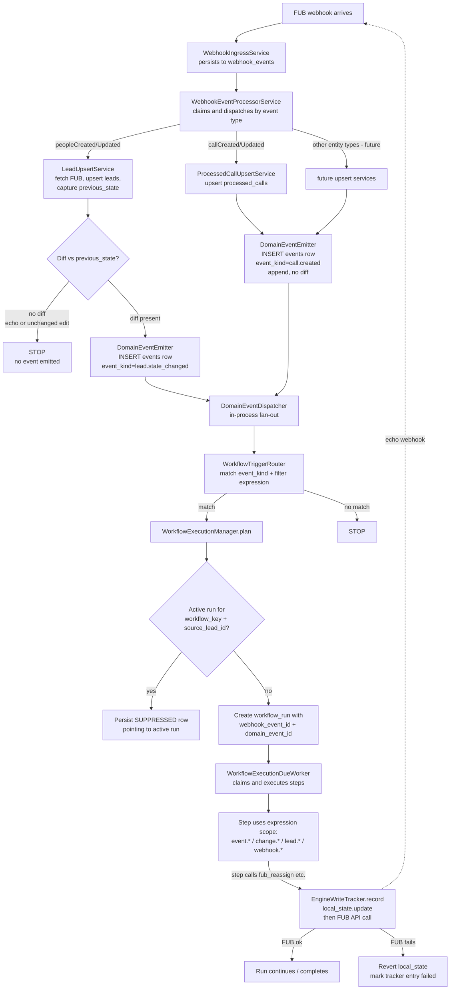

# Domain Events

A platform-level reframe: webhooks become **state-sync signals**; workflows subscribe to **domain events** the engine emits when state actually transitions or when something happens (a call, a note). The engine — not the webhook stream — is the source of truth for "what changed."

This replaces the earlier draft at [`Docs/features/state-change-events/design.md`](../state-change-events/design.md), which framed the same problem as a layered set of patches over the existing webhook-as-trigger model. After deliberation we concluded the deeper move is a model change, not a patch stack.

## Why this feature exists

The driving evidence is in [`Docs/features/agent-followup-enforcement/field-observations.md`](../agent-followup-enforcement/field-observations.md). Across three operational days the `agent_followup_enforcement` workflow ran at a **46–64% bad-run rate** because:

- FUB's `peopleUpdated` is a catch-all for any person mutation. The trigger has no view of what changed, so it fires on every edit. (Known issue #20.)
- Engine writes to FUB produce echo webhooks within 300–800 ms. Every meaningful reassign produced an echo on 2026-05-12 (7/7). The workflow self-triggers. (Known issue #23.)
- FUB occasionally fires 3–4 `peopleUpdated` webhooks within 8–16 seconds for one logical edit. Multiple parallel runs result. (New observation on 2026-05-12.)
- Two webhooks for the same lead within minutes produce two independent runs that proceed in parallel, unaware of each other. (Known issue #24.)
- `workflow_runs.webhook_event_id` is never populated — every investigation requires fuzzy correlation. (Known issue #25.)

The current workflow stays "safe" only because of engineering safety nets — particularly the 5-min lookback buffer absorbing agent-induced over-fires by accident. It is **not production-credible** today and adding a second workflow inherits the same bugs.

## Conceptual framing

Two ways to read a webhook:

| Framing | Meaning |
|---|---|
| **Event-sourced** (today) | A webhook is a discrete event the engine reacts to. Three webhooks = three reactions. |
| **State-observation** (this plan) | A webhook is a signal that some entity's state *may* have changed. The engine reads the new state, compares against what it knows, and emits a **domain event** only if something meaningful actually changed (or, for append entities, every time an instance is created). |

Under state-observation:

- Three `peopleUpdated` webhooks for one logical edit collapse to **one** event (only the first sees a diff; the others see no change).
- An engine write that updates local state at write time produces **no event** when the echo arrives (no diff).
- Workflows subscribe to *what changed*, not to *what arrived*.

State-observation does not cover every case — appendable events like calls and notes have no "previous state" to diff against. Those flow through the same domain-event pipeline as **append events**: every webhook arrival produces one event, no diff machinery involved.

The unified abstraction is `events` (or `domain_events`) — a single table with `event_kind` discriminating the flavour.

## The five invariants this plan establishes

| # | Invariant | Mechanism |
|---|---|---|
| **I1** | Local `leads` state authoritatively mirrors FUB for fields any workflow references | Webhook-driven upsert (existing); workflow-creation-time validation that every field referenced in trigger filter / step expressions is captured |
| **I2** | A domain event is emitted iff something meaningful happened (state diff, or append) | Diff at upsert for state entities; pass-through for append entities |
| **I3** | Engine-originated writes do not produce phantom events | Local-state-first writes (update local before FUB call); `EngineWriteTracker` cache as race-window guard |
| **I4** | At most one active run per `(workflow_key, source_lead_id)` | Partial unique index, hard suppression; supersede semantics deferred |
| **I5** | Every run knows the proximate webhook AND the logical domain event that caused it | Populate both `workflow_runs.webhook_event_id` and a new `workflow_runs.domain_event_id` |

## End-to-end lifecycle



The diagram is load-bearing. Anyone reading this doc later should be able to trace any workflow-run incident through it without re-reading the implementation.

## Architectural pieces

### 1. `leads.previous_state` column

A JSONB column on `leads` storing the entity's state from before the most recent upsert. Used at upsert time to compute the diff. Retention: keep last-known-previous only (one column, not a history table) — adequate for trigger evaluation; a future change-log table can be added if audit needs grow.

### 2. The `events` table (domain events)

```sql
CREATE TABLE events (
    id                  BIGSERIAL PRIMARY KEY,
    event_kind          VARCHAR(64) NOT NULL,
        -- "lead.state_changed", "call.created", "note.created", "task.completed", ...
    source_system       VARCHAR(32) NOT NULL DEFAULT 'FUB',
    source_event_id     BIGINT,
        -- FK to webhook_events.id; nullable for engine-synthesized events
    entity_type         VARCHAR(32),
        -- "lead" | "call" | "note" | ...
    entity_id           VARCHAR(255),
        -- source-system entity id (e.g. lead 20235)
    payload             JSONB NOT NULL,
        -- event-specific shape; see below
    created_at          TIMESTAMPTZ NOT NULL DEFAULT NOW(),
    CONSTRAINT fk_events_webhook
        FOREIGN KEY (source_event_id) REFERENCES webhook_events(id)
        ON DELETE SET NULL
);

CREATE INDEX idx_events_kind_created_at ON events (event_kind, created_at DESC);
CREATE INDEX idx_events_entity ON events (entity_type, entity_id, created_at DESC);
```

`payload` shape per flavour:

| Flavour | Example event_kind | `payload` shape |
|---|---|---|
| **State-change** | `lead.state_changed` | `{ changed_fields: ["assignedUserId","stage"], previous: { assignedUserId: 10, stage: "Cold" }, current: { assignedUserId: 11, stage: "Hot" } }` |
| **Append** | `call.created`, `note.created` | The full entity payload (e.g., the call record) |

`source_system` is on the row from day one even though only `FUB` feeds it today — future CRM adapters slot in cleanly (closes the spirit of known issue #18).

### 3. Trigger schema (new)

Replaces the existing `peopleUpdated`-typed trigger. Hard cut — one workflow exists today (`agent_followup_enforcement`); it gets re-authored as part of Phase 4.

```json
{
  "trigger": {
    "on": "lead.state_changed",
    "filter": "change.assignedUserId.changed AND change.source != 'ENGINE'"
  }
}
```

Or for append:

```json
{
  "trigger": {
    "on": "call.created",
    "filter": "event.payload.durationSec > 60"
  }
}
```

### 4. Expression scope (new shape)

| Scope key | Source | Notes |
|---|---|---|
| `event.id`, `event.kind`, `event.entityType`, `event.entityId` | Domain event metadata | Stable across all event_kinds |
| `event.payload.*` | Domain event payload — shape varies by kind | State-change: `{changed_fields, previous, current}`. Append: the entity record. |
| `change.<field>.changed` / `.old` / `.new` | Sugar over `event.payload` for state-change events | Cleaner than indexing into `changed_fields` arrays |
| `change.source` | Annotated by `EngineWriteTracker` if the diff matches a recent engine write | `"ENGINE"` or absent |
| `lead.*` | Current lead snapshot (resolved at step time, as today) | Available in trigger filter scope too — closes #17 |
| `webhook.*` | Raw underlying webhook payload | Available for steps that need source-format fields |
| `runMetadata.*` | Run timing (unchanged from today) | |
| `steps.<stepId>.*` | Prior step outputs (Wave 2, unchanged) | |

This is a workflow-author-facing breaking change. Steps that today use `event.payload.resourceIds[0]` must migrate to `webhook.payload.resourceIds[0]`. There is one production workflow that needs the migration.

### 5. Local-state-first engine writes

Steps that write to FUB (`fub_reassign`, `fub_move_to_pond`, `fub_create_note`, ...) follow:

```text
begin transaction
  capture old local state for affected fields
  update local state to intended new value
  insert engine_write_tracker entry (kind, entity, fields, ttl ~30s)
commit
call FUB
on FUB failure:
  begin transaction
    revert local state to old value
    mark tracker entry FAILED
  commit
  return error to workflow runtime (step fails as today)
on FUB success:
  return success
```

When the echo webhook arrives ~500ms later, `LeadUpsertService` fetches FUB, computes the diff against the already-updated local state, finds no diff → no event. The tracker is a secondary guard for the narrow race where the echo arrives before the local commit lands.

**Failure semantic chosen — and why:** if FUB write fails, the engine compensates by reverting local. Worst case: revert fails too; the next legitimate webhook re-syncs anyway. This is preferred over the alternative (write FUB first, then local) because (a) its failure mode is **operation did not execute** — loud, loggable, no FUB-visible side effect; (b) the alternative's failure mode is a **phantom event** — silent, indistinguishable from real events, can cascade.

Accepted residual race: an external write (human, another integration) landing in FUB between the local commit and our PUT can produce a brief inconsistency that self-heals on the next webhook. Window ~100–500 ms. Acceptable for dev phase.

### 6. `EngineWriteTracker` (interface-first)

```text
interface EngineWriteTracker {
  void record(entityType, entityId, changedFields, runId);
  Optional<EngineWriteRecord> findMatching(entityType, entityId, changedFields, withinMs);
  void markFailed(recordId);
}
```

Shipped initial impl: `InMemoryEngineWriteTracker` (ConcurrentHashMap + scheduled eviction). Future impl: `RedisEngineWriteTracker`, swapped in when Redis enters the stack (no Redis dependency in the project today). The interface boundary is the commitment; the impl is replaceable.

### 7. Run-level uniqueness

A **partial unique index** in addition to the existing `uk_workflow_runs_idempotency_key`:

```sql
CREATE UNIQUE INDEX uk_workflow_runs_active_per_lead
  ON workflow_runs (workflow_key, source_lead_id)
  WHERE status IN ('PENDING','RUNNING','BLOCKED');
```

The existing constraint catches "same webhook event replayed forever." The new partial index catches "same workflow, same lead, while a run is still active." Both stay — they protect different things and the cost is one extra B-tree index.

On conflict, the planner persists a `SUPPRESSED` row pointing at the active run via `workflow_runs.suppressed_by_run_id` (new column) for audit. Status is hard-suppress only; **supersede semantics are deferred** (see Out of Scope).

## Engine-echo exclusion default

`change.source` is annotated when the diff matches a recent engine-write tracker record. The `change.source != 'ENGINE'` predicate is **opt-in per workflow**: workflow authors must include it (or set a workflow-level `excludeEngineEchoes` toggle once the config page exists). Default is opt-in.

This is a deliberate platform choice for flexibility. It carries a real risk: a workflow author who forgets the predicate reintroduces #23 silently. Mitigation at the platform level:

- Document the predicate as the standard pattern for any workflow that does FUB writes
- Surface the toggle prominently in the future workflow-creation UI
- Revisit the default if/when a second workflow shows the opt-in pattern is error-prone

## Workflow-creation-time validation

The workflow validator (called at `POST /admin/workflows` and `PUT`) gains field-reference validation:

- Every `change.<field>` reference must resolve against a field captured in `leads.previous_state` / `leads.lead_details`
- Every `lead.<field>` reference must resolve against a field captured in the lead snapshot
- Every `event.*` reference must be valid for the declared `event_kind`

This is the defence against the silent-failure mode where a workflow references a field that isn't captured → diff never sees a transition → trigger never fires → workflow looks healthy but doesn't run.

## Out of scope (tracked as follow-ups)

These are deliberately deferred, not forgotten. Each will land as its own change when the priority surfaces.

| Deferred item | Why deferred |
|---|---|
| **Supersede semantics for same-workflow multi-transition** (Option B from deliberation) — when a second `lead.state_changed` event arrives for a lead with an active run, terminate the active run and start a fresh one | Hard-suppress is the placeholder; supersede needs run-termination machinery that's a separate effort. No observed incident requires it today. |
| **Action-step freshness gate** (re-read assignedUserId immediately before reassigning) | Only justified by the supersede case, which is deferred. We trust local state for the single-transition case. |
| **5-min lookback buffer narrowing** | Once Phase 4 lands and over-fires stop reaching `wait_and_check_communication`, the buffer's "absorb agent over-fire" job disappears. Should be narrowed back to its true purpose (calls-before-claim race). Trivial to do; deferred to a follow-up that touches the step's config. |
| **FUB-to-local reconciliation / catch-up** | If FUB stops sending webhooks the engine has no recovery path. Whole system already relies on FUB to keep sending; not regressing. Out of scope; address if/when observed. |
| **Stale-assignment guard** (lead 19255 case — prior real conversation outside buffer window) | Product concern, not engine bug. Workflow author should add a `lead.lastCallAt` predicate; engine should expose the data. |
| **30-min reassign threshold tuning** | Product, not platform. |
| **`change.source` exclusion default reconsidered** | If a second workflow exposes the opt-in pattern as error-prone, revisit. |
| **In-flight run drain protocol** at Phase 4 deploy | App is in dev phase; not worth building a drain protocol yet. |
| **`previous_state` retention policy** | Currently last-known-only; if storage growth or audit needs change, formalise. |
| **Lead merges** in FUB orphaning events | One-line note; out of scope. |
| **Replay harness extension to all event kinds** | Phase 0 ships harness for lead events; extend incrementally as new event kinds are added. |
| **Redis-backed `EngineWriteTracker`** | Interface ready; swap when Redis lands. |
| **Time-sensitive step expiry (known issue #11)** | Backlog-driven; not observed under current volume. |

## Risks and mid-flight detection

| Risk | Detection signal during build |
|---|---|
| Field-coverage gap silently breaks a workflow | Validation at workflow creation should refuse to save; replay harness (Phase 0) catches missed events in test data |
| Engine local-state-first compensation logic has a bug → local drifts from FUB | Periodic diff between `leads.lead_details` and a live FUB fetch on a small sample; surface drift as a metric |
| `EngineWriteTracker` TTL too short → echo arrives after eviction → phantom event | Tracker metrics: tracker hits vs misses on echo windows; tune TTL if miss rate rises |
| Partial unique index race on planner | Smoke test under simulated FUB-burst load (Phase 0 harness) |
| New trigger schema breaks existing workflow | Hard-cut migration of `agent_followup_enforcement` and explicit validation that no other workflow uses old shape |
| Expression-scope breaking change misses a call site | Validator runs at workflow save; runtime resolution errors logged loudly (per #10 — JSONata error surfacing remains a separate concern) |

## Validation criteria

Per phase (see [phases.md](phases.md)) but at the feature level:

- Replay harness covers the 05-08, 05-11, 05-12 incidents recorded in field observations. Each replays cleanly and produces the *expected* sequence under the new architecture (engine echoes collapse, FUB bursts collapse, agent over-fires never produce events).
- Lead 20235 scenario (3 webhooks in 8s, all hitting peopleUpdated): under new architecture, exactly one `lead.state_changed` event is emitted; one run is created; one reassign is performed.
- Lead 20123 scenario (echo cascade after reassign): under new architecture, the engine's reassign updates local state first, the echo webhook diff is empty, no second event emitted.
- The `agent_followup_enforcement` workflow re-authored against the new shape runs the same 26+ days of recorded events with bad-run rate dropping from ~50% to <5% (the residual being genuine multi-transition cases the deferred supersede semantics would close).

## Linked decisions

- This plan does not require a new entry in `Docs/repo-decisions/`. The state-observation framing is a feature-level architectural choice limited to the workflow-trigger pipeline; it does not cross-cut other subsystems. If the model proves out and we want to canonicalise "state-observation as engine policy," promote to `repo-decisions/` then.
- The `excludeEngineEchoes` opt-in default is a platform behaviour choice worth promoting to `repo-decisions/` once the config page exists, so future workflow authors have a referenceable rationale.

## Cross-references

- Driving evidence: [`Docs/features/agent-followup-enforcement/field-observations.md`](../agent-followup-enforcement/field-observations.md)
- Bug records: [`Docs/engineering-reference/known-issues.md`](../../engineering-reference/known-issues.md) #17, #18, #20, #23, #24, #25
- Earlier draft (superseded by this doc): [`Docs/features/state-change-events/design.md`](../state-change-events/design.md)
- Product backlog: [`Docs/product-discovery/ideas.md`](../../product-discovery/ideas.md)
- Existing engine entry points referenced in the lifecycle diagram:
  - [WebhookIngressService.java](../../../src/main/java/com/fuba/automation_engine/service/webhook/WebhookIngressService.java)
  - [WebhookEventProcessorService.java](../../../src/main/java/com/fuba/automation_engine/service/webhook/WebhookEventProcessorService.java)
  - [LeadUpsertService.java](../../../src/main/java/com/fuba/automation_engine/service/lead/LeadUpsertService.java)
  - [FubWebhookTriggerType.java](../../../src/main/java/com/fuba/automation_engine/service/workflow/trigger/FubWebhookTriggerType.java)
  - [WorkflowExecutionManager.java](../../../src/main/java/com/fuba/automation_engine/service/workflow/WorkflowExecutionManager.java)
  - [WorkflowExecutionDueWorker.java](../../../src/main/java/com/fuba/automation_engine/service/workflow/WorkflowExecutionDueWorker.java)
