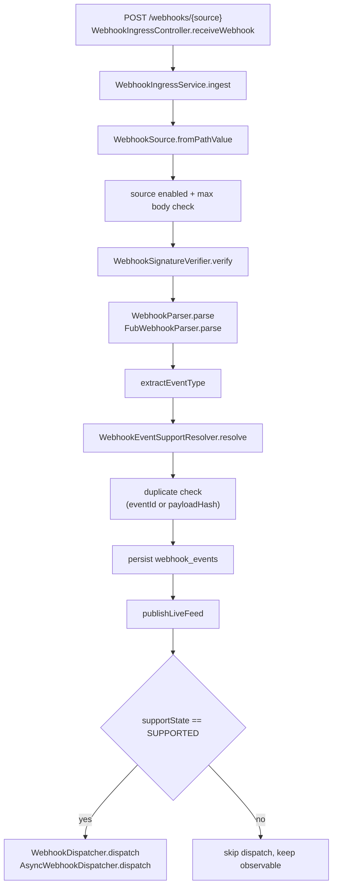
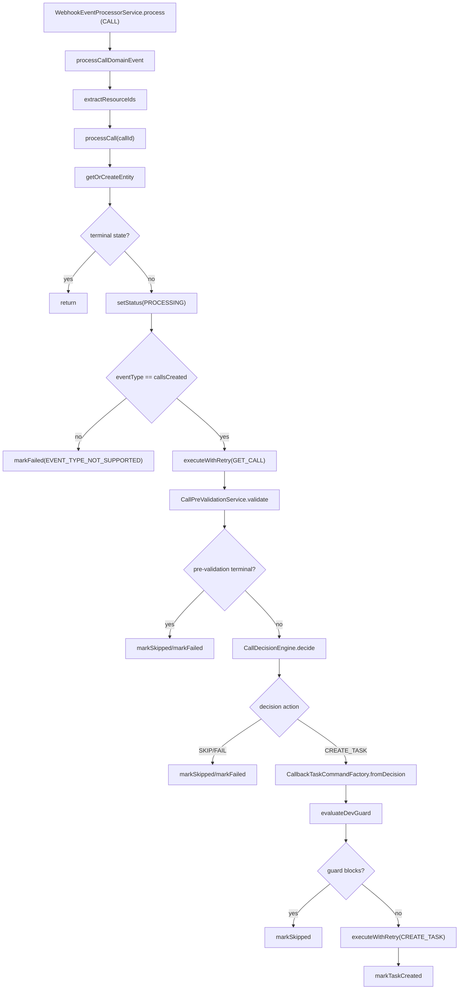
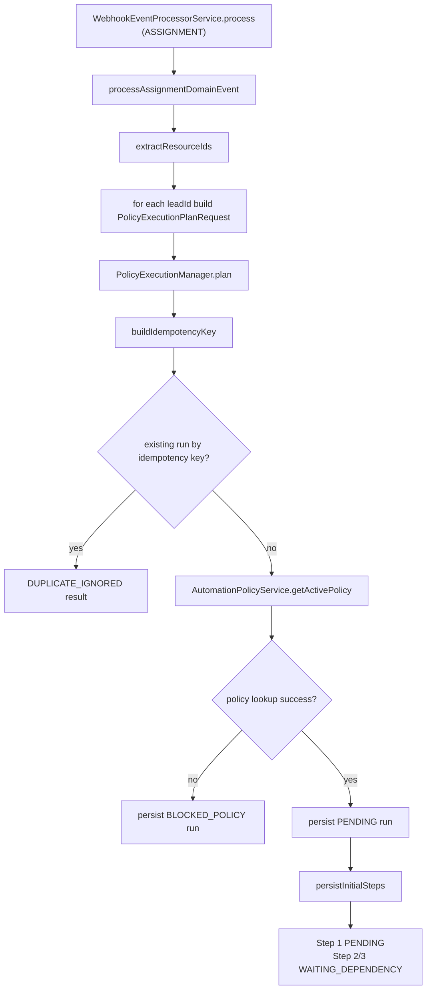
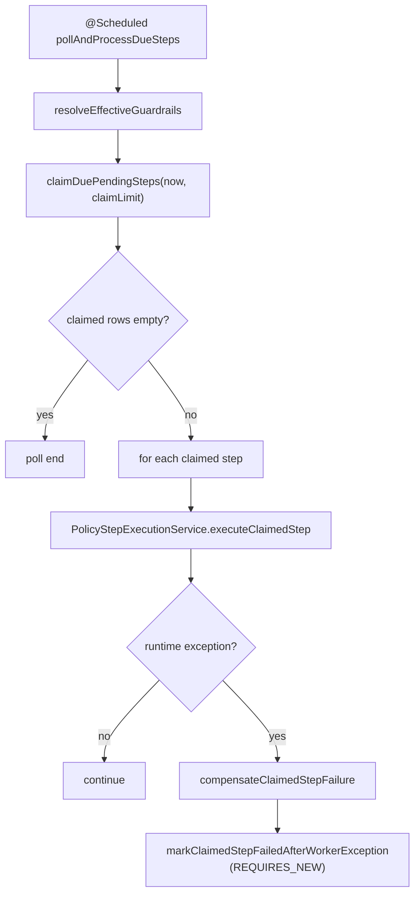

# Lead Management Platform: Current-State Implementation Deep Dive

## 1) Scope and Intent

This document describes the **current implementation state on `feature/lead-management-platform`** and compares it with `main`.

Scope boundaries:
- Feature scope: lead-management-platform docs + runtime behavior in `src/main`.
- Runtime scope: webhook ingestion, call automation, assignment policy planning/execution, and admin read/ops APIs.
- No speculation: only behavior implemented in current branch code.

## 2) Branch Snapshot (`feature/lead-management-platform` vs `main`)

Base comparison:
- `main` head: `fa27766`
- current branch: `feature/lead-management-platform` head `83821d1`

High-level delta:
- `131` files changed
- `8664` insertions
- `146` deletions

Feature outcomes present in this branch but not in `main`:
- Normalized webhook contract with catalog-state routing gates.
- Assignment-domain policy planning on webhook fan-out.
- Policy control plane with optimistic concurrency + active-scope invariant.
- Policy runtime persistence and execution pipeline:
  - `policy_execution_runs`
  - `policy_execution_steps`
  - due worker claim/execute/transition loop.
- Phase 5 executors for claim check, communication check, and action step handling.
- Admin policy-execution read APIs (list/detail with cursor pagination).
- Expanded admin webhook feed/detail/stream and processed-call replay operations.

## 3) Decision Alignment (Implemented)

Repo decisions consumed:
- `RD-001`: normalized lead event contract.
- `RD-002`: event catalog state + routing semantics.
- `RD-003`: identity mapping boundary (current assignment runtime intentionally keeps `sourceLeadId` as execution identity; identity resolver contract removed in migration V8).

Code anchors:
- Normalized event model: [`NormalizedWebhookEvent.java`](/Users/sarathkumar/Projects/2Creative/automation-engine/src/main/java/com/fuba/automation_engine/service/webhook/model/NormalizedWebhookEvent.java)
- Catalog resolver: [`StaticWebhookEventSupportResolver.java`](/Users/sarathkumar/Projects/2Creative/automation-engine/src/main/java/com/fuba/automation_engine/service/webhook/support/StaticWebhookEventSupportResolver.java)
- Assignment planning entrypoint: [`PolicyExecutionManager.java`](/Users/sarathkumar/Projects/2Creative/automation-engine/src/main/java/com/fuba/automation_engine/service/policy/PolicyExecutionManager.java)
- Identity-resolver contract removal: [`V8__remove_identity_resolver_contract.sql`](/Users/sarathkumar/Projects/2Creative/automation-engine/src/main/resources/db/migration/V8__remove_identity_resolver_contract.sql)

## 4) Current Feature Phase State

From current feature docs on this branch:
- Sprint 0: Completed
- Phase 1: Completed
- Phase 2: Completed
- Phase 3: Completed
- Phase 4: Completed
- Phase 5: Completed

Practical runtime implication:
- Assignment flow is in **planning + execution mode**.
- Due worker claims due steps and executes policy step transitions.
- Action step currently fails explicitly with `ACTION_TARGET_UNCONFIGURED` until target semantics are finalized.

## 5) Flow Catalog (Top-Level)

Primary flows covered by implementation:
1. Webhook ingestion and dispatch gating.
2. CALL-domain automation (processed calls + task creation).
3. ASSIGNMENT-domain policy planning and runtime materialization.
4. Policy due-worker execution (claim -> execute -> transition).
5. Admin observability and operations (webhooks, processed calls, policies, policy-executions).

---

## 6) Flow A: Webhook Ingestion and Dispatch Gating

### 6.1 Main path

Entry:
- `POST /webhooks/{source}` -> [`WebhookIngressController.receiveWebhook(...)`](/Users/sarathkumar/Projects/2Creative/automation-engine/src/main/java/com/fuba/automation_engine/controller/WebhookIngressController.java)

Method chain:
1. `WebhookIngressController.receiveWebhook`
2. `WebhookIngressService.ingest`
3. `WebhookSignatureVerifier.verify`
4. `WebhookParser.parse` (FUB parser today)
5. `WebhookEventSupportResolver.resolve`
6. duplicate checks in `WebhookEventRepository`
7. persist `WebhookEventEntity`
8. `WebhookLiveFeedPublisher.publish`
9. `WebhookDispatcher.dispatch` only for `SUPPORTED`

Vertical runtime diagram:

### 6.2 Files in this flow

- Controller: [`WebhookIngressController.java`](/Users/sarathkumar/Projects/2Creative/automation-engine/src/main/java/com/fuba/automation_engine/controller/WebhookIngressController.java)
- Service: [`WebhookIngressService.java`](/Users/sarathkumar/Projects/2Creative/automation-engine/src/main/java/com/fuba/automation_engine/service/webhook/WebhookIngressService.java)
- Parser: [`FubWebhookParser.java`](/Users/sarathkumar/Projects/2Creative/automation-engine/src/main/java/com/fuba/automation_engine/service/webhook/parse/FubWebhookParser.java)
- Resolver: [`StaticWebhookEventSupportResolver.java`](/Users/sarathkumar/Projects/2Creative/automation-engine/src/main/java/com/fuba/automation_engine/service/webhook/support/StaticWebhookEventSupportResolver.java)
- Async dispatch: [`AsyncWebhookDispatcher.java`](/Users/sarathkumar/Projects/2Creative/automation-engine/src/main/java/com/fuba/automation_engine/service/webhook/dispatch/AsyncWebhookDispatcher.java)
- Persistence: [`WebhookEventRepository.java`](/Users/sarathkumar/Projects/2Creative/automation-engine/src/main/java/com/fuba/automation_engine/persistence/repository/WebhookEventRepository.java)

### 6.3 Current resolver map

`StaticWebhookEventSupportResolver` currently maps:
- `FUB:callsCreated` -> `SUPPORTED / CALL / CREATED`
- `FUB:peopleCreated` -> `SUPPORTED / ASSIGNMENT / CREATED`
- `FUB:peopleUpdated` -> `SUPPORTED / ASSIGNMENT / UPDATED`
- default -> `IGNORED / UNKNOWN / UNKNOWN`

---

## 7) Flow B: CALL-Domain Automation

### 7.1 Main path

Domain router entry:
- [`WebhookEventProcessorService.process(...)`](/Users/sarathkumar/Projects/2Creative/automation-engine/src/main/java/com/fuba/automation_engine/service/webhook/WebhookEventProcessorService.java)
- `NormalizedDomain.CALL` -> `processCallDomainEvent` -> `processCall`

Method chain inside call processing:
1. `getOrCreateEntity(callId, payload)`
2. terminal-state guard (`FAILED/SKIPPED/TASK_CREATED`)
3. `setStatus(PROCESSING)`
4. event-type support check (`callsCreated`)
5. `executeWithRetry(GET_CALL, followUpBossClient.getCallById)`
6. `CallPreValidationService.validate`
7. `CallDecisionEngine.decide`
8. `CallbackTaskCommandFactory.fromDecision`
9. local dev guard (`evaluateDevGuard`)
10. `executeWithRetry(CREATE_TASK, followUpBossClient.createTask)`
11. terminal persistence: `markTaskCreated` or `markSkipped` or `markFailed`

Vertical runtime diagram:

### 7.2 Files in this flow

- Router + call processing: [`WebhookEventProcessorService.java`](/Users/sarathkumar/Projects/2Creative/automation-engine/src/main/java/com/fuba/automation_engine/service/webhook/WebhookEventProcessorService.java)
- FUB adapter: [`FubFollowUpBossClient.java`](/Users/sarathkumar/Projects/2Creative/automation-engine/src/main/java/com/fuba/automation_engine/client/fub/FubFollowUpBossClient.java)
- Persistence: [`ProcessedCallRepository.java`](/Users/sarathkumar/Projects/2Creative/automation-engine/src/main/java/com/fuba/automation_engine/persistence/repository/ProcessedCallRepository.java)

### 7.3 Current known runtime note

- `processCall` still contains a TODO for non-atomic claim around duplicate async deliveries (`step3-concurrency`), so duplicate workers can pass terminal guard before state settles.

---

## 8) Flow C: ASSIGNMENT-Domain Policy Planning and Materialization

### 8.1 Main path

Domain router entry:
- `WebhookEventProcessorService.process` with `NormalizedDomain.ASSIGNMENT`

Method chain:
1. `processAssignmentDomainEvent`
2. `extractResourceIds` from payload
3. build `PolicyExecutionPlanRequest` per lead
4. `PolicyExecutionManager.plan(request)`
5. `AutomationPolicyService.getActivePolicy(domain, key)`
6. plan persistence in `policy_execution_runs`
7. `persistInitialSteps` using `PolicyExecutionMaterializationContract.initialTemplates`
8. due timings from blueprint `steps[].delayMinutes`

Vertical runtime diagram:

### 8.2 Files in this flow

- Assignment router: [`WebhookEventProcessorService.java`](/Users/sarathkumar/Projects/2Creative/automation-engine/src/main/java/com/fuba/automation_engine/service/webhook/WebhookEventProcessorService.java)
- Planning orchestration: [`PolicyExecutionManager.java`](/Users/sarathkumar/Projects/2Creative/automation-engine/src/main/java/com/fuba/automation_engine/service/policy/PolicyExecutionManager.java)
- Policy read/validation: [`AutomationPolicyService.java`](/Users/sarathkumar/Projects/2Creative/automation-engine/src/main/java/com/fuba/automation_engine/service/policy/AutomationPolicyService.java)
- Step template contract: [`PolicyExecutionMaterializationContract.java`](/Users/sarathkumar/Projects/2Creative/automation-engine/src/main/java/com/fuba/automation_engine/service/policy/PolicyExecutionMaterializationContract.java)
- Runtime repositories: [`PolicyExecutionRunRepository.java`](/Users/sarathkumar/Projects/2Creative/automation-engine/src/main/java/com/fuba/automation_engine/persistence/repository/PolicyExecutionRunRepository.java), [`PolicyExecutionStepRepository.java`](/Users/sarathkumar/Projects/2Creative/automation-engine/src/main/java/com/fuba/automation_engine/persistence/repository/PolicyExecutionStepRepository.java)

---

## 9) Flow D: Policy Due-Worker Execution (Phase 4/5 Runtime)

### 9.1 Worker polling + DB claim

Entry:
- [`PolicyExecutionDueWorker.pollAndProcessDueSteps()`](/Users/sarathkumar/Projects/2Creative/automation-engine/src/main/java/com/fuba/automation_engine/service/policy/PolicyExecutionDueWorker.java)

Method chain:
1. `resolveEffectiveGuardrails`
2. `PolicyExecutionStepClaimRepository.claimDuePendingSteps(now, limit)`
3. loop claimed rows -> `PolicyStepExecutionService.executeClaimedStep`
4. on unhandled exception -> `markClaimedStepFailedAfterWorkerException` with retry compensation

Claim SQL behavior:
- Implemented in [`JdbcPolicyExecutionStepClaimRepository.java`](/Users/sarathkumar/Projects/2Creative/automation-engine/src/main/java/com/fuba/automation_engine/persistence/repository/JdbcPolicyExecutionStepClaimRepository.java)
- Uses `FOR UPDATE SKIP LOCKED` then updates `PENDING -> PROCESSING` and returns claimed rows.

Vertical runtime diagram:

### 9.2 Step execution + transition engine

Primary orchestrator:
- [`PolicyStepExecutionService.executeClaimedStep(...)`](/Users/sarathkumar/Projects/2Creative/automation-engine/src/main/java/com/fuba/automation_engine/service/policy/PolicyStepExecutionService.java)

Method chain:
1. load step and run
2. resolve executor from indexed `PolicyStepExecutor` set
3. build `PolicyStepExecutionContext`
4. executor `execute(context)`
5. success path:
   - `markStepCompleted`
   - `applyTransition` via `PolicyStepTransitionContract`
   - activate next step (`WAITING_DEPENDENCY -> PENDING`, compute `dueAt`) or apply terminal outcome
6. failure path:
   - `markStepAndRunFailed(reasonCode,errorMessage)`

Transition contract:
- Defined in [`PolicyStepTransitionContract.java`](/Users/sarathkumar/Projects/2Creative/automation-engine/src/main/java/com/fuba/automation_engine/service/policy/PolicyStepTransitionContract.java)
- Active transitions:
  - `WAIT_AND_CHECK_CLAIM:CLAIMED -> WAIT_AND_CHECK_COMMUNICATION`
  - `WAIT_AND_CHECK_CLAIM:NOT_CLAIMED -> NON_ESCALATED_CLOSED`
  - `WAIT_AND_CHECK_COMMUNICATION:COMM_FOUND -> COMPLIANT_CLOSED`
  - `WAIT_AND_CHECK_COMMUNICATION:COMM_NOT_FOUND -> ON_FAILURE_EXECUTE_ACTION`
  - `ON_FAILURE_EXECUTE_ACTION:ACTION_SUCCESS -> ACTION_COMPLETED`
  - `ON_FAILURE_EXECUTE_ACTION:ACTION_FAILED -> ACTION_FAILED`

### 9.3 Executor subflows

#### Subflow D3.1 WAIT_AND_CHECK_CLAIM

File:
- [`WaitAndCheckClaimStepExecutor.java`](/Users/sarathkumar/Projects/2Creative/automation-engine/src/main/java/com/fuba/automation_engine/service/policy/WaitAndCheckClaimStepExecutor.java)

Execution path:
1. validate/parse `sourceLeadId` -> `personId`
2. retry wrapper around `followUpBossClient.getPersonById(personId)`
3. resolve claimed outcome from:
   - `person.claimed` if non-null
   - fallback `assignedUserId > 0`
4. returns `CLAIMED` or `NOT_CLAIMED`, or explicit failure reason codes on errors

#### Subflow D3.2 WAIT_AND_CHECK_COMMUNICATION

File:
- [`WaitAndCheckCommunicationStepExecutor.java`](/Users/sarathkumar/Projects/2Creative/automation-engine/src/main/java/com/fuba/automation_engine/service/policy/WaitAndCheckCommunicationStepExecutor.java)

Execution path:
1. validate/parse `sourceLeadId` -> `personId`
2. retry wrapper around `followUpBossClient.checkPersonCommunication(personId)`
3. map `communicationFound` to:
   - `COMM_FOUND`
   - `COMM_NOT_FOUND`
4. map transient/permanent/unexpected errors to explicit reason codes

#### Subflow D3.3 ON_FAILURE_EXECUTE_ACTION

File:
- [`OnCommunicationMissActionStepExecutor.java`](/Users/sarathkumar/Projects/2Creative/automation-engine/src/main/java/com/fuba/automation_engine/service/policy/OnCommunicationMissActionStepExecutor.java)

Execution path:
1. read `actionConfig.actionType` from policy blueprint snapshot
2. validate supported types (`REASSIGN`, `MOVE_TO_POND`)
3. current interim behavior: deterministic failure with `ACTION_TARGET_UNCONFIGURED`
4. TODO retained for future target-aware provider mutation wiring

### 9.4 FUB adapter methods used by executors

File:
- [`FubFollowUpBossClient.java`](/Users/sarathkumar/Projects/2Creative/automation-engine/src/main/java/com/fuba/automation_engine/client/fub/FubFollowUpBossClient.java)

Methods used in policy runtime:
- `getPersonById(personId)`
- `checkPersonCommunication(personId)` -> derives result from `getPersonById(...).contacted > 0`

---

## 10) Flow E: Admin Observability and Operations

### 10.1 Webhook feed/detail/stream

Entrypoints:
- `GET /admin/webhooks` -> `AdminWebhookController.list` -> `AdminWebhookService.list`
- `GET /admin/webhooks/{id}` -> `AdminWebhookController.detail` -> `AdminWebhookService.findDetail`
- `GET /admin/webhooks/stream` -> `AdminWebhookController.stream` -> `WebhookSseHub.subscribe`

Files:
- [`AdminWebhookController.java`](/Users/sarathkumar/Projects/2Creative/automation-engine/src/main/java/com/fuba/automation_engine/controller/AdminWebhookController.java)
- [`AdminWebhookService.java`](/Users/sarathkumar/Projects/2Creative/automation-engine/src/main/java/com/fuba/automation_engine/service/webhook/AdminWebhookService.java)
- [`WebhookSseHub.java`](/Users/sarathkumar/Projects/2Creative/automation-engine/src/main/java/com/fuba/automation_engine/service/webhook/live/WebhookSseHub.java)

### 10.2 Processed-calls list + replay

Entrypoints:
- `GET /admin/processed-calls` -> `ProcessedCallAdminController.list` -> `ProcessedCallAdminService.list`
- `POST /admin/processed-calls/{callId}/replay` -> `ProcessedCallAdminController.replay` -> `ProcessedCallAdminService.replay`

Replay behavior:
- Allowed only for `FAILED` rows.
- Resets to `RECEIVED`, clears terminal fields, re-dispatches synthetic `callsCreated` event via `WebhookDispatcher`.

Files:
- [`ProcessedCallAdminController.java`](/Users/sarathkumar/Projects/2Creative/automation-engine/src/main/java/com/fuba/automation_engine/controller/ProcessedCallAdminController.java)
- [`ProcessedCallAdminService.java`](/Users/sarathkumar/Projects/2Creative/automation-engine/src/main/java/com/fuba/automation_engine/service/webhook/ProcessedCallAdminService.java)

### 10.3 Policy control plane APIs

Entrypoints:
- `GET /admin/policies/{domain}/{policyKey}/active`
- `GET /admin/policies?domain=&policyKey=`
- `POST /admin/policies`
- `PUT /admin/policies/{id}`
- `POST /admin/policies/{id}/activate`

Core files:
- [`AdminPolicyController.java`](/Users/sarathkumar/Projects/2Creative/automation-engine/src/main/java/com/fuba/automation_engine/controller/AdminPolicyController.java)
- [`AutomationPolicyService.java`](/Users/sarathkumar/Projects/2Creative/automation-engine/src/main/java/com/fuba/automation_engine/service/policy/AutomationPolicyService.java)

### 10.4 Policy execution read APIs

Entrypoints:
- `GET /admin/policy-executions`
- `GET /admin/policy-executions/{id}`

Core files:
- [`AdminPolicyExecutionController.java`](/Users/sarathkumar/Projects/2Creative/automation-engine/src/main/java/com/fuba/automation_engine/controller/AdminPolicyExecutionController.java)
- [`AdminPolicyExecutionService.java`](/Users/sarathkumar/Projects/2Creative/automation-engine/src/main/java/com/fuba/automation_engine/service/policy/AdminPolicyExecutionService.java)

---

## 11) Data Model and Migration Evolution (Feature-Relevant)

Feature migrations:
- [`V4__add_catalog_resolution_fields_to_webhook_events.sql`](/Users/sarathkumar/Projects/2Creative/automation-engine/src/main/resources/db/migration/V4__add_catalog_resolution_fields_to_webhook_events.sql)
- [`V5__create_automation_policies.sql`](/Users/sarathkumar/Projects/2Creative/automation-engine/src/main/resources/db/migration/V5__create_automation_policies.sql)
- [`V6__add_policy_blueprint_and_remove_seed.sql`](/Users/sarathkumar/Projects/2Creative/automation-engine/src/main/resources/db/migration/V6__add_policy_blueprint_and_remove_seed.sql)
- [`V7__create_policy_execution_runtime_and_drop_due_after_minutes.sql`](/Users/sarathkumar/Projects/2Creative/automation-engine/src/main/resources/db/migration/V7__create_policy_execution_runtime_and_drop_due_after_minutes.sql)
- [`V8__remove_identity_resolver_contract.sql`](/Users/sarathkumar/Projects/2Creative/automation-engine/src/main/resources/db/migration/V8__remove_identity_resolver_contract.sql)

Important runtime model notes:
- `PolicyExecutionRunStatus` now: `PENDING`, `BLOCKED_POLICY`, `DUPLICATE_IGNORED`, `COMPLETED`, `FAILED`.
- `BLOCKED_IDENTITY` and `internal_lead_ref` have been removed from runtime contract.

---

## 12) API Surface (Current)

Webhook ingest:
- `POST /webhooks/{source}`

Webhook admin:
- `GET /admin/webhooks`
- `GET /admin/webhooks/{id}`
- `GET /admin/webhooks/stream`

Processed calls:
- `GET /admin/processed-calls`
- `POST /admin/processed-calls/{callId}/replay`

Policy control:
- `GET /admin/policies/{domain}/{policyKey}/active`
- `GET /admin/policies`
- `POST /admin/policies`
- `PUT /admin/policies/{id}`
- `POST /admin/policies/{id}/activate`

Policy execution admin:
- `GET /admin/policy-executions`
- `GET /admin/policy-executions/{id}`

---

## 13) Known Gaps / Deferred Items (Still Valid)

- `ON_FAILURE_EXECUTE_ACTION` does not execute provider mutation yet; it fails with `ACTION_TARGET_UNCONFIGURED` until target semantics are finalized.
- Due worker has compensation retries; stale `PROCESSING` watchdog/reaper is still deferred.
- `WebhookSseHub.publish` contains TODO about null-safe payload map construction.
- CALL flow non-atomic claim TODO remains for duplicate concurrent deliveries.
- `ProcessedCallAdminService.replay` TODO remains for retry-count reset policy.

---

## 14) 10-Pass Verification Log (Document vs Code)

This document was verified in recursive passes against current branch code:

1. Branch baseline and diff stats validated (`HEAD`, `main`, `diff --shortstat`).
2. Feature phase status validated against current `phases.md` and phase logs.
3. Webhook ingress flow validated against controller + service + parser + resolver + repository + dispatcher chain.
4. Catalog routing map validated against `StaticWebhookEventSupportResolver` entries.
5. CALL flow validated against `WebhookEventProcessorService` method sequence and retry/terminal transitions.
6. ASSIGNMENT planning flow validated against `processAssignmentDomainEvent` and `PolicyExecutionManager.plan` materialization.
7. Due worker claim flow validated against `PolicyExecutionDueWorker` + `JdbcPolicyExecutionStepClaimRepository` SQL behavior.
8. Step execution and transition semantics validated against `PolicyStepExecutionService` + `PolicyStepTransitionContract`.
9. Executor internals validated for claim/communication/action paths and reason-code outcomes.
10. Runtime contract/migration parity validated for V8 identity removal and current run statuses.

Result:
- Mismatches from old deep-dive state were corrected (phase status, execution-mode assumptions, identity contract, runtime statuses, and flow sequencing).

