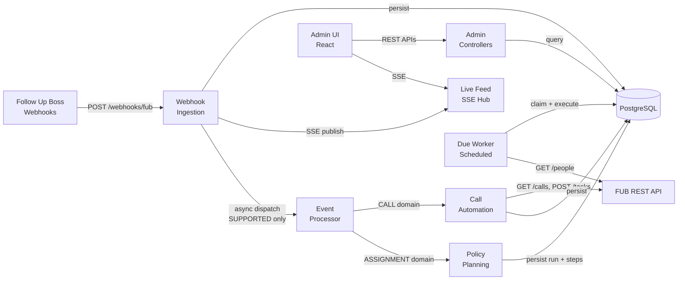
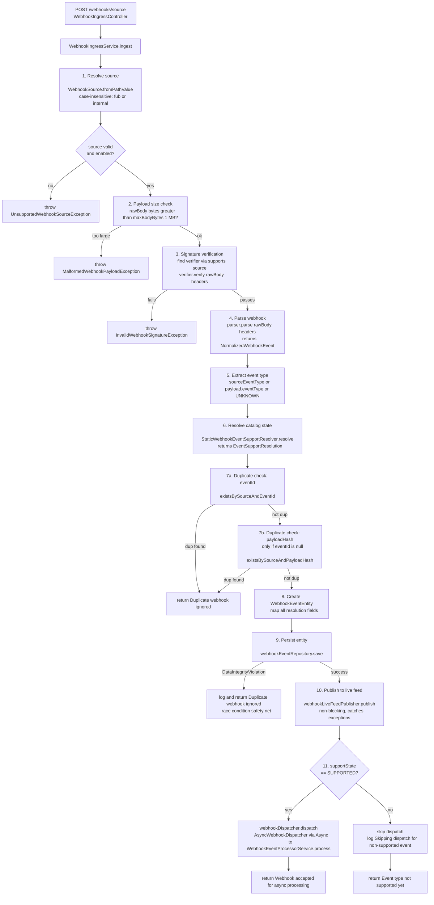
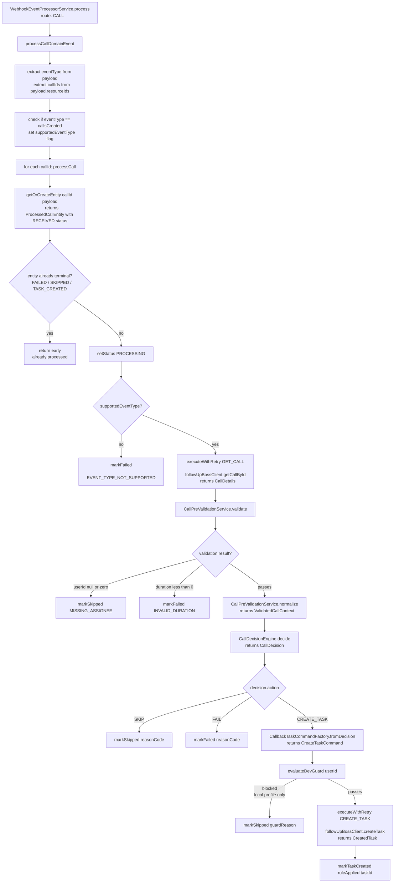
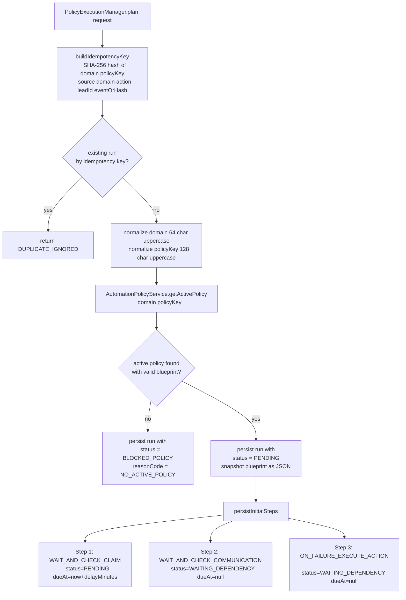
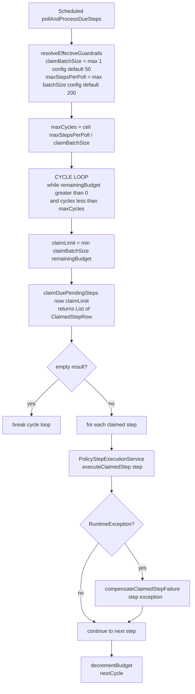
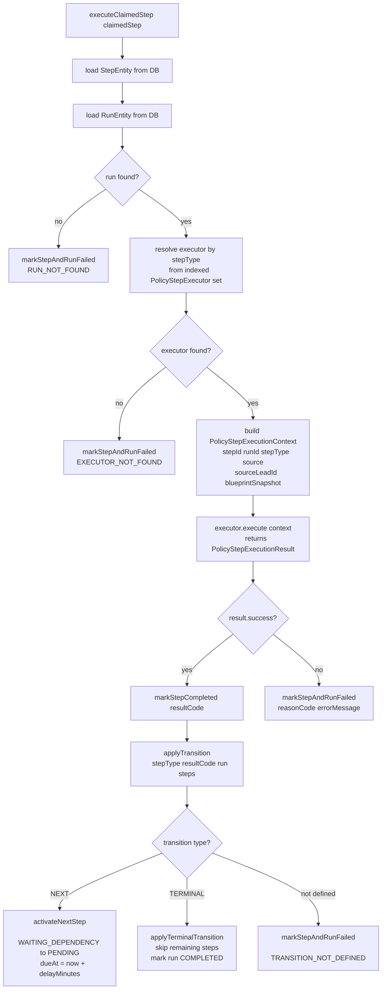

# Lead Management Platform: Current-State Implementation Deep Dive

## 1) What This App Is and Why It Exists

### 1.1 The problem

A real estate team uses **Follow Up Boss (FUB)** as their CRM. Leads come in, agents get assigned, calls happen. But things fall through the cracks:

- A call is missed or too short — nobody follows up.
- A lead is assigned to an agent, but the agent never contacts them — nobody notices until the lead goes cold.

These are the two real-world problems this app solves.

### 1.2 How it solves them

The **Automation Engine** sits between Follow Up Boss and the team's workflow. It listens for events from FUB via webhooks and takes automated action:

**Scenario 1 — Call Automation (live today):**
A call happens in FUB. FUB fires a `callsCreated` webhook to this app. The app fetches the call details, evaluates the outcome, and decides:
- **Missed call** (duration = 0) → creates a "Call back" task in FUB assigned to the same agent, due tomorrow.
- **Short call** (duration ≤ 30 seconds) → creates a "Follow up" task in FUB.
- **"No answer" outcome** → creates a "Call back" task.
- **Connected call** (duration > 30 seconds) → no action needed, skip.

**Scenario 2 — Assignment SLA Enforcement (live today):**
A lead is created or updated in FUB. FUB fires a `peopleCreated` or `peopleUpdated` webhook. The app starts a policy-driven SLA timer:
1. Wait 5 minutes → check if the lead is still claimed by the assigned agent.
2. If claimed, wait 10 more minutes → check if the agent has made contact.
3. If no contact → trigger an action (reassign or move to pond). *Note: the action execution is structurally wired but the target semantics are deferred — it currently fails with `ACTION_TARGET_UNCONFIGURED`.*

### 1.3 Who uses it

- **The automation runs unattended** — webhooks arrive, processing happens automatically.
- **The Admin UI** (React app at `/admin-ui/`) gives the team visibility:
  - Live webhook feed (SSE streaming) — see events arrive in real time.
  - Processed calls list — see what happened to each call and why.
  - Replay failed calls — retry a failed call with one click.
  - Policy execution monitoring — see SLA enforcement runs and their step-by-step outcomes.
  - Policy control plane — create, update, activate policies.

### 1.4 Scope of this document

This document covers the **backend implementation** in detail — every flow, every method, every configuration value. The frontend (React UI) is covered in a separate document.

**Branch snapshot:**
- `main` head: `fa27766`
- Current branch head: `83821d1`
- Delta: `131` files changed, `8664` insertions, `146` deletions

---

## 2) Local Development and Startup

### 2.1 Prerequisites

- Java 21
- Node.js 20+ and npm
- PostgreSQL (local or remote)
- Optional: `cloudflared` for temporary public demo links (required for FUB webhook delivery in dev)

### 2.2 Environment setup

```bash
cp .env.example .env
```

Required variables in `.env`:

| Variable | Purpose | Example |
|----------|---------|---------|
| `FUB_API_KEY` | FUB REST API key (Basic Auth) | `your-api-key` |
| `FUB_BASE_URL` | FUB API base URL | `https://api.followupboss.com/v1` |
| `FUB_X_SYSTEM` | X-System header (from FUB system registration) | `your-system-name` |
| `FUB_X_SYSTEM_KEY` | X-System-Key header (also used as webhook signing key) | `your-system-key` |
| `DB_URL` | PostgreSQL JDBC URL | `jdbc:postgresql://localhost:5432/automation_engine` |
| `DB_USER` | Database username | `postgres` |
| `DB_PASS` | Database password | `postgres` |
| `DEV_TEST_USER_ID` | In `local` profile, only process calls for this FUB user ID (safety guard) | `30` |

### 2.3 Running the app

**Option A: Backend only**
```bash
./mvnw spring-boot:run
```
Backend starts on `http://localhost:8080`. Flyway auto-applies migrations.

**Option B: Full dev stack** (backend + frontend + Cloudflare tunnel + webhook sync)
```bash
./scripts/run-app.sh dev
```

This is the main dev workflow. The script (`scripts/run-app.sh`, ~480 lines) orchestrates:

1. **Loads `.env`** — sources environment variables.
2. **Starts backend** — `./mvnw spring-boot:run` with `local` profile, logs to `logs/backend.log`.
3. **Starts frontend** — `npm run dev` in `ui/`, Vite dev server on `:5173`, logs to `logs/frontend.log`.
4. **Starts Cloudflare tunnel** — `cloudflared tunnel --url http://localhost:8080`, creates a temporary `*.trycloudflare.com` public URL pointing to the local backend.
5. **Syncs FUB webhooks** — reads `config/fub-webhook-events.txt` for the list of managed events (`callsCreated`, `peopleCreated`, `peopleUpdated`), then for each event:
   - Fetches existing FUB webhooks via `GET https://api.followupboss.com/v1/webhooks`
   - If no webhook exists for that event → creates one via `POST /v1/webhooks` with URL `{tunnel_url}/webhooks/fub`
   - If webhook exists but URL is stale → updates it via `PUT /v1/webhooks/{id}` with the new tunnel URL
   - If webhook exists and URL matches → skips (already up to date)
6. **Streams logs** — tails backend, frontend, and tunnel logs to the terminal with colorized output.
7. **Cleanup on Ctrl+C** — kills all child processes (backend, frontend, tunnel, log tailers).

**Why the tunnel and webhook sync exist:** FUB can only deliver webhooks to a public URL. Since local dev runs on `localhost`, the Cloudflare quick tunnel creates a temporary public URL. The tunnel URL changes every restart, so the script automatically updates the FUB webhook targets each time.

**Option C: Production mode**
```bash
./scripts/run-app.sh prod --profile prod
```
Runs backend only with the `prod` Spring profile. No tunnel, no frontend dev server, no webhook sync.

### 2.4 Managed webhook events

The file `config/fub-webhook-events.txt` defines which FUB webhook events the startup script manages:

```
callsCreated
peopleCreated
peopleUpdated
```

Adding a new event type to this file will cause the startup script to register a new webhook in FUB on next `dev` startup. The event must also be mapped in `StaticWebhookEventSupportResolver` to be processed (otherwise it will be persisted but not dispatched).

### 2.5 Log files

| File | Content |
|------|---------|
| `logs/backend.log` | Spring Boot backend output (cleared on each dev startup) |
| `logs/frontend.log` | Vite dev server output (cleared on each dev startup) |
| `logs/startup.log` | Startup orchestration log (cleared on each dev startup) |

---

## 3) Architecture Overview (Backend)

### 2.1 Layered architecture pattern

The backend follows a **hexagonal / ports-and-adapters** pattern layered as:

```
Controller (HTTP concerns)
    ↓
Service (orchestration / business logic)
    ↓
Port (interface contract)
    ↓
Adapter (provider-specific implementation)
    ↓
Repository / External API
```

### 2.2 Package structure

```
com.fuba.automation_engine/
├── AutomationEngineApplication.java          ← Spring Boot entry point
├── config/                                    ← Configuration beans and property classes
│   ├── FubClientProperties                   ← FUB API connection config
│   ├── WebhookProperties                     ← Webhook ingestion config
│   ├── CallOutcomeRulesProperties            ← Call decision rules config
│   ├── PolicyWorkerProperties                ← Due worker config
│   ├── FubRetryProperties                    ← Retry policy config
│   ├── HttpClientConfig                      ← RestClient.Builder bean
│   ├── JacksonConfig                         ← ObjectMapper bean
│   ├── TimeConfig                            ← Clock.systemUTC() bean
│   ├── WebhookAsyncConfig                    ← Async thread pool for webhook dispatch
│   └── PolicyWorkerSchedulingConfig          ← Enables @Scheduled
├── controller/                                ← HTTP endpoints
│   ├── WebhookIngressController              ← POST /webhooks/{source}
│   ├── AdminWebhookController                ← GET /admin/webhooks, stream
│   ├── ProcessedCallAdminController          ← GET/POST /admin/processed-calls
│   ├── AdminPolicyController                 ← CRUD /admin/policies
│   ├── AdminPolicyExecutionController        ← GET /admin/policy-executions
│   ├── HealthController                      ← GET /health
│   ├── TasksController                       ← POST /tasks (manual)
│   └── dto/                                  ← Request/response DTOs (13 classes)
├── service/
│   ├── FollowUpBossClient                    ← Port interface for FUB API
│   ├── model/                                ← Domain models (CallDetails, PersonDetails, etc.)
│   ├── webhook/
│   │   ├── WebhookIngressService             ← Main ingestion orchestrator
│   │   ├── WebhookEventProcessorService      ← Domain routing + call/assignment processing
│   │   ├── AdminWebhookService               ← Webhook feed queries
│   │   ├── ProcessedCallAdminService         ← Processed call queries + replay
│   │   ├── WebhookFeedCursorCodec            ← Cursor encoding for pagination
│   │   ├── parse/                            ← WebhookParser interface + FubWebhookParser
│   │   ├── security/                         ← WebhookSignatureVerifier + FubWebhookSignatureVerifier
│   │   ├── support/                          ← WebhookEventSupportResolver + StaticResolver
│   │   ├── dispatch/                         ← WebhookDispatcher + AsyncWebhookDispatcher
│   │   ├── live/                             ← WebhookLiveFeedPublisher + WebhookSseHub
│   │   └── model/                            ← NormalizedWebhookEvent, enums
│   └── policy/
│       ├── AutomationPolicyService           ← Policy CRUD + activation
│       ├── PolicyExecutionManager            ← Planning orchestrator
│       ├── PolicyStepExecutionService        ← Step execution + transitions
│       ├── PolicyExecutionDueWorker          ← Scheduled worker
│       ├── AdminPolicyExecutionService       ← Execution feed queries
│       ├── PolicyBlueprintValidator          ← Blueprint JSON validation
│       ├── PolicyExecutionMaterializationContract ← Step template definitions
│       ├── PolicyStepTransitionContract      ← Transition map
│       ├── PolicyExecutionCursorCodec        ← Cursor encoding
│       ├── WaitAndCheckClaimStepExecutor     ← Claim check executor
│       ├── WaitAndCheckCommunicationStepExecutor ← Communication check executor
│       ├── OnCommunicationMissActionStepExecutor ← Action executor (deferred)
│       └── (context, result, request, outcome records)
├── client/fub/
│   ├── FubFollowUpBossClient                 ← Adapter: FUB REST API client
│   └── dto/                                  ← FUB API request/response DTOs
├── rules/
│   ├── CallPreValidationService              ← Call data validation
│   ├── CallDecisionEngine                    ← Call outcome decision rules
│   ├── CallbackTaskCommandFactory            ← Task creation command builder
│   └── (ValidatedCallContext, CallDecision, etc.)
├── persistence/
│   ├── entity/                               ← JPA entities (5) + enums (4)
│   └── repository/                           ← JPA repositories (5) + JDBC impls (2)
└── exception/                                ← Custom exception classes (7)
```

### 2.3 High-level system flow



---

## 4) Decision Alignment (Implemented)

Three repo-wide decisions govern the platform:

| Decision | Summary | Code Anchor |
|----------|---------|-------------|
| **RD-001** | Source-agnostic normalized event contract. All webhook sources produce `NormalizedWebhookEvent` records with uniform fields. | `NormalizedWebhookEvent.java` |
| **RD-002** | Event catalog with explicit state-controlled routing. Each `(source, eventType)` maps to a `supportState` (`SUPPORTED`, `STAGED`, `IGNORED`) that gates dispatch. | `StaticWebhookEventSupportResolver.java` |
| **RD-003** | Lead identity mapping boundary. Currently deferred — runtime uses `sourceLeadId` directly. Identity resolver contract removed in migration `V8`. | `V8__remove_identity_resolver_contract.sql` |

---

## 5) Feature Phase State

All phases are **completed**:

| Phase | Focus | Status |
|-------|-------|--------|
| Sprint 0 | RFC lock gate (3 RFCs approved) | Completed |
| Phase 1 | Normalized event contract, catalog resolver, domain routing | Completed |
| Phase 2 | Policy control plane with optimistic concurrency | Completed |
| Phase 3 | Assignment event expansion, policy execution runtime tables | Completed |
| Phase 4 | Due worker, claim/communication executors, transition engine | Completed |
| Phase 5 | Action executor, admin execution APIs, expanded admin surfaces | Completed |

**Current runtime state:** Assignment flow is in planning + execution mode. Due worker claims and executes steps. Action step fails explicitly with `ACTION_TARGET_UNCONFIGURED` until target semantics are finalized.

---

## 6) Configuration Reference

### 5.1 FUB client (`fub.*`)

| Property | Default | Env Var | Description |
|----------|---------|---------|-------------|
| `fub.base-url` | *(required)* | `FUB_BASE_URL` | FUB REST API base URL |
| `fub.api-key` | *(required)* | `FUB_API_KEY` | API key for Basic Auth |
| `fub.x-system` | *(required)* | `FUB_X_SYSTEM` | X-System header value |
| `fub.x-system-key` | *(required)* | `FUB_X_SYSTEM_KEY` | X-System-Key header value |

### 5.2 FUB retry policy (`fub.retry.*`)

| Property | Default | Description |
|----------|---------|-------------|
| `fub.retry.max-attempts` | `3` | Max retry attempts for transient FUB failures |
| `fub.retry.initial-delay-ms` | `500` | Base delay before first retry (ms) |
| `fub.retry.max-delay-ms` | `5000` | Maximum backoff cap (ms) |
| `fub.retry.multiplier` | `2.0` | Exponential backoff multiplier |
| `fub.retry.jitter-factor` | `0.2` | ±20% jitter applied to base delay |

**Backoff formula:**
```
unbounded = initialDelayMs × multiplier^(attempt - 1)
baseDelay = min(unbounded, maxDelayMs)
jitterRange = baseDelay × jitterFactor
jitteredDelay = round(baseDelay + random(-jitterRange, +jitterRange))
finalDelay = clamp(jitteredDelay, 0, maxDelayMs)
```

### 5.3 Webhook ingestion (`webhook.*`)

| Property | Default | Description |
|----------|---------|-------------|
| `webhook.max-body-bytes` | `1048576` (1 MB) | Max webhook payload size |
| `webhook.sources.fub.enabled` | `true` | Whether FUB source is active |
| `webhook.sources.fub.signing-key` | `""` | HMAC signing key for signature verification |
| `webhook.live-feed.heartbeat-seconds` | `15` | SSE heartbeat interval |
| `webhook.live-feed.emitter-timeout-ms` | `1800000` (30 min) | SSE emitter timeout |

### 5.4 Call outcome rules (`rules.call-outcome.*`)

| Property | Default | Description |
|----------|---------|-------------|
| `rules.call-outcome.short-call-threshold-seconds` | `30` | Duration threshold separating "short" from "connected" |
| `rules.call-outcome.task-due-in-days` | `1` | Days from today for task due date |
| `rules.call-outcome.dev-test-user-id` | `0` | Dev guard: only process calls for this userId in `local` profile. `0` = disabled. |

### 5.5 Policy worker (`policy.worker.*`)

| Property | Default | Description |
|----------|---------|-------------|
| `policy.worker.enabled` | `true` | Enable/disable due worker polling |
| `policy.worker.poll-interval-ms` | `2000` | Fixed delay between polls (ms) |
| `policy.worker.claim-batch-size` | `50` | Steps claimed per DB round-trip |
| `policy.worker.max-steps-per-poll` | `200` | Total steps processed per poll cycle |

### 5.6 Async thread pool (`WebhookAsyncConfig`)

| Setting | Value |
|---------|-------|
| Thread name prefix | `webhook-worker-` |
| Core pool size | `2` |
| Max pool size | `4` |
| Queue capacity | `100` |

### 5.7 Database

| Property | Default |
|----------|---------|
| `spring.datasource.url` | `jdbc:postgresql://localhost:5432/automation_engine` |
| `spring.datasource.hikari.maximum-pool-size` | `5` |
| `spring.jpa.hibernate.ddl-auto` | `none` (Flyway manages schema) |

---

## 7) Database Schema

### 6.1 `webhook_events` (V1 + V3 + V4)

| Column | Type | Nullable | Default | Notes |
|--------|------|----------|---------|-------|
| `id` | `BIGSERIAL` | NO | auto | PK |
| `source` | `VARCHAR(32)` | NO | | Enum: `FUB`, `INTERNAL` |
| `event_id` | `VARCHAR(255)` | YES | | Provider event identifier |
| `event_type` | `VARCHAR(64)` | NO | `'UNKNOWN'` | e.g. `callsCreated` |
| `catalog_state` | `VARCHAR(32)` | NO | `'IGNORED'` | `SUPPORTED`, `STAGED`, `IGNORED` |
| `normalized_domain` | `VARCHAR(32)` | NO | `'UNKNOWN'` | `CALL`, `ASSIGNMENT`, `UNKNOWN` |
| `normalized_action` | `VARCHAR(32)` | NO | `'UNKNOWN'` | `CREATED`, `UPDATED`, `UNKNOWN` |
| `source_lead_id` | `VARCHAR(128)` | YES | | Lead identifier from source |
| `status` | `VARCHAR(32)` | NO | `'RECEIVED'` | Currently always `RECEIVED` |
| `payload` | `JSONB` | NO | | Full normalized payload |
| `payload_hash` | `VARCHAR(88)` | YES | | SHA-256 Base64 hash |
| `received_at` | `TIMESTAMPTZ` | NO | `NOW()` | When webhook was received |

**Indexes:**
- `uk_webhook_events_source_event_id` — UNIQUE on `(source, event_id)` WHERE `event_id IS NOT NULL`
- `uk_webhook_events_source_payload_hash` — UNIQUE on `(source, payload_hash)` WHERE `event_id IS NULL AND payload_hash IS NOT NULL`
- `idx_webhook_events_status_received_at` — on `(status, received_at)`
- `idx_webhook_events_source_event_type_received_at_id_desc` — on `(source, event_type, received_at DESC, id DESC)`
- `idx_webhook_events_received_at_id_desc` — on `(received_at DESC, id DESC)`

### 6.2 `processed_calls` (V2)

| Column | Type | Nullable | Default | Notes |
|--------|------|----------|---------|-------|
| `id` | `BIGSERIAL` | NO | auto | PK |
| `call_id` | `BIGINT` | NO | | UNIQUE, FUB call ID |
| `status` | `VARCHAR(32)` | NO | | `RECEIVED`, `PROCESSING`, `SKIPPED`, `TASK_CREATED`, `FAILED` |
| `rule_applied` | `VARCHAR(128)` | YES | | e.g. `MISSED`, `SHORT` |
| `task_id` | `BIGINT` | YES | | FUB task ID if created |
| `failure_reason` | `VARCHAR(512)` | YES | | Reason if failed/skipped |
| `retry_count` | `INTEGER` | NO | `0` | FUB API retry attempts |
| `raw_payload` | `JSONB` | YES | | Original webhook payload |
| `created_at` | `TIMESTAMPTZ` | NO | `NOW()` | |
| `updated_at` | `TIMESTAMPTZ` | NO | `NOW()` | |

**Indexes:**
- UNIQUE on `call_id`
- `idx_processed_calls_status_updated_at` — on `(status, updated_at)`

### 6.3 `automation_policies` (V5 + V6)

| Column | Type | Nullable | Default | Notes |
|--------|------|----------|---------|-------|
| `id` | `BIGSERIAL` | NO | auto | PK |
| `domain` | `VARCHAR(64)` | NO | | e.g. `ASSIGNMENT` |
| `policy_key` | `VARCHAR(128)` | NO | | e.g. `FOLLOW_UP_SLA` |
| `enabled` | `BOOLEAN` | NO | `TRUE` | |
| `blueprint` | `JSONB` | YES | | Policy definition (see §10.2) |
| `status` | `VARCHAR(16)` | NO | | `ACTIVE` or `INACTIVE` |
| `version` | `BIGINT` | NO | `0` | Optimistic lock version |

**Constraints:**
- `chk_automation_policies_status` — CHECK `status IN ('ACTIVE', 'INACTIVE')`
- `uk_automation_policies_active_per_scope` — UNIQUE on `(domain, policy_key)` WHERE `status = 'ACTIVE'` (at most one active policy per scope)

**Indexes:**
- `idx_automation_policies_domain_policy_key_id_desc` — on `(domain, policy_key, id DESC)`

### 6.4 `policy_execution_runs` (V7 + V8)

| Column | Type | Nullable | Default | Notes |
|--------|------|----------|---------|-------|
| `id` | `BIGSERIAL` | NO | auto | PK |
| `source` | `VARCHAR(32)` | NO | | `FUB`, `INTERNAL` |
| `event_id` | `VARCHAR(255)` | YES | | From webhook event |
| `webhook_event_id` | `BIGINT` | YES | | FK → `webhook_events.id` ON DELETE SET NULL |
| `source_lead_id` | `VARCHAR(255)` | YES | | Lead identifier |
| `domain` | `VARCHAR(64)` | NO | | Policy domain |
| `policy_key` | `VARCHAR(128)` | NO | | Policy key |
| `policy_version` | `BIGINT` | NO | | Snapshotted policy version |
| `policy_blueprint_snapshot` | `JSONB` | NO | | Frozen blueprint at plan time |
| `status` | `VARCHAR(32)` | NO | | `PENDING`, `BLOCKED_POLICY`, `DUPLICATE_IGNORED`, `COMPLETED`, `FAILED` |
| `reason_code` | `VARCHAR(64)` | YES | | Terminal outcome or failure reason |
| `idempotency_key` | `VARCHAR(255)` | NO | | SHA-256 hash (see §10.4) |
| `created_at` | `TIMESTAMPTZ` | NO | `NOW()` | |
| `updated_at` | `TIMESTAMPTZ` | NO | `NOW()` | |

**Constraints:**
- `uk_policy_execution_runs_idempotency_key` — UNIQUE on `idempotency_key`
- FK → `webhook_events(id)` ON DELETE SET NULL

**Indexes:**
- `idx_policy_execution_runs_status_created_at` — on `(status, created_at)`

### 6.5 `policy_execution_steps` (V7)

| Column | Type | Nullable | Default | Notes |
|--------|------|----------|---------|-------|
| `id` | `BIGSERIAL` | NO | auto | PK |
| `run_id` | `BIGINT` | NO | | FK → `policy_execution_runs.id` ON DELETE CASCADE |
| `step_order` | `INTEGER` | NO | | Position in pipeline (≥ 1) |
| `step_type` | `VARCHAR(64)` | NO | | `WAIT_AND_CHECK_CLAIM`, `WAIT_AND_CHECK_COMMUNICATION`, `ON_FAILURE_EXECUTE_ACTION` |
| `status` | `VARCHAR(32)` | NO | | `PENDING`, `WAITING_DEPENDENCY`, `PROCESSING`, `COMPLETED`, `FAILED`, `SKIPPED` |
| `due_at` | `TIMESTAMPTZ` | YES | | When step becomes eligible for execution |
| `depends_on_step_order` | `INTEGER` | YES | | Step that must complete first |
| `result_code` | `VARCHAR(64)` | YES | | e.g. `CLAIMED`, `COMM_FOUND` |
| `error_message` | `VARCHAR(512)` | YES | | Failure details |
| `created_at` | `TIMESTAMPTZ` | NO | `NOW()` | |
| `updated_at` | `TIMESTAMPTZ` | NO | `NOW()` | |

**Constraints:**
- `uk_policy_execution_steps_run_step_order` — UNIQUE on `(run_id, step_order)`
- `chk_policy_execution_steps_step_order_positive` — CHECK `step_order >= 1`
- FK → `policy_execution_runs(id)` ON DELETE CASCADE

**Indexes:**
- `idx_policy_execution_steps_status_due_at` — on `(status, due_at)` — used by due worker claim query
- `idx_policy_execution_steps_run_id_step_order` — on `(run_id, step_order)`

---

## 8) Flow A: Webhook Ingestion and Dispatch Gating

### 7.1 Entry point

```
POST /webhooks/{source}  →  WebhookIngressController.receiveWebhook(source, rawBody, headers)
```

The controller flattens multi-value HTTP headers to single-value (takes first value), then delegates to `WebhookIngressService.ingest()`. Returns **HTTP 202 ACCEPTED** on success.

**Exception mapping at controller level:**

| Exception | HTTP Status |
|-----------|-------------|
| `InvalidWebhookSignatureException` | 401 UNAUTHORIZED |
| `MalformedWebhookPayloadException` | 400 BAD REQUEST |
| `UnsupportedWebhookSourceException` | 400 BAD REQUEST |

### 7.2 Full ingestion flow



### 7.3 Subflow A.1: FUB signature verification

**Implementation:** `FubWebhookSignatureVerifier.verify(rawBody, headers)`

**Why it works this way:** FUB signs webhooks with HMAC-SHA256 over a Base64-encoded body. The verifier must handle both raw hex signatures and `key=value` formatted signatures (e.g. `sha256=abc123`) that FUB may send.

1. Read signing key from `webhook.sources.fub.signing-key` config
2. Extract `FUB-Signature` header (case-insensitive lookup)
3. Compute expected signature:
   - Base64-encode the raw body: `Base64.encode(rawBody.getBytes(UTF_8))`
   - HMAC-SHA256 the Base64 string with signing key → hex string (lowercase)
4. Compare using **constant-time equals** (`MessageDigest.isEqual`) to prevent timing attacks
5. If direct match fails, try parsing `key=value` format: extract value after `=` and compare again
6. Returns `true` if either comparison matches, `false` otherwise

### 7.4 Subflow A.2: FUB webhook parsing

**Implementation:** `FubWebhookParser.parse(rawBody, headers)`

1. Parse raw body as JSON via `ObjectMapper.readTree()` — throws `MalformedWebhookPayloadException` if invalid JSON
2. Extract `event` field (required, non-blank) — throws if missing
3. For `callsCreated` events: validate `resourceIds` array exists
4. Extract `eventId` if present (nullable)
5. **Compute payload hash:** SHA-256 of raw body → Base64-encoded string

   **Why:** The hash provides a deduplication fallback when `eventId` is absent. Two identical payloads produce the same hash, preventing duplicate processing.

6. Map domain and action (parser-owned, marked for future deprecation to resolver):
   - `callsCreated` → `CALL / CREATED`
   - `peopleCreated` → `ASSIGNMENT / CREATED`
   - `peopleUpdated` → `ASSIGNMENT / UPDATED`
   - default → `UNKNOWN / UNKNOWN`
7. Build payload JSON containing: `eventType`, `resourceIds` (or empty array), `uri`, selected `headers` (`FUB-Signature`, `User-Agent`, `Content-Type`), and `rawBody`
8. Build provider metadata with: `resourceIds`, `uri`, selected headers
9. Return `NormalizedWebhookEvent` record with `sourceSystem=FUB`, `status=RECEIVED`, `receivedAt=now()`

**Note:** `sourceLeadId` is currently always `null` from the parser (TODO: derive for `peopleCreated`/`peopleUpdated` in future).

### 7.5 Subflow A.3: Catalog state resolution

**Implementation:** `StaticWebhookEventSupportResolver.resolve(source, eventType)`

Current mapping:

| Source | Event Type | Support State | Domain | Action |
|--------|-----------|---------------|--------|--------|
| `FUB` | `callsCreated` | `SUPPORTED` | `CALL` | `CREATED` |
| `FUB` | `peopleCreated` | `SUPPORTED` | `ASSIGNMENT` | `CREATED` |
| `FUB` | `peopleUpdated` | `SUPPORTED` | `ASSIGNMENT` | `UPDATED` |
| *any* | *unmapped* | `IGNORED` | `UNKNOWN` | `UNKNOWN` |

**Why this matters:** Only `SUPPORTED` events are dispatched for processing. `STAGED` events are persisted and observable but not acted upon. `IGNORED` events are persisted for observability only.

### 7.6 Files in this flow

| Role | File |
|------|------|
| Controller | `controller/WebhookIngressController.java` |
| Orchestrator | `service/webhook/WebhookIngressService.java` |
| Parser | `service/webhook/parse/FubWebhookParser.java` |
| Verifier | `service/webhook/security/FubWebhookSignatureVerifier.java` |
| Resolver | `service/webhook/support/StaticWebhookEventSupportResolver.java` |
| Dispatcher | `service/webhook/dispatch/AsyncWebhookDispatcher.java` |
| Repository | `persistence/repository/WebhookEventRepository.java` |
| Live feed | `service/webhook/live/SseWebhookLiveFeedPublisher.java` → `WebhookSseHub.java` |

---

## 9) Flow B: CALL-Domain Automation

### 8.1 Entry and domain routing

After async dispatch, `WebhookEventProcessorService.process(event)` routes by `normalizedDomain`:
- `CALL` → `processCallDomainEvent()`
- `ASSIGNMENT` → `processAssignmentDomainEvent()` (see §10)
- `UNKNOWN` → `processUnknownDomainEvent()` (logs warning, no action)

### 8.2 Call processing — full flow



**Exception handling in `processCall()` (call fetch phase):**

| Exception | Terminal State | Reason Code |
|-----------|--------------|-------------|
| `FubTransientException` | `FAILED` | `TRANSIENT_FETCH_FAILURE:{statusCode}` |
| `FubPermanentException` | `FAILED` | `PERMANENT_FETCH_FAILURE:{statusCode}` |
| `RuntimeException` | `FAILED` | `UNEXPECTED_PROCESSING_FAILURE` |

**Exception handling in `executeDecision()` (task creation phase):**

| Exception | Terminal State | Reason Code |
|-----------|--------------|-------------|
| `FubTransientException` | `FAILED` | `TRANSIENT_TASK_CREATE_FAILURE:{statusCode}` |
| `FubPermanentException` | `FAILED` | `PERMANENT_TASK_CREATE_FAILURE:{statusCode}` |
| `RuntimeException` | `FAILED` | `UNEXPECTED_TASK_CREATE_FAILURE` |

### 8.3 Subflow B.1: Call decision engine

**Implementation:** `CallDecisionEngine.decide(ValidatedCallContext)`

**Why it's ordered this way:** Outcome check runs first for backward compatibility. Future plan is to switch to duration-first to prevent stale outcome labels from creating unnecessary tasks on connected calls (TODO in code).

Decision rules evaluated in order (short-circuits on first match):

| # | Condition | Action | Rule / Reason |
|---|-----------|--------|---------------|
| 1 | `normalizedOutcome == "no answer"` | `CREATE_TASK` | `OUTCOME_NO_ANSWER` |
| 2 | `duration == null` | `FAIL` | `UNMAPPED_OUTCOME_WITHOUT_DURATION` |
| 3 | `duration > shortCallThresholdSeconds` (default 30) | `SKIP` | `CONNECTED_NO_FOLLOWUP` |
| 4 | `duration == 0` | `CREATE_TASK` | `MISSED` |
| 5 | `0 < duration ≤ shortCallThresholdSeconds` | `CREATE_TASK` | `SHORT` |

### 8.4 Subflow B.2: Task creation

**Implementation:** `CallbackTaskCommandFactory.fromDecision(decision, context)`

Task name mapping:

| Rule Applied | Task Name |
|-------------|-----------|
| `MISSED` or `OUTCOME_NO_ANSWER` | `"Call back - previous attempt not answered"` |
| `SHORT` | `"Follow up - previous call was very short"` |

The `CreateTaskCommand` includes:
- `personId` from validated context (null if original was ≤ 0)
- `name` mapped from rule
- `assignedUserId` from call context
- `dueDate` = today + `taskDueInDays` (default 1 day)
- `dueDateTime` = null

### 8.5 Subflow B.3: Retry logic (`executeWithRetry`)

**Implementation:** `WebhookEventProcessorService.executeWithRetry(entity, operation, action)`

```
maxAttempts = max(1, fubRetryProperties.maxAttempts)  // default 3
for attempt = 1 to ∞:
    try:
        return action.get()
    catch FubTransientException:
        if attempt >= maxAttempts → rethrow (no more retries)
        increment entity.retryCount in DB
        delay = calculateDelayWithJitter(attempt)  // see §6.2
        Thread.sleep(delay)
        attempt++
    catch other → rethrow immediately (no retry)
```

**Why retry count is persisted:** It provides observability — the admin can see how many FUB API retries a particular call required, helping diagnose flaky upstream issues.

### 8.6 Subflow B.4: Dev guard

**Implementation:** `WebhookEventProcessorService.evaluateDevGuard(assignedUserId)`

Only active when Spring profile is `local`. Prevents accidental task creation during local development:
- If `devTestUserId` is not configured (0 or negative) → blocks with `DEV_MODE_TEST_USER_NOT_CONFIGURED`
- If `assignedUserId != devTestUserId` → blocks with `DEV_MODE_USER_FILTERED`
- Otherwise → passes (task creation proceeds)

### 8.7 Subflow B.5: Entity lifecycle (`getOrCreateEntity`)

Creates a new `ProcessedCallEntity` with status `RECEIVED`, `retryCount=0`, timestamps set to `now()`. If a `DataIntegrityViolationException` occurs (unique constraint on `call_id` from a concurrent delivery), it catches the exception and falls back to `findByCallId()`.

**Known issue:** The terminal-state check + PROCESSING update is NOT atomic. Two concurrent webhook deliveries for the same call can both pass the terminal check and execute downstream side effects. A future fix should use a single atomic claim transition (`RECEIVED → PROCESSING`).

### 8.8 Files in this flow

| Role | File |
|------|------|
| Router + processor | `service/webhook/WebhookEventProcessorService.java` |
| Pre-validation | `rules/CallPreValidationService.java` |
| Decision engine | `rules/CallDecisionEngine.java` |
| Task factory | `rules/CallbackTaskCommandFactory.java` |
| FUB client | `client/fub/FubFollowUpBossClient.java` |
| Repository | `persistence/repository/ProcessedCallRepository.java` |

---

## 10) Flow C: ASSIGNMENT-Domain Policy Planning and Materialization

### 9.1 Entry: assignment event routing

When `WebhookEventProcessorService.process()` receives an event with `normalizedDomain == ASSIGNMENT`:

1. `processAssignmentDomainEvent(event)` is called
2. Extracts `resourceIds` from `event.payload()` as a list of lead IDs
3. For each lead ID, builds a `PolicyExecutionPlanRequest` containing:
   - `source`, `eventId`, `webhookEventId`, `sourceLeadId`
   - `normalizedDomain`, `normalizedAction`
   - `payloadHash`
   - `domain = "ASSIGNMENT"`, `policyKey = "FOLLOW_UP_SLA"`
4. Calls `PolicyExecutionManager.plan(request)` for each lead (fan-out). Each planning call is wrapped in try/catch — if one lead fails, the remaining leads still proceed. Planned/failed counts are logged at the end.

### 9.2 Policy blueprint structure

The policy blueprint defines the step pipeline. Currently the only supported template is `ASSIGNMENT_FOLLOWUP_SLA_V1`:

```json
{
  "templateKey": "ASSIGNMENT_FOLLOWUP_SLA_V1",
  "steps": [
    {
      "type": "WAIT_AND_CHECK_CLAIM",
      "delayMinutes": 5
    },
    {
      "type": "WAIT_AND_CHECK_COMMUNICATION",
      "delayMinutes": 10,
      "dependsOn": "WAIT_AND_CHECK_CLAIM"
    },
    {
      "type": "ON_FAILURE_EXECUTE_ACTION",
      "dependsOn": "WAIT_AND_CHECK_COMMUNICATION"
    }
  ],
  "actionConfig": {
    "actionType": "REASSIGN"
  }
}
```

**Blueprint validation** (`PolicyBlueprintValidator`):
1. Blueprint must not be null or empty
2. `templateKey` must be `ASSIGNMENT_FOLLOWUP_SLA_V1`
3. Exactly 3 steps in exact type order
4. Steps 1 and 2 must have `delayMinutes ≥ 1`
5. Step 2 depends on Step 1; Step 3 depends on Step 2
6. `actionConfig.actionType` must be `REASSIGN` or `MOVE_TO_POND`

### 9.3 Planning flow



### 9.4 Idempotency key construction

**Why:** Prevents duplicate policy runs from the same webhook event for the same lead and policy scope.

```
prefix = "PEM1|"
raw = domain + "|" + policyKey + "|" + source + "|" + normalizedDomain
      + "|" + normalizedAction + "|" + sourceLeadId + "|"
      + (eventId != null ? "EVENT|" + eventId
         : payloadHash != null ? "PAYLOAD|" + payloadHash
         : "FALLBACK|NO_EVENT_OR_HASH")

idempotencyKey = prefix + SHA-256(raw).toHex()
```

**Duplicate detection is two-phase:**
1. Pre-insert: `runRepository.findByIdempotencyKey(key)` — if found, return `DUPLICATE_IGNORED`
2. Post-insert: if `DataIntegrityViolationException` matches the idempotency constraint, clear EntityManager, re-query, return `DUPLICATE_IGNORED`. If exception doesn't match constraint → rethrow.

### 9.5 Step materialization contract

`PolicyExecutionMaterializationContract.initialTemplates()` returns three step templates:

| Step Order | Type | Initial Status | DueAt | Depends On |
|-----------|------|---------------|-------|------------|
| 1 | `WAIT_AND_CHECK_CLAIM` | `PENDING` | `now + delayMinutes` (from blueprint) | none |
| 2 | `WAIT_AND_CHECK_COMMUNICATION` | `WAITING_DEPENDENCY` | `null` (computed on activation) | Step 1 |
| 3 | `ON_FAILURE_EXECUTE_ACTION` | `WAITING_DEPENDENCY` | `null` (computed on activation) | Step 2 |

**Why `WAITING_DEPENDENCY` for steps 2 and 3:** These steps cannot execute until their predecessor completes. Their `dueAt` is calculated at activation time (when the predecessor's transition fires), relative to the activation moment — not the original plan time.

### 9.6 Files in this flow

| Role | File |
|------|------|
| Assignment router | `service/webhook/WebhookEventProcessorService.java` |
| Planning orchestrator | `service/policy/PolicyExecutionManager.java` |
| Policy CRUD | `service/policy/AutomationPolicyService.java` |
| Blueprint validator | `service/policy/PolicyBlueprintValidator.java` |
| Step templates | `service/policy/PolicyExecutionMaterializationContract.java` |
| Run repository | `persistence/repository/PolicyExecutionRunRepository.java` |
| Step repository | `persistence/repository/PolicyExecutionStepRepository.java` |

---

## 11) Flow D: Policy Due-Worker Execution

### 10.1 Worker polling loop

**Entry:** `PolicyExecutionDueWorker.pollAndProcessDueSteps()` — runs on `@Scheduled(fixedDelay)` with `policy.worker.poll-interval-ms` (default 2000ms). Conditional on `policy.worker.enabled=true`.



### 10.2 Atomic claim query (SQL)

**Implementation:** `JdbcPolicyExecutionStepClaimRepository`

```sql
WITH due AS (
    SELECT id
    FROM policy_execution_steps
    WHERE status = 'PENDING'
      AND due_at <= :now
    ORDER BY due_at, id
    LIMIT :limit
    FOR UPDATE SKIP LOCKED
)
UPDATE policy_execution_steps steps
SET status = 'PROCESSING',
    updated_at = :now
FROM due
WHERE steps.id = due.id
RETURNING steps.id, steps.run_id, steps.step_type,
          steps.step_order, steps.due_at, steps.status
```

**Why `FOR UPDATE SKIP LOCKED`:** This enables concurrent worker instances without blocking. If two workers poll simultaneously, each claims a different batch — no contention, no deadlocks. The `ORDER BY due_at, id` ensures FIFO fairness.

### 10.3 Step execution and transition engine

**Implementation:** `PolicyStepExecutionService.executeClaimedStep(claimedStep)`



### 10.4 Transition contract

**Implementation:** `PolicyStepTransitionContract`

| Source Step Type | Result Code | Outcome Type | Target |
|-----------------|-------------|--------------|--------|
| `WAIT_AND_CHECK_CLAIM` | `CLAIMED` | `NEXT` | → activate `WAIT_AND_CHECK_COMMUNICATION` |
| `WAIT_AND_CHECK_CLAIM` | `NOT_CLAIMED` | `TERMINAL` | → `NON_ESCALATED_CLOSED` |
| `WAIT_AND_CHECK_COMMUNICATION` | `COMM_FOUND` | `TERMINAL` | → `COMPLIANT_CLOSED` |
| `WAIT_AND_CHECK_COMMUNICATION` | `COMM_NOT_FOUND` | `NEXT` | → activate `ON_FAILURE_EXECUTE_ACTION` |
| `ON_FAILURE_EXECUTE_ACTION` | `ACTION_SUCCESS` | `TERMINAL` | → `ACTION_COMPLETED` |
| `ON_FAILURE_EXECUTE_ACTION` | `ACTION_FAILED` | `TERMINAL` | → `ACTION_FAILED` |

**Terminal transition logic (`applyTerminalTransition`):**
1. Loop all steps ordered by `stepOrder`
2. Skip already-terminal steps (COMPLETED, FAILED, SKIPPED) and steps at or before current
3. Mark remaining steps `SKIPPED` with `dueAt=null`, `errorMessage=null`
4. Mark run `COMPLETED` with outcome name as `reasonCode`

**Next step activation (`activateNextStep`):**
1. Find next step by type with minimum order
2. Verify it's in `WAITING_DEPENDENCY` state
3. Calculate `dueAt = now + delayMinutes` (extracted from blueprint for that step type)
4. Transition to `PENDING`, clear `errorMessage`
5. The due worker will pick it up on next poll when `dueAt ≤ now`

### 10.5 Subflow D.1: WAIT_AND_CHECK_CLAIM executor

**Implementation:** `WaitAndCheckClaimStepExecutor.execute(context)`

```
1. Validate sourceLeadId not null/blank
   → failure: SOURCE_LEAD_ID_MISSING
2. Parse sourceLeadId as Long personId
   → NumberFormatException: SOURCE_LEAD_ID_INVALID
3. executeWithRetry(() → followUpBossClient.getPersonById(personId))
4. Determine claim status:
   - If person.claimed() != null → use claimed boolean directly
   - If person.claimed() == null → fallback: assignedUserId > 0 means CLAIMED
5. Return CLAIMED or NOT_CLAIMED
```

**Why the fallback logic:** The `claimed` field on the FUB person object may be null in some cases. The fallback checks whether an `assignedUserId` exists as a proxy for claim status.

**Failure codes:** `SOURCE_LEAD_ID_MISSING`, `SOURCE_LEAD_ID_INVALID`, `PERSON_NOT_FOUND`, `FUB_PERSON_READ_TRANSIENT`, `FUB_PERSON_READ_PERMANENT`, `CLAIM_CHECK_EXECUTION_ERROR`

### 10.6 Subflow D.2: WAIT_AND_CHECK_COMMUNICATION executor

**Implementation:** `WaitAndCheckCommunicationStepExecutor.execute(context)`

```
1. Validate sourceLeadId not null/blank
   → failure: SOURCE_LEAD_ID_MISSING
2. Parse sourceLeadId as Long personId
   → NumberFormatException: SOURCE_LEAD_ID_INVALID
3. executeWithRetry(() → followUpBossClient.checkPersonCommunication(personId))
4. If result is null → COMM_NOT_FOUND
5. If result.communicationFound() → COMM_FOUND
6. Otherwise → COMM_NOT_FOUND
```

**How `checkPersonCommunication` works in the FUB adapter:** It calls `getPersonById(personId)` and checks if `person.contacted != null && person.contacted > 0`. This is a derived check — there is no separate FUB API endpoint for communication history. The `contacted` field on the FUB person object indicates whether communication has occurred.

**Failure codes:** `SOURCE_LEAD_ID_MISSING`, `SOURCE_LEAD_ID_INVALID`, `FUB_COMM_CHECK_TRANSIENT`, `FUB_COMM_CHECK_PERMANENT`, `COMM_CHECK_EXECUTION_ERROR`

### 10.7 Subflow D.3: ON_FAILURE_EXECUTE_ACTION executor

**Implementation:** `OnCommunicationMissActionStepExecutor.execute(context)`

```
1. Extract actionConfig.actionType from blueprint snapshot
   → null config: ACTION_CONFIG_MISSING
   → blank type: ACTION_TYPE_MISSING
   → not REASSIGN or MOVE_TO_POND: ACTION_TYPE_UNSUPPORTED
2. CURRENT BEHAVIOR: always returns failure with ACTION_TARGET_UNCONFIGURED
```

**Why it fails deliberately:** Target semantics (which user to reassign to, which pond to move to) are not yet finalized in the policy contract. The executor validates the action type to ensure the blueprint is structurally correct, but defers actual execution until the target wiring is implemented.

### 10.8 Worker exception compensation

**Implementation:** `PolicyExecutionDueWorker.compensateClaimedStepFailure(step, exception)`

```
COMPENSATION_MAX_ATTEMPTS = 3
COMPENSATION_RETRY_BACKOFF_MS = 25

for attempt = 1 to COMPENSATION_MAX_ATTEMPTS:
    try:
        markClaimedStepFailedAfterWorkerException(step, ex)  // @Transactional(REQUIRES_NEW)
        return
    catch RuntimeException:
        if attempt == max → log error, return (orphan accepted)
        Thread.sleep(25ms)
```

**Why `REQUIRES_NEW`:** If the step execution threw mid-transaction, the original transaction is rolled back. The compensation must run in a **new** transaction to successfully mark the step and run as `FAILED`. Without this, the step would remain in `PROCESSING` state indefinitely.

**`markClaimedStepFailedAfterWorkerException`:** Checks if step still exists and is in `PROCESSING` status. If not, skips compensation (idempotent). Otherwise marks step `FAILED` with `WORKER_UNHANDLED_EXCEPTION` and marks the run `FAILED`.

**Known gap:** There is no stale `PROCESSING` watchdog/reaper. If compensation also fails (all 3 attempts), the step remains in `PROCESSING` forever. A future reaper should detect and recover these orphaned rows.

### 10.9 Files in this flow

| Role | File |
|------|------|
| Worker | `service/policy/PolicyExecutionDueWorker.java` |
| Step executor orchestrator | `service/policy/PolicyStepExecutionService.java` |
| Claim repository | `persistence/repository/JdbcPolicyExecutionStepClaimRepository.java` |
| Transition contract | `service/policy/PolicyStepTransitionContract.java` |
| Claim executor | `service/policy/WaitAndCheckClaimStepExecutor.java` |
| Communication executor | `service/policy/WaitAndCheckCommunicationStepExecutor.java` |
| Action executor | `service/policy/OnCommunicationMissActionStepExecutor.java` |

---

## 12) Flow E: FUB REST API Client

### 11.1 Client interface

`FollowUpBossClient` (port interface) defines 5 methods:

```java
RegisterWebhookResult registerWebhook(RegisterWebhookCommand command)
CallDetails getCallById(long callId)
PersonDetails getPersonById(long personId)
PersonCommunicationCheckResult checkPersonCommunication(long personId)
CreatedTask createTask(CreateTaskCommand command)
```

### 11.2 Adapter implementation

`FubFollowUpBossClient` uses Spring `RestClient` with Basic Auth.

**Authentication:** `Authorization: Basic {Base64(apiKey + ":")}`

Headers sent on every request: `Accept: application/json`, `Authorization`, `X-System`, `X-System-Key`.

**Exception mapping:**

| Condition | Exception Type | Retryable? |
|-----------|---------------|------------|
| HTTP 429 (rate limit) | `FubTransientException` | Yes |
| HTTP 5xx (server error) | `FubTransientException` | Yes |
| HTTP 4xx (except 429) | `FubPermanentException` | No |
| Network/IO error (`ResourceAccessException`) | `FubTransientException` | Yes |
| Null response body | `FubPermanentException` | No |

### 11.3 API methods

| Method | HTTP | Endpoint | Returns |
|--------|------|----------|---------|
| `getCallById(callId)` | `GET` | `/calls/{id}` | `CallDetails(id, personId, duration, userId, outcome)` |
| `getPersonById(personId)` | `GET` | `/people/{id}` | `PersonDetails(id, claimed, assignedUserId, contacted)` |
| `checkPersonCommunication(personId)` | — | calls `getPersonById` | `PersonCommunicationCheckResult(personId, communicationFound)` — derived from `contacted > 0` |
| `createTask(command)` | `POST` | `/tasks` | `CreatedTask(id, personId, assignedUserId, name, dueDate, dueDateTime)` |
| `registerWebhook(command)` | — | *(stubbed)* | Returns `status="STUBBED"` — registration is done manually |

### 11.4 Executor retry wrapper

Both `WaitAndCheckClaimStepExecutor` and `WaitAndCheckCommunicationStepExecutor` use their own `executeWithRetry()`:

```
maxAttempts = max(1, fubRetryProperties.maxAttempts)
for attempt = 1..∞:
    try: return action.get()
    catch FubTransientException:
        if attempt >= maxAttempts → rethrow
        attempt++   // (no backoff delay — simple retry loop)
```

**Note:** Unlike the call-processing retry (§9.5) which has exponential backoff with jitter, the policy executor retry is a simple retry loop without delay. This is because the due worker can re-claim the step on the next poll if it fails.

---

## 13) Flow F: Admin Observability and Operations APIs

### 12.1 API surface summary

| Method | Endpoint | Description |
|--------|----------|-------------|
| `GET` | `/admin/webhooks` | List webhook events (paginated) |
| `GET` | `/admin/webhooks/{id}` | Webhook event detail |
| `GET` | `/admin/webhooks/stream` | SSE live feed |
| `GET` | `/admin/processed-calls` | List processed calls |
| `POST` | `/admin/processed-calls/{callId}/replay` | Replay a failed call |
| `GET` | `/admin/policies` | List policies by scope |
| `GET` | `/admin/policies/{domain}/{policyKey}/active` | Get active policy |
| `POST` | `/admin/policies` | Create policy |
| `PUT` | `/admin/policies/{id}` | Update policy |
| `POST` | `/admin/policies/{id}/activate` | Activate policy version |
| `GET` | `/admin/policy-executions` | List execution runs (paginated) |
| `GET` | `/admin/policy-executions/{id}` | Execution run detail with steps |
| `GET` | `/health` | Health check |

### 12.2 Webhook feed API

**`GET /admin/webhooks`**

Query parameters:

| Param | Type | Required | Description |
|-------|------|----------|-------------|
| `source` | `WebhookSource` | no | Filter by source (`FUB`) |
| `status` | `WebhookEventStatus` | no | Filter by status |
| `eventType` | `String` | no | Filter by event type (exact match, trimmed) |
| `from` | `OffsetDateTime` | no | Inclusive start time |
| `to` | `OffsetDateTime` | no | Inclusive end time |
| `limit` | `Integer` | no | Page size (default: 50, max: 200) |
| `cursor` | `String` | no | Pagination cursor from previous response |
| `includePayload` | `boolean` | no | Include full payload in items (default: false) |

**Validation:** `from` must be ≤ `to` or throws `InvalidWebhookFeedQueryException` → 400.

**Response:** `WebhookFeedPageResponse`
```json
{
  "items": [
    {
      "id": 1,
      "eventId": "abc-123",
      "source": "FUB",
      "eventType": "callsCreated",
      "catalogState": "SUPPORTED",
      "normalizedDomain": "CALL",
      "normalizedAction": "CREATED",
      "status": "RECEIVED",
      "receivedAt": "2026-04-08T10:00:00Z",
      "payload": null
    }
  ],
  "nextCursor": "eyJyZWNlaXZlZEF0Ijoi...",
  "serverTime": "2026-04-08T10:05:00Z"
}
```

**Pagination implementation:** Keyset/cursor-based pagination using `(receivedAt, id)` as the bookmark. The cursor is a Base64-encoded JSON `{"receivedAt":"<ISO8601>","id":<number>}`. The query fetches `limit + 1` rows to detect if more pages exist. The SQL uses:
```sql
WHERE (received_at < :cursorReceivedAt
   OR (received_at = :cursorReceivedAt AND id < :cursorId))
ORDER BY received_at DESC, id DESC
```

**Why keyset pagination:** Offset/limit pagination breaks with concurrent inserts (rows shift, causing duplicates or missed items). Keyset pagination is stable regardless of concurrent writes.

**`GET /admin/webhooks/{id}`** → Returns `WebhookEventDetailResponse` with all fields including `payloadHash` and full `payload`. Returns 404 if not found.

### 12.3 Webhook SSE live feed

**`GET /admin/webhooks/stream`** (produces `text/event-stream`)

Query parameters: `source`, `status`, `eventType` (all optional filters).

**Implementation:** `WebhookSseHub`

- Creates an `SseEmitter` with configurable timeout (default 30 minutes)
- Assigns unique subscriber ID (atomic sequence)
- Registers completion/timeout/error callbacks to clean up subscribers
- **Event types:**
  - `webhook.received` — published when a new webhook is persisted. Payload: `{id, eventId, source, eventType, status, receivedAt}`
  - `heartbeat` — sent every 15 seconds (configurable) to keep connection alive. Payload: `{serverTime: <ISO8601>}`
- **Filter matching:** Each subscriber has optional `source`, `status`, `eventType` filters. An event matches if all non-null filters match. Null filter = match all.
- **Error handling:** `IOException` or `IllegalStateException` during send → remove subscriber, complete emitter with error
- **Known issue:** `Map.of()` used for payload construction does not allow null values — `eventId` can be null, causing `NullPointerException`. TODO to replace with null-tolerant builder.

### 12.4 Processed calls API

**`GET /admin/processed-calls`**

Query parameters:

| Param | Type | Required | Description |
|-------|------|----------|-------------|
| `status` | `ProcessedCallStatus` | no | Filter by status |
| `from` | `OffsetDateTime` | no | Start time filter |
| `to` | `OffsetDateTime` | no | End time filter |
| `limit` | `Integer` | no | Page size (default: 50, max: 200) |

**Response:** `List<ProcessedCallSummaryResponse>`
```json
[
  {
    "callId": 12345,
    "status": "TASK_CREATED",
    "ruleApplied": "MISSED",
    "taskId": 67890,
    "failureReason": null,
    "retryCount": 0,
    "updatedAt": "2026-04-08T10:00:00Z"
  }
]
```

Uses JPA `Specification` for dynamic filtering, sorted by `updatedAt DESC`.

### 12.5 Processed call replay

**`POST /admin/processed-calls/{callId}/replay`**

**Behavior:**
1. Look up `ProcessedCallEntity` by `callId` — if not found → 404
2. Check status is `FAILED` — if not → 409 CONFLICT ("Only FAILED calls can be replayed")
3. Reset entity:
   - `status = RECEIVED`
   - `failureReason = null`
   - `ruleApplied = null`
   - `taskId = null`
   - `updatedAt = now()`
   - **Note:** `retryCount` is NOT reset (TODO in code)
4. Build synthetic `NormalizedWebhookEvent`:
   - `source = FUB`, `domain = CALL`, `action = CREATED`
   - `eventId = "replay-{callId}-{timestamp}"` (unique per replay attempt)
   - `payload` with `eventType: "callsCreated"` and `resourceIds: [callId]`
   - `payloadHash = null`, `receivedAt = now()`
5. Dispatch via `webhookDispatcher.dispatch(event)` — re-enters the normal async processing pipeline
6. Returns 202 ACCEPTED with message `"Replay accepted for callId: {callId}"`

### 12.6 Policy control plane API

**`POST /admin/policies`** — Create new policy

Request body:
```json
{
  "domain": "ASSIGNMENT",
  "policyKey": "FOLLOW_UP_SLA",
  "enabled": true,
  "blueprint": { ... }
}
```

Creates an `AutomationPolicyEntity` with `status = INACTIVE` and `version = 0`. Blueprint is validated via `PolicyBlueprintValidator`. Returns 201 CREATED with `PolicyResponse`.

**`PUT /admin/policies/{id}`** — Update policy

Request body:
```json
{
  "enabled": true,
  "expectedVersion": 1,
  "blueprint": { ... }
}
```

Uses **optimistic locking** via JPA `@Version`. If `expectedVersion` doesn't match → 409 CONFLICT (stale version). Blueprint is re-validated on update.

**`POST /admin/policies/{id}/activate`** — Activate policy version

Request body:
```json
{
  "expectedVersion": 1
}
```

Activation logic:
1. Find policy by ID — 404 if not found
2. Check `expectedVersion` matches — 409 CONFLICT if stale
3. **Deactivate all other active policies in the same scope** via `deactivateActivePoliciesInScopeExcludingId()`:
   ```sql
   UPDATE automation_policies
   SET status = 'INACTIVE'
   WHERE domain = :domain AND policy_key = :policyKey
     AND status = 'ACTIVE' AND id <> :excludedId
   ```
4. Set this policy's `status = ACTIVE`
5. Returns 200 OK with `PolicyResponse`

**Why single-active invariant:** The unique partial index `uk_automation_policies_active_per_scope` on `(domain, policy_key) WHERE status = 'ACTIVE'` ensures at most one active policy per domain+key combination at the database level. The deactivation query provides application-level safety.

**`GET /admin/policies`** — List policies by scope

Query params: `domain` (required), `policyKey` (required). Returns `List<PolicyResponse>` ordered by `id DESC`.

**`GET /admin/policies/{domain}/{policyKey}/active`** — Get active policy

Returns the active policy for the given scope. Validates blueprint on read — returns 422 if blueprint is invalid (allows detection of corrupted policies). Returns 404 if no active policy.

### 12.7 Policy execution read APIs

**`GET /admin/policy-executions`**

Query parameters:

| Param | Type | Required | Description |
|-------|------|----------|-------------|
| `status` | `PolicyExecutionRunStatus` | no | Filter by run status |
| `policyKey` | `String` | no | Filter by policy key (trimmed, uppercased) |
| `from` | `OffsetDateTime` | no | Start time filter (on `createdAt`) |
| `to` | `OffsetDateTime` | no | End time filter |
| `limit` | `Integer` | no | Page size (default: 50, max: 200) |
| `cursor` | `String` | no | Pagination cursor |

**Response:** `PolicyExecutionRunPageResponse`
```json
{
  "items": [
    {
      "id": 1,
      "source": "FUB",
      "eventId": "abc-123",
      "sourceLeadId": "456",
      "domain": "ASSIGNMENT",
      "policyKey": "FOLLOW_UP_SLA",
      "policyVersion": 1,
      "status": "COMPLETED",
      "reasonCode": "COMPLIANT_CLOSED",
      "createdAt": "2026-04-08T10:00:00Z",
      "updatedAt": "2026-04-08T10:15:00Z"
    }
  ],
  "nextCursor": "eyJjcmVhdGVkQXQiOiI...",
  "serverTime": "2026-04-08T10:20:00Z"
}
```

**Pagination:** Same keyset/cursor pattern as webhook feed, using `(createdAt, id)` bookmark with Base64-encoded JSON cursor. Uses JPA `Specification` for filtering.

**`GET /admin/policy-executions/{id}`**

Returns `PolicyExecutionRunDetailResponse` with full run details plus all steps ordered by `stepOrder`:

```json
{
  "id": 1,
  "source": "FUB",
  "eventId": "abc-123",
  "webhookEventId": 10,
  "sourceLeadId": "456",
  "domain": "ASSIGNMENT",
  "policyKey": "FOLLOW_UP_SLA",
  "policyVersion": 1,
  "policyBlueprintSnapshot": { ... },
  "status": "COMPLETED",
  "reasonCode": "COMPLIANT_CLOSED",
  "idempotencyKey": "PEM1|a1b2c3...",
  "createdAt": "2026-04-08T10:00:00Z",
  "updatedAt": "2026-04-08T10:15:00Z",
  "steps": [
    {
      "id": 1,
      "stepOrder": 1,
      "stepType": "WAIT_AND_CHECK_CLAIM",
      "status": "COMPLETED",
      "dueAt": "2026-04-08T10:05:00Z",
      "dependsOnStepOrder": null,
      "resultCode": "CLAIMED",
      "errorMessage": null,
      "createdAt": "2026-04-08T10:00:00Z",
      "updatedAt": "2026-04-08T10:05:00Z"
    }
  ]
}
```

### 12.8 Files in this flow

| Role | File |
|------|------|
| Webhook admin controller | `controller/AdminWebhookController.java` |
| Webhook admin service | `service/webhook/AdminWebhookService.java` |
| Webhook feed repository | `persistence/repository/JdbcWebhookFeedReadRepository.java` |
| Webhook cursor codec | `service/webhook/WebhookFeedCursorCodec.java` |
| SSE hub | `service/webhook/live/WebhookSseHub.java` |
| Processed calls controller | `controller/ProcessedCallAdminController.java` |
| Processed calls service | `service/webhook/ProcessedCallAdminService.java` |
| Policy controller | `controller/AdminPolicyController.java` |
| Policy service | `service/policy/AutomationPolicyService.java` |
| Policy execution controller | `controller/AdminPolicyExecutionController.java` |
| Policy execution service | `service/policy/AdminPolicyExecutionService.java` |
| Policy execution cursor | `service/policy/PolicyExecutionCursorCodec.java` |

---

## 14) End-to-End Scenario: Assignment SLA Enforcement

To tie all flows together, here is the complete lifecycle of an assignment event:

```
1. FUB fires webhook: peopleCreated for lead 456
       ↓
2. POST /webhooks/fub
   → signature verified (HMAC-SHA256)
   → parsed by FubWebhookParser
   → resolved as SUPPORTED / ASSIGNMENT / CREATED
   → persisted in webhook_events
   → published to SSE live feed
   → dispatched async
       ↓
3. WebhookEventProcessorService.process()
   → routes to processAssignmentDomainEvent()
   → extracts resourceIds → leadId = 456
   → builds PolicyExecutionPlanRequest
       ↓
4. PolicyExecutionManager.plan()
   → builds idempotency key (SHA-256)
   → looks up active policy: ASSIGNMENT/FOLLOW_UP_SLA
   → persists run (PENDING) + snapshots blueprint
   → materializes 3 steps:
     Step 1: WAIT_AND_CHECK_CLAIM (PENDING, dueAt = now + 5min)
     Step 2: WAIT_AND_CHECK_COMMUNICATION (WAITING_DEPENDENCY, dueAt = null)
     Step 3: ON_FAILURE_EXECUTE_ACTION (WAITING_DEPENDENCY, dueAt = null)
       ↓
5. [5 minutes later] Due worker polls
   → claims Step 1 (PENDING → PROCESSING via FOR UPDATE SKIP LOCKED)
   → WaitAndCheckClaimStepExecutor:
     calls FUB GET /people/456 → person.claimed = true
   → result: CLAIMED
   → transition: CLAIMED → activate WAIT_AND_CHECK_COMMUNICATION
   → Step 2: WAITING_DEPENDENCY → PENDING, dueAt = now + 10min
       ↓
6. [10 minutes later] Due worker polls
   → claims Step 2 (PENDING → PROCESSING)
   → WaitAndCheckCommunicationStepExecutor:
     calls FUB GET /people/456 → person.contacted = 0
   → result: COMM_NOT_FOUND
   → transition: COMM_NOT_FOUND → activate ON_FAILURE_EXECUTE_ACTION
   → Step 3: WAITING_DEPENDENCY → PENDING, dueAt = now + 0min
       ↓
7. [Next poll] Due worker claims Step 3
   → OnCommunicationMissActionStepExecutor:
     reads actionConfig.actionType = "REASSIGN"
     → returns ACTION_TARGET_UNCONFIGURED (deferred)
   → transition: ACTION_FAILED → terminal
   → remaining steps: none to skip
   → run status: COMPLETED, reasonCode = ACTION_FAILED
```

**Alternative paths:**
- If Step 1 returns `NOT_CLAIMED` → terminal `NON_ESCALATED_CLOSED`, Steps 2 and 3 → `SKIPPED`
- If Step 2 returns `COMM_FOUND` → terminal `COMPLIANT_CLOSED`, Step 3 → `SKIPPED`
- If duplicate event arrives → idempotency key matches → `DUPLICATE_IGNORED`
- If no active policy → run persisted with `BLOCKED_POLICY`

---

## 15) Enum Reference

### 14.1 Webhook enums

| Enum | Values |
|------|--------|
| `WebhookSource` | `FUB` (path: `"fub"`), `INTERNAL` (path: `"internal"`) |
| `WebhookEventStatus` | `RECEIVED` |
| `EventSupportState` | `SUPPORTED`, `STAGED`, `IGNORED` |
| `NormalizedDomain` | `CALL`, `ASSIGNMENT`, `UNKNOWN` |
| `NormalizedAction` | `CREATED`, `UPDATED`, `ASSIGNED`, `UNKNOWN` |

### 14.2 Processed call enums

| Enum | Values |
|------|--------|
| `ProcessedCallStatus` | `RECEIVED`, `PROCESSING`, `SKIPPED`, `TASK_CREATED`, `FAILED` |

### 14.3 Policy enums

| Enum | Values |
|------|--------|
| `PolicyStatus` | `ACTIVE`, `INACTIVE` |
| `PolicyExecutionRunStatus` | `PENDING`, `BLOCKED_POLICY`, `DUPLICATE_IGNORED`, `COMPLETED`, `FAILED` |
| `PolicyExecutionStepStatus` | `PENDING`, `WAITING_DEPENDENCY`, `PROCESSING`, `COMPLETED`, `FAILED`, `SKIPPED` |
| `PolicyStepType` | `WAIT_AND_CHECK_CLAIM`, `WAIT_AND_CHECK_COMMUNICATION`, `ON_FAILURE_EXECUTE_ACTION` |
| `PolicyStepResultCode` | `CLAIMED`, `NOT_CLAIMED`, `COMM_FOUND`, `COMM_NOT_FOUND`, `ACTION_SUCCESS`, `ACTION_FAILED` |
| `PolicyTerminalOutcome` | `NON_ESCALATED_CLOSED`, `COMPLIANT_CLOSED`, `ACTION_COMPLETED`, `ACTION_FAILED` |

---

## 16) Known Gaps / Deferred Items

| # | Issue | Impact | Location |
|---|-------|--------|----------|
| 1 | `ON_FAILURE_EXECUTE_ACTION` fails with `ACTION_TARGET_UNCONFIGURED` | Action step always fails; no actual reassign/pond-move | `OnCommunicationMissActionStepExecutor` |
| 2 | Stale `PROCESSING` watchdog/reaper missing | Orphaned PROCESSING steps after crash are never recovered | `PolicyExecutionDueWorker` |
| 3 | Call processing non-atomic claim | Duplicate concurrent deliveries can both pass terminal guard | `WebhookEventProcessorService.processCall` |
| 4 | SSE `Map.of` null safety | `WebhookSseHub.publish` can NPE if `eventId` is null | `WebhookSseHub` |
| 5 | Replay doesn't reset `retryCount` | Replayed calls show inflated retry counts from previous attempt | `ProcessedCallAdminService.replay` |
| 6 | Duplicate detection too broad on save | `DataIntegrityViolationException` catch masks non-duplicate integrity failures | `WebhookIngressService.ingest` |
| 7 | Parser `sourceLeadId` always null | Lead ID not extracted from `peopleCreated`/`peopleUpdated` payloads | `FubWebhookParser` |
| 8 | Decision engine outcome-first ordering | Stale outcome labels can trigger tasks on connected calls | `CallDecisionEngine.decide` |

---

## 17) Verification Log (Document vs Code)

This document was verified in 10 recursive passes against current branch code:

1. **Architecture and package structure** — validated against actual directory tree and class inventory (~125 Java classes).
2. **Webhook ingestion flow** — validated every step of `WebhookIngressService.ingest()` including source validation, payload size check, signature verification HMAC details, parser SHA-256 hash, two-stage duplicate detection, `DataIntegrityViolationException` catch, live feed error handling, and conditional dispatch.
3. **Call-domain flow** — validated `processCallDomainEvent` → `processCall` method chain including `getOrCreateEntity` race handling, `executeWithRetry` exponential backoff formula with jitter, `CallPreValidationService` rules, `CallDecisionEngine` 5-rule evaluation order, `CallbackTaskCommandFactory` task name mappings, dev guard logic, and all terminal state transitions.
4. **Assignment-domain planning** — validated `processAssignmentDomainEvent` fan-out, `PolicyExecutionManager.plan` with idempotency key SHA-256 construction, blueprint validation rules (7 checks), `getActivePolicy` lookup, step materialization with PENDING/WAITING_DEPENDENCY initial states, and `dueAt` calculation from blueprint `delayMinutes`.
5. **Due worker execution** — validated `pollAndProcessDueSteps` cycle/budget algorithm, `JdbcPolicyExecutionStepClaimRepository` SQL (`FOR UPDATE SKIP LOCKED`), `PolicyStepExecutionService.executeClaimedStep` method chain, and `compensateClaimedStepFailure` with `REQUIRES_NEW` and 3-attempt retry.
6. **Transition contract** — validated all 6 transition entries in `PolicyStepTransitionContract`, terminal transition logic (skip remaining steps, mark run COMPLETED), and next-step activation (WAITING_DEPENDENCY → PENDING with computed `dueAt`).
7. **Executor implementations** — validated all 3 executors: claim check (`claimed` field with `assignedUserId` fallback), communication check (derived from `contacted > 0`), action executor (validates actionType then fails with `ACTION_TARGET_UNCONFIGURED`). Verified all failure codes per executor.
8. **FUB client adapter** — validated Basic Auth encoding, header construction, exception mapping (429/5xx → transient, 4xx → permanent, network → transient), `checkPersonCommunication` derivation from `getPersonById`, and `registerWebhook` stub status.
9. **Admin APIs** — validated all 12 endpoints with request/response shapes, cursor-based pagination (Base64 JSON encoding, keyset queries), JPA Specification filtering, replay behavior (field reset, synthetic event dispatch, retryCount TODO), policy CRUD with optimistic locking, activation with deactivation query, and SSE hub implementation (heartbeat, subscriber management, filter matching, event names).
10. **Database schema** — validated all 8 Flyway migrations (V1–V8) including table structures, column types, indexes, unique constraints, partial indexes, foreign keys, check constraints, and V8 identity resolver removal.

All flows, diagrams, method details, configuration values, and database schemas in this document match the current branch code as of commit `83821d1`.
