# Lead Management Platform: Current-State Implementation Deep Dive

## 1) Scope and Intent

This document describes the **current implementation state on `dev`** for the `lead-management-platform` feature and compares it with `main`.

Scope boundaries used in this document:
- Feature only: `Docs/features/lead-management-platform/*` and related code paths introduced/changed for this feature.
- Runtime only: actual code behavior in `src/main` plus contract-supporting migrations and tests.
- No speculative behavior: only what is currently implemented.

## 2) Branch Comparison Snapshot (`dev` vs `main`)

Base comparison:
- `main` head: `fa27766`
- current branch: `dev` head `ec8d6e5`

High-level delta:
- `92` files changed
- `5778` insertions
- `103` deletions

Feature-specific outcomes now present on `dev` but not on `main`:
- Normalized event contract + catalog-state persistence/gating.
- Assignment-domain routing path in webhook processor.
- Policy control plane (`automation_policies`) with optimistic concurrency + activation invariant.
- Policy blueprint validator and typed step contracts.
- Runtime planning persistence for assignment automation:
  - `policy_execution_runs`
  - `policy_execution_steps`
- Admin policy execution read APIs:
  - list + detail + cursor pagination.
- Expanded webhook admin feed/detail fields for catalog/domain/action visibility.

## 3) Required Decision Alignment (Implemented)

Repo decisions consumed by this feature:
- `RD-001`: normalized lead event contract
- `RD-002`: event catalog state + routing semantics
- `RD-003`: lead identity mapping boundary

How current code aligns:
- Normalized event fields are represented by [`NormalizedWebhookEvent`](/Users/sarathkumar/Projects/2Creative/automation-engine/src/main/java/com/fuba/automation_engine/service/webhook/model/NormalizedWebhookEvent.java).
- Catalog state is resolved by [`StaticWebhookEventSupportResolver`](/Users/sarathkumar/Projects/2Creative/automation-engine/src/main/java/com/fuba/automation_engine/service/webhook/support/StaticWebhookEventSupportResolver.java) and persisted on [`WebhookEventEntity`](/Users/sarathkumar/Projects/2Creative/automation-engine/src/main/java/com/fuba/automation_engine/persistence/entity/WebhookEventEntity.java).
- Identity mapping is explicit via port [`LeadIdentityResolver`](/Users/sarathkumar/Projects/2Creative/automation-engine/src/main/java/com/fuba/automation_engine/service/policy/LeadIdentityResolver.java) with unresolved default adapter [`DefaultLeadIdentityResolver`](/Users/sarathkumar/Projects/2Creative/automation-engine/src/main/java/com/fuba/automation_engine/service/policy/DefaultLeadIdentityResolver.java).

## 4) Current Feature Phase State

From feature docs:
- Sprint 0: Completed
- Phase 1: Completed
- Phase 2: Completed
- Phase 3: Completed
- Phase 4: Planned / not started
- Phase 5: Planned / not started

Important practical implication:
- Assignment automation is currently in **planning/persistence mode**, not execution mode.
- Steps are materialized and stored, but no due-worker executes them yet.

## 5) Runtime Architecture (As Implemented)

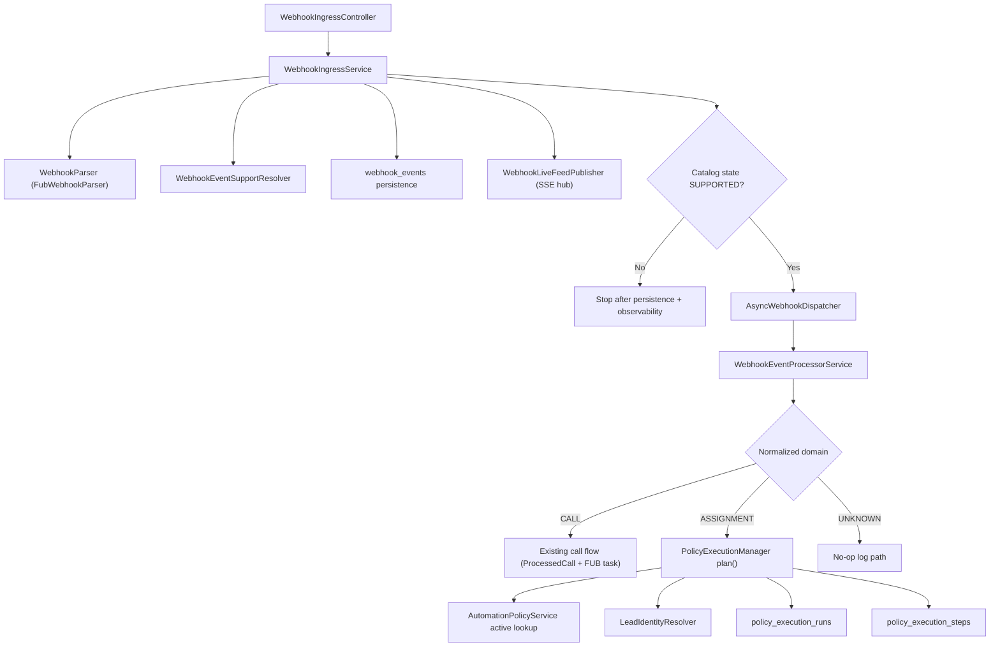

## 6) End-to-End Flow Details

### 6.1 Webhook Ingress Flow (Controller -> Service -> Persist -> Dispatch Gate)

Entry:
- `POST /webhooks/{source}` in [`WebhookIngressController.receiveWebhook`](/Users/sarathkumar/Projects/2Creative/automation-engine/src/main/java/com/fuba/automation_engine/controller/WebhookIngressController.java:34)

Processing sequence in [`WebhookIngressService.ingest`](/Users/sarathkumar/Projects/2Creative/automation-engine/src/main/java/com/fuba/automation_engine/service/webhook/WebhookIngressService.java:59):
1. Parse source path into enum (`WebhookSource.fromPathValue`).
2. Validate source enablement (`webhook.sources.fub.enabled`).
3. Validate payload size (`webhook.maxBodyBytes`).
4. Resolve and execute signature verifier.
5. Resolve and execute parser.
6. Extract event type with precedence:
   - `NormalizedWebhookEvent.sourceEventType`
   - fallback: `payload.eventType`
   - else `"UNKNOWN"`.
7. Resolve catalog support + normalized domain/action using resolver.
8. Duplicate checks:
   - by `(source,eventId)` if eventId present
   - else by `(source,payloadHash)` if eventId absent.
9. Persist `webhook_events` row with:
   - source/eventType/status/payload/payloadHash/receivedAt
   - `catalog_state`, `normalized_domain`, `normalized_action`, `source_lead_id`.
10. Publish SSE live event (`webhook.received`).
11. Dispatch asynchronously only if `catalog_state == SUPPORTED`.
12. Return accepted message.

Ingress failure mapping:
- unsupported source / disabled source / invalid parser/verifier setup -> `400`
- signature verification failure -> `401`
- payload malformed/too large -> `400`

Vertical flow:
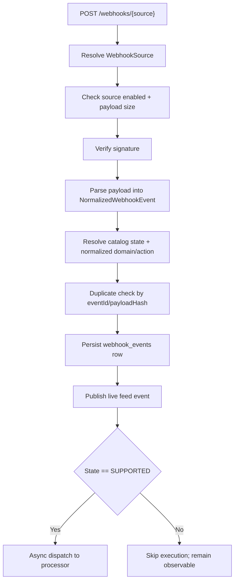

### 6.2 Catalog Resolution and Dispatch Gating

Resolver implementation:
- [`StaticWebhookEventSupportResolver.resolve`](/Users/sarathkumar/Projects/2Creative/automation-engine/src/main/java/com/fuba/automation_engine/service/webhook/support/StaticWebhookEventSupportResolver.java:40)

Current mapping:
- `FUB:callsCreated` -> `SUPPORTED`, `CALL`, `CREATED`
- `FUB:peopleCreated` -> `SUPPORTED`, `ASSIGNMENT`, `CREATED`
- `FUB:peopleUpdated` -> `SUPPORTED`, `ASSIGNMENT`, `UPDATED`
- default -> `IGNORED`, `UNKNOWN`, `UNKNOWN`

Why this exists:
- Makes event onboarding explicit and safe.
- Centralizes source-event semantics.
- Allows observation/persistence even for non-executing events.

### 6.3 Async Dispatch and Domain Router

Dispatch adapter:
- [`AsyncWebhookDispatcher.dispatch`](/Users/sarathkumar/Projects/2Creative/automation-engine/src/main/java/com/fuba/automation_engine/service/webhook/dispatch/AsyncWebhookDispatcher.java:23)

Domain router:
- [`WebhookEventProcessorService.process`](/Users/sarathkumar/Projects/2Creative/automation-engine/src/main/java/com/fuba/automation_engine/service/webhook/WebhookEventProcessorService.java:89)
- switch on `NormalizedDomain`:
  - `CALL` -> `processCallDomainEvent`
  - `ASSIGNMENT` -> `processAssignmentDomainEvent`
  - `UNKNOWN` -> `processUnknownDomainEvent`

Vertical flow:
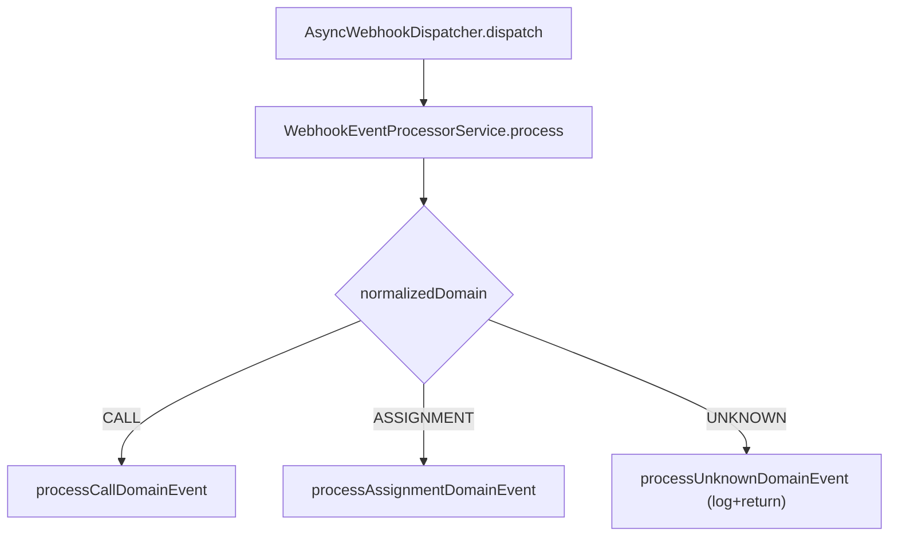

### 6.4 CALL Domain Flow (Existing path, still active)

Primary function:
- Process call events and create callback tasks in Follow Up Boss based on rules.

Implementation anchor:
- [`WebhookEventProcessorService.processCall`](/Users/sarathkumar/Projects/2Creative/automation-engine/src/main/java/com/fuba/automation_engine/service/webhook/WebhookEventProcessorService.java:159)

Current behavior:
1. Load/create `processed_calls` row by callId.
2. Skip if terminal status (`FAILED`, `SKIPPED`, `TASK_CREATED`).
3. Move to `PROCESSING`.
4. Ensure event type is `callsCreated`; else mark failed.
5. Fetch call details from FUB with retry/backoff+jitter.
6. Pre-validate call; may terminate as skip/fail.
7. Decide with rule engine.
8. If decision create-task:
   - apply local dev guard when running local profile.
   - call FUB `createTask` with retry.
9. Persist terminal result:
   - `TASK_CREATED` or `SKIPPED` or `FAILED`.

Known TODO retained in this flow:
- Non-atomic claim for concurrent duplicate deliveries (`step3-concurrency` TODO comment in file).

Vertical flow:
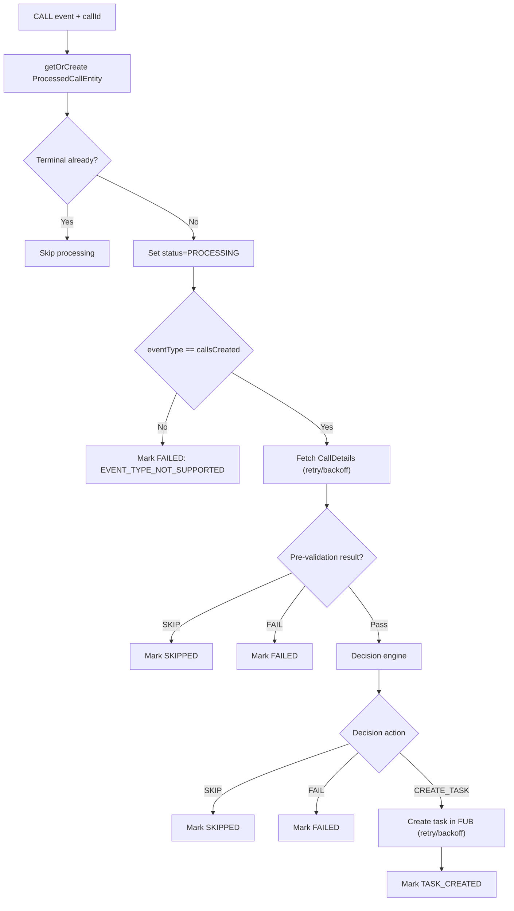

### 6.5 ASSIGNMENT Domain Flow (Phase 3 planning path)

Trigger point:
- [`WebhookEventProcessorService.processAssignmentDomainEvent`](/Users/sarathkumar/Projects/2Creative/automation-engine/src/main/java/com/fuba/automation_engine/service/webhook/WebhookEventProcessorService.java:125)

Hardcoded planning scope:
- `policyDomain = ASSIGNMENT`
- `policyKey = FOLLOW_UP_SLA`

Planner entry:
- [`PolicyExecutionManager.plan`](/Users/sarathkumar/Projects/2Creative/automation-engine/src/main/java/com/fuba/automation_engine/service/policy/PolicyExecutionManager.java:61)

Planner decision tree:
1. Build idempotency key from:
   - policy scope
   - source/domain/action
   - sourceLeadId
   - eventId or payloadHash fallback marker.
2. If run already exists by idempotency key:
   - return `DUPLICATE_IGNORED` with existing runId.
3. Lookup active policy via `AutomationPolicyService`.
4. If policy missing/invalid/input-invalid:
   - persist `BLOCKED_POLICY` run with reason code.
5. Resolve identity via `LeadIdentityResolver`.
6. If unresolved:
   - persist `BLOCKED_IDENTITY` run.
7. If policy+identity valid:
   - persist `PENDING` run with policy snapshot.
   - materialize steps from contract:
     - step1 claim check -> `PENDING`, `dueAt = now + blueprint delay`.
     - step2 communication -> `WAITING_DEPENDENCY`.
     - step3 failure action -> `WAITING_DEPENDENCY`.
8. Return planning result with status/runId/reasonCode.

Duplicate race handling:
- On DB unique conflict for idempotency key:
  - clear EntityManager
  - re-read by key
  - return deterministic duplicate result.

Vertical flow:
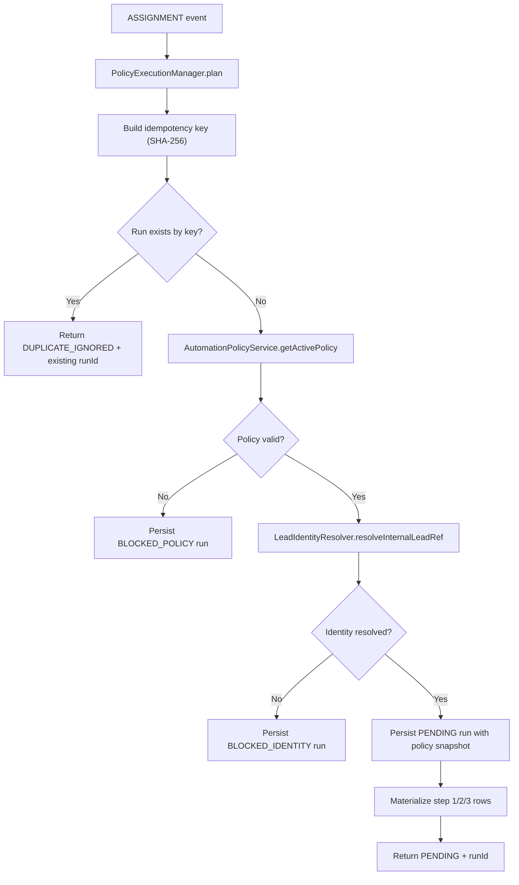

### 6.6 Policy Control Plane Flow (Admin CRUD + Activation Invariant)

Controller:
- [`AdminPolicyController`](/Users/sarathkumar/Projects/2Creative/automation-engine/src/main/java/com/fuba/automation_engine/controller/AdminPolicyController.java)

Service core:
- [`AutomationPolicyService`](/Users/sarathkumar/Projects/2Creative/automation-engine/src/main/java/com/fuba/automation_engine/service/policy/AutomationPolicyService.java)

Endpoints:
- `GET /admin/policies/{domain}/{policyKey}/active`
- `GET /admin/policies?domain=&policyKey=`
- `POST /admin/policies`
- `PUT /admin/policies/{id}`
- `POST /admin/policies/{id}/activate`

Important implemented rules:
- Domain/policyKey normalization: trim + uppercase.
- Scope max lengths enforced.
- Blueprint required and validated.
- Optimistic concurrency on update/activate via `expectedVersion`.
- Single active policy per `(domain, policyKey)` enforced with unique partial index and scoped deactivation.

Activation vertical flow:
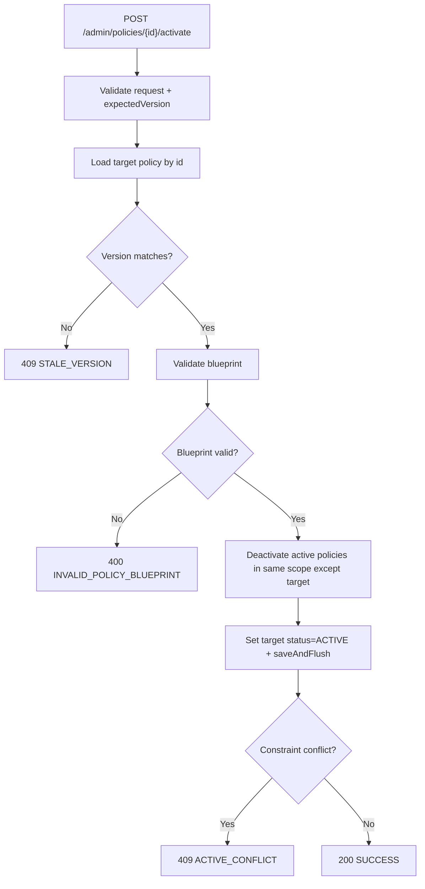

### 6.7 Policy Execution Admin Read Flow

Controller:
- [`AdminPolicyExecutionController`](/Users/sarathkumar/Projects/2Creative/automation-engine/src/main/java/com/fuba/automation_engine/controller/AdminPolicyExecutionController.java)

Service:
- [`AdminPolicyExecutionService`](/Users/sarathkumar/Projects/2Creative/automation-engine/src/main/java/com/fuba/automation_engine/service/policy/AdminPolicyExecutionService.java)

Endpoints:
- `GET /admin/policy-executions`
- `GET /admin/policy-executions/{id}`

List behavior:
- Filters: `status`, `policyKey`, `from`, `to`, cursor.
- Cursor encoding/decoding by [`PolicyExecutionCursorCodec`](/Users/sarathkumar/Projects/2Creative/automation-engine/src/main/java/com/fuba/automation_engine/service/policy/PolicyExecutionCursorCodec.java).
- Order: `createdAt DESC, id DESC`.
- Returns `nextCursor` when page has more rows.

Detail behavior:
- Run loaded by id.
- Steps loaded ordered by `stepOrder ASC`.
- Full run snapshot + step state returned.

Vertical flow:
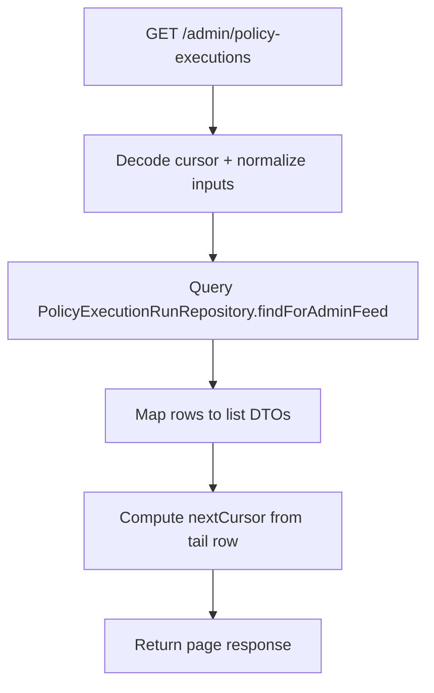

### 6.8 Webhook Admin Feed/Detail/Stream Flow

Controller:
- [`AdminWebhookController`](/Users/sarathkumar/Projects/2Creative/automation-engine/src/main/java/com/fuba/automation_engine/controller/AdminWebhookController.java)

Service + repository:
- [`AdminWebhookService`](/Users/sarathkumar/Projects/2Creative/automation-engine/src/main/java/com/fuba/automation_engine/service/webhook/AdminWebhookService.java)
- [`JdbcWebhookFeedReadRepository`](/Users/sarathkumar/Projects/2Creative/automation-engine/src/main/java/com/fuba/automation_engine/persistence/repository/JdbcWebhookFeedReadRepository.java)

Feature additions surfaced here:
- `catalogState`
- `normalizedDomain`
- `normalizedAction`

SSE streaming:
- `GET /admin/webhooks/stream`
- hub: [`WebhookSseHub`](/Users/sarathkumar/Projects/2Creative/automation-engine/src/main/java/com/fuba/automation_engine/service/webhook/live/WebhookSseHub.java)
- event names:
  - `webhook.received`
  - `heartbeat`

Vertical flow:
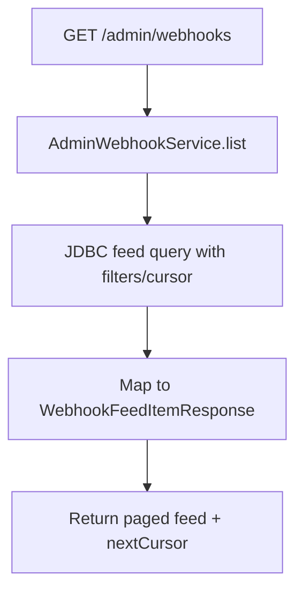

### 6.9 Processed Call Replay Flow (Operational Path)

Service:
- [`ProcessedCallAdminService.replay`](/Users/sarathkumar/Projects/2Creative/automation-engine/src/main/java/com/fuba/automation_engine/service/webhook/ProcessedCallAdminService.java:52)

Behavior:
1. Lookup `processed_calls` by callId.
2. Only `FAILED` status is replayable.
3. Reset state to `RECEIVED` and clear failure/task/rule.
4. Dispatch synthetic normalized event (`callsCreated`) through dispatcher.

Why this matters for current feature:
- Preserves call-domain operational continuity while assignment planning was introduced.

Vertical flow:
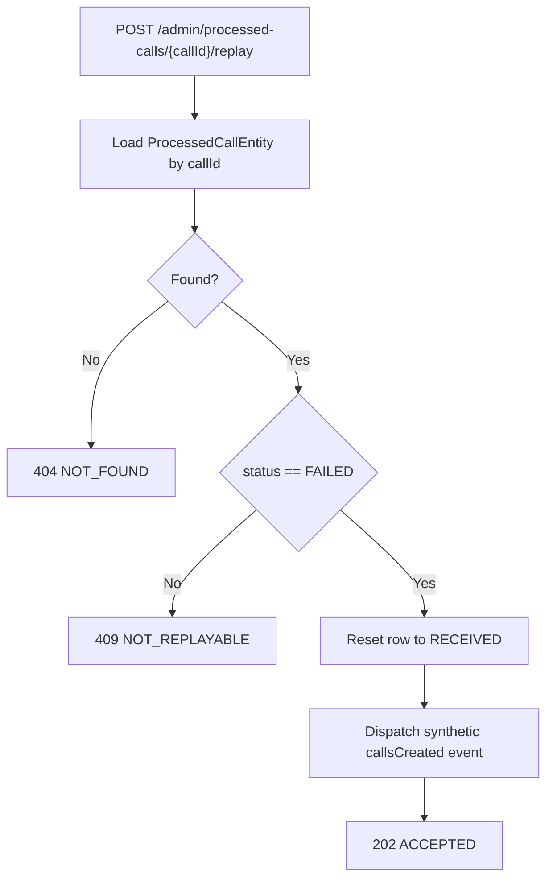

### 6.10 Policy Blueprint Validation Flow

Validator:
- [`PolicyBlueprintValidator.validate`](/Users/sarathkumar/Projects/2Creative/automation-engine/src/main/java/com/fuba/automation_engine/service/policy/PolicyBlueprintValidator.java:39)

Current strict v1 checks:
- blueprint must exist and not be empty
- `templateKey == ASSIGNMENT_FOLLOWUP_SLA_V1`
- exactly 3 ordered steps:
  - `WAIT_AND_CHECK_CLAIM`
  - `WAIT_AND_CHECK_COMMUNICATION`
  - `ON_FAILURE_EXECUTE_ACTION`
- required delays for wait steps must be positive
- dependency chain must be valid:
  - communication depends on claim
  - action depends on communication
- `actionConfig.actionType` must be `REASSIGN` or `MOVE_TO_POND`

Validation flow:
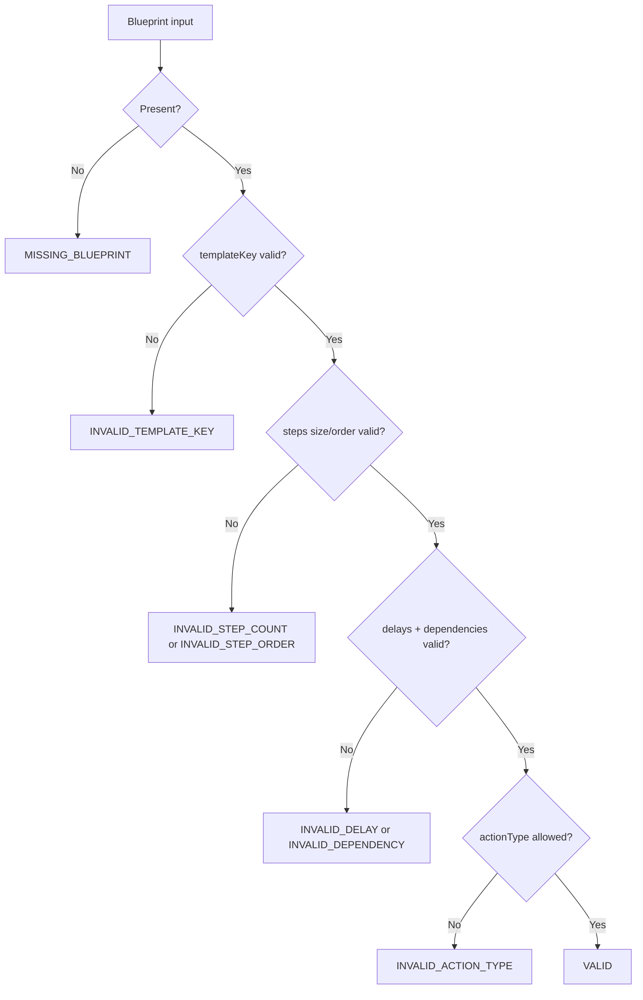

## 7) Data Model and Migration Evolution

### 7.1 `V4__add_catalog_resolution_fields_to_webhook_events.sql`

Adds to `webhook_events`:
- `catalog_state` default `IGNORED`
- `normalized_domain` default `UNKNOWN`
- `normalized_action` default `UNKNOWN`
- `source_lead_id` nullable

### 7.2 `V5__create_automation_policies.sql`

Creates:
- `automation_policies` with optimistic version + scope activation invariant.
- partial unique index `uk_automation_policies_active_per_scope`.
- initial seed row (later removed by V6).

### 7.3 `V6__add_policy_blueprint_and_remove_seed.sql`

Changes:
- add `blueprint JSONB` to `automation_policies`.
- remove initial seeded active policy.

### 7.4 `V7__create_policy_execution_runtime_and_drop_due_after_minutes.sql`

Creates runtime planning tables:
- `policy_execution_runs`
- `policy_execution_steps`

Also:
- remove `automation_policies.due_after_minutes`.
- timing now comes from blueprint step `delayMinutes`.

DB relationship flow:
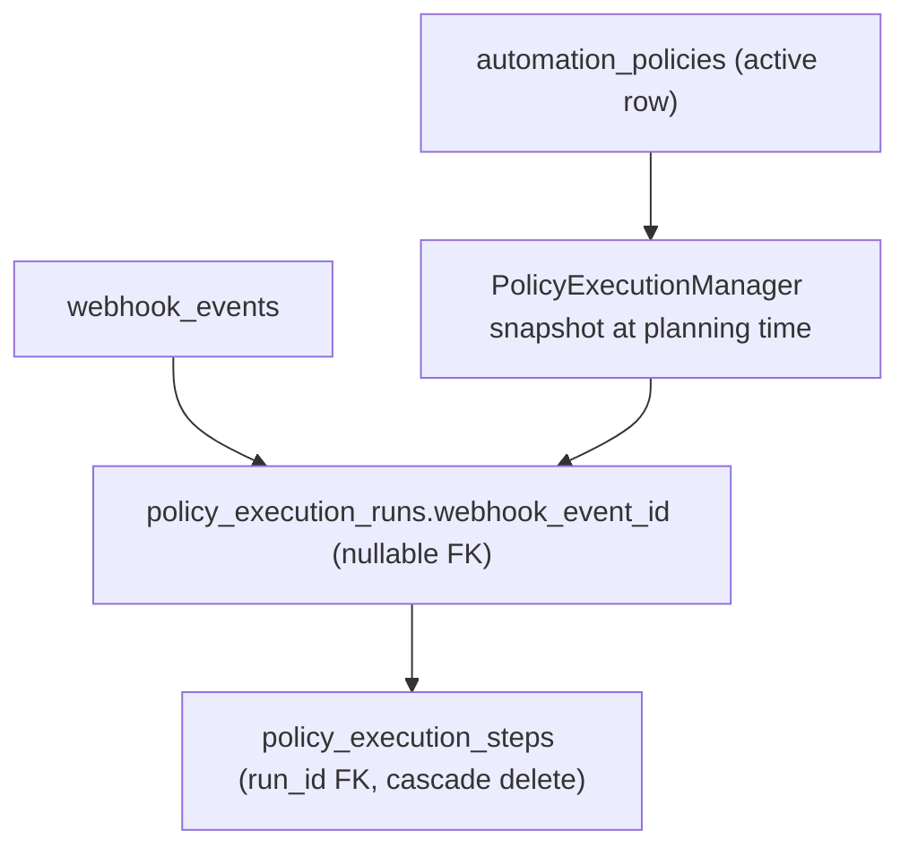

## 8) File-by-File Responsibility Map (Feature-Relevant)

### 8.1 Controllers and DTOs

| File | Why it exists |
|---|---|
| [`AdminPolicyController.java`](/Users/sarathkumar/Projects/2Creative/automation-engine/src/main/java/com/fuba/automation_engine/controller/AdminPolicyController.java) | HTTP boundary for policy CRUD/activation with deterministic status mapping. |
| [`AdminPolicyExecutionController.java`](/Users/sarathkumar/Projects/2Creative/automation-engine/src/main/java/com/fuba/automation_engine/controller/AdminPolicyExecutionController.java) | HTTP read boundary for runtime planning runs/steps. |
| [`AdminWebhookController.java`](/Users/sarathkumar/Projects/2Creative/automation-engine/src/main/java/com/fuba/automation_engine/controller/AdminWebhookController.java) | Admin feed/detail/stream for webhook observability. |
| [`CreatePolicyRequest.java`](/Users/sarathkumar/Projects/2Creative/automation-engine/src/main/java/com/fuba/automation_engine/controller/dto/CreatePolicyRequest.java) | Create payload contract. |
| [`UpdatePolicyRequest.java`](/Users/sarathkumar/Projects/2Creative/automation-engine/src/main/java/com/fuba/automation_engine/controller/dto/UpdatePolicyRequest.java) | Update payload contract with `expectedVersion`. |
| [`ActivatePolicyRequest.java`](/Users/sarathkumar/Projects/2Creative/automation-engine/src/main/java/com/fuba/automation_engine/controller/dto/ActivatePolicyRequest.java) | Activate payload contract with `expectedVersion`. |
| [`PolicyResponse.java`](/Users/sarathkumar/Projects/2Creative/automation-engine/src/main/java/com/fuba/automation_engine/controller/dto/PolicyResponse.java) | Policy view sent to clients. |
| [`PolicyExecutionRunPageResponse.java`](/Users/sarathkumar/Projects/2Creative/automation-engine/src/main/java/com/fuba/automation_engine/controller/dto/PolicyExecutionRunPageResponse.java) | Paged run list envelope with cursor and server time. |
| [`PolicyExecutionRunListItemResponse.java`](/Users/sarathkumar/Projects/2Creative/automation-engine/src/main/java/com/fuba/automation_engine/controller/dto/PolicyExecutionRunListItemResponse.java) | Lightweight run projection for list page. |
| [`PolicyExecutionRunDetailResponse.java`](/Users/sarathkumar/Projects/2Creative/automation-engine/src/main/java/com/fuba/automation_engine/controller/dto/PolicyExecutionRunDetailResponse.java) | Full run detail with snapshot + steps. |
| [`PolicyExecutionStepResponse.java`](/Users/sarathkumar/Projects/2Creative/automation-engine/src/main/java/com/fuba/automation_engine/controller/dto/PolicyExecutionStepResponse.java) | Step-level state contract in detail view. |
| [`WebhookFeedItemResponse.java`](/Users/sarathkumar/Projects/2Creative/automation-engine/src/main/java/com/fuba/automation_engine/controller/dto/WebhookFeedItemResponse.java) | Feed item contract exposing catalog/domain/action fields. |
| [`WebhookEventDetailResponse.java`](/Users/sarathkumar/Projects/2Creative/automation-engine/src/main/java/com/fuba/automation_engine/controller/dto/WebhookEventDetailResponse.java) | Detailed webhook event contract including catalog/domain/action. |

### 8.2 Policy Domain Services

| File | Why it exists |
|---|---|
| [`AutomationPolicyService.java`](/Users/sarathkumar/Projects/2Creative/automation-engine/src/main/java/com/fuba/automation_engine/service/policy/AutomationPolicyService.java) | Policy control-plane service with validation, concurrency, and activation invariants. |
| [`PolicyBlueprintValidator.java`](/Users/sarathkumar/Projects/2Creative/automation-engine/src/main/java/com/fuba/automation_engine/service/policy/PolicyBlueprintValidator.java) | Enforces v1 blueprint shape/step order/dependencies/action constraints. |
| [`PolicyExecutionManager.java`](/Users/sarathkumar/Projects/2Creative/automation-engine/src/main/java/com/fuba/automation_engine/service/policy/PolicyExecutionManager.java) | Phase-3 planner that turns assignment events into run/step persistence. |
| [`PolicyExecutionMaterializationContract.java`](/Users/sarathkumar/Projects/2Creative/automation-engine/src/main/java/com/fuba/automation_engine/service/policy/PolicyExecutionMaterializationContract.java) | Canonical initial step templates and ordering. |
| [`PolicyStepTransitionContract.java`](/Users/sarathkumar/Projects/2Creative/automation-engine/src/main/java/com/fuba/automation_engine/service/policy/PolicyStepTransitionContract.java) | Defines deterministic step-result -> next-step/terminal mappings (worker contract for Phase 4). |
| [`AdminPolicyExecutionService.java`](/Users/sarathkumar/Projects/2Creative/automation-engine/src/main/java/com/fuba/automation_engine/service/policy/AdminPolicyExecutionService.java) | Read-side orchestration for run/step admin APIs. |
| [`PolicyExecutionCursorCodec.java`](/Users/sarathkumar/Projects/2Creative/automation-engine/src/main/java/com/fuba/automation_engine/service/policy/PolicyExecutionCursorCodec.java) | Stable cursor encoding/decoding for policy execution list pagination. |
| [`LeadIdentityResolver.java`](/Users/sarathkumar/Projects/2Creative/automation-engine/src/main/java/com/fuba/automation_engine/service/policy/LeadIdentityResolver.java) | Port boundary for source->internal lead identity mapping. |
| [`DefaultLeadIdentityResolver.java`](/Users/sarathkumar/Projects/2Creative/automation-engine/src/main/java/com/fuba/automation_engine/service/policy/DefaultLeadIdentityResolver.java) | Placeholder adapter returning unresolved identity (intentional for current phase). |
| [`PolicyExecutionPlanRequest.java`](/Users/sarathkumar/Projects/2Creative/automation-engine/src/main/java/com/fuba/automation_engine/service/policy/PolicyExecutionPlanRequest.java) | Planner input contract. |
| [`PolicyExecutionPlanningResult.java`](/Users/sarathkumar/Projects/2Creative/automation-engine/src/main/java/com/fuba/automation_engine/service/policy/PolicyExecutionPlanningResult.java) | Planner output contract. |
| [`PolicyStepType.java`](/Users/sarathkumar/Projects/2Creative/automation-engine/src/main/java/com/fuba/automation_engine/service/policy/PolicyStepType.java) | Canonical step taxonomy. |
| [`PolicyStepResultCode.java`](/Users/sarathkumar/Projects/2Creative/automation-engine/src/main/java/com/fuba/automation_engine/service/policy/PolicyStepResultCode.java) | Canonical step execution outcomes. |
| [`PolicyTerminalOutcome.java`](/Users/sarathkumar/Projects/2Creative/automation-engine/src/main/java/com/fuba/automation_engine/service/policy/PolicyTerminalOutcome.java) | Canonical terminal run outcome categories. |

### 8.3 Webhook + Routing Services

| File | Why it exists |
|---|---|
| [`WebhookIngressService.java`](/Users/sarathkumar/Projects/2Creative/automation-engine/src/main/java/com/fuba/automation_engine/service/webhook/WebhookIngressService.java) | Ingress orchestration with parse -> catalog -> persist -> live-feed -> dispatch gate order. |
| [`WebhookEventProcessorService.java`](/Users/sarathkumar/Projects/2Creative/automation-engine/src/main/java/com/fuba/automation_engine/service/webhook/WebhookEventProcessorService.java) | Domain router and domain-specific execution/planning paths. |
| [`FubWebhookParser.java`](/Users/sarathkumar/Projects/2Creative/automation-engine/src/main/java/com/fuba/automation_engine/service/webhook/parse/FubWebhookParser.java) | Source adapter from FUB payload to normalized event model. |
| [`StaticWebhookEventSupportResolver.java`](/Users/sarathkumar/Projects/2Creative/automation-engine/src/main/java/com/fuba/automation_engine/service/webhook/support/StaticWebhookEventSupportResolver.java) | Source event catalog table for support/domain/action mapping. |
| [`EventSupportResolution.java`](/Users/sarathkumar/Projects/2Creative/automation-engine/src/main/java/com/fuba/automation_engine/service/webhook/support/EventSupportResolution.java) | Typed support/domain/action resolution value object. |
| [`AsyncWebhookDispatcher.java`](/Users/sarathkumar/Projects/2Creative/automation-engine/src/main/java/com/fuba/automation_engine/service/webhook/dispatch/AsyncWebhookDispatcher.java) | Async adapter decoupling ingress from processing. |
| [`NoopWebhookDispatcher.java`](/Users/sarathkumar/Projects/2Creative/automation-engine/src/main/java/com/fuba/automation_engine/service/webhook/dispatch/NoopWebhookDispatcher.java) | Non-bean fallback for debugging scenarios. |
| [`AdminWebhookService.java`](/Users/sarathkumar/Projects/2Creative/automation-engine/src/main/java/com/fuba/automation_engine/service/webhook/AdminWebhookService.java) | Feed/detail read service with cursor pagination and payload normalization. |
| [`ProcessedCallAdminService.java`](/Users/sarathkumar/Projects/2Creative/automation-engine/src/main/java/com/fuba/automation_engine/service/webhook/ProcessedCallAdminService.java) | Ops list + replay for call flow continuity. |

### 8.4 Persistence Layer

| File | Why it exists |
|---|---|
| [`WebhookEventEntity.java`](/Users/sarathkumar/Projects/2Creative/automation-engine/src/main/java/com/fuba/automation_engine/persistence/entity/WebhookEventEntity.java) | Durable inbox row with catalog/domain/action fields. |
| [`AutomationPolicyEntity.java`](/Users/sarathkumar/Projects/2Creative/automation-engine/src/main/java/com/fuba/automation_engine/persistence/entity/AutomationPolicyEntity.java) | Policy definition row with blueprint JSON + version + status. |
| [`PolicyExecutionRunEntity.java`](/Users/sarathkumar/Projects/2Creative/automation-engine/src/main/java/com/fuba/automation_engine/persistence/entity/PolicyExecutionRunEntity.java) | Runtime execution context snapshot + status + idempotency key. |
| [`PolicyExecutionStepEntity.java`](/Users/sarathkumar/Projects/2Creative/automation-engine/src/main/java/com/fuba/automation_engine/persistence/entity/PolicyExecutionStepEntity.java) | Materialized step rows with dependency and due metadata. |
| [`AutomationPolicyRepository.java`](/Users/sarathkumar/Projects/2Creative/automation-engine/src/main/java/com/fuba/automation_engine/persistence/repository/AutomationPolicyRepository.java) | Active lookup + scope deactivation helper for activation flow. |
| [`PolicyExecutionRunRepository.java`](/Users/sarathkumar/Projects/2Creative/automation-engine/src/main/java/com/fuba/automation_engine/persistence/repository/PolicyExecutionRunRepository.java) | Idempotency lookup + admin feed query. |
| [`PolicyExecutionStepRepository.java`](/Users/sarathkumar/Projects/2Creative/automation-engine/src/main/java/com/fuba/automation_engine/persistence/repository/PolicyExecutionStepRepository.java) | Step reads and due-step query shape for worker phase. |
| [`JdbcWebhookFeedReadRepository.java`](/Users/sarathkumar/Projects/2Creative/automation-engine/src/main/java/com/fuba/automation_engine/persistence/repository/JdbcWebhookFeedReadRepository.java) | Efficient webhook admin feed query with dynamic filters and cursor predicates. |

### 8.5 Migrations and Configuration

| File | Why it exists |
|---|---|
| [`V4__add_catalog_resolution_fields_to_webhook_events.sql`](/Users/sarathkumar/Projects/2Creative/automation-engine/src/main/resources/db/migration/V4__add_catalog_resolution_fields_to_webhook_events.sql) | Adds catalog/domain/action/sourceLeadId persistence columns to webhook inbox table. |
| [`V5__create_automation_policies.sql`](/Users/sarathkumar/Projects/2Creative/automation-engine/src/main/resources/db/migration/V5__create_automation_policies.sql) | Introduces policy definition storage + active-per-scope invariant. |
| [`V6__add_policy_blueprint_and_remove_seed.sql`](/Users/sarathkumar/Projects/2Creative/automation-engine/src/main/resources/db/migration/V6__add_policy_blueprint_and_remove_seed.sql) | Adds blueprint JSON column and shifts policy bootstrapping to admin-managed flow. |
| [`V7__create_policy_execution_runtime_and_drop_due_after_minutes.sql`](/Users/sarathkumar/Projects/2Creative/automation-engine/src/main/resources/db/migration/V7__create_policy_execution_runtime_and_drop_due_after_minutes.sql) | Creates run/step runtime tables and moves delays from policy scalar field to blueprint steps. |
| [`WebhookAsyncConfig.java`](/Users/sarathkumar/Projects/2Creative/automation-engine/src/main/java/com/fuba/automation_engine/config/WebhookAsyncConfig.java) | Defines webhook async thread pool used by dispatcher. |
| [`WebhookProperties.java`](/Users/sarathkumar/Projects/2Creative/automation-engine/src/main/java/com/fuba/automation_engine/config/WebhookProperties.java) | Central webhook source/body-size/live-feed heartbeat settings. |

## 9) Method-Level Purpose Map (Core Classes)

### 9.1 Controller Method Inventory

- `AdminPolicyController.getActivePolicy`: active policy read with `400/404/422` mapping.
- `AdminPolicyController.listPolicies`: scoped policy list with input validation path.
- `AdminPolicyController.createPolicy`: create endpoint bridge to service command.
- `AdminPolicyController.updatePolicy`: versioned policy update endpoint.
- `AdminPolicyController.activatePolicy`: versioned policy activation endpoint.
- `AdminPolicyExecutionController.list`: list runtime runs with filters/cursor.
- `AdminPolicyExecutionController.detail`: detail runtime run by id.
- `AdminWebhookController.list`: webhook feed with cursor and optional payload.
- `AdminWebhookController.detail`: webhook detail by event row id.
- `AdminWebhookController.stream`: live webhook SSE subscription boundary.
- `WebhookIngressController.receiveWebhook`: ingress boundary and header flattening.

### 9.2 `AutomationPolicyService`

- `getActivePolicy`: normalize scope, fetch active policy, validate blueprint, return typed read status.
- `listPolicies`: normalize scope, return scoped policies newest-first.
- `createPolicy`: validate command + blueprint, persist new inactive policy.
- `updatePolicy`: enforce expectedVersion optimistic check, update mutable fields.
- `activatePolicy`: optimistic version check + blueprint revalidation + scoped deactivate + activate target.
- `validateCreate`: create-command normalization + blueprint validation.
- `normalizeToken`: token canonicalization + max-length guard.
- `mapIntegrityViolation` / `isActiveConflict`: classify DB integrity conflicts into domain statuses.

### 9.3 `PolicyExecutionManager`

- `plan`: full assignment planning orchestration.
- `persistBlockedPolicyRun`: persists blocked run for policy lookup failures.
- `persistBlockedIdentityRun`: persists blocked run for unresolved lead identity.
- `duplicateResult`: constructs deterministic duplicate outcome.
- `handlePotentialDuplicate`: race-safe duplicate resolution after unique-key conflict.
- `persistInitialSteps`: creates step rows using materialization contract.
- `resolveInitialDueAt` / `resolveDelayMinutes`: derive due time from blueprint delays.
- `buildIdempotencyKey`: deterministic fingerprint input composition.
- `sha256Hex`: hash primitive for idempotency key build.
- `mapPolicyReadStatus`: maps policy read status into blocked reason code.
- `normalize` / `hasText`: canonicalization helpers used by planner and idempotency input.

### 9.4 `WebhookIngressService`

- `ingest`: ingress orchestration and dispatch gating.
- `extractEventType`: source-event precedence resolution with fallback.
- `publishLiveFeed`: best-effort observability publish, non-fatal on errors.

### 9.5 `WebhookEventProcessorService`

- `process`: route by normalized domain.
- `processCallDomainEvent`: call-event fanout by resource IDs.
- `processAssignmentDomainEvent`: construct plan request and invoke planner.
- `processUnknownDomainEvent`: safe no-op.
- `processCall`: end-to-end call domain execution state machine.
- `executeWithRetry`: retry loop with exponential backoff+jitter for transient FUB failures.
- terminal mutators:
  - `markFailed`
  - `markSkipped`
  - `markTaskCreated`
- call-state helpers:
  - `getOrCreateEntity`
  - `setStatus`
  - `isTerminal`
  - `extractEventType`
  - `extractResourceIds`
- retry helpers:
  - `incrementRetryCount`
  - `calculateDelayWithJitter`
  - `sleepBackoff`

### 9.6 Read/Projection Services

- `AdminPolicyExecutionService.list`: validates query, decodes cursor, fetches page, encodes next cursor.
- `AdminPolicyExecutionService.findDetail`: returns run detail with ordered step list.
- `AdminPolicyExecutionService.validateRange`: range guardrail.
- `AdminWebhookService.list`: webhook feed query orchestration.
- `AdminWebhookService.findDetail`: webhook detail lookup by id.
- `AdminWebhookService.buildPage`: cursor page envelope construction.
- `AdminWebhookService.normalizePayload`: payload JSON safety conversion.
- `ProcessedCallAdminService.list`: filtered list query for processed calls.
- `ProcessedCallAdminService.replay`: replay mutation + synthetic dispatch.
- `ProcessedCallAdminService.buildReplayPayload`: deterministic minimal replay payload shape.

### 9.7 Adapter/Contract Services

- `FubWebhookParser.parse`: transforms FUB transport payload to normalized event contract.
- `StaticWebhookEventSupportResolver.resolve`: catalog lookup by `(source,eventType)`.
- `PolicyExecutionCursorCodec.encode/decode`: policy execution feed cursor transport.
- `WebhookFeedCursorCodec.encode/decode` (existing component): webhook feed cursor transport.
- `AsyncWebhookDispatcher.dispatch`: async invocation bridge to processor.

## 10) Enumerations and Contract Semantics

### 10.1 Support and Routing

- `EventSupportState`: `SUPPORTED`, `STAGED`, `IGNORED`
- `NormalizedDomain`: `CALL`, `ASSIGNMENT`, `UNKNOWN`
- `NormalizedAction`: `CREATED`, `UPDATED`, `ASSIGNED`, `UNKNOWN`

### 10.2 Policy Control and Runtime

- `PolicyStatus`: `ACTIVE`, `INACTIVE`
- `PolicyExecutionRunStatus`: `PENDING`, `BLOCKED_IDENTITY`, `BLOCKED_POLICY`, `DUPLICATE_IGNORED`, `COMPLETED`, `FAILED`
- `PolicyExecutionStepStatus`: `PENDING`, `WAITING_DEPENDENCY`, `PROCESSING`, `COMPLETED`, `FAILED`, `SKIPPED`
- `PolicyStepType`: claim check, communication check, failure action
- `PolicyStepResultCode`: per-step outputs
- `PolicyTerminalOutcome`: aggregate close reason categories

## 11) API Surface Added/Changed by This Feature

Added:
- `/admin/policies/*` (policy control plane)
- `/admin/policy-executions*` (run/step observability)

Expanded existing admin webhook contracts:
- feed/detail include `catalogState`, `normalizedDomain`, `normalizedAction`.

No Phase-4 execution API yet:
- runtime execution is not implemented; only planning/read APIs exist.

## 12) Test Coverage Map (Feature-Critical)

Policy control plane:
- `AutomationPolicyServiceTest`
- `AutomationPolicyRepositoryTest`
- `AdminPolicyControllerTest`
- `AdminPolicyActivationConcurrencyFlowTest`
- `AutomationPolicyMigrationPostgresRegressionTest`

Blueprint/runtime contracts:
- `PolicyBlueprintValidatorTest`
- `PolicyStepTransitionContractTest`
- `PolicyExecutionMaterializationContractTest`
- `PolicyExecutionRuntimeRepositoryTest`
- `AutomationPolicyRuntimeSchemaMigrationTest`

Assignment planning orchestration:
- `PolicyExecutionManagerIntegrationTest`
- `AdminPolicyExecutionServiceTest`
- `AdminPolicyExecutionControllerTest`

Webhook normalization/catalog/routing:
- `FubWebhookParserNormalizedContractTest`
- `WebhookEventSupportResolverTest`
- `WebhookIngressServiceTest`
- `WebhookIngressEventTypePrecedenceTest`
- `WebhookEventProcessorServiceTest`
- `WebhookProcessingFlowTest`

Admin webhook feed projection:
- `AdminWebhookServiceTest`
- `AdminWebhookControllerTest`
- `JdbcWebhookFeedReadRepositoryTest`

## 13) Known Gaps and Deferred Work (Captured in Code/Phase Docs)

1. Phase 4 worker is not implemented:
- no executor consuming due `policy_execution_steps`.

2. Identity mapping adapter unresolved:
- default resolver intentionally returns empty -> assignment planning typically yields `BLOCKED_IDENTITY`.

3. Parser ownership TODOs:
- source lead id extraction rule still pending in parser.
- parser domain/action mapping marked compatibility-only; resolver is intended runtime owner.

4. Call-flow concurrency TODO:
- non-atomic terminal-state check/set around processed call processing can allow duplicate execution races.

5. SSE payload null-safety TODO:
- `WebhookSseHub.publish` uses `Map.of`, which is null-intolerant for nullable fields like `eventId`.

## 14) Verification Checklist Used for This Document

This document was verified against:
- feature docs (`research`, `plan`, `phases`, phase logs)
- repo decisions (`RD-001/002/003`)
- branch diff (`main...dev` names/stat/log)
- controllers, services, repositories, entities, migrations, DTOs
- feature-specific tests added in this branch

Path coverage check completed for:
- ingress path
- catalog gating path
- call domain path
- assignment planning path
- policy CRUD path
- policy execution read path
- admin webhook read/stream path
- processed-call replay path

## 15) Quick “Why Does This Method/File Exist?” Guide

If asked:
- “Why do we persist `policy_blueprint_snapshot` on runs?”
  - To decouple runtime execution from later policy edits and keep replay/audit deterministic.
- “Why is assignment flow creating runs but not doing actions?”
  - Because Phase 3 scope is planning/persistence only; Phase 4 owns execution.
- “Why do we have both parser mapping and resolver mapping?”
  - Resolver is runtime source of truth for support/domain/action; parser mapping remains compatibility metadata pending deprecation.
- “Why do duplicates return runId?”
  - To make idempotent retries deterministic and observable for operators.
- “Why do blocked runs exist?”
  - To preserve event observability when execution preconditions fail (policy missing/invalid or identity unresolved), instead of dropping events.

## 16) Endpoint-to-Code Trace Matrix

| Endpoint | Controller Method | Service Method Chain | Persistence/Adapter Touchpoints |
|---|---|---|---|
| `POST /webhooks/{source}` | `WebhookIngressController.receiveWebhook` | `WebhookIngressService.ingest` -> `WebhookParser.parse` -> `WebhookEventSupportResolver.resolve` -> `WebhookDispatcher.dispatch` (if supported) | `WebhookEventRepository` save/duplicate checks, `WebhookLiveFeedPublisher.publish`, async processor |
| `GET /admin/webhooks` | `AdminWebhookController.list` | `AdminWebhookService.list` -> `WebhookFeedReadRepository.fetch` | JDBC read over `webhook_events` |
| `GET /admin/webhooks/{id}` | `AdminWebhookController.detail` | `AdminWebhookService.findDetail` | `WebhookEventRepository.findById` |
| `GET /admin/webhooks/stream` | `AdminWebhookController.stream` | `WebhookSseHub.subscribe` | in-memory subscriber registry |
| `GET /admin/policies/{domain}/{policyKey}/active` | `AdminPolicyController.getActivePolicy` | `AutomationPolicyService.getActivePolicy` | `AutomationPolicyRepository.findFirst...status=ACTIVE` |
| `GET /admin/policies` | `AdminPolicyController.listPolicies` | `AutomationPolicyService.listPolicies` | `AutomationPolicyRepository.findByDomainAndPolicyKey...` |
| `POST /admin/policies` | `AdminPolicyController.createPolicy` | `AutomationPolicyService.createPolicy` | `AutomationPolicyRepository.saveAndFlush` |
| `PUT /admin/policies/{id}` | `AdminPolicyController.updatePolicy` | `AutomationPolicyService.updatePolicy` | `AutomationPolicyRepository.findById/saveAndFlush` |
| `POST /admin/policies/{id}/activate` | `AdminPolicyController.activatePolicy` | `AutomationPolicyService.activatePolicy` | scoped deactivate query + target saveAndFlush |
| `GET /admin/policy-executions` | `AdminPolicyExecutionController.list` | `AdminPolicyExecutionService.list` | `PolicyExecutionRunRepository.findForAdminFeed` |
| `GET /admin/policy-executions/{id}` | `AdminPolicyExecutionController.detail` | `AdminPolicyExecutionService.findDetail` | run + step repositories |
| `POST /admin/processed-calls/{callId}/replay` | `ProcessedCallAdminController.replay` | `ProcessedCallAdminService.replay` -> `WebhookDispatcher.dispatch` | `ProcessedCallRepository.findByCallId/save` |

## 17) Exception and Error Mapping Notes

Feature-relevant exception types:
- [`InvalidPolicyExecutionQueryException`](/Users/sarathkumar/Projects/2Creative/automation-engine/src/main/java/com/fuba/automation_engine/exception/policy/InvalidPolicyExecutionQueryException.java)
  - raised for invalid policy execution cursor/range inputs
  - mapped to `400` in `AdminPolicyExecutionController`.
- [`InvalidWebhookFeedQueryException`](/Users/sarathkumar/Projects/2Creative/automation-engine/src/main/java/com/fuba/automation_engine/exception/webhook/InvalidWebhookFeedQueryException.java)
  - raised for invalid webhook feed query ranges/cursor
  - mapped to `400` in `AdminWebhookController`.
- [`MalformedWebhookPayloadException`](/Users/sarathkumar/Projects/2Creative/automation-engine/src/main/java/com/fuba/automation_engine/exception/webhook/MalformedWebhookPayloadException.java)
  - parser/body validation failure
  - mapped to `400` in ingress controller.
- [`InvalidWebhookSignatureException`](/Users/sarathkumar/Projects/2Creative/automation-engine/src/main/java/com/fuba/automation_engine/exception/webhook/InvalidWebhookSignatureException.java)
  - signature verification failure
  - mapped to `401` in ingress controller.

### 17.1 Policy API Status Mapping

`AdminPolicyController` current HTTP mapping:
- Active read:
  - `SUCCESS` -> `200`
  - `POLICY_INVALID` -> `422`
  - `NOT_FOUND` -> `404`
  - `INVALID_INPUT` -> `400`
- List read:
  - `SUCCESS` -> `200`
  - `INVALID_INPUT` -> `400`
- Mutations:
  - `SUCCESS` -> `201` (`create`) / `200` (`update`, `activate`)
  - `NOT_FOUND` -> `404`
  - `STALE_VERSION` -> `409`
  - `ACTIVE_CONFLICT` -> `409`
  - `INVALID_POLICY_BLUEPRINT` -> `400`
  - `INVALID_INPUT` -> `400`
