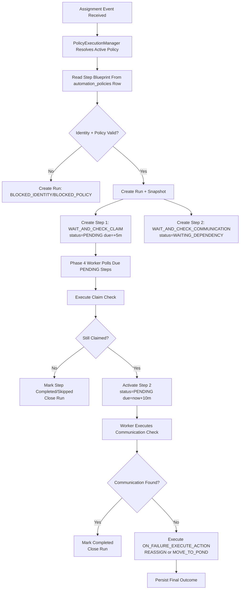
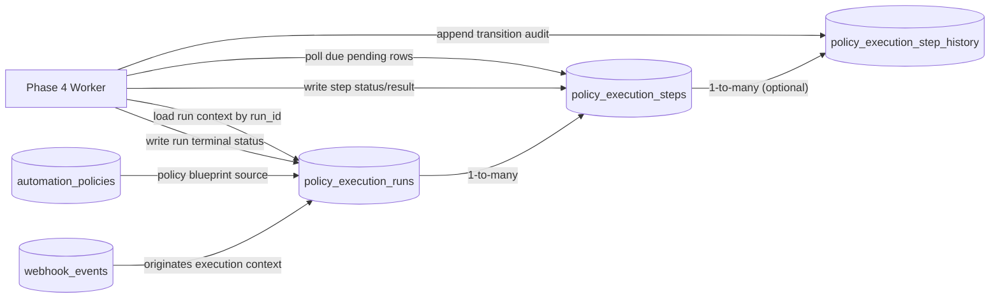

# Lead Management Platform Plan

## Intent
Build a lead-management-ready automation foundation that supports:
- internal lead inflow
- external lead inflow (FUB now, additional CRMs later)

V1 delivery remains assignment-SLA-first while keeping architecture source-agnostic.

## Locked Decisions
- Event onboarding scope: Catalog + Batch 1 (assignment events first)
- Delayed execution model: DB-backed worker
- Policy storage: DB + Admin API

## Prework (must complete before implementation)
- Reframe contracts from provider-centric to lead-domain terms.
- Standardize normalized event fields:
  - `sourceSystem`
  - `sourceLeadId`
  - internal lead identity mapping reference
- Keep provider-specific transport details inside adapter implementations only.

## Validated Platform Upgrade Areas
1. Webhook ingestion platform: reusable, needs event-shape generalization.
2. Event orchestration: needs domain-aware routing beyond call-centric flow.
3. Domain modules: call domain exists; assignment domain is new.
4. Policy platform: needs persistent runtime policy control.
5. Delayed execution platform: async exists; durable due-check worker is new.
6. Adapter layer: base FUB adapter exists; assignment-SLA operations need extension.
7. Admin ops platform: reusable patterns exist; assignment surfaces are new.
8. Reliability governance: enforce atomic claim and stronger idempotent processing in new flow.

## 5-Phase Roadmap
| Phase | Main Platform Areas | Outcome |
|---|---|---|
| Phase 1: Foundation and Contracts | Ingestion, orchestration contracts, reliability boundaries | Domain-ready event model and catalog posture are established. |
| Phase 2: Data and Policy Infrastructure | Policy platform, reliability governance | Persistent runtime policy control plane is introduced. |
| Phase 3: Event Expansion + Assignment Triggering | Ingestion + orchestration + assignment domain | Assignment events create pending checks through routed handlers. |
| Phase 4: Due Worker + Decision + Adapter Actions | Delayed execution, decision layer, adapter extensions | Durable delayed SLA enforcement with reassign/skip outcomes. |
| Phase 5: Ops Surface, Hardening, Rollout | Admin operations, observability/governance | Safe operations flow (monitoring, replay, policy control) is production-ready. |

## Product Example Flow (Assignment SLA)
This feature roadmap includes the following target V1 automation behavior for assignment domain events:

1. Assignment event arrives for a lead.
2. Wait 5 minutes, then check whether the lead is still claimed by an assignee.
3. If still claimed, wait an additional 10 minutes and check whether the assignee made any communication with the lead.
4. If no qualifying communication exists, move the lead to pond or reassign to a different assignee based on policy.

## V1 Policy Model (Typed Linear Steps)
For this feature, the policy is a single ordered workflow definition, not a generic workflow graph.

Policy example: `assignment_followup_sla_v1`

Step types inside one policy:
1. `WAIT_AND_CHECK_CLAIM`
   - wait configured delay (default 5 minutes), then evaluate if lead is still claimed
2. `WAIT_AND_CHECK_COMMUNICATION`
   - runs only when claim check passes, waits configured delay (default 10 minutes), then evaluates if qualifying communication exists
3. `ON_FAILURE_EXECUTE_ACTION`
   - runs only when communication check fails, executes configured action (`REASSIGN` or `MOVE_TO_POND`)

This keeps V1 deterministic and testable while allowing future expansion to richer workflow models.

## Execution Component Model (Phase 3 -> 4)
To support reliable delayed execution, policy definition and policy execution are separated.

1. Policy definition/configuration component:
   - existing `AutomationPolicyService`
   - responsible for create/update/activate/deactivate policy definitions in `automation_policies`
   - `automation_policies` is the sole source of policy blueprint definitions
   - each policy row contains ordered step blueprint data for runtime materialization
   - does not schedule or execute runtime checks

2. Policy execution planning component:
   - new `PolicyExecutionManager` (name can be finalized during implementation)
   - triggered when eligible assignment lead events arrive
   - resolves active policy from `automation_policies` + creates immutable policy snapshot per run
   - materializes step records from policy blueprint at ingestion time
   - creates runtime execution records for pending step processing

3. Runtime execution persistence (DB):
   - `policy_execution_runs` (one execution context per event/policy snapshot)
   - `policy_execution_steps` (step-level state, due time, attempts, pending/blocked/completed outcomes)
   - optional `policy_execution_step_history` for transition/audit granularity

4. Phase 4 worker contract:
   - worker reads due `policy_execution_steps` rows in pending state
   - atomically claims and executes step work
   - writes step/run outcomes for replay-safe, idempotent processing

## Runtime Flow Diagram (Phase 3 + 4)

## Runtime Table Connections Diagram

Phase mapping for this example:
- Phase 3: create durable pending checks and schedule due times for the first and second checkpoints.
- Phase 4: execute due checks and apply decision logic (`claimed`, `communication`) plus adapter actions (reassign or pond).
- Phase 5: provide operator visibility, replay, and governance for this flow.
