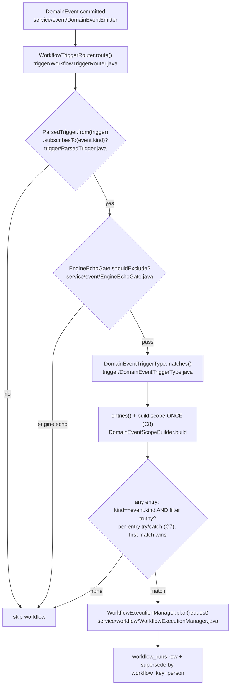

# Multi-Event Triggers — Implementation Plan

> Status: APPROVED 2026-06-18 — building in 4 phases (tracker: [phases.md](phases.md)).
> Additive, no schema change, no migration. Code paths re-verified 2026-06-18 against
> `dev` (post engine-seams `TriggerValidator` SPI merge).

## Contract (binding)

### Accepted trigger shapes

1. **Flat (existing, unchanged):**
   `{ "on": "<kind>", "filter": "<jsonata?>", "reactToEngineEvents": <bool?> }`
2. **Multi (new):**
   `{ "anyOf": [ { "on": "<kind>", "filter": "<jsonata?>" }, ... ], "reactToEngineEvents": <bool?> }`

### Rules

| # | Rule | Rationale |
|---|---|---|
| C1 | `on` XOR `anyOf` — exactly one present; both or neither = validation error | unambiguous shape detection |
| C2 | `anyOf` must be a non-empty array of objects; each entry: required valid `on` (known-kind catalog), optional non-blank `filter` | mirrors flat rules per entry |
| C3 | **Duplicate kinds across entries rejected** | OR-of-filters for one kind is expressible inside a single filter; duplicates would make entry order semantically load-bearing |
| C4 | `reactToEngineEvents` allowed **top-level only**; inside an entry = validation error | RD-006's echo gate is evaluated per-trigger before matching — per-entry would be unenforceable ambiguity |
| C5 | Each entry's filter is field-checked against **its own** kind's scope (existing per-kind rules: `change.*` only on `person.state_changed`, `current.*` only on person kinds) | preserves the validator's silent-no-fire guarantee — the reason Shape B was chosen over a shared filter |
| C6 | Match semantics: workflow fires if **any** entry matches (kind equal AND filter absent-or-truthy). Entries evaluated in array order; first match suffices | boolean outcome — order has no behavioral effect except error handling (C7) |
| C7 | An entry whose filter **errors at runtime** counts as non-match (WARN log), remaining entries still evaluated | one bad entry must not veto its siblings; mirrors the router's existing per-workflow error tolerance |
| C8 | The expression scope is built **once per (event, workflow)** and shared across entries | scope build resolves the person snapshot (DB read) — per-entry rebuilds would multiply reads for zero benefit |

## Lifecycle (runtime trigger path)

**Save path (validation):** `AutomationWorkflowService.validate` → `DomainEventTriggerValidator.validate(trigger)` (the host `TriggerValidator` SPI impl) → `ParsedTrigger.shapeErrors()` (C1–C4) + per-entry `validateEntry` (C5).

## Code changes (verified integration points)

| # | Change | Where | Notes |
|---|---|---|---|
| 1 | **`ParsedTrigger` (record) — single shape authority.** `from(Map)` → `List<TriggerEntry(on, filter)>` (flat → 1 entry, `anyOf` → N) + `subscribesTo(kind)` + `shapeErrors()` (pure C1–C4). | new package-private records `ParsedTrigger`/`TriggerEntry` in `service/workflow/trigger/` | one parser used by **all three** readers (router, matcher, validator) so shape can't drift; infra-bound checks stay in the services |
| 2 | `matches()` iterates `entries()`: kind match → lazy-build scope **once** (C8) → per-entry filter eval in a **per-entry try/catch** (C7). First match wins. | `DomainEventTriggerType.java:46-61` (single-string read at :50-54 replaced) | flat behaviour byte-for-byte identical |
| 3 | Router: replace **both** the null-`on` skip (`:81`) **and** the kind equality (`:85`) with `ParsedTrigger.subscribesTo(event.kind)`. ⚠️ `:81` would otherwise drop `anyOf` (no top-level `on`). | `WorkflowTriggerRouter.java:81,85` | echo gate (`:89`) + whole-trigger try/catch (`:97`) untouched |
| 4 | Validator: prepend `shapeErrors()` (C1–C4); refactor body into `validateEntry(on, filter, errors)`; flat calls once, `anyOf` per entry; per-kind scope checks move in unchanged (C5). | `DomainEventTriggerValidator.java:65-131` | SPI call-sites (`AutomationWorkflowService:284,346`) unchanged — engine SPI stays `Map`-based |
| 5 | Admin catalog: trigger-shape doc string gains the `anyOf` form | `AdminWorkflowController.getTriggerTypes()` | string-level |
| 6 | `create-workflow-json` skill: document `anyOf` + when to use it | `.claude/skills/create-workflow-json/SKILL.md` | authoring guidance |

**No schema change** (triggers are JSONB in `automation_workflows.trigger`), no
migration, no new properties, no UI code (admin UI renders trigger JSON as-is;
form-based trigger editing for `anyOf` is an explicit non-goal).

## Test matrix

**Validator (unit):**
- V1 flat trigger valid → unchanged acceptance (regression)
- V2 `anyOf` two valid entries → accepted
- V3 both `on` and `anyOf` → rejected (C1)
- V4 empty `anyOf` / non-array / entry missing `on` / unknown kind in entry → rejected (C2)
- V5 duplicate kinds in entries → rejected (C3)
- V6 `reactToEngineEvents` inside an entry → rejected (C4)
- V7 entry filter uses `change.*` with `on=person.created` → rejected; same filter under the `person.state_changed` entry → accepted (C5 — the Shape-B guarantee)

**Trigger type (unit):**
- T1 flat trigger behavior unchanged (regression)
- T2 `anyOf`: event matches first entry / second entry / neither
- T3 entry filter runtime error → that entry non-match, sibling entry still matches (C7)
- T4 scope built once across two filter-bearing entries (verify single `PersonSnapshotResolver.resolve` invocation — C8)

**Router + e2e (integration):**
- R1 one workflow with the MVP `anyOf` trigger: a `person.created` event with pre-set assignment plans a run; a `person.state_changed` with `assignedUserId` change plans a run; a `state_changed` with only `contacted` change does not (the Rita repro, both directions)
- R2 supersede across entry paths: created-assigned run in flight → reassignment event → same-key new run supersedes the old (the correctness bonus, proven)
- R3 echo-gated event (`origin=ENGINE`, no opt-in) skipped before any entry evaluation

## Order of work (4 phases — tracker: [phases.md](phases.md))

Strict order; each phase compiles green and is reviewable alone.

1. **Phase 1 — shape authority + matcher.** `ParsedTrigger`/`TriggerEntry` records; `matches()` iterates entries (C6–C8). Tests T1–T4 + `ParsedTriggerTest`. *Dormant* (anyOf not yet saveable/routable).
2. **Phase 2 — validator.** Shape rules C1–C4 + per-entry `validateEntry` (C5). Tests V1–V7. (anyOf saveable+matchable; **router still skips it → needs Phase 3**.)
3. **Phase 3 — router + integration.** `ParsedTrigger.subscribesTo` at `:81`/`:85`. Tests R1–R3 (Rita repro + supersede). anyOf live end-to-end.
4. **Phase 4 — catalog/docs + MVP repoint.** `getTriggerTypes()` + skill docs; repoint `agent_followup_enforcement_mvp` to `anyOf` (admin API + `mvp-wf.workflow.json`) + Rita verify; confirm admin-UI renders anyOf.

## Risks & detection

| Risk | Signal | Mitigation |
|---|---|---|
| Behavior drift for existing flat triggers | any existing trigger test fails | flat path delegates to the same helper + `validateEntry`; regression tests V1/T1 pinned first |
| Router/trigger-type kind-check drift (the pre-existing duplication) | — | both call sites use helper #1; the duplication is removed, not extended |
| Filter valid for kind A leaking into kind B evaluation | silent non-match in prod | prevented at save time (C5/V7); runtime undefined → falsy is the safe direction |
| Admin UI rendering of `anyOf` triggers | workflow detail view breaks on unexpected shape | verify render of an `anyOf` workflow in the run/workflow views during R1; JSON passthrough expected — confirm, don't assume |

## Non-goals

- AND-composition of events, debounce/correlation across events (different feature)
- Per-entry `reactToEngineEvents` (C4)
- UI form-based authoring of `anyOf` (JSON authoring; builder follow-up if ever needed)
- *(The `agent_followup_enforcement_mvp` trigger repoint is now **in scope** as Phase 4 —
  moved out of non-goals after the 2026-06-18 plan approval.)*

## Validation criteria (feature-level)

- Full suite green; V/T/R matrix green
- A live `anyOf` workflow demonstrably fires from both event kinds in the
  local environment (Rita-style replay), and flat-trigger workflows behave
  identically to before
- Effort check: ~1–1.5 dev-days incl. tests (verified against actual code 2026-06-11)

## Linked decisions

- [RD-006](../../repo-decisions/RD-006-engine-echo-exclusion-safe-by-default.md) — echo gate stays top-level, per-trigger (C4)
- No new RD needed: additive config shape, no architectural boundary moved
  (helper lives in the existing trigger package; engine/host kernel boundary untouched)
