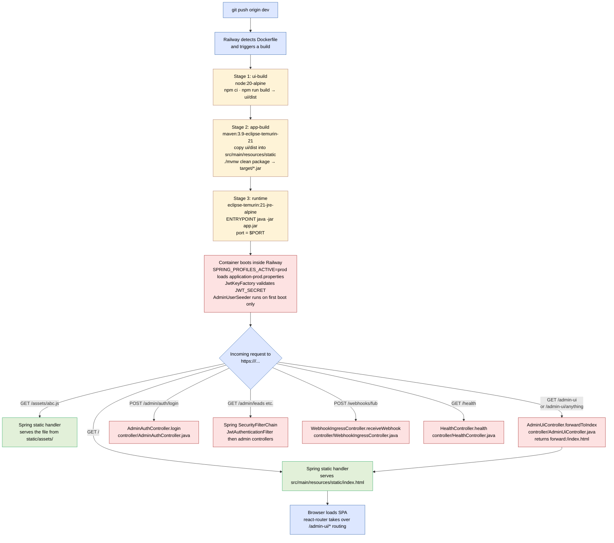

# Plan — Railway Deploy with Bundled SPA

## Context

The app is being moved to a public Railway URL so Follow Up Boss can deliver real webhooks. We want a single Railway service that serves both the backend API and the admin SPA from the same origin — no CORS, no `VITE_API_BASE` plumbing, one URL to give FUB. This plan delivers the deploy artifact (Dockerfile) and the Spring fallback that makes deep-link reloads work.

## Supersedes prior work

This feature consolidates and replaces the unmerged
[`phase/docker-hosting-readiness-phase-1`](https://github.com/sarathkumar365/FUB-Automation/tree/phase/docker-hosting-readiness-phase-1)
branch. The old branch's `Docs/features/docker-hosting-readiness/` folder is
not brought forward; the work that *is* worth keeping (Dockerfile,
`.dockerignore`, `fub-webhook-sync.sh` script) is folded in here. Two
correctness fixes were made during the consolidation:

1. **`AdminUiController` becomes a single `/admin-ui/**` catch-all** instead
   of an enumerated route list. The old list was missing `/admin-ui/login`,
   `/admin-ui/leads`, and `/admin-ui/leads/:sourceLeadId` (added by later
   features), so deep-link reloads on those routes would have 404'd in
   production.
2. **`application-hosted.properties` is dropped.** The newer
   `application-prod.properties` (from `dev-hosting-security-hardening`)
   is strictly more useful — body-size cap, log hardening — and we
   standardise on `SPRING_PROFILES_ACTIVE=prod` for the deployed env.

## Decisions taken

- **Bundle the SPA into the Spring jar** rather than split FE/BE across two
  Railway services. The trade-off — slightly bigger jar, no CDN edge cache —
  is irrelevant at this scale; the simplicity gain (one URL, no CORS, atomic
  FE/BE deploys) is real.
- **Multi-stage Dockerfile** (Node → Maven → JRE) so Railway's build is
  reproducible. Final image uses `eclipse-temurin:21-jre-alpine` for size.
- **`PORT` env var honoured** — Railway sets a dynamic port; the Dockerfile's
  `ENTRYPOINT` reads `${PORT:-8080}` so the container binds to whatever
  Railway provides.
- **No backend changes besides the SPA fallback controller.** Spring's
  default static-resource handler already serves files from
  `src/main/resources/static/`, including `index.html` at `/` (welcome page)
  and `assets/*` for hashed Vite outputs. The only missing piece is the
  fallback for client-side routes that don't correspond to actual files,
  which `AdminUiController` provides.

## Architecture / pattern compliance

- New controller (`AdminUiController`) is HTTP-only, no service layer needed
  — it's pure routing glue.
- No new persistence, no new ports, no new repositories.
- No impact on existing module boundaries.

## End-to-end lifecycle (Railway request → bundled jar)

Top-down, naming the file/method invoked at each hop. This is the diagram a
future dev should read first when wondering "how does this deployment
actually work?".



The "magic" piece is `AdminUiController.forwardToIndex`: any path under
`/admin-ui` that isn't a static file gets forwarded to `/index.html`, which
the Spring static handler then serves. React Router reads
`window.location.pathname` and renders the correct view. Without this,
reloading `/admin-ui/leads/42` would hit Spring with no handler and return
404.

## Critical files

**New:**
- `Dockerfile` — multi-stage build (cherry-picked from prior work).
- `.dockerignore` — keeps `target/`, `node_modules/`, `.env`, `Docs/`, etc. out of build context.
- `src/main/java/com/fuba/automation_engine/controller/AdminUiController.java` — `/admin-ui/**` catch-all (rewritten from prior brittle version).
- `src/test/java/com/fuba/automation_engine/controller/AdminUiControllerTest.java` — pins the catch-all behaviour including for routes added by later features.
- `src/test/resources/static/index.html` — fixture for the forward target during tests.
- `scripts/fub-webhook-sync.sh` — reusable script for upserting FUB webhook URLs after a deploy (cherry-picked from prior work).
- `src/test/java/com/fuba/automation_engine/FubWebhookSyncScriptTest.java` — contract test for the sync script.

**Modified:**
- `Docs/features/railway-deploy-bundled-spa/research.md` — context and constraints.
- `Docs/features/railway-deploy-bundled-spa/plan.md` — this file.

**Not modified:**
- `application.properties` and `application-prod.properties` — already in good shape from `dev-hosting-security-hardening`.
- `pom.xml` — no new dependencies needed.
- SPA — no changes needed; Vite's defaults work as-is.

## Verification

```bash
# 1. Backend tests still pass
./mvnw clean test                   # expect: BUILD SUCCESS, 0 failures

# 2. UI tests still pass
cd ui && npm test                   # expect: all green

# 3. Local Docker build works (optional but recommended before pushing)
docker build -t automation-engine:local .
docker run --rm -p 8080:8080 \
  -e SPRING_PROFILES_ACTIVE=prod \
  -e JWT_SECRET="$(openssl rand -base64 48)" \
  -e ADMIN_AUTH_USERNAME=admin \
  -e ADMIN_AUTH_PASSWORD=devpass \
  -e DB_URL=... -e DB_USER=... -e DB_PASS=... \
  -e FUB_BASE_URL=... -e FUB_API_KEY=... -e FUB_X_SYSTEM=... -e FUB_X_SYSTEM_KEY=... \
  automation-engine:local

# 4. Smoke checks on the running container
curl -i http://localhost:8080/health                                # expect 200
curl -i http://localhost:8080/admin-ui                              # expect 200, HTML body (forwarded)
curl -i http://localhost:8080/admin-ui/leads/42                     # expect 200, HTML body (deep-link refresh works)
curl -i http://localhost:8080/admin/leads                           # expect 401 (auth required, not forwarded)
```

After Railway deploy, repeat the smoke checks against the deployed URL,
then run `scripts/fub-webhook-sync.sh` to point FUB webhooks at the new
host.

## Repo decisions impact

`No` — this is deployment infrastructure, not architectural change. The
auth pattern in `RD-004` is unaffected (we still use bearer tokens; the
fact that the SPA happens to be served by the same Spring instance doesn't
change the auth contract). No new repo-wide rule emerges from this feature.

## Out of scope

- Docker-layer cache optimisation (single-build approach is fine for first deploy).
- Asset compression / Brotli.
- Code-splitting the 700 KB Vite bundle (pre-existing warning, separate concern).
- A separate `phase-N-implementation.md` log — this is one consolidated change set, not multi-phase.
