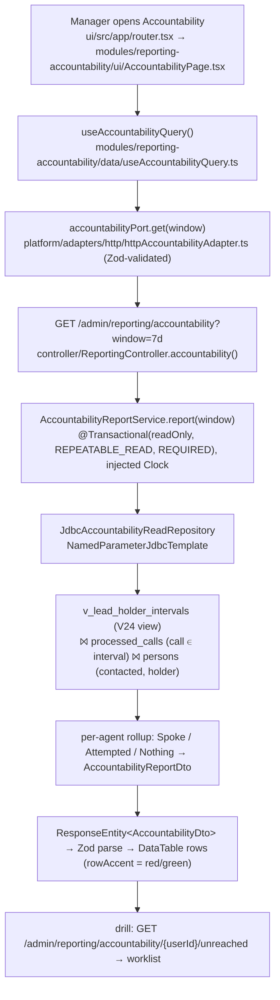

# Reporting Phase 2 — Implementation Plan (build-ready)

> ## Changelog — 2026-08-12 replan (read this first)
> A `/consult` replan reworked the metric model and the windows. Four approaches to
> holder-at-call-time were rated (on-read view / stamp the call / history table / ignore
> reassignment); **the on-read view won** — it cannot drift, works on all history, and is already
> built and proven. A nightly snapshot table and call-stamping were both **considered and rejected**.
>
> | Changed | Was | Now |
> |---|---|---|
> | "Contacted" | FUB's `contacted` flag | A **conversation** — outbound call over the threshold. FUB's flag is renamed **Attempted** |
> | Contact states | reached-by-call / other-channel / not-reached | **Spoke / Attempted / Nothing** (decision 17) |
> | Windows | rolling 24h / 7d | **Yesterday / Today / This week** — calendar days in the configured business timezone (decision 18) |
> | R1 vs R2 | required to agree | Deliberately different jobs — R1 coverage, R2 attribution (decision 19) |
> | Query shape | unspecified | One join + aggregate; never per-lead (decision 20) |
>
> **Why the flag was demoted:** it flips on *any* attempt. Measured on live data — of 532 leads FUB
> marks contacted, only **318 had a real conversation**; **143 had nothing but failed dials** and 60
> had no call at all. A 27% overstatement, on the exact number a manager acts on.
>
> **Status: BUILD-READY (2026-07-02; re-verified and amended 2026-08-12).** All scoping decisions
> closed; grounded against the live DB, the FUB API, and a full code-reuse sweep. A plan-scrutiny pass
> on **2026-08-12** re-checked the spec against the actual schema and code and added decisions 11–16 —
> read those alongside the original ten. This is the commit-level spec. Companions:
> [plan.md](./plan.md) (feature arc), [phase-2-accountability-scoping.md](./phase-2-accountability-scoping.md)
> (how we got here + the data audit), [findings/data-truths.md](./findings/data-truths.md) (canonical
> semantic layer, §6 = this substrate),
> [RD-014](../../repo-decisions/RD-014-reporting-query-architecture.md).
>
> *(The `phase-2-design-handoff.md` FE brief was deleted 2026-07-02 — it needs rewriting before the
> frontend step; see decision 9.)*

## What we're building — two phases
1. **Phase 2a — Lead-timeline substrate.** Reconstruct a per-lead ownership timeline from the events we
   already capture (a SQL view; no API, no UI). The foundation.
2. **Phase 2b — The two reports.** Run two manager reports on top of the timeline (BE + FE).

A **lead-timeline substrate** (on-read SQL views over `events`) and **two deterministic reports** on
top, admin/owner-facing, over short forward windows (**24h / 7d**):

- **Report 1 — Source → Agent → Contact outcome** (coverage). Where leads come from, who holds them,
  and whether they're being reached. Snapshot-flag based.
- **Report 2 — Agent accountability** (assigned → contacted, **timeline-correct**). Per agent, of the
  leads they hold, how many they've engaged — with contact credited to the agent who **held the lead at
  the moment of contact**, immune to reassignment.

Direct vertical slice — plain SQL views + dashboard-local read repos, **not** the RD-012 framework
(that's still Phase 3), and **no** materialized read-model table.

## Locked decisions (2026-07-02)
1. **Semantic layer = real Flyway `CREATE VIEW`(s)** (not CTEs duplicated per query). Single source of
   truth both reports — and any future NL layer — read. First DB view in the repo.
2. **Windows: 24h / 7d, forward-only.** Default 7d; 24h is the leading edge. Historical (pre-hosting)
   out of scope. **Resolved 2026-07-02 (supersedes the audit's gating):** the ephemeral-tunnel ingress
   that dropped ~59% of recent calls is **fixed** — the app runs on Railway at a stable public URL with
   FUB webhooks registered to it (data-truths §2.1 RESOLUTION). Forward windows are complete, so R2's
   call-derived numbers are trustworthy for any window lying **entirely after the fix**. We are not
   backfilling pre-fix history (reconcile PARKED), so do not present R2 over a window reaching into the
   pre-fix zero-days; this self-heals as the window rolls forward. R1 (snapshot flags) was never affected.
3. **Holder-intervals anchor on the `persons` row, NOT `person.created` events.** Only 266/784 active
   leads (34%) have a `person.created` event; every lead has a `persons` row. Each `person.state_changed`
   reassignment carries *both* previous and current owner, so the chain reconstructs from `persons`
   (current + `created_at`) + the reassignment events alone.
4. **Contact model — a dialled call is not a conversation** *(rewritten 2026-08-12, see decisions 11–12)*.
   Per lead, mutually exclusive:
   - **Conversation** — an outbound call **by the holder at that instant** that classifies as
     `CONVERSATIONAL`. This is the only state that counts as the agent having reached the lead.
   - **Dialled, no conversation** — the holder called but the call classified as
     `CONNECTED_NON_CONVERSATIONAL` or `COMM_NOT_FOUND`. Effort, not contact — its own column.
   - **Covered by someone else** — a conversation with the lead by a user who was **not** the holder
     (ISA/pond/owner). The lead was worked; the holder gets no credit. Keeps a handled lead off the
     neglected list without flattering the assignee.
   - **Reached by another channel** — FUB `contacted='1'` **but no call on record** (residual ⇒ msg/email);
     attributed to the holder-at-flip-time. This bucket is a *residual*, so it is only as good as call
     capture: complete for post-ingress-fix windows (decision 2), inflated for any window reaching
     before it.
   - **Not reached** — none of the above.

   *Why this matters (live data 2026-08-12): of 2,534 outbound calls, only **791 (31%)** exceed the
   conversational threshold — 1,431 are 1–30s and 312 are zero-duration. "Called" and "spoke to" differ
   by a factor of three.*
5. **Report 1 drill depth: Source → Agent → contact outcome** (3 levels).
6. **Report 2 drill: per-agent → the actual not-reached leads** (worklist with name + contact handle),
   not counts-only.
7. **Owner `uid=1` (Mandeep) = a normal agent** — leads that sit with him now are shown as his; no
   bucket, no exclusion. Timeline-correct attribution removes the false-red distortion that used to
   motivate segregating him.
8. **Report 1 "contacted" = current snapshot flag**, with the window filtering lead **arrival**
   (`persons.created_at` / `person.created` in-window). "Contacted-within-window" (recency) is a Report-2
   / velocity concern, not Report 1.
9. **FE waits on a design handoff**; **BE is built first** and does not block on it. *(The handoff doc
   was deleted 2026-07-02 and must be rewritten — or the decision revisited — before the FE step.)*
10. ~~**Canonical lead-source set is part of Phase 2a's semantic layer**~~ **REVERSED 2026-08-13 —
    the mapping lives in Java behind a swappable seam, not in a SQL view.** Reports depend on the
    `LeadSourceResolver` **interface**; `StaticLeadSourceResolver` is today's fixed rule list. A
    per-company table or admin-editable mapping replaces it by adding a `@Primary` bean — no caller
    changes. (A test pins that seam.)** A `V25`
    view encoding these buckets was built and then reverted: these are *one brokerage's ad channels*,
    not a property of the schema. Baking them into a migration would mean another company's sources
    can't be expressed at all, and adding a new channel would need a migration plus a deploy. Reports
    **group by the raw `source` string in SQL and fold in the service** — 16 distinct values today, so
    the merge is free. Unrecognised values map to **`Other`** (never dropped, so a new channel stays
    visible in totals) and `isUnmapped()` surfaces them. A per-company lookup table is the eventual
    multi-tenant answer; not needed yet. *The bucket list below is still the correct content — only its
    location changed.* Locked buckets from the live distinct-value scan (2026-07-02): **Facebook**
    (`facebook`) · **Instagram** (`Instagram`/`Insta`/`Intragram`) · **TikTok** · **Social media** ·
    **Manual Add** (+`Mandeep Dhesi`) · **Realtor.ca** · **InvestorGuide** · **Website**
    (`dhesirealestate.ca`) · **Listing** · **Referral** (+`Reference`) · **Open house** ·
    **Unspecified** (blank/null). Encoded as a raw→canonical mapping in the view; the set is recorded in
    [data-truths §2.7](./findings/data-truths.md) and is tunable. Report 1's top axis reads it.

### Locked decisions (2026-08-12) — from the plan scrutiny pass
11. **Call classification is REUSED, not re-invented, and not materialised.** The ladder already exists
    in [`WaitAndCheckCommunicationWorkflowStep.classifyCall()`](../../../src/main/java/com/flux/service/workflow/steps/WaitAndCheckCommunicationWorkflowStep.java):
    `duration_seconds > threshold` → `CONVERSATIONAL`; `1..threshold` → `CONNECTED_NON_CONVERSATIONAL`;
    `0` → `COMM_NOT_FOUND`; outcome-blacklist only as a fallback when duration is null. The report
    applies **the same ladder as a `CASE` in SQL**.
    - **Not a workflow, and not a stored label.** Classification is a pure function of two columns we
      already store (`duration_seconds`, `outcome`), so SQL classifies *every call ever captured*,
      retroactively. Labelling at ingest (or via a workflow) would cover only calls after deployment,
      only for leads whose workflow fired, and would freeze the then-current threshold into history —
      making old and new rows incomparable the moment the threshold is tuned. Store facts, derive
      meaning. *(`processed_calls.rule_applied` is **not** such a label: it is set on 433/4,437 rows,
      it records a task-creation decision, and its legacy path is disabled in prod.)*
    - **Threshold is a bind parameter** sourced from `CallOutcomeRulesProperties`
      (`rules.call-outcome.short-call-threshold-seconds`, default 30) — never hardcoded in the view, so
      SQL and config cannot drift.
    - **Comparison is strict `>`**, matching the code (a flat 30s call is *not* conversational). This
      supersedes data-truths §1's `>= 30` so the report and the workflow step can never disagree.
    - **Null duration counts as an attempt, never as "not reached".** *(Amended 2026-08-13 during code
      review — the original wording said "its own named bucket", which the implementation does not do
      and should not: we dialled the lead, we just don't know the outcome, and that is exactly what
      **Attempted** means. A fourth bucket would split the three-state model for a population that does
      not exist — all 2,534 outbound calls carry a duration.)* The rule that matters is the one the
      code enforces: an unknown outcome must never be reported as neglect.
12. **Credit requires the holder to have made the call** — `processed_calls.source_user_id` must equal
    the holder-at-call-time. Verified available: **2,534/2,534 outbound calls (100%) carry a caller id**,
    in the same namespace as `assignedUserId`. Conversations by anyone else go to "covered by someone
    else" (decision 4). We still cannot *name* a non-assignee caller without the FUB roster (Phase 2d),
    but we do not need to in order to count correctly.
13. **Verdicts are evaluated as of the window's END, not as of now.** A lead that arrived in-window and
    was contacted three weeks later reads **red** when you look back at that window. Evaluating "as of
    now" would let every historical window self-heal, so the board could never show a past failure.
    Report 2 inherits Report 1's window semantics (decision 8): the window filters lead **arrival**;
    a lead appears in the window it arrived in.
14. **Interval boundaries use FUB's `eventCreated`, not our ingest time.** `DomainEventEmitter` stamps
    `created_at = now()` at persist, while `call_started_at` is the real call time from FUB — comparing
    them mixes two clocks. Every webhook envelope carries FUB's own `eventCreated`, reachable via
    `events.source_event_id → webhook_events.payload->>'rawBody'`. Measured skew (2026-08-12):
    `person.state_changed` avg **2s** / worst **11s**; `call.created` avg **4s** / worst **620s**. Small,
    but the join removes the mismatch outright and makes any future backfill safe by construction —
    the emitter's unconditional `now()` is exactly what would corrupt a replay.
15. **The snapshot wins at the head of the chain.** Where the event-reconstructed final holder disagrees
    with `persons.assignedUserId` (the downtime-robust field, verified 786/786 against FUB), close the
    chain with the **snapshot** owner and **expose the mismatch count** as a health number. A single
    dropped reassignment webhook would otherwise misattribute that lead's calls indefinitely with
    nothing surfacing it — free detection for exactly the loss we chose not to backfill.
16. **The pre-assignment stretch is an explicit "unassigned" interval, not a NULL.**
    `PersonDiffComputer` omits a field from `previous` when its old value was null, so a lead's first
    assignment yields `from_uid = NULL` — which would otherwise surface as a phantom unnamed agent in
    any `GROUP BY assigned_uid`. A lead arriving unassigned and being assigned afterwards is the normal
    FUB flow, so the view **names** the state rather than null-checking it at the edges. Calls landing
    in it credit nobody, which is correct.

### Locked decisions (2026-08-12) — from the replan
17. **Contact is three states, and FUB's flag is not one of them.** Per lead, mutually exclusive,
    superseding decision 4:
    - **Spoke** — an outbound call over the threshold, **by the holder at that instant**. The only
      state that means the lead was actually reached.
    - **Attempted** — dialled but no conversation, *or* FUB's flag is on with no call on record
      (a text/email we can't verify). Effort, not outcome.
    - **Nothing** — neither.

    **Never label FUB's flag "Contacted" in any UI.** It flips on any attempt: of 532 flagged leads,
    143 had only failed dials. Where the flag is the sole evidence it is shown **as of now**, never
    as a historical verdict — it carries no date and only ~41% of flips are captured even in a good
    ingestion month.
18. **Windows are calendar days in the business timezone.** **Yesterday**, **Today**, **This week** —
    read from `automation.business-hours.timezone` (settings page, env-set, defaults
    `America/Toronto`), **not** UTC and **not** rolling. A rolling 24h window answers a different
    question and changes its answer every hour, so the same question returns different numbers to two
    people. Month and year ranges need no new code — only a wider bound. *(Supersedes decision 2's
    24h/7d.)* Today stays live; finished days are fixed forever.
19. **R1 and R2 answer different questions and are not required to agree.** R1 counts *leads* by
    source (coverage) and groups by the current holder — each lead once, totals reconcile to arrivals.
    R2 credits *agents* via the holder-at-call-time. A reassigned lead legitimately appears differently
    in each. *(Retracts the earlier cross-report criterion, which would have forced double-counting in
    R1.)* Label R1's agent column as routing, not as a scorecard.
20. **One join and one aggregate per report — never a per-lead lookup.** Measured at 20k leads: the
    per-lead shape took 112ms where the join-and-aggregate shape took 13ms. At 100k leads / 300k calls
    the correct shape holds at ~199ms (R1) and ~96ms (R2). The view cannot push a filter down into
    itself, so cost tracks total lead count rather than window size — which is affordable, but only if
    the report scans it once.
21. **Rejected in the replan, recorded so they are not re-proposed.** A **nightly snapshot table**
    (one row per day/source/agent) and **stamping the holder onto each call at write time** were both
    considered and dropped. The snapshot's only unique benefit was dating FUB's `contacted` flag — and
    once contact means a conversation (decision 17), that flag is no longer load-bearing, leaving a
    scheduled job to maintain for an 11% fuzzy signal. Call-stamping is forward-only and, uniquely
    among the options, **cannot be recomputed if the rule turns out wrong**. The view stays because it
    is derived: always rebuildable, incapable of drifting. If read cost ever becomes real, the upgrade
    is a **stored ownership-history table** (same logic, same answers, rebuildable from `events`) —
    an internal swap invisible to the reports.

### Verification banked (2026-07-02)
Holder reconstruction was checked against the FUB API (read-only `GET /v1/people/{id}`):
- Lead 21385 → local reconstructed owner **14 (Karanjot Makkar)** == FUB `assignedUserId 14`; `contacted 1` both. Reconstructed reassignment chain (14→1→14→1→14) lands on the correct final owner.
- Lead 21394 → local **32 (Gurbir Mander)** == FUB `assignedUserId 32`; `contacted 1` both.
- FUB `created` (21385: 15:32:50Z) sits ~3 min before our first captured event (15:35:56Z) — the first event we log is the lead's real birth, consistent with FUB.

## Semantics — frozen (every query reuses these)
| Term | Definition |
|---|---|
| **Active assigned lead** | `persons` `kind='LEAD' AND status='ACTIVE'` and `person_details->>'assignedUserId'` present. |
| **Holder-at-T** | the `assignedUserId` whose interval `[valid_from, valid_to)` contains timestamp T (from the timeline view). |
| **Outbound call** | `processed_calls.is_incoming = false` (also mirrored by `events.call.created`, `isIncoming=false`). Excludes the `source_person_id='0'` FUB person-less sentinel (data-truths §2.3). |
| **Conversational** | an outbound call with `duration_seconds > :shortCallThresholdSeconds` (bind param, default 30 — decision 11). Below that: `CONNECTED_NON_CONVERSATIONAL` (1..threshold) or `COMM_NOT_FOUND` (0). |
| **Conversation (credited)** | ≥1 **conversational** outbound call whose `call_started_at` falls in a holder interval **and** whose `source_user_id` equals that interval's holder (decision 12); credited to that holder. |
| **Dialled, no conversation** | the holder called in-window but no call of theirs was conversational. |
| **Covered by someone else** | a conversational call to the lead by a user who is not the holder-at-that-instant. Lead worked; holder uncredited. |
| **Reached by other channel** | `person_details->>'contacted' = '1'` AND no outbound call on record (residual). |
| **Not reached** | none of the above. |
| **Verdict time** | every state is evaluated **as of the window's end**, never as of now (decision 13). |
| **Source (normalized)** | `person_details->>'source'` collapsed to the canonical bucket set (decision 10; e.g. Instagram/Insta/Intragram → Instagram). |
| **Group key** | `assignedUserId` (bigint); display `assignedTo`, canonical name per id. |

## What already exists to reuse (from the 2026-07-02 code sweep)
**Backend read-repo template** — mirror exactly:
- `controller/DashboardController.java` — `@RestController @RequestMapping("/admin/...") @PreAuthorize("hasAnyRole('ADMIN','OPERATOR','VIEWER')")` → `ResponseEntity<Dto>`.
- `service/reporting/dashboard/DashboardSnapshotService.java` — `@Transactional(readOnly=true, isolation=Isolation.REPEATABLE_READ, propagation=Propagation.REQUIRED)`, injected `Clock` for testable time.
- `persistence/repository/DashboardMetricsReadRepository.java` + `JdbcDashboardMetricsReadRepository.java` — `NamedParameterJdbcTemplate`, `MapSqlParameterSource` w/ `Types.TIMESTAMP_WITH_TIMEZONE`, `date_trunc(... AT TIME ZONE 'UTC')`, nested `record` rows, `RowMapper`/`RowCallbackHandler`.
- Sibling JSONB reader: `JdbcPersonFeedReadRepository.java` (reads `person_details`, PGobject→Jackson helper).
- Entities present: `EventEntity`/`EventRepository` (**write-only today — our view is its first reader**), `ProcessedCallEntity`/`ProcessedCallRepository` (has person-scoped call finders), `PersonEntity`/`PersonRepository`.
- DTOs: nested `record`s under `controller/dto/`.

**Frontend template (RD-011)** — mirror per report:
- `platform/contracts/dashboardSchemas.ts` (Zod) → `platform/ports/dashboardPort.ts` → `platform/adapters/http/httpDashboardAdapter.ts` → wired in `platform/container.ts` + `platform/query/queryKeys.ts` → `modules/dashboard/data/useDashboardSnapshotQuery.ts` (TanStack Query).
- Primitives: `shared/ui/DataTable.tsx` (has `rowAccent` for status rails), token-driven `modules/dashboard/ui/charts/{AreaChart,Sparkbars}.tsx` (RD-013), full-width opt-in (just **don't** call `useShellRegionRegistration`), module layout `modules/<slug>/{data,lib,ui}`, route in `app/router.tsx`.

**Testcontainers IT template** — per-class, no base:
- `@SpringBootTest @Testcontainers(disabledWithoutDocker=true)` + static `PostgreSQLContainer("postgres:16-alpine")` + `@DynamicPropertySource` (Flyway on). Seed via `NamedParameterJdbcTemplate`; reset `TRUNCATE ... RESTART IDENTITY CASCADE` in `@BeforeEach`; `FixedClockConfig` for deterministic time.
- Direct models: `JdbcDashboardMetricsReadRepositoryPostgresTest`, `DashboardSnapshotInvariantPostgresTest`. Migration ITs already exist for `events`/`persons`/`processed_calls`.

**Net-new ground (all proven-capable):** first `events` reader; first native-JSONB read queries (`->>'`, proven in V21 migration); first DB view. `idx_processed_calls_person_started (source_person_id, call_started_at)` already indexes the call join. **`idx_events_entity` is `(entity_type, entity_id, created_at)` — it is only usable if the query supplies `entity_type`**; the reassign CTE must therefore carry an explicit `AND e.entity_type = 'person'` (true of every row it already matches, so it changes no results) or Postgres will sequential-scan `events`.

**Test-schema constraint:** the H2 profile runs `ddl-auto=create-drop` with **`spring.flyway.enabled=false`** (`src/test/resources/application.properties`), so `v_lead_holder_intervals` does **not** exist under H2. Every test touching the view must be a Postgres Testcontainers IT; service unit tests stay on mocked repos. Also note `DomainEventEmitter` stamps `created_at` with a bare `OffsetDateTime.now()` — it does **not** honour the injected `Clock`, so ITs must seed `events` rows via raw JDBC rather than driving time through `FixedClockConfig`.

## The substrate — holder-intervals view (Step 1, the one hard piece)
A Flyway view `v_lead_holder_intervals` yielding, per lead, `(source_person_id, assigned_uid, valid_from, valid_to)`. Reconstructed from `persons` (anchor + current owner) plus `person.state_changed` reassignment rows (each carries `previous`+`current`+timestamp). Sketch (finalize in the IT):

```sql
CREATE VIEW v_lead_holder_intervals AS
WITH active_leads AS (   -- the ONE membership filter; all branches inherit it (audit fix #2)
  SELECT source_person_id, created_at,
         (person_details->>'assignedUserId')::bigint AS current_uid
  FROM persons
  WHERE kind='LEAD' AND status='ACTIVE'
    AND person_details->>'assignedUserId' IS NOT NULL
),
reassign AS (
  SELECT al.source_person_id,
         (e.payload->'previous'->>'assignedUserId')::bigint AS from_uid,   -- NULL on first assignment (fix #3)
         (e.payload->'current' ->>'assignedUserId')::bigint AS to_uid,
         -- FUB's own change time, not our ingest time (decision 14)
         ((w.payload->>'rawBody')::jsonb ->> 'eventCreated')::timestamptz AS changed_at,
         lead(...)  OVER (PARTITION BY e.entity_id ORDER BY <changed_at>) AS next_changed_at,
         row_number() OVER (PARTITION BY e.entity_id ORDER BY <changed_at>) AS seq
  FROM events e
  JOIN webhook_events w ON w.id = e.source_event_id
  JOIN active_leads al ON al.source_person_id = e.entity_id
  WHERE e.event_kind = 'person.state_changed'
    AND e.entity_type = 'person'                                -- REQUIRED for idx_events_entity (fix #4)
    AND e.payload->'changed_fields' ? 'assignedUserId'          -- jsonb array element test
),
anchored AS (   -- before the first reassignment; start = -infinity (audit fix #1).
                -- from_uid NULL ⇒ the lead was unassigned until then: a named state, not a null (fix #3)
  SELECT r.source_person_id, r.from_uid AS assigned_uid,
         '-infinity'::timestamptz AS valid_from, r.changed_at AS valid_to
  FROM reassign r WHERE r.seq = 1
),
segments AS (   -- each reassignment opens an interval closed by the next (or +infinity)
  SELECT r.source_person_id, r.to_uid AS assigned_uid,
         r.changed_at AS valid_from, coalesce(r.next_changed_at, 'infinity'::timestamptz) AS valid_to
  FROM reassign r
),
never AS (       -- no reassignment: single interval = current owner, for all time
  SELECT al.source_person_id, al.current_uid AS assigned_uid,
         '-infinity'::timestamptz AS valid_from, 'infinity'::timestamptz AS valid_to
  FROM active_leads al
  WHERE NOT EXISTS (SELECT 1 FROM reassign r WHERE r.source_person_id = al.source_person_id)
)
-- + the snapshot-wins head correction (decision 15): where the last `segments` interval's
--   assigned_uid <> active_leads.current_uid, close it and open a final interval for current_uid.
--   Finalize the exact shape in the IT; also expose the disagreement count (see below).
SELECT * FROM anchored
UNION ALL SELECT * FROM segments
UNION ALL SELECT * FROM never;
```

**Corrections baked in:**
1. *(audit 2026-07-02)* **Earliest interval starts at `-infinity`, not `persons.created_at`.** `created_at` = *first-seen-by-us*,
   not FUB intake — anchoring there dropped same-day calls that occurred *before* we first saw the lead
   (~128 false "not-reached" credits in the audit). Tenure is bounded only by reassignment events; the
   earliest holder owned the lead "from the beginning of time" as far as we can prove.
2. *(audit 2026-07-02)* **All branches inherit the `active_leads` filter** (`kind='LEAD' AND status='ACTIVE'`). Previously
   `anchored`/`segments` read raw `events` and leaked a few stale/non-lead entities.
3. *(scrutiny 2026-08-12)* **`from_uid` is NULL on a lead's first assignment** — `PersonDiffComputer` omits a
   field from `previous` when its old value was null. Render that interval as the named **unassigned**
   state (decision 16), never as a NULL group key.
4. *(scrutiny 2026-08-12)* **`entity_type = 'person'` is mandatory** — without it `idx_events_entity` cannot be
   used and the CTE sequential-scans `events`.
5. *(scrutiny 2026-08-12)* **Boundaries come from FUB's `eventCreated`** via `webhook_events`, so interval edges
   and `call_started_at` share one clock (decision 14).
6. *(scrutiny 2026-08-12)* **The snapshot wins at the head** (decision 15), with the disagreement count exposed.

**A companion health query ships with the view** (decision 15): the count of active leads whose
event-reconstructed final holder disagreed with `persons.assignedUserId`. Expected 0; anything above 0
is a dropped reassignment webhook, and it is the only detector we have now that the reconcile job is parked.

**Why it's correct with 34% birth-record coverage:** `anchored`/`segments` need only the reassignment
events (which carry `from`+`to`), not `person.created`; `never` covers the ~93% unreassigned leads from
the snapshot. Blast radius: only ~54/784 leads were ever reassigned, so the view *changes an answer* only
for that small, correctness-critical set. **The IT is the deliverable that proves this** — seed a lead
reassigned mid-window (with a call before first-seen, and one in each interval) and assert each call
credits the right holder.

## Report 1 — Source → Agent → contact outcome
- **Universe:** active assigned leads whose arrival (`persons.created_at`) is in-window.
- **Aggregate:** normalized `source` → `assignedUserId`/`assignedTo` (current holder) → the contact-state
  counts of decision 4. Source normalization is a `CASE` map per data-truths §2.7.
- Contact state here uses **current snapshot + our call log** (decision 8), with calls **classified**
  (decision 11) and **windowed on the same window as the lead's arrival** so R1 and R2 can never colour
  the same lead differently: conversation = a conversational outbound call; else dialled-no-conversation;
  else `contacted='1'` ⇒ other channel; else not reached. Evaluated as of window end (decision 13).
  (No holder-interval needed at level 2 — level 2 is *current* holder; attribution correctness matters
  for Report 2.)

## Report 2 — Agent accountability (timeline-correct)
- **Grain:** per `assignedUserId` (canonical name).
- **Universe:** same as R1 — leads whose **arrival** falls in the window (decision 13). A lead appears in
  the window it arrived in; move the window back to see older cohorts.
- **Conversation:** join `processed_calls` (outbound, in-window, classified conversational) to
  `v_lead_holder_intervals` on `source_person_id` and `call_started_at ∈ [valid_from, valid_to)`,
  **requiring `pc.source_user_id = hi.assigned_uid`**; credit `hi.assigned_uid`.
- **Dialled, no conversation:** the holder called in-window but none of their calls was conversational.
- **Covered by someone else:** a conversational call exists in the interval but from a different
  `source_user_id`. Lead worked, holder uncredited.
- **Reached by other channel:** leads with `contacted='1'` and no in-window outbound call; credit the
  holder-at-flip-time (join the `contacted` flip event to the interval on FUB's `eventCreated`) —
  falling back to current holder if the flip predates ingestion.
- **Not reached:** the rest of each agent's in-window leads.
- **Drill:** per agent → the list of not-reached leads (name + contact handle from `person_details`).

Sketch (call attribution — classified + caller-checked):
```sql
SELECT hi.assigned_uid AS holder_uid,
       count(DISTINCT pc.source_person_id)
         FILTER (WHERE pc.duration_seconds >  :shortCallThresholdSeconds
                   AND pc.source_user_id = hi.assigned_uid)          AS leads_with_conversation,
       count(DISTINCT pc.source_person_id)
         FILTER (WHERE pc.duration_seconds <= :shortCallThresholdSeconds
                   AND pc.source_user_id = hi.assigned_uid)          AS leads_dialled_no_conversation,
       count(DISTINCT pc.source_person_id)
         FILTER (WHERE pc.duration_seconds >  :shortCallThresholdSeconds
                   AND pc.source_user_id <> hi.assigned_uid)         AS leads_covered_by_other
FROM processed_calls pc
JOIN v_lead_holder_intervals hi
  ON hi.source_person_id = pc.source_person_id
 AND pc.call_started_at >= hi.valid_from
 AND pc.call_started_at <  hi.valid_to
WHERE pc.is_incoming = false
  AND pc.source_person_id <> '0'                    -- FUB person-less sentinel (data-truths §2.3)
  AND pc.call_started_at >= :from AND pc.call_started_at < :to
GROUP BY hi.assigned_uid;
```
> The three buckets are computed per lead and are mutually exclusive at the lead grain — a lead with both
> a conversation and a short call is a conversation. Resolve the precedence in the read repo (or a
> per-lead CTE), not by summing these `FILTER`s; the sketch shows the predicates, not the final shape.
> Rows with a NULL `duration_seconds` fall into the decision-11 unknown bucket, not into any of these.

## As built (2026-08-13/14) — the backend, file by file

Both reports are complete and green (852-test suite, incl. end-to-end HTTP). This section is
the record of what actually exists; the sections above are the design it was built from.

### The request path

```
GET /admin/reporting/accountability?window=yesterday
  → ReportingController.accountability()          parses the window, 400s on an unknown one
  → ReportWindow.fromKey("yesterday")             text → enum, or UnknownReportWindowException
  → AccountabilityReportService.report(window)    @Transactional(readOnly, REPEATABLE_READ, REQUIRED)
      ├── ZoneId.of(businessHours.getTimezone())  the settings-page value, not UTC
      ├── window.resolve(clock, zone)             → Bounds(from, to), whole calendar days
      ├── readRepository.countByAgentAndState()   the one query
      ├── countEventsReceived()                   so the UI can tell quiet from dead
      └── totals() / agents()                     add up, name once per id, sort by volume
  → AccountabilityReportDto                       JSON
```

### Endpoints
| Method | Path | Returns |
|---|---|---|
| `GET` | `/admin/reporting/source-contact?window=` | `SourceContactReportDto` — R1 |
| `GET` | `/admin/reporting/accountability?window=` | `AccountabilityReportDto` — R2 |
| `GET` | `/admin/reporting/accountability/{agentId}/unreached?window=` | `UnreachedLeads` — the drill |

`window` accepts `yesterday` (default), `today`, `this-week`. All three carry
`@PreAuthorize("hasAnyRole('ADMIN','OPERATOR','VIEWER')")`, matching `DashboardController`.

### Files
| File | Role |
|---|---|
| `controller/ReportingController` | All three endpoints + the `UnknownReportWindowException` → 400 handler |
| `controller/dto/ReportWindowDto` | Window echoed back: key, bounds, timezone, `open`, `eventsReceived`. **Own type** — shared by both reports, so neither defines the other's contract |
| `controller/dto/ContactCountsDto` | `leads / spoke / attempted / nothing`; the three always sum to `leads` |
| `controller/dto/SourceContactReportDto` | R1: totals + sources → agents |
| `controller/dto/AccountabilityReportDto` | R2: totals + agents; nested `UnreachedLeads` for the drill |
| `service/reporting/ReportWindow` | Calendar-day maths. Takes a zone as a parameter — the service supplies it, keeping this testable against any timezone |
| `service/reporting/UnknownReportWindowException` | Its own type so the 400 handler can't swallow genuine faults |
| `service/reporting/LeadSourceResolver` (+`Static…`) | Raw source → display bucket, behind a swap seam |
| `service/reporting/sourcecontact/SourceContactReportService` | R1: folds source names, merges agents by id, totals |
| `service/reporting/accountability/AccountabilityReportService` | R2: totals, agent rows, the capped worklist |
| `persistence/repository/{SourceContact,Accountability}ReadRepository` + `Jdbc…` | The SQL |
| `db/migration/V24__create_lead_holder_intervals_view.sql` | The ownership timeline + its head-mismatch health view |

### The R2 query, in four steps
1. **`cohort`** — active leads that *arrived* in the window, with current owner and contact handles.
2. **`deciding_call`** — `DISTINCT ON (lead)` over calls joined to `v_lead_holder_intervals`,
   keeping only calls the holder themself made, ordered conversation-first
   (**`DESC NULLS LAST`** — Postgres sorts NULL first under DESC, so without it a call with no
   recorded duration would outrank a real conversation).
3. **`attributed`** — agent = whoever made that call, else the current owner. State = the
   three-way CASE.
4. **`names`** — one canonical spelling per user id, most-used wins, ties broken by name.

### Contract decisions worth not re-litigating
- **Each lead lands on exactly one agent**, so R2's rows sum back to the arrival count.
- **The worklist is scoped to `NOTHING` and keyed on the *current* holder** — so its length
  equals the red number it drills into, and every lead on it is one the reader can still act on.
  *Consequence to be aware of:* a lead dialled but never connected appears on **no** worklist —
  it is counted in that agent's Attempted column, which has no drill-down yet.
- **The drill asks for `cap + 1` rows** and reports `truncated: true`, rather than presenting a
  cut-off list as the whole of it.
- **An unrecognised contact state throws** rather than defaulting into "nothing" — a silent
  miscount there would manufacture neglect on the number people are confronted with.
- **Primary phone/email, not `[0]`**, compared as text (`IN ('1','true')`) so a boolean from FUB
  cannot abort the query.

### Test coverage
| Layer | Where | Proves |
|---|---|---|
| View | `LeadHolderIntervalsViewPostgresTest` (11) | Ownership at any instant; `-infinity` anchor; unassigned named; snapshot wins at the head; FUB's clock |
| SQL | `Jdbc{SourceContact,Accountability}ReadRepositoryPostgresTest` (30) | State classification, window edges, non-holder calls, NULL durations, worklist scope, primary handles |
| Logic | `{SourceContact,Accountability}ReportServiceTest` (17) | Source folding, name merging, ordering, truncation, unknown-state failure |
| Time | `ReportWindowTest` (8) | Toronto boundaries, non-moving windows, half-open ranges |
| End-to-end | `SourceContactReportFlowTest` (9) | Real HTTP through security → SQL → JSON; 400 on bad input; 403 without a role |

## Phase 2f — Frontend plan (2026-08-14, design handoff received)

Design source: `ui/Flux Design System/design_handoff_reporting_phase2/` (README + `Reports.dc.html`
prototype). High-fidelity; recreate with codebase primitives, never ship the HTML. The handoff
predates the 2026-08-12 backend replan, so two of its assumptions are deliberately overridden
(owner-approved 2026-08-14):

| Handoff says | We build | Why |
|---|---|---|
| Windows "Last 24 Hours / Last 7 Days" | Segmented control with **Yesterday / Today / This week** | Calendar-day windows in the business timezone are a locked replan decision — rolling windows change hourly |
| Middle outcome = "reached by another channel" (contacted) | **Spoke / Attempted / Untouched**; "reached %" counts Spoke only | Our middle state means *dialled but NOT reached* — keeping the handoff copy would report attempts as contact, the exact lie the replan removed. Colors stay (teal/indigo/amber) |

Also fixed at approval: inspector stays the shell's 320px (not the handoff's 372px); no role
gating — all three roles see both reports and contact handles, matching the backend's
`@PreAuthorize`; the "Preview State" pill is prototype-only chrome, not implemented.

**Charting — [RD-015](../../repo-decisions/RD-015-charting-library-echarts.md).** The sankey is
ECharts (first consumer of the new library), via the centralized `ui/src/platform/charts/` layer:
`chartTheme.ts` (theme resolved from CSS tokens at runtime, light+dark) + `EChart.tsx` (the one
wrapper: init/resize/dispose/events; modular `echarts/core` imports). Option builders are pure,
unit-tested functions in the feature's `lib/` — the traceability chain per chart is
API → Zod contract → port/adapter → query hook → pure option builder → `<EChart>`. Everything
that is not a chart (ledger tree, agent table, mix bars, chips, worklist) is plain flex/grid
per the handoff. Sankey visuals therefore sit close to, not pixel-identical with, the prototype.

**Data fit (verified against the shipped DTOs):** R1's nested `sources[].agents[].counts` is
exactly the sankey triple (source×agent×state) — drill, breadcrumb, and both ledger levels are
client-side folds of it, no new endpoints. R2's `agents[].counts` drives the table; the
`/unreached` worklist already returns name/phone/email/source/arrivedAt oldest-first, and its
`truncated` flag renders as an honesty note at the 200 cap. `window.eventsReceived` gives the
empty state its "quiet day vs feed down" variant — a distinction the handoff couldn't know about.
The handoff's "Agents hold all of them" narration holds by construction (R1's cohort filters
`assignedUserId IS NOT NULL`).

**Module shape (one module, not two):** `ui/src/modules/reports/` — `data/` (three query hooks),
`lib/` (pure folds: narration, sankey option, ledger rows, sort), `ui/` (ReportsPage + the two
report views + inspector worklist). Platform chain: `contracts/reportingSchemas.ts` → 
`ports/reportingPort.ts` → `adapters/http/httpReportingAdapter.ts` → `container.ts` →
`queryKeys.reports.*(window)`.

**Build order:** RD-015 + `echarts` install → `platform/charts/` → tokens
(`--color-outcome-{call|other|none}-*`) + primitives (SegmentedControl — new; Skeleton `shimmer`
variant; EmptyState hero extension; bar-chart + eye icons) → data plumbing → shell entries
(rail item, `/admin-ui/reports` route, panel nav cards, `uiText.reports`) → Report 1 (narration,
flow story w/ drill, ledger) → Report 2 (sortable table, narration, inspector worklist) →
states → tests + `npm run check`.

## Placement (net-new files)
Backend (mirrors the dashboard package shape):
- `service/reporting/timeline/` — timeline read repo over the view (or the view is read directly by each report repo).
- `service/reporting/sourcecontact/SourceContactReportService.java` + `persistence/repository/{SourceContactReadRepository,JdbcSourceContactReadRepository}.java`.
- `service/reporting/accountability/AccountabilityReportService.java` + `persistence/repository/{AccountabilityReadRepository,JdbcAccountabilityReadRepository}.java`.
- `controller/ReportingController.java` → `GET /admin/reporting/source-contact?window=24h|7d`, `GET /admin/reporting/accountability?window=24h|7d`, `GET /admin/reporting/accountability/{userId}/unreached?window=…`.
- DTOs under `controller/dto/`.
- Flyway: `V24__create_lead_holder_intervals_view.sql`; `V25__index_persons_assigned_user_id.sql` (`CREATE INDEX ... ON persons ((person_details->>'assignedUserId')) WHERE kind='LEAD'`).

Frontend (plan above, 2026-08-14): one `modules/reports/` module + the shared
`platform/charts/` layer; single `contracts/reportingSchemas.ts` + `reportingPort` +
`httpReportingAdapter` + container wiring + `queryKeys.reports` + three `use*Query` hooks.
*(The earlier two-module sketch here is superseded — both reports share one nav surface,
one port, and one uiText namespace.)*

## The two phases (build order, BE-first)

### Phase 2a — Lead-timeline substrate
The foundation: reconstruct the per-lead ownership timeline. **No API, no UI — a view + its proof.**
1. `V24` — the `v_lead_holder_intervals` view (above).
2. `HolderIntervals…PostgresTest` IT — seed rows via raw JDBC (the emitter ignores the injected `Clock`).
   Cases it must cover:
   - a lead reassigned mid-window with a call in each interval → each call credits the holder-at-call-time;
   - a never-reassigned lead → exactly one interval;
   - a call **before** our first sight of the lead → still credited (the `-infinity` anchor, correction 1);
   - a lead **created unassigned then assigned** → an explicit unassigned interval, no NULL group key
     (correction 3) — this is the normal FUB routing flow, not an edge case;
   - a lead whose event chain disagrees with `persons.assignedUserId` → the snapshot wins at the head
     and the disagreement is counted (decision 15);
   - interval edges read FUB's `eventCreated`, not `events.created_at` (decision 14).

**Done signal:** IT green; the view returns the correct holder-at-T for reassigned and unreassigned
leads. Independently reviewable and shippable — a pure substrate with no behavior surface.

### Phase order after the replan
| Step | What | Done when |
|---|---|---|
| **2a** | `V24` holder-intervals view — **written, SQL verified** | The IT actually runs (needs Docker) and passes 11/11 |
| **2b** | `V25` canonical source view | Source variants fold; IT green |
| **2c** | Report 1 — leads by source, three states, calendar windows | **DONE 2026-08-13** — `GET /admin/reporting/source-contact`; 29 tests + a 6-case end-to-end HTTP flow |
| **2d** | Report 2 — agent scorecard + unreached drill | **DONE 2026-08-14** — `GET /admin/reporting/accountability` and `/{agentId}/unreached`; 23 tests. Each lead lands on exactly one agent: whoever acted on it, else whoever holds it now |
| **2e** | `V26` JSONB index + 5-minute client cache | Measured, not assumed |
| **2f** | Frontend — one `modules/reports/` module, ECharts sankey (RD-015) | **Design handoff received + plan approved 2026-08-14** — see "Phase 2f — Frontend plan" above |

### Phase 2b — The two reports (on the timeline)
3. **Report 1** — read path + IT (source normalization + the decision-4 contact-state aggregate) → API (endpoint + DTO +
   service unit tests on a mocked repo).
4. **Report 2** — read path + IT (the correctness-critical attribution join over the view + the
   unreached-drill query) → API (endpoints + DTO + unit tests).
5. **`V25`** — JSONB expression index (fast-follow).
6. **Frontend** — both modules (RD-011 trio + screens) once the design handoff lands.
7. **Docs** — update `phases.md`, append notes, keep the RD-014 README index current.

**Done signal:** both reports render with correct numbers; a lead reassigned mid-window credits the
right agent (no false red); the unreached drill lists the actual leads; FE gate green.

> **Dependency honesty:** Report 1 reads the *current* holder and doesn't strictly need the timeline;
> only Report 2 does. Both live in 2b, but if 2b is sliced further, Report 1 can land before the timeline
> IT fully settles. Phase 2a is the hard, foundational piece — do it first and get it provably right.

## Lifecycle diagram (Report 2, main path)


## Non-goals
- Materialized read-model table (RD-012, Phase 3); the timeline is reconstructed on-read.
- Conversion / deals / appointments (not captured; every lead is `stage='Lead'`).
- FUB-user ingestion / naming non-assignee callers (Issue #19).
- SLA / time-to-first-call as a graded metric (no true FUB intake date).
- ~~The "connected ≥30s" quality signal — deferred; v1 counts attempts, not connects.~~ **Reversed
  2026-08-12 (decision 11):** the conversational threshold is now central, not deferred — the classifier
  already exists and only 31% of outbound calls clear it, so counting attempts as contact would be wrong.

## Risks (with mid-flight detection)
- **Holder-interval SQL wrong on a reassignment edge** → misattribution. *Detect:* the Step-1 IT seeds a mid-window reassignment with a call per interval and asserts credit. *Mitigation:* the view is the single choke point — fix once.
- **A dropped reassignment webhook silently freezes the chain** → the lead's calls credit the wrong agent indefinitely. *Detect:* the decision-15 disagreement count (reconstructed head vs `persons.assignedUserId`). *Mitigation:* the snapshot wins at the head, so the current holder is always right; only the boundary time is lost.
- **`contacted`-flip attribution weak for pre-ingestion contacts** (no flip event). *Detect:* count leads with `contacted='1'` and no flip event. *Mitigation:* fall back to current holder; shrinks going forward under continuous hosting.
- **First native-JSONB reporting SQL** → H2 can't run it, and the H2 profile has Flyway disabled so the view does not exist there at all. *Mitigation:* Postgres-IT-only (matches the `date_trunc` precedent); service unit tests on mocked repos.
- **`persons.created_at` = first-seen, not FUB intake** → "arrived in window" approximate for pre-existing leads. *Mitigation:* documented limitation; forward windows under hosting are clean.
- **A window overlapping a period with no ingestion renders as zeros** rather than as "no data". *Detect:* compare the window against `webhook_events` coverage. *Mitigation:* the UI must distinguish *nothing happened* from *we heard nothing* — an explicit no-data state, not an empty table.

## Validation criteria
- **Phase 2a (timeline):** the IT cases listed under Phase 2a all pass — reassignment credit, single interval, pre-first-seen call, unassigned-then-assigned, snapshot-wins head, `eventCreated` boundaries.
- **Phase 2b · Report 1:** source→agent→outcome renders; source variants collapse; every in-window lead lands in exactly one contact state, and the states sum to the in-window arrival count *(not to the agent's all-time held-lead total)*.
- **Phase 2b · Report 2:** per-agent states render; a lead reassigned mid-window credits the right agent (no false red); a conversation by a non-holder shows as *covered by someone else*, never as the holder's credit; a lead dialled three times without a conversation reads as effort, not contact; the unreached drill lists the actual leads.
- ~~**Cross-report:** the same lead in the same window never shows a different contact state in R1 and R2.~~
  **Retracted 2026-08-12 (decision 19)** — R1 counts leads once by current holder, R2 credits agents by
  holder-at-call-time. Forcing agreement would double-count reassigned leads in R1.
- **Windows:** "Yesterday" is a fixed calendar day in the business timezone and returns the same numbers
  at 9am and at 5pm. A window overlapping a period with no ingestion renders a **no-data** state, not zeros.
- **Suite:** existing backend suite + new ITs green; FE gate green once built.

## Repo decisions impact
**Yes.** Governed by **[RD-014](../../repo-decisions/RD-014-reporting-query-architecture.md)** (Accepted; its 2026-07-02 amendment records the event-sourced timeline as the semantic-layer substrate. **Final state of the ingress question, same day:** the audit correctly showed continuous *app* hosting does not imply complete data — the root cause was an ephemeral tunnel ingress. That ingress is now **fixed** (stable Railway URL, verified), so R2 is trustworthy for post-fix windows; the **reconcile/backfill job is PARKED, not mandatory** — we accept forward-only R2 and recover no pre-fix history. See data-truths §2.1 RESOLUTION and phases.md Phase 2c.). The DB-view-as-semantic-layer is RD-014's literal implementation — **no new RD needed**. RD-012 framework extraction stays Phase 3 (these views are plain SQL, not the framework). FE follows RD-011 (schema ownership) + RD-013 (charts).
