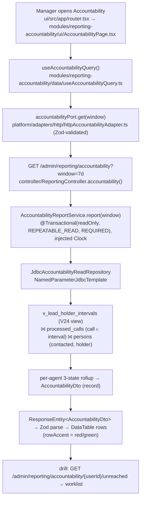

# Reporting Phase 2 — Implementation Plan (build-ready)

> **Status: BUILD-READY (2026-07-02).** All scoping decisions closed; grounded against the live DB,
> the FUB API, and a full code-reuse sweep. This is the commit-level spec. Companions:
> [plan.md](./plan.md) (feature arc), [phase-2-accountability-scoping.md](./phase-2-accountability-scoping.md)
> (how we got here + the data audit), [findings/data-truths.md](./findings/data-truths.md) (canonical
> semantic layer, §6 = this substrate), [phase-2-design-handoff.md](./phase-2-design-handoff.md)
> (the brief for the FE screens), [RD-014](../../repo-decisions/RD-014-reporting-query-architecture.md).

## What we're building — two phases
1. **Phase 2a — Lead-timeline substrate.** Reconstruct a per-lead ownership timeline from the events we
   already capture (a SQL view; no API, no UI). The foundation.
2. **Phase 2b — The two reports.** Run two manager reports on top of the timeline (BE + FE).

A **lead-timeline substrate** (on-read SQL views over `events`) and **two deterministic reports** on
top, admin/owner-facing, over short forward windows (**24h / 7d**):

- **Report 1 — Source → Agent → Contact outcome** (coverage). Where leads come from, who holds them,
  and whether they're being reached. Snapshot-flag based.
- **Report 2 — Agent accountability** (assigned → contacted, **timeline-correct**). Per agent, of the
  leads they hold, how many they've engaged — with contact credited to the agent who **held the lead at
  the moment of contact**, immune to reassignment.

Direct vertical slice — plain SQL views + dashboard-local read repos, **not** the RD-012 framework
(that's still Phase 3), and **no** materialized read-model table.

## Locked decisions (2026-07-02)
1. **Semantic layer = real Flyway `CREATE VIEW`(s)** (not CTEs duplicated per query). Single source of
   truth both reports — and any future NL layer — read. First DB view in the repo.
2. **Windows: 24h / 7d, forward-only.** Default 7d; 24h is the leading edge. Historical (pre-hosting)
   out of scope. **⚠️ Corrected 2026-07-02 (audit):** short windows are *not* automatically complete —
   the ephemeral webhook ingress drops ~59% of recent calls (data-truths §2.1 CORRECTION), so **R2's
   call-derived numbers are gated on Phase 2c** (stable ingress + reconcile). R1 (snapshot flags) is
   unaffected.
3. **Holder-intervals anchor on the `persons` row, NOT `person.created` events.** Only 266/784 active
   leads (34%) have a `person.created` event; every lead has a `persons` row. Each `person.state_changed`
   reassignment carries *both* previous and current owner, so the chain reconstructs from `persons`
   (current + `created_at`) + the reassignment events alone.
4. **Contact is a 3-state, two-type model** (per lead, mutually exclusive):
   - **Reached by call** — an actual outbound call in our log; attributed to the holder-at-call-time.
   - **Reached by another channel** — FUB `contacted='1'` **but no call on record** (residual ⇒ msg/email);
     attributed to the holder-at-flip-time. Reliable only under complete call capture — **gated on Phase 2c**.
   - **Not reached** — `contacted='0'` and no call.
5. **Report 1 drill depth: Source → Agent → contact outcome** (3 levels).
6. **Report 2 drill: per-agent → the actual not-reached leads** (worklist with name + contact handle),
   not counts-only.
7. **Owner `uid=1` (Mandeep) = a normal agent** — leads that sit with him now are shown as his; no
   bucket, no exclusion. Timeline-correct attribution removes the false-red distortion that used to
   motivate segregating him.
8. **Report 1 "contacted" = current snapshot flag**, with the window filtering lead **arrival**
   (`persons.created_at` / `person.created` in-window). "Contacted-within-window" (recency) is a Report-2
   / velocity concern, not Report 1.
9. **FE waits on a design handoff** (see companion doc); **BE is built first** and does not block on it.
10. **Canonical lead-source set is part of Phase 2a's semantic layer** (a `definitions` artifact, not a
    per-query CASE). Locked buckets from the live distinct-value scan (2026-07-02): **Facebook**
    (`facebook`) · **Instagram** (`Instagram`/`Insta`/`Intragram`) · **TikTok** · **Social media** ·
    **Manual Add** (+`Mandeep Dhesi`) · **Realtor.ca** · **InvestorGuide** · **Website**
    (`dhesirealestate.ca`) · **Listing** · **Referral** (+`Reference`) · **Open house** ·
    **Unspecified** (blank/null). Encoded as a raw→canonical mapping in the view; the set is recorded in
    [data-truths §2.7](./findings/data-truths.md) and is tunable. Report 1's top axis reads it.

### Verification banked (2026-07-02)
Holder reconstruction was checked against the FUB API (read-only `GET /v1/people/{id}`):
- Lead 21385 → local reconstructed owner **14 (Karanjot Makkar)** == FUB `assignedUserId 14`; `contacted 1` both. Reconstructed reassignment chain (14→1→14→1→14) lands on the correct final owner.
- Lead 21394 → local **32 (Gurbir Mander)** == FUB `assignedUserId 32`; `contacted 1` both.
- FUB `created` (21385: 15:32:50Z) sits ~3 min before our first captured event (15:35:56Z) — the first event we log is the lead's real birth, consistent with FUB.

## Semantics — frozen (every query reuses these)
| Term | Definition |
|---|---|
| **Active assigned lead** | `persons` `kind='LEAD' AND status='ACTIVE'` and `person_details->>'assignedUserId'` present. |
| **Holder-at-T** | the `assignedUserId` whose interval `[valid_from, valid_to)` contains timestamp T (from the timeline view). |
| **Outbound call** | `processed_calls.is_incoming = false` (also mirrored by `events.call.created`, `isIncoming=false`). |
| **Reached by call** | ≥1 outbound call to the lead whose `call_started_at` falls in a holder interval; credited to that holder. |
| **Reached by other channel** | `person_details->>'contacted' = '1'` AND no outbound call on record (residual). |
| **Not reached** | `contacted='0'` and no outbound call. |
| **Source (normalized)** | `person_details->>'source'` collapsed to the canonical bucket set (decision 10; e.g. Instagram/Insta/Intragram → Instagram). |
| **Group key** | `assignedUserId` (bigint); display `assignedTo`, canonical name per id. |

## What already exists to reuse (from the 2026-07-02 code sweep)
**Backend read-repo template** — mirror exactly:
- `controller/DashboardController.java` — `@RestController @RequestMapping("/admin/...") @PreAuthorize("hasAnyRole('ADMIN','OPERATOR','VIEWER')")` → `ResponseEntity<Dto>`.
- `service/reporting/dashboard/DashboardSnapshotService.java` — `@Transactional(readOnly=true, isolation=Isolation.REPEATABLE_READ, propagation=Propagation.REQUIRED)`, injected `Clock` for testable time.
- `persistence/repository/DashboardMetricsReadRepository.java` + `JdbcDashboardMetricsReadRepository.java` — `NamedParameterJdbcTemplate`, `MapSqlParameterSource` w/ `Types.TIMESTAMP_WITH_TIMEZONE`, `date_trunc(... AT TIME ZONE 'UTC')`, nested `record` rows, `RowMapper`/`RowCallbackHandler`.
- Sibling JSONB reader: `JdbcPersonFeedReadRepository.java` (reads `person_details`, PGobject→Jackson helper).
- Entities present: `EventEntity`/`EventRepository` (**write-only today — our view is its first reader**), `ProcessedCallEntity`/`ProcessedCallRepository` (has person-scoped call finders), `PersonEntity`/`PersonRepository`.
- DTOs: nested `record`s under `controller/dto/`.

**Frontend template (RD-011)** — mirror per report:
- `platform/contracts/dashboardSchemas.ts` (Zod) → `platform/ports/dashboardPort.ts` → `platform/adapters/http/httpDashboardAdapter.ts` → wired in `platform/container.ts` + `platform/query/queryKeys.ts` → `modules/dashboard/data/useDashboardSnapshotQuery.ts` (TanStack Query).
- Primitives: `shared/ui/DataTable.tsx` (has `rowAccent` for status rails), token-driven `modules/dashboard/ui/charts/{AreaChart,Sparkbars}.tsx` (RD-013), full-width opt-in (just **don't** call `useShellRegionRegistration`), module layout `modules/<slug>/{data,lib,ui}`, route in `app/router.tsx`.

**Testcontainers IT template** — per-class, no base:
- `@SpringBootTest @Testcontainers(disabledWithoutDocker=true)` + static `PostgreSQLContainer("postgres:16-alpine")` + `@DynamicPropertySource` (Flyway on). Seed via `NamedParameterJdbcTemplate`; reset `TRUNCATE ... RESTART IDENTITY CASCADE` in `@BeforeEach`; `FixedClockConfig` for deterministic time.
- Direct models: `JdbcDashboardMetricsReadRepositoryPostgresTest`, `DashboardSnapshotInvariantPostgresTest`. Migration ITs already exist for `events`/`persons`/`processed_calls`.

**Net-new ground (all proven-capable):** first `events` reader; first native-JSONB read queries (`->>'`, proven in V21 migration); first DB view. `idx_events_entity (entity_type, entity_id, created_at)` and `idx_processed_calls_person_started (source_person_id, call_started_at)` already index the joins.

## The substrate — holder-intervals view (Step 1, the one hard piece)
A Flyway view `v_lead_holder_intervals` yielding, per lead, `(source_person_id, assigned_uid, valid_from, valid_to)`. Reconstructed from `persons` (anchor + current owner) plus `person.state_changed` reassignment rows (each carries `previous`+`current`+timestamp). Sketch (finalize in the IT):

```sql
CREATE VIEW v_lead_holder_intervals AS
WITH active_leads AS (   -- the ONE membership filter; all branches inherit it (audit fix #2)
  SELECT source_person_id, created_at,
         (person_details->>'assignedUserId')::bigint AS current_uid
  FROM persons
  WHERE kind='LEAD' AND status='ACTIVE'
    AND person_details->>'assignedUserId' IS NOT NULL
),
reassign AS (
  SELECT al.source_person_id,
         (e.payload->'previous'->>'assignedUserId')::bigint AS from_uid,
         (e.payload->'current' ->>'assignedUserId')::bigint AS to_uid,
         e.created_at AS changed_at,
         lead(e.created_at) OVER (PARTITION BY e.entity_id ORDER BY e.created_at) AS next_changed_at,
         row_number()      OVER (PARTITION BY e.entity_id ORDER BY e.created_at) AS seq
  FROM events e
  JOIN active_leads al ON al.source_person_id = e.entity_id
  WHERE e.event_kind = 'person.state_changed'
    AND e.payload->'changed_fields' ? 'assignedUserId'          -- jsonb array element test
),
anchored AS (   -- before the first reassignment: holder = its from_uid; start = -infinity (audit fix #1)
  SELECT r.source_person_id, r.from_uid AS assigned_uid,
         '-infinity'::timestamptz AS valid_from, r.changed_at AS valid_to
  FROM reassign r WHERE r.seq = 1
),
segments AS (   -- each reassignment opens an interval closed by the next (or +infinity)
  SELECT r.source_person_id, r.to_uid AS assigned_uid,
         r.changed_at AS valid_from, coalesce(r.next_changed_at, 'infinity'::timestamptz) AS valid_to
  FROM reassign r
),
never AS (       -- no reassignment: single interval = current owner, for all time
  SELECT al.source_person_id, al.current_uid AS assigned_uid,
         '-infinity'::timestamptz AS valid_from, 'infinity'::timestamptz AS valid_to
  FROM active_leads al
  WHERE NOT EXISTS (SELECT 1 FROM reassign r WHERE r.source_person_id = al.source_person_id)
)
SELECT * FROM anchored
UNION ALL SELECT * FROM segments
UNION ALL SELECT * FROM never;
```

**Two audit-found corrections baked in (2026-07-02):**
1. **Earliest interval starts at `-infinity`, not `persons.created_at`.** `created_at` = *first-seen-by-us*,
   not FUB intake — anchoring there dropped same-day calls that occurred *before* we first saw the lead
   (~128 false "not-reached" credits in the audit). Tenure is bounded only by reassignment events; the
   earliest holder owned the lead "from the beginning of time" as far as we can prove.
2. **All branches inherit the `active_leads` filter** (`kind='LEAD' AND status='ACTIVE'`). Previously
   `anchored`/`segments` read raw `events` and leaked a few stale/non-lead entities.

**Why it's correct with 34% birth-record coverage:** `anchored`/`segments` need only the reassignment
events (which carry `from`+`to`), not `person.created`; `never` covers the ~93% unreassigned leads from
the snapshot. Blast radius: only ~54/784 leads were ever reassigned, so the view *changes an answer* only
for that small, correctness-critical set. **The IT is the deliverable that proves this** — seed a lead
reassigned mid-window (with a call before first-seen, and one in each interval) and assert each call
credits the right holder.

## Report 1 — Source → Agent → contact outcome
- **Universe:** active assigned leads whose arrival (`persons.created_at`) is in-window.
- **Aggregate:** normalized `source` → `assignedUserId`/`assignedTo` (current holder) → the 3-state count
  (reached-by-call / reached-by-other-channel / not-reached). Source normalization is a `CASE` map per
  data-truths §2.7.
- Contact state here uses **current snapshot + our call log** (decision 8): reached-by-call = has an
  outbound call; reached-by-other = `contacted='1'` and no call; else not-reached. (No holder-interval
  needed at level 2 — level 2 is *current* holder; attribution correctness matters for Report 2.)

## Report 2 — Agent accountability (timeline-correct)
- **Grain:** per `assignedUserId` (canonical name).
- **Reached by call:** join `processed_calls` (outbound, in-window) to `v_lead_holder_intervals` on
  `source_person_id` and `call_started_at ∈ [valid_from, valid_to)`; credit `hi.assigned_uid`.
- **Reached by other channel:** leads with `contacted='1'` and no in-window outbound call; credit the
  holder-at-flip-time (join the `contacted` flip event's `created_at` to the interval) — falling back to
  current holder if the flip predates ingestion.
- **Not reached:** the rest of each agent's held leads.
- **Drill:** per agent → the list of not-reached leads (name + contact handle from `person_details`).

Sketch (call attribution):
```sql
SELECT hi.assigned_uid AS holder_uid,
       count(DISTINCT pc.source_person_id) AS leads_reached_by_call
FROM processed_calls pc
JOIN v_lead_holder_intervals hi
  ON hi.source_person_id = pc.source_person_id
 AND pc.call_started_at >= hi.valid_from
 AND pc.call_started_at <  hi.valid_to
WHERE pc.is_incoming = false
  AND pc.call_started_at >= :from AND pc.call_started_at < :to
GROUP BY hi.assigned_uid;
```

## Placement (net-new files)
Backend (mirrors the dashboard package shape):
- `service/reporting/timeline/` — timeline read repo over the view (or the view is read directly by each report repo).
- `service/reporting/sourcecontact/SourceContactReportService.java` + `persistence/repository/{SourceContactReadRepository,JdbcSourceContactReadRepository}.java`.
- `service/reporting/accountability/AccountabilityReportService.java` + `persistence/repository/{AccountabilityReadRepository,JdbcAccountabilityReadRepository}.java`.
- `controller/ReportingController.java` → `GET /admin/reporting/source-contact?window=24h|7d`, `GET /admin/reporting/accountability?window=24h|7d`, `GET /admin/reporting/accountability/{userId}/unreached?window=…`.
- DTOs under `controller/dto/`.
- Flyway: `V24__create_lead_holder_intervals_view.sql`; `V25__index_persons_assigned_user_id.sql` (`CREATE INDEX ... ON persons ((person_details->>'assignedUserId')) WHERE kind='LEAD'`).

Frontend (blocked on design handoff): `modules/reporting-source/` and `modules/reporting-accountability/`, each with its `platform/contracts/*Schemas.ts` + port + `httpAdapter` + container wiring + `queryKeys` + `use*Query`.

## The two phases (build order, BE-first)

### Phase 2a — Lead-timeline substrate
The foundation: reconstruct the per-lead ownership timeline. **No API, no UI — a view + its proof.**
1. `V24` — the `v_lead_holder_intervals` view (above).
2. `HolderIntervals…PostgresTest` IT — seed a lead reassigned mid-window with a call in each interval;
   assert each call credits the holder-at-call-time; assert a never-reassigned lead is a single interval.

**Done signal:** IT green; the view returns the correct holder-at-T for reassigned and unreassigned
leads. Independently reviewable and shippable — a pure substrate with no behavior surface.

### Phase 2b — The two reports (on the timeline)
3. **Report 1** — read path + IT (source normalization + 3-state aggregate) → API (endpoint + DTO +
   service unit tests on a mocked repo).
4. **Report 2** — read path + IT (the correctness-critical attribution join over the view + the
   unreached-drill query) → API (endpoints + DTO + unit tests).
5. **`V25`** — JSONB expression index (fast-follow).
6. **Frontend** — both modules (RD-011 trio + screens) once the design handoff lands.
7. **Docs** — update `phases.md`, append notes, keep the RD-014 README index current.

**Done signal:** both reports render with correct numbers; a lead reassigned mid-window credits the
right agent (no false red); the unreached drill lists the actual leads; FE gate green.

> **Dependency honesty:** Report 1 reads the *current* holder and doesn't strictly need the timeline;
> only Report 2 does. Both live in 2b, but if 2b is sliced further, Report 1 can land before the timeline
> IT fully settles. Phase 2a is the hard, foundational piece — do it first and get it provably right.

## Lifecycle diagram (Report 2, main path)


## Non-goals
- Materialized read-model table (RD-012, Phase 3); the timeline is reconstructed on-read.
- Conversion / deals / appointments (not captured; every lead is `stage='Lead'`).
- FUB-user ingestion / naming non-assignee callers (Issue #19).
- SLA / time-to-first-call as a graded metric (no true FUB intake date).
- The "connected ≥30s" quality signal — deferred; v1 counts attempts, not connects.

## Risks (with mid-flight detection)
- **Holder-interval SQL wrong on a reassignment edge** → misattribution. *Detect:* the Step-1 IT seeds a mid-window reassignment with a call per interval and asserts credit. *Mitigation:* the view is the single choke point — fix once.
- **`contacted`-flip attribution weak for pre-ingestion contacts** (no flip event). *Detect:* count leads with `contacted='1'` and no flip event. *Mitigation:* fall back to current holder; shrinks going forward under continuous hosting.
- **First native-JSONB reporting SQL** → H2 can't run it. *Mitigation:* these are Postgres-IT-only (matches the `date_trunc` precedent); keep service unit tests on mocked repos.
- **`persons.created_at` = first-seen, not FUB intake** → "arrived in window" approximate for pre-existing leads. *Mitigation:* documented limitation; forward windows under hosting are clean.

## Validation criteria
- **Phase 2a (timeline):** IT proves a reassigned lead's calls each credit the holder-at-call-time; an unreassigned lead is a single interval.
- **Phase 2b · Report 1:** source→agent→outcome renders; source variants collapse; 3-state counts sum to the agent's held-lead total.
- **Phase 2b · Report 2:** per-agent 3-state renders; a lead reassigned mid-window credits the right agent (no false red); the unreached drill lists the actual leads.
- **Suite:** existing backend suite + new ITs green; FE gate green once built.

## Repo decisions impact
**Yes.** Governed by **[RD-014](../../repo-decisions/RD-014-reporting-query-architecture.md)** (Accepted; its 2026-07-02 amendment records the event-sourced timeline as the semantic-layer substrate. **The amendment's "reconcile job optional" clause was REVERSED the same day by a live-API audit — the reconcile/backfill job + a stable webhook ingress are MANDATORY and gate R2's call-derived accuracy; see data-truths §2.1 CORRECTION and phases.md Phase 2c.**). The DB-view-as-semantic-layer is RD-014's literal implementation — **no new RD needed**. Action item: **RD-014 is missing from `Docs/repo-decisions/README.md` — add it** (hygiene). RD-012 framework extraction stays Phase 3 (these views are plain SQL, not the framework). FE follows RD-011 (schema ownership) + RD-013 (charts).
