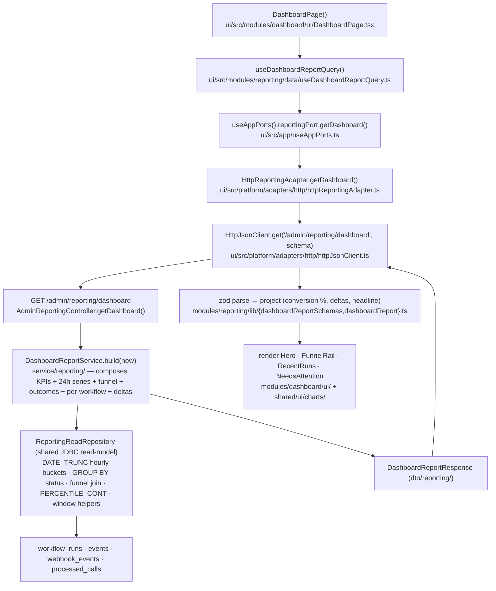
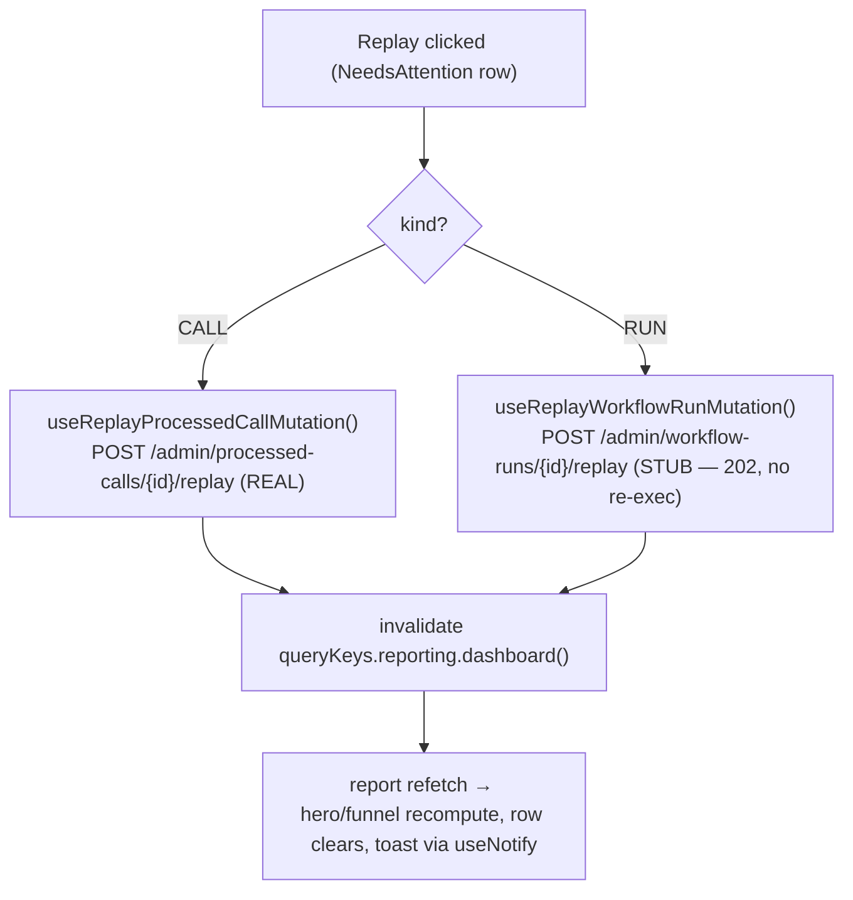

# Implementation Plan — Reporting

See [`research.md`](./research.md) for the design spec, the data ↔ backend reconciliation, and the reuse
inventory; [`phases.md`](./phases.md) for the tracker. **Full-stack.** This feature establishes the **reporting
module** (backend reporting model + FE reporting data seam) and ships the **health dashboard** as its first
surface. **Part A = backend reporting model. Part B = the dashboard surface** (consuming Part A). A lands first
(or the DTO contract is frozen first and B mocks it).

## Structural rule (D4 — reporting-module-first)
Everything is shaped so a **future report type is additive**, not a refactor:
- **Backend:** one reporting package, `/admin/reporting/**`, a report service per report over a **shared
  read-model** (reusable time-window / hourly-bucket / delta helpers). Adding `…/workflow-actions` later =
  a new service method + DTO + controller method, reusing the helpers.
- **Frontend:** `modules/reporting/` owns the **data seam** (one `reportingPort`, per-report schemas +
  projections + hooks) and the **future dedicated report pages** (`ui/<report>/`). Adding a report later = a new
  port method + schema + hook + page. **The landing dashboard stays in `modules/dashboard/`** and *consumes* the
  reporting seam. **Charts live in `shared/ui/charts/`** (shared by all report surfaces).

## Repo decisions impact

**No new repo decision.** Consumes existing `Accepted` decisions:
- **RD-004 (admin auth = JWT bearer):** `GET /admin/reporting/dashboard` and the stub
  `POST /admin/workflow-runs/{id}/replay` ride the existing `@PreAuthorize` / JWT layer.
- **RD-006 (engine-echo exclusion, safe-by-default):** reporting is **read-only aggregation** — counts rows,
  emits **no** domain events, triggers no engine writes. The stub run-replay **must not** re-execute or emit
  events until the real feature lands.
- **RD-005 (product name):** the dashboard renders in-shell (no full-page lockup); the centralized wordmark is
  not involved.

(Each phase's `phase-<n>-implementation.md` restates this impact note per the workflow.)

## Lifecycle diagram

### Dashboard load → reporting read path (the data flows through the reporting module)

### Replay (worklist action)

---

# Part A — Backend reporting model

## Architecture
- **Shared read-model first.** `ReportingReadRepository` (JDBC, mirroring `JdbcWebhookFeedReadRepository`) holds
  reusable aggregate building blocks — hourly `DATE_TRUNC` bucketing, `GROUP BY status` counts, prior-window
  helpers for deltas, the funnel join, `PERCENTILE_CONT`. **Every future report reuses these**, so the heavy SQL
  lives in one place out of JPA.
- **A report service per report.** `DashboardReportService.build(now)` composes the dashboard DTO from the
  read-model (24h window + prior 24–48h window → deltas). Future reports add their own service class.
- **`DashboardReportResponse` DTO** (under `dto/reporting/`): `kpis` (runs24, success rate, p50, open failures,
  outcome counts — each with a prior-window delta), `throughput[24]` (hourly events/runs/success%), `funnel`
  (ingested/events/runs/failed + conversion %), `outcomes[]` (24h status breakdown), `perWorkflow[]`,
  `recentRuns[]` (reuse run-summary shape), `attention[]` (open failures: kind RUN/CALL, ref, reason, retries?,
  ago, workflow).
- **`AdminReportingController`** — `/admin/reporting/**`; `GET …/dashboard` now (`@PreAuthorize`, RD-004).
- **Stub `POST /admin/workflow-runs/{id}/replay`** on `AdminWorkflowRunController` — 202 for FAILED, 409
  otherwise, 404 missing; **no re-execution, no event emission** (documented stub).
- **Honesty (D2):** any datum with no real source (per-run retries, "replayed today") is `null`/omitted in the
  DTO and rendered as such — never fabricated.

## Phases (A) — each adds its own test
- **A1 — Shared read-model + aggregate SQL:** `ReportingReadRepository` + JDBC impl (hourly series, group-by-
  status counts, funnel join, p50, window helpers). **+ repository/slice test against a seeded schema.**
- **A2 — Dashboard report service + DTOs:** `DashboardReportService.build` (compose 24h + prior window → deltas;
  decide where conversion % is computed and document). **+ service unit test.**
- **A3 — Controller:** `AdminReportingController` `GET /admin/reporting/dashboard`. **+ `@WebMvcTest` (200 shape;
  401 unauth).**
- **A4 — Stub run-replay:** `POST /admin/workflow-runs/{id}/replay` (202 FAILED only; no re-exec/emit).
  **+ controller test pinning the stub contract.**

### Files (A)
**New:** `controller/AdminReportingController.java`; `service/reporting/DashboardReportService.java`;
`persistence/repository/reporting/ReportingReadRepository.java` (+ `Jdbc…Impl`); `dto/reporting/*` (response
records). **Edited:** `controller/AdminWorkflowRunController.java` (+ stub replay).
**Naming is report-agnostic** (`reporting`, not `dashboard`) so siblings drop in.

---

# Part B — Dashboard surface (consumes the reporting module)

## Architecture
- **Reporting data seam (`modules/reporting/` + `platform/`):** `platform/ports/reportingPort.ts`
  (`getDashboard()` now, future methods later) + `httpReportingAdapter` (real GET → Zod → project),
  `container.ts` registration, `queryKeys.reporting.dashboard()`. `modules/reporting/lib/`
  (`dashboardReportSchemas.ts`, `dashboardReport.ts` projection) + `modules/reporting/data/`
  (`useDashboardReportQuery.ts`). Future report pages live under `modules/reporting/ui/<report>/`.
- **Projection (`modules/reporting/lib/dashboardReport.ts`):** derive conversion % (if not server-sent), format
  deltas (`+8%`/`+0.3pt`), and the headline ("Healthy"/"All clear") + dynamic subtitle from the open-failure
  count — all from the snapshot numbers so replay recompute is automatic.
- **Charts (greenfield, `shared/ui/charts/`):** `AreaChart` (smooth brand line + gradient fill + baseline + end
  marker) and `Sparkbars` (8 bars, last-2 highlighted) — pure token-driven SVG; decorative motion guarded by
  `prefers-reduced-motion`. Shared so future reports reuse them.
- **Dashboard sections (`modules/dashboard/ui/`):** `Hero`, `FunnelRail`, `RecentRunsCard` (reuse `DataTable`
  ledger), `NeedsAttentionCard` (ConfirmDialog + `useNotify`; call replay real, run replay via the stub hook).
  The page **drops the panel + inspector** (no `useShellRegionRegistration`) — full-width per the design.
- **Replay:** reuse `useReplayProcessedCallMutation` (calls); add `useReplayWorkflowRunMutation` → the stub
  endpoint; both invalidate `queryKeys.reporting.dashboard()`.

## Phases (B) — each adds its own test
- **B1 — Reporting data seam + projection:** schemas, `reportingPort`/`httpReportingAdapter`/DI/queryKeys,
  `useDashboardReportQuery`, `dashboardReport.ts` (conversion %, deltas, headline). **+ projection + hook tests.**
- **B2 — Shared chart primitives:** `shared/ui/charts/{AreaChart,Sparkbars}.tsx`. **+ render/shape tests
  (path geometry, reduced-motion).**
- **B3 — Hero:** kicker, headline + live pill, stat strip with deltas, throughput chart, live readout. **+ test.**
- **B4 — Funnel rail:** 4 stages + connectors + conversion %, sparkbars. **+ test (conversion math, Failed tone).**
- **B5 — Recent Runs + Needs attention:** ledger table → run detail; worklist replay (call real / run stub) →
  ConfirmDialog → toast → invalidate. **+ test (replay confirm fires the right mutation; empty state).**
- **B6 — Assemble + copy + wire-in:** rebuild `modules/dashboard/ui/DashboardPage.tsx` (drop panel/inspector;
  consume the reporting hook), extend `uiText.dashboard`, keep the route. **+ page test.**
- **B7 — Gate + browser-verify:** `npm run check` + `./mvnw test` green; live verify against the real backend
  (light/dark; real numbers; replay recompute).

### Files (B)
**New:** `platform/ports/reportingPort.ts`; `platform/adapters/http/httpReportingAdapter.ts`;
`modules/reporting/lib/{dashboardReportSchemas.ts,dashboardReport.ts}`;
`modules/reporting/data/useDashboardReportQuery.ts`; `shared/ui/charts/{AreaChart,Sparkbars}.tsx`;
`modules/dashboard/ui/{Hero,FunnelRail,RecentRunsCard,NeedsAttentionCard}.tsx`;
`modules/workflow-runs/data/useReplayWorkflowRunMutation.ts`; matching `src/test/*`.
**Edited:** `modules/dashboard/ui/DashboardPage.tsx` (rebuild), `platform/container.ts`,
`platform/query/queryKeys.ts`, `shared/constants/uiText.ts`, `shared/ui/index.ts`.
**Likely removed:** `modules/dashboard/lib/dashboardSnapshot.ts` + `data/useDashboardSnapshotQuery.ts` (replaced
by the reporting hook) — confirm no other consumer.

---

## Verification (both parts)
- **Backend:** `./mvnw test` — new read-model/service/controller tests green; the stub replay contract pinned.
- **Frontend:** `cd ui && npm run check` → lint + lint:tokens (no hex) + knip + build + test all green; new specs
  (projection, charts, sections, page) pass.
- **Browser (preview MCP), against the real backend (authenticated):** real KPIs + a real 24h chart + funnel with
  live conversion %; recent-runs row → detail; replaying a CALL clears it + toast + recompute (real); replaying a
  RUN hits the stub (202) + toast + recompute; dark mode; `prefers-reduced-motion` stills the ticker/sparkbars.

## Future (separate features that reuse this module — see README)
The dedicated report pages (workflow-actions, agent-activity) — new `reportingPort` method + DTO +
`AdminReportingController` method + `modules/reporting/ui/<report>/` page, reusing the shared read-model and
chart primitives. Also: real workflow-run replay execution; webhook per-status pipeline tracking; real per-run
retry history.
