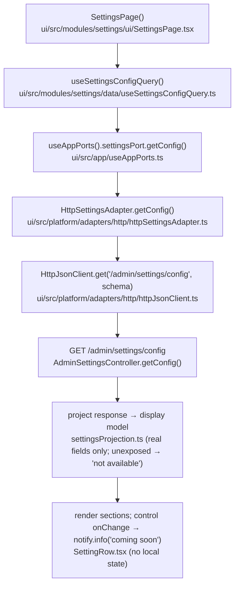
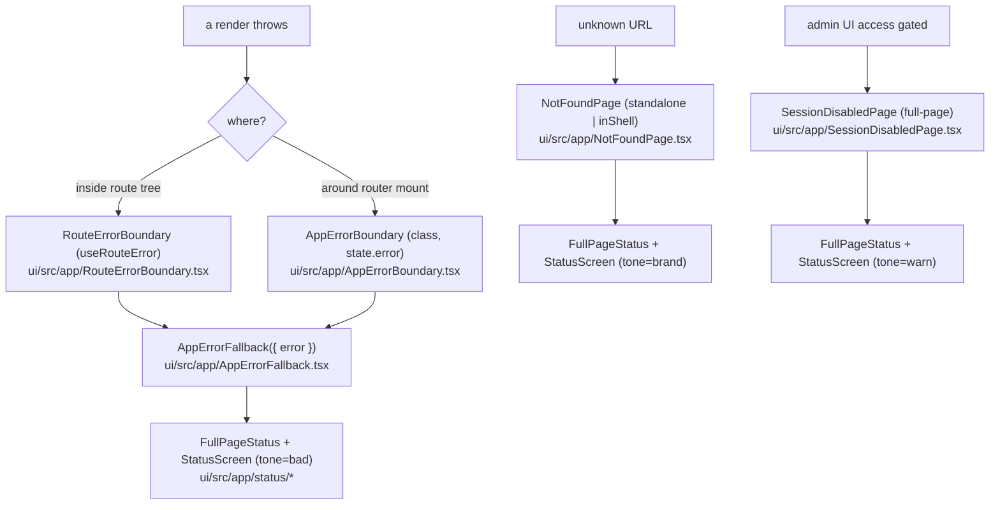

# Implementation Plan — Settings + Status Screens

See [`research.md`](./research.md) for specs/findings (incl. the review-resolved decisions A–F),
[`phases.md`](./phases.md) for the tracker. Frontend-only. **Part A = Settings page. Part B = Status
screens.** Independent; build in either order.

## Repo decisions impact

**No new repo decision.** This feature consumes existing `Accepted` decisions:
- **RD-004 (admin auth = JWT bearer):** the Settings read (`GET /admin/settings/config`) and all guarded
  routes ride the existing JWT / `@PreAuthorize` layer — no parallel auth.
- **RD-005 (product name → Throughline, Provisional):** the status/auth lockup renders the existing
  centralized wordmark (`uiText.authShell.wordmark`); **no new "Automation Engine" literals**, so the pending
  rename stays single-source.
- **RD-006 (engine-echo exclusion, safe-by-default):** the `engine.write.emit-events` flag is RD-006-governed
  and is **not** returned by the read endpoint; the page **must not fabricate** its value (shows "not
  available yet"), so it never misrepresents the echo-safety posture.

(Each `phase-<n>-implementation.md` will restate this impact note per the workflow.)

## Lifecycle diagrams

### Settings read path

### Status / error boundary path

---

# Part A — Settings page

## Architecture
- **`SettingsPort { getConfig(): SettingsConfig }`** (read only, real). `updateConfig(...)` documented as the
  **future write seam** (added with a mutation hook + the Save/Reset dirty bar when the backend `PUT` lands).
- **`HttpSettingsAdapter.getConfig`** validates the live GET (Zod) and **projects only the real fields** into
  a display `SettingsConfig`; unexposed flags + managed-webhooks are modelled as **absent → "not available
  yet"** (no mock fill, no fabricated values).
- **Zero local form state** — controls are controlled by the query data; a change attempt fires
  `notify.info("This editing feature is coming soon.")` and does not mutate (snaps back to the query value).
- **`Toggle`** wraps `@radix-ui/react-switch`; on this page it's controlled-by-query with its change handler
  gated to the coming-soon notice.

## Phases (A) — each adds its own test
- **A1 — Foundation (`modules/settings/lib`):** Zod schema for the GET response; display `SettingsConfig`
  type (fields can be "present" or "not available"); `SETTINGS_SECTIONS` metadata (copy from `uiText`);
  `settingsProjection.ts` (response → display, **no mock fill**). **+ projection unit test.**
- **A2 — Platform seam:** `platform/ports/settingsPort.ts` (getConfig; documented updateConfig seam);
  `platform/adapters/http/httpSettingsAdapter.ts` (real GET only); register in `container.ts`;
  `queryKeys.settings.config`.
- **A3 — Data hook:** `modules/settings/data/useSettingsConfigQuery.ts`.
- **A4 — Primitive + icons:** `shared/ui/Toggle.tsx` (wrap `@radix-ui/react-switch`; add dep) + barrel;
  `SettingsIcon` + `RefreshIcon` in `icons.tsx` + barrel. **+ Toggle unit test.**
- **A5 — UI (`modules/settings/ui`):** `SettingRow` (toggle/number/select/text + read-only secret status +
  "not available" rows), `ManagedWebhooksCard` (real-data table or "not available" empty state),
  `SettingsPage` (Panel "Configuration" section-nav; controls controlled-by-query; coming-soon gate).
  `max-w-[720px]`. **+ page test (renders real values, section switch, interaction fires coming-soon,
  unexposed → "not available").**
- **A6 — Wire-in:** `routes.ts` (`AppNavKey += 'settings'`, `routes.settings`, `appNavItems`), `router.tsx`
  (route under `AuthGuard`), `AppRail.tsx` (`NAV_ICONS.settings`), `uiText.ts`
  (`settings` namespace + `nav.settings` + `comingSoon` + "not available" copy). **+ routing/nav test.**
- **A7 — Gate:** `npm run check` green; browser-verify.

### Files (A)
**New:** `modules/settings/lib/{settingsSchemas,settingsSections,settingsProjection}.ts`;
`modules/settings/data/useSettingsConfigQuery.ts`;
`modules/settings/ui/{SettingsPage,SettingRow,ManagedWebhooksCard}.tsx`;
`platform/ports/settingsPort.ts`; `platform/adapters/http/httpSettingsAdapter.ts`; `shared/ui/Toggle.tsx`;
`src/test/{settings-projection.test.ts,settings-page.test.tsx}`.
**Edited:** `platform/container.ts`, `platform/query/queryKeys.ts`, `shared/constants/routes.ts`,
`app/router.tsx`, `shared/ui/AppRail.tsx`, `shared/ui/icons.tsx`, `shared/ui/index.ts`,
`shared/constants/uiText.ts`, `package.json` (`@radix-ui/react-switch`).

---

# Part B — Status screens

## Architecture
- **One shared shell + one renderer.** `FullPageStatus` (gradient + lockup + centered slot, `isolation:
  isolate`) wraps `StatusScreen` (Direction B). The 3 pages = thin wrappers passing tone + copy + actions.
- **Placement:** `src/app/status/` (consumers all in `src/app`; must stay router-hook-free for
  `AppErrorFallback`). Glyphs → shared `icons.tsx`; `useRise` → `shared/lib`.
- **Lockup wordmark:** render the existing `uiText.authShell.wordmark` (RD-005 single-source).
- **Gradient:** the status family gets its **own** constant (handoff values + `var(--color-bg)` base); **do
  not** refactor `AuthShell` onto it.

## Phases (B) — each adds its own test
- **B1 — Shared foundation:** `src/app/status/FullPageStatus.tsx` (own handoff-value gradient; lockup via
  centralized wordmark); `shared/lib/useRise.ts` (transform-only WAAPI + reduced-motion guard); glyphs in
  `icons.tsx` + barrel. **+ FullPageStatus/useRise test.**
- **B2 — Content renderer:** `src/app/status/StatusScreen.tsx` (tone map, `PillEyebrow`, `StatusStrip`, quiet
  link, `Actions`, watermark). **+ renderer test.**
- **B3 — `AppErrorFallback` + error threading:** rebuild as `({ error? })` (bad tone); Reload + plain `<a>`;
  dev-only `ErrorDetails`. Thread error from `RouteErrorBoundary` + `AppErrorBoundary`. No router hooks.
  **+ test: renders without a router; `ErrorDetails` only in DEV.**
- **B4 — `NotFoundPage`:** brand tone, "404" watermark, real-path strip; standalone + `inShell` (wire the
  in-shell `*` route to pass `inShell`). **+ standalone vs inShell test.**
- **B5 — `SessionDisabledPage`:** warn tone, lock, helper, no primary. **Renders full-page** — move the route
  so it renders **outside `AppShell`** (Decision D); the shell shouldn't frame a "access disabled" screen.
  **+ test (no primary action; full-page).**
- **B6 — Copy:** extend `uiText` (`appError` / `notFound` / `session`) with eyebrows, titles, bodies, strip
  texts, helper, action + error-details labels. **+ copy-consumed assertions in the page tests.**
- **B7 — Gate:** `npm run check` green; browser-verify (light/dark/in-shell).

### Files (B)
**New:** `src/app/status/{FullPageStatus,StatusScreen}.tsx`; `shared/lib/useRise.ts`;
`src/test/status-screens.test.tsx`.
**Edited:** `src/app/{AppErrorFallback,NotFoundPage,SessionDisabledPage,RouteErrorBoundary,AppErrorBoundary}.tsx`;
`src/app/router.tsx` (pass `inShell`/error; move session-disabled out of `AppShell`); `shared/ui/icons.tsx` +
`shared/ui/index.ts`; `shared/constants/uiText.ts`.

---

## Verification (both parts)
- `cd ui && npm run check` → lint + lint:tokens (no hex) + knip (no dead exports) + build + test all green.
- New Vitest specs pass (Settings projection + page incl. "not available" + coming-soon; status-screens incl.
  router-free `AppErrorFallback`).
- **Browser (preview MCP):**
  - **Settings** — `/admin-ui/settings`: section-nav switches; real values render; unexposed flags +
    managed-webhooks show "not available yet"; changing a control fires "This editing feature is coming
    soon."; dark-mode flip; rail icon active.
  - **Status** — thrown error (fallback); unknown top-level URL (standalone 404) + unknown `/admin-ui/*`
    (in-shell 404); `/admin-ui/session-disabled` (full-page). Verify gradient, ghost-glyph watermark, console
    strip, lockup, entrance rise, dark mode. Screenshots.

## Future (unblocks Settings editing) — see README "Out of scope"
When the backend write path lands: add `SettingsPort.updateConfig`, `useUpdateSettingsMutation`, the design's
Save/Reset dirty bar + "Settings saved" toast, switch controls to editable, and remove the coming-soon gate.
