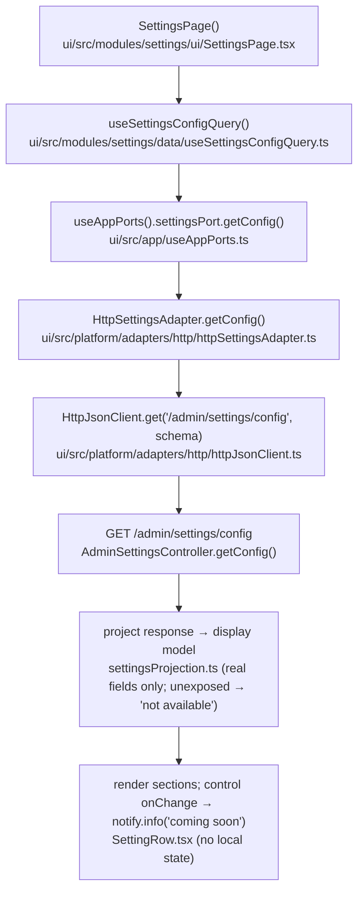
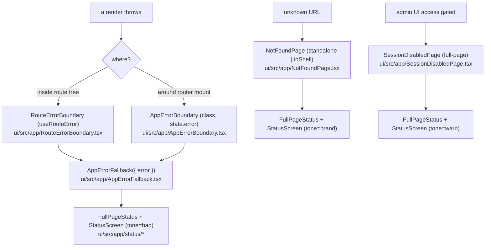

# Plan + Research — Settings + Status Screens

Design + research for the feature. Specs/findings and the review-resolved decisions A–G are in the
[Research](#research--settings--status-screens) section below (absorbed on archive); per-phase narrative is in
[`implementation-log.md`](./implementation-log.md); entry point + tracker in [`README.md`](./README.md).
Frontend-only. **Part A = Settings page. Part B = Status screens.** Independent; build in either order.

## Repo decisions impact

**No new repo decision.** This feature consumes existing `Accepted` decisions:
- **RD-004 (admin auth = JWT bearer):** the Settings read (`GET /admin/settings/config`) and all guarded
  routes ride the existing JWT / `@PreAuthorize` layer — no parallel auth.
- **RD-005 (product name → Throughline, Provisional):** the status/auth lockup renders the existing
  centralized wordmark (`uiText.authShell.wordmark`); **no new "Automation Engine" literals**, so the pending
  rename stays single-source.
- **RD-006 (engine-echo exclusion, safe-by-default):** the `engine.write.emit-events` flag is RD-006-governed
  and is **not** returned by the read endpoint; the page **must not fabricate** its value (shows "not
  available yet"), so it never misrepresents the echo-safety posture.

(Each phase's section in [`implementation-log.md`](./implementation-log.md) restates this impact note.)

## Lifecycle diagrams

### Settings read path

### Status / error boundary path

---

# Part A — Settings page

## Architecture
- **`SettingsPort { getConfig(): SettingsConfig }`** (read only, real). `updateConfig(...)` documented as the
  **future write seam** (added with a mutation hook + the Save/Reset dirty bar when the backend `PUT` lands).
- **`HttpSettingsAdapter.getConfig`** validates the live GET (Zod) and **projects only the real fields** into
  a display `SettingsConfig`; unexposed flags + managed-webhooks are modelled as **absent → "not available
  yet"** (no mock fill, no fabricated values).
- **Zero local form state** — controls are controlled by the query data; a change attempt fires
  `notify.info("This editing feature is coming soon.")` and does not mutate (snaps back to the query value).
- **`Toggle`** wraps `@radix-ui/react-switch`; on this page it's controlled-by-query with its change handler
  gated to the coming-soon notice.

## Phases (A) — each adds its own test
- **A1 — Foundation (`modules/settings/lib`):** Zod schema for the GET response; display `SettingsConfig`
  type (fields can be "present" or "not available"); `SETTINGS_SECTIONS` metadata (copy from `uiText`);
  `settingsProjection.ts` (response → display, **no mock fill**). **+ projection unit test.**
- **A2 — Platform seam:** `platform/ports/settingsPort.ts` (getConfig; documented updateConfig seam);
  `platform/adapters/http/httpSettingsAdapter.ts` (real GET only); register in `container.ts`;
  `queryKeys.settings.config`.
- **A3 — Data hook:** `modules/settings/data/useSettingsConfigQuery.ts`.
- **A4 — Primitive + icons:** `shared/ui/Toggle.tsx` (wrap `@radix-ui/react-switch`; add dep) + barrel;
  `SettingsIcon` + `RefreshIcon` sourced from **`lucide-react`** (add dep) and re-exported via `icons.tsx`
  at stroke `1.8`. **+ Toggle unit test.**
- **A5 — UI (`modules/settings/ui`):** `SettingRow` (toggle/number/select/text + read-only secret status +
  "not available" rows), `ManagedWebhooksCard` (real-data table or "not available" empty state),
  `SettingsPage` (Panel "Configuration" section-nav; controls controlled-by-query; coming-soon gate).
  `max-w-[720px]`. **+ page test (renders real values, section switch, interaction fires coming-soon,
  unexposed → "not available").**
- **A6 — Wire-in:** `routes.ts` (`AppNavKey += 'settings'`, `routes.settings`, `appNavItems`), `router.tsx`
  (route under `AuthGuard`), `AppRail.tsx` (`NAV_ICONS.settings`), `uiText.ts`
  (`settings` namespace + `nav.settings` + `comingSoon` + "not available" copy). **+ routing/nav test.**
- **A7 — Gate:** `npm run check` green; browser-verify.

### Files (A)
**New:** `modules/settings/lib/{settingsSchemas,settingsSections,settingsProjection}.ts`;
`modules/settings/data/useSettingsConfigQuery.ts`;
`modules/settings/ui/{SettingsPage,SettingRow,ManagedWebhooksCard}.tsx`;
`platform/ports/settingsPort.ts`; `platform/adapters/http/httpSettingsAdapter.ts`; `shared/ui/Toggle.tsx`;
`src/test/{settings-projection.test.ts,settings-page.test.tsx}`.
**Edited:** `platform/container.ts`, `platform/query/queryKeys.ts`, `shared/constants/routes.ts`,
`app/router.tsx`, `shared/ui/AppRail.tsx`, `shared/ui/icons.tsx`, `shared/ui/index.ts`,
`shared/constants/uiText.ts`, `package.json` (`@radix-ui/react-switch`, `lucide-react`).

---

# Part B — Status screens

## Architecture
- **One shared shell + one renderer.** `FullPageStatus` (gradient + lockup + centered slot, `isolation:
  isolate`) wraps `StatusScreen` (Direction B). The 3 pages = thin wrappers passing tone + copy + actions.
- **Placement:** `src/app/status/` (consumers all in `src/app`; must stay router-hook-free for
  `AppErrorFallback`). Glyphs → shared `icons.tsx`; `useRise` → `shared/lib`.
- **Lockup wordmark:** render the existing `uiText.authShell.wordmark` (RD-005 single-source).
- **Gradient:** the status family gets its **own** constant (handoff values + `var(--color-bg)` base); **do
  not** refactor `AuthShell` onto it.

## Phases (B) — each adds its own test
- **B1 — Shared foundation:** `src/app/status/FullPageStatus.tsx` (own handoff-value gradient; lockup via
  centralized wordmark); `shared/lib/useRise.ts` (transform-only WAAPI + reduced-motion guard); status glyphs
  from **`lucide-react`** re-exported via `icons.tsx` (alert-triangle, compass, lock, chevron-left,
  chevron-down) at the handoff stroke widths. **+ FullPageStatus/useRise test.**
- **B2 — Content renderer:** `src/app/status/StatusScreen.tsx` (tone map, `PillEyebrow`, `StatusStrip`, quiet
  link, `Actions`, watermark). **+ renderer test.**
- **B3 — `AppErrorFallback` + error threading:** rebuild as `({ error? })` (bad tone); Reload + plain `<a>`;
  dev-only `ErrorDetails`. Thread error from `RouteErrorBoundary` + `AppErrorBoundary`. No router hooks.
  **+ test: renders without a router; `ErrorDetails` only in DEV.**
- **B4 — `NotFoundPage`:** brand tone, "404" watermark, real-path strip; standalone + `inShell` (wire the
  in-shell `*` route to pass `inShell`). **+ standalone vs inShell test.**
- **B5 — `SessionDisabledPage`:** warn tone, lock, helper, no primary. **Renders full-page** — move the route
  so it renders **outside `AppShell`** (Decision D); the shell shouldn't frame a "access disabled" screen.
  **+ test (no primary action; full-page).**
- **B6 — Copy:** extend `uiText` (`appError` / `notFound` / `session`) with eyebrows, titles, bodies, strip
  texts, helper, action + error-details labels. **+ copy-consumed assertions in the page tests.**
- **B7 — Gate:** `npm run check` green; browser-verify (light/dark/in-shell).

### Files (B)
**New:** `src/app/status/{FullPageStatus,StatusScreen}.tsx`; `shared/lib/useRise.ts`;
`src/test/status-screens.test.tsx`.
**Edited:** `src/app/{AppErrorFallback,NotFoundPage,SessionDisabledPage,RouteErrorBoundary,AppErrorBoundary}.tsx`;
`src/app/router.tsx` (pass `inShell`/error; move session-disabled out of `AppShell`); `shared/ui/icons.tsx` +
`shared/ui/index.ts`; `shared/constants/uiText.ts`; `package.json` (`lucide-react`, if not already added in A4).

---

## Verification (both parts)
- `cd ui && npm run check` → lint + lint:tokens (no hex) + knip (no dead exports) + build + test all green.
- New Vitest specs pass (Settings projection + page incl. "not available" + coming-soon; status-screens incl.
  router-free `AppErrorFallback`).
- **Browser (preview MCP):**
  - **Settings** — `/admin-ui/settings`: section-nav switches; real values render; unexposed flags +
    managed-webhooks show "not available yet"; changing a control fires "This editing feature is coming
    soon."; dark-mode flip; rail icon active.
  - **Status** — thrown error (fallback); unknown top-level URL (standalone 404) + unknown `/admin-ui/*`
    (in-shell 404); `/admin-ui/session-disabled` (full-page). Verify gradient, ghost-glyph watermark, console
    strip, lockup, entrance rise, dark mode. Screenshots.

## Future (unblocks Settings editing) — see README "Out of scope"
When the backend write path lands: add `SettingsPort.updateConfig`, `useUpdateSettingsMutation`, the design's
Save/Reset dirty bar + "Settings saved" toast, switch controls to editable, and remove the coming-soon gate.

---

## Research — Settings + Status Screens

Consolidated findings. **Part A = Settings page. Part B = Status screens.**
Decisions resolved during the design review are listed in [§ Review-resolved decisions](#review-resolved-decisions).

---

## Part A — Settings page

### A1. Authoritative design spec

**Source of truth = the design-system kit** (`ui/AGENTS.md`):
`Automation Engine Design System/ui_kits/automation-engine/screens-settings.jsx` (+ `HANDOFF.md`).

- **Layout:** four-region shell. Panel = "Configuration" section-nav (4 buttons; active pill
  `--color-brand-soft` bg + `--color-brand` text). Content = one card per active section, `max-width ~720px`.
  **No inspector.**
- **Header:** title "Settings", subtitle "Platform configuration for this workspace."
- **Sections:** Business hours · Feature flags · Connections · Managed webhooks (controls + copy per the kit).

> Superseded: `ui/Docs/ui-product-design-proposal.md:202` (older 2-tab read-only variant) — the kit wins.

### A2. Backend read contract (real, today)

`GET /admin/settings/config` — `AdminSettingsController` → `AdminSettingsService` → `SettingsConfigResponse`.
- Roles ADMIN/OPERATOR/VIEWER; 401 unauthenticated. **Read-only by design.** No POST/PUT/PATCH.
- Shape (confirmed by `AdminSettingsControllerTest`): `businessHours{timezone,startHour,endHour,weekdaysOnly}`,
  `fubConnection{baseUrl,apiKey{present,value},xSystem,xSystemKey{...}}`, `fubRetry{...}`,
  `webhook{maxBodyBytes,sources{enabled,signingKey{...}},liveFeed...}`, `callRules{...}`.
- **Secrets redacted:** `Redactable{present, value:"***"|null}`.

### A3. Design ↔ backend reconciliation — show only real data

The page renders **only what the backend actually returns**. Fields the design shows but the endpoint does
**not** expose are surfaced as an explicit **"not available yet"** state — **never fabricated**. (This honors
the UI rule *"do not invent UI-only backend behavior"* and avoids misrepresenting safety-relevant config.)

| Design section | Backend reality | Treatment |
|---|---|---|
| **Business hours** (4 fields) | `businessHours{...}` — exact match | Real values, read-only display. |
| **Connections** | `fubConnection{...}`, secrets redacted | Real values; secrets show **Configured / Not configured**. |
| **Feature flags** (4) | Only `webhook.sources.enabled` returned | Backed flag shown (read-only); the other **3 → "not available yet"** (no fabricated value). |
| **Managed webhooks** | **No endpoint** | Section shows a **"not available yet"** empty state — **no mock rows**. |
| `fubRetry`, `callRules`, webhook body/heartbeat | Returned, not in the kit | Not shown. |

**RD-006 note (engine-echo safety):** one unexposed flag is `engine.write.emit-events`, the engine-echo
control governed by `RD-006` (safe-by-default, platform-gated). Because the endpoint doesn't return it,
fabricating a value (e.g. `false`) could tell an operator echo-emission is OFF when its real state is
**unknown**. It therefore renders "not available yet", never a guessed value.

### A4. Editing model — "coming soon", zero local state

Editing is **not functional** this pass. Per the UI rule *"keep server state in TanStack Query; avoid
duplicating fetched data in local component state"*, the page holds **no local form state**:
- Controls are **controlled by the query data** (`checked`/`value` come straight from `useSettingsConfigQuery`).
- A change attempt fires `notify.info("This editing feature is coming soon.")` and **does not mutate** — the
  control snaps back to the query value (nothing to persist, nothing to copy locally).
- The write seam (`SettingsPort.updateConfig` + the design's Save/Reset dirty bar + a mutation hook) is the
  documented drop-in for when the backend `PUT` lands.

### A5. Conventions to reuse (Settings)

- **Central API layer:** `platform/adapters/http/httpJsonClient.ts`, `platform/container.ts` (`appPorts`),
  `app/useAppPorts.ts`.
- Module shape `modules/<feature>/{data,lib,ui}`; port/adapter/DI; `queryKeys.ts`; `useQuery`
  (mirror `useDashboardSnapshotQuery`); `useShellRegionRegistration`; `uiText.ts` (centralized copy);
  `shared/ui` primitives (`PageHeader`, `PageCard`, `DataTable`, `StatusBadge`, `Button`, `Input`, `Select`);
  `useNotify`; routing in `routes.ts` + `router.tsx` + `AppRail.tsx`.
- **`Toggle` primitive — wrap `@radix-ui/react-switch`** (no switch dep yet; the repo already wraps Radix
  `dialog`/`popover`/`tabs`, so a Radix wrapper is the established pattern and gives a11y for free). Add the
  dep; export the wrapper from the barrel. On this page the Toggle is rendered controlled-by-query with its
  change handler gated to the coming-soon notice.
- Add `SettingsIcon` (rail) + `RefreshIcon` ("Sync now") to `icons.tsx`.

---

## Part B — Status screens

### B1. Design handoff (source of truth)

`ui/Automation Engine Design System/design_handoff_status_screens/`:
- `README.md` (spec). `reference/status-screens.jsx` (component reference — recreate, don't copy).
- `reference/status.css` — `.aestatus-root { isolation: isolate }` + link/details hover; motion is
  **JS-driven (WAAPI)**, never CSS opacity.
- `reference/final.html` + `final-canvas.jsx` — gallery harness (reference only); confirms ship =
  **all three `variant="B" strip`**, in-shell 404 = `<NotFoundPage inShell />`, dark = `data-theme="dark"`.

**Chosen direction:** Direction **B + console strip**.

### B2. Shared shell — `FullPageStatus`

1. **Ambient brand gradient** (handoff values — see § gradient caveat):
   `radial-gradient(760px 360px at 50% -14%, color-mix(in srgb, var(--color-brand) 13%, transparent), transparent 64%),`
   `radial-gradient(560px 300px at 86% 114%, color-mix(in srgb, var(--color-brand-2) 10%, transparent), transparent 60%), var(--color-bg)`
2. **Brand lockup** pinned top-center: `LogoMarkIcon` + wordmark. **Reuse the existing centralized wordmark
   strings** (`uiText.authShell.wordmark` / `wordmarkSub`) — do **not** introduce new "Automation Engine"
   literals (`RD-005` renames the product to *Throughline*; keep the rename single-source).
3. **Centered content slot** (`flex:1`, padding `104px 40px 56px`).
- Props: `inShell` (gradient→transparent + drop lockup, padding `32px`), `hideLockup`.
- Root sets **`isolation: isolate`**.

#### Tones (`TONES`)
| tone | fg | bg | eyebrow |
|---|---|---|---|
| `bad` | `--color-status-bad` | `--color-status-bad-bg` | `ERROR` |
| `warn` | `--color-status-warn` | `--color-status-warn-bg` | `RESTRICTED` |
| `brand` | `--color-brand` | `--color-brand-soft` | `404 · NOT FOUND` |

### B3. Direction B body

- **Ghost-glyph watermark** (`aria-hidden`, absolute, `translate(-50%,-56%)`, `tone.fg`, `opacity 0.07`):
  error → alert-triangle (372, sw 1.1); session → lock; 404 → **"404" numerals** (`--font-ui` 800, 300px, `-.04em`).
- **Foreground stack** (`max-width 560`): PillEyebrow → Title (`h1` 32/800/`-.025em`) → Body (15/1.55 muted,
  `42ch`) → optional Helper → **StatusStrip** (mono console strip) → Actions → optional Extra.

### B4. Per-page spec

- **`AppErrorFallback`** (bad): alert-triangle; "Something went wrong"; strip `BOUNDARY · render error caught · 500`;
  primary **Reload**, secondary **plain `<a href="/admin-ui">`** (not a router link); dev-only `ErrorDetails`
  (`error.message`+`error.stack`, `import.meta.env.DEV` only). **Signature `({ error?: unknown })`, no router hooks.**
- **`NotFoundPage`** (brand): compass + **"404" watermark**; "Page not found"; strip `GET <attempted path> · 404`
  (real path via `useLocation`); primary router link → `/admin-ui`, secondary **Back** (`history.back()`).
  **Standalone + `inShell`.**
- **`SessionDisabledPage`** (warn): lock; "Admin access is disabled"; helper emphasizing "workspace
  administrator"; strip `GUARD · admin-ui access disabled`; **no primary**, quiet **Return to sign in**.
  **Renders full-page** (see Decision D below).

### B5. Current repo state + wiring (being replaced)

- `src/app/AppErrorFallback.tsx` — plain `Button` + plain `<a>`; **no `error` prop / no `ErrorDetails`** yet;
  already router-hook-free.
- `src/app/NotFoundPage.tsx` — plain + a router `<Link>`; no in-shell variant.
- `src/app/SessionDisabledPage.tsx` — currently renders **inside `AppShell`** (shell-region + `PageCard`).
- Fallback consumers: `RouteErrorBoundary` (`useRouteError()`) + `AppErrorBoundary` (class, **outside**
  RouterProvider) — **neither passes the error yet**; the rebuild threads it through for `ErrorDetails`.
- `router.tsx`: top-level `*` (standalone 404) + in-shell `*` under `adminUi` (in-shell 404) both render
  `<NotFoundPage />`; `session-disabled` is an `adminUi` child (inside the shell today).

### B6. Reuse / new (Status screens)

- **Reuse:** `LogoMarkIcon`, `Button` (`size="lg"`), the centralized wordmark, token names.
- **Gradient caveat:** the status family uses its **own** constant with the **handoff** values
  (`760×360 / -14% / brand 13%` + a `var(--color-bg)` base). `AuthShell`'s gradient is *similar but not
  identical* (`700×320 / -10% / brand 12%`, no base) — **leave `AuthShell` untouched**; any unification is a
  separate, deliberate visual change.
- **New glyphs in `shared/ui/icons.tsx`:** alert-triangle, compass, lock, chevron-left, chevron-down.
- **New hook `useRise`:** transform-only WAAPI rise (`translateY(14px)→0`, 540ms, `cubic-bezier(.2,.7,.3,1)`),
  skip on `prefers-reduced-motion`; no opacity, no fill.

### B7. Constraints

- `AppErrorFallback` + `FullPageStatus` **router-hook-free**; dev-only error stack hidden in prod; terminal
  states (no loading/data/forms); keyboard-accessible; ≥44px touch targets.

---

## Review-resolved decisions

Decisions taken during the design review (apply to both parts):

- **A. Wordmark single-source** — status/auth lockups render the existing `uiText.authShell.wordmark` /
  `wordmarkSub`; no new product-name literals (RD-005 rename pending). *Accepted.*
- **B. No fabricated data** — Settings shows only backend-returned values; unexposed flags + managed-webhooks
  render "not available yet". *Accepted.* (RD-006 safety + "don't invent UI-only behavior".)
- **C. Zero local form state** — Settings controls are controlled by the query data; interaction fires the
  coming-soon notice and does not mutate. *Accepted.*
- **D. `SessionDisabledPage` is full-page** — the latest handoff wins over `ui-0.1-plan.md`'s in-shell note;
  the route renders outside `AppShell`. *Accepted (user, this review).*
- **E. `Toggle` wraps `@radix-ui/react-switch`** — consistent with existing Radix wrappers; add the dep. *Accepted.*
- **F. Test-with-each-phase** — every phase that adds code lands its own test (not deferred to the final phase).
  *Accepted.*
- **G. Icons via `lucide-react`** — add `lucide-react` and source the **new** glyphs from it (status:
  alert-triangle, compass, lock, chevron-left, chevron-down; settings: settings, refresh), rendered at the
  handoff's stroke widths (and `1.8` for the rail icon to match neighbours). **Existing hand-rolled icons in
  `icons.tsx` are left untouched** — lucide defaults to `strokeWidth 2` vs the repo's `1.8`, so a wholesale
  migration would thicken every icon app-wide (out of scope; a future cleanup initiative). New glyphs are
  added/re-exported through `icons.tsx` so call sites stay single-sourced. *Accepted (user, this review).*

### Tokens (both parts — all present, light + dark, in `ui/src/styles/tokens.css`)

`--color-bg`, `--color-brand`, `--color-brand-2`, `--color-brand-soft`, `--color-status-bad(-bg)`,
`--color-status-warn(-bg)`, `--color-status-ok(-bg)`, `--color-surface(-alt)`, `--color-border`,
`--color-text(-muted)`, `--color-live`, `--radius-sm/md/pill`, `--shadow-subtle/hover/float`,
`--font-ui`, `--font-mono`. **Never hard-code hex** (`lint:tokens`).
