# Workflow Engine — Technical Implementation Details

> **Parent document:** [workflow-engine-implementation-plan.md](workflow-engine-implementation-plan.md)
>
> This document describes **how** each wave is implemented — database schemas, Java interfaces, method-level data flows, diagrams, and concrete input/output examples. Read the parent document first for the **what** and **why**.

---

## End-to-end data flow (new architecture)

This is the full picture after all waves are complete. Each wave builds toward this.

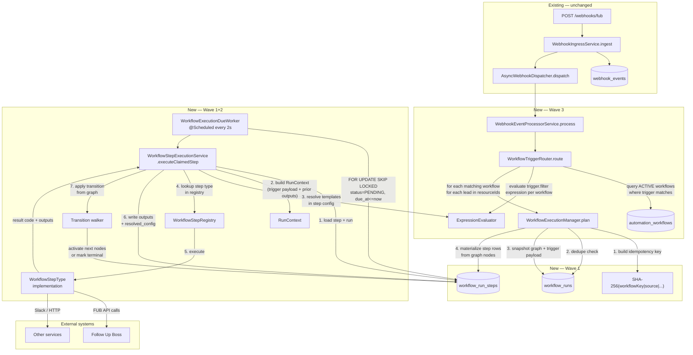

---

## Wave 1 — Engine Foundations

### 1.1 Database migration

**File:** `src/main/resources/db/migration/V{next}__create_workflow_engine.sql`

```sql
-- =============================================================
-- Table: automation_workflows  (workflow definitions)
-- =============================================================
CREATE TABLE automation_workflows (
    id              BIGSERIAL       PRIMARY KEY,
    key             VARCHAR(128)    NOT NULL,
    name            VARCHAR(256)    NOT NULL,
    description     TEXT,
    trigger         JSONB,                              -- filled in Wave 3; nullable until then
    graph           JSONB           NOT NULL,            -- the DAG definition
    status          VARCHAR(16)     NOT NULL,            -- DRAFT | ACTIVE | INACTIVE
    version         BIGINT          NOT NULL DEFAULT 0,  -- @Version optimistic lock
    created_at      TIMESTAMPTZ     NOT NULL DEFAULT NOW(),
    updated_at      TIMESTAMPTZ     NOT NULL DEFAULT NOW(),
    CONSTRAINT chk_automation_workflows_status
        CHECK (status IN ('DRAFT', 'ACTIVE', 'INACTIVE'))
);

-- Only one ACTIVE workflow per key
CREATE UNIQUE INDEX uk_automation_workflows_active_per_key
    ON automation_workflows (key)
    WHERE status = 'ACTIVE';

CREATE INDEX idx_automation_workflows_key
    ON automation_workflows (key, id DESC);


-- =============================================================
-- Table: workflow_runs  (one row per execution)
-- =============================================================
CREATE TABLE workflow_runs (
    id                      BIGSERIAL       PRIMARY KEY,
    workflow_id             BIGINT          NOT NULL,
    workflow_key            VARCHAR(128)    NOT NULL,
    workflow_version        BIGINT          NOT NULL,
    workflow_graph_snapshot  JSONB           NOT NULL,    -- frozen graph at plan time
    trigger_payload         JSONB,                       -- frozen event payload (Wave 2)
    source                  VARCHAR(32)     NOT NULL,
    event_id                VARCHAR(255),
    webhook_event_id        BIGINT,
    source_lead_id          VARCHAR(255),
    status                  VARCHAR(32)     NOT NULL,    -- PENDING | BLOCKED | DUPLICATE_IGNORED | COMPLETED | FAILED
    reason_code             VARCHAR(64),
    idempotency_key         VARCHAR(255)    NOT NULL,
    created_at              TIMESTAMPTZ     NOT NULL DEFAULT NOW(),
    updated_at              TIMESTAMPTZ     NOT NULL DEFAULT NOW(),
    CONSTRAINT uk_workflow_runs_idempotency_key
        UNIQUE (idempotency_key),
    CONSTRAINT fk_workflow_runs_webhook_event
        FOREIGN KEY (webhook_event_id)
        REFERENCES webhook_events (id)
        ON DELETE SET NULL
);

CREATE INDEX idx_workflow_runs_status_created_at
    ON workflow_runs (status, created_at);

CREATE INDEX idx_workflow_runs_workflow_id
    ON workflow_runs (workflow_id, created_at DESC);


-- =============================================================
-- Table: workflow_run_steps  (one row per node instance)
-- =============================================================
CREATE TABLE workflow_run_steps (
    id                      BIGSERIAL       PRIMARY KEY,
    run_id                  BIGINT          NOT NULL,
    node_id                 VARCHAR(128)    NOT NULL,    -- stable ID from graph
    step_type               VARCHAR(128)    NOT NULL,    -- registry key, e.g. "fub_reassign"
    status                  VARCHAR(32)     NOT NULL,    -- PENDING | WAITING_DEPENDENCY | PROCESSING | COMPLETED | FAILED | SKIPPED
    due_at                  TIMESTAMPTZ,
    depends_on_node_ids     JSONB,                       -- e.g. ["wait_claim","wait_comm"] for merge
    pending_dependency_count INTEGER        NOT NULL DEFAULT 0,  -- decremented as deps complete
    config_snapshot         JSONB,                       -- authored config from graph node
    resolved_config         JSONB,                       -- config after template resolution (Wave 2)
    result_code             VARCHAR(64),
    outputs                 JSONB,                       -- step outputs for downstream consumption (Wave 2)
    error_message           VARCHAR(512),
    retry_count             INTEGER         NOT NULL DEFAULT 0,
    stale_recovery_count    INTEGER         NOT NULL DEFAULT 0,
    created_at              TIMESTAMPTZ     NOT NULL DEFAULT NOW(),
    updated_at              TIMESTAMPTZ     NOT NULL DEFAULT NOW(),
    CONSTRAINT fk_workflow_run_steps_run
        FOREIGN KEY (run_id)
        REFERENCES workflow_runs (id)
        ON DELETE CASCADE,
    CONSTRAINT uk_workflow_run_steps_run_node
        UNIQUE (run_id, node_id)
);

-- The claim query: WHERE status='PENDING' AND due_at <= now FOR UPDATE SKIP LOCKED
CREATE INDEX idx_workflow_run_steps_status_due_at
    ON workflow_run_steps (status, due_at);

CREATE INDEX idx_workflow_run_steps_run_id
    ON workflow_run_steps (run_id);
```

**Key differences from the old `policy_execution_steps` table:**

| Old (`policy_execution_steps`) | New (`workflow_run_steps`) | Why |
|---|---|---|
| `step_order INTEGER` | `node_id VARCHAR(128)` | Nodes identified by graph ID, not position |
| `depends_on_step_order INTEGER` (single) | `depends_on_node_ids JSONB` + `pending_dependency_count` | Supports merge points (multiple predecessors) |
| `step_type VARCHAR(64)` (enum name) | `step_type VARCHAR(128)` (registry key) | Registry keys are strings, not Java enums |
| — | `config_snapshot JSONB` | Per-node authored config from the graph |
| — | `resolved_config JSONB` | Config after template resolution (Wave 2) |
| — | `outputs JSONB` | Step outputs for downstream consumption (Wave 2) |
| — | `retry_count INTEGER` | Tracks retries per step (Wave 3) |

---

### 1.2 Graph JSON schema

This is the JSON that lives in `automation_workflows.graph` and `workflow_runs.workflow_graph_snapshot`.

**Example — the existing ASSIGNMENT_FOLLOWUP_SLA_V1 expressed as a workflow graph:**

```json
{
  "schemaVersion": 1,
  "nodes": [
    {
      "id": "check_claim",
      "type": "wait_and_check_claim",
      "config": { "delayMinutes": 5 },
      "transitions": {
        "CLAIMED":     { "terminal": "COMPLIANT_CLOSED" },
        "NOT_CLAIMED": ["check_comm"]
      }
    },
    {
      "id": "check_comm",
      "type": "wait_and_check_communication",
      "config": { "delayMinutes": 10 },
      "transitions": {
        "COMM_FOUND":     { "terminal": "COMPLIANT_CLOSED" },
        "COMM_NOT_FOUND": ["do_reassign"]
      }
    },
    {
      "id": "do_reassign",
      "type": "fub_reassign",
      "config": { "targetUserId": 77 },
      "transitions": {
        "SUCCESS": { "terminal": "ACTION_COMPLETED" },
        "FAILED":  { "terminal": "ACTION_FAILED" }
      }
    }
  ],
  "entryNode": "check_claim"
}
```

**Example — a branching workflow (not possible with the old engine):**

```json
{
  "schemaVersion": 1,
  "nodes": [
    {
      "id": "check_claim",
      "type": "wait_and_check_claim",
      "config": { "delayMinutes": 5 },
      "transitions": {
        "CLAIMED":     ["check_comm"],
        "NOT_CLAIMED": { "terminal": "NON_ESCALATED_CLOSED" }
      }
    },
    {
      "id": "check_comm",
      "type": "wait_and_check_communication",
      "config": { "delayMinutes": 10 },
      "transitions": {
        "COMM_FOUND":     { "terminal": "COMPLIANT_CLOSED" },
        "COMM_NOT_FOUND": ["do_reassign", "notify_slack"]
      }
    },
    {
      "id": "do_reassign",
      "type": "fub_reassign",
      "config": { "targetUserId": 77 },
      "transitions": {
        "SUCCESS": { "terminal": "ACTION_COMPLETED" },
        "FAILED":  { "terminal": "ACTION_FAILED" }
      }
    },
    {
      "id": "notify_slack",
      "type": "slack_notify",
      "config": {
        "channel": "#ops-leads",
        "message": "Lead was not contacted, reassigning"
      },
      "transitions": {
        "SUCCESS": { "terminal": "NOTIFICATION_SENT" }
      }
    }
  ],
  "entryNode": "check_claim"
}
```

Note: `"COMM_NOT_FOUND": ["do_reassign", "notify_slack"]` — **parallel fan-out**. Both nodes activate simultaneously.

---

### 1.3 Java interfaces

#### WorkflowStepType (the plugin contract)

```java
package com.fuba.automation_engine.service.workflow;

import java.util.Map;
import java.util.Set;

/**
 * Contract for a step type implementation.
 * Implement this interface + annotate with @Component to register.
 * The engine auto-discovers all implementations via WorkflowStepRegistry.
 */
public interface WorkflowStepType {

    /** Unique ID matching graph node "type" field. e.g. "fub_reassign" */
    String id();

    /** Human-readable name for the builder palette. e.g. "Reassign Lead" */
    String displayName();

    /** Short description for the builder palette tooltip. */
    String description();

    /** JSON Schema (as Map) for the "config" block. Drives validator + builder form. */
    Map<String, Object> configSchema();

    /** Result codes this step can return. e.g. {"SUCCESS","FAILED"} */
    Set<String> declaredResultCodes();

    /** Default retry policy. Overridable per node in the graph. */
    default RetryPolicy defaultRetryPolicy() {
        return RetryPolicy.NO_RETRY;
    }

    /** Execute the step. Receives resolved config + run context. Returns result. */
    StepExecutionResult execute(StepExecutionContext context);
}
```

#### StepExecutionContext (what a step receives)

```java
package com.fuba.automation_engine.service.workflow;

import java.util.Map;

public record StepExecutionContext(
    long runId,
    long stepId,
    String nodeId,
    String sourceLeadId,

    /** The authored config from the graph node (raw, pre-template). */
    Map<String, Object> rawConfig,

    /** Config after template resolution (Wave 2 — null in Wave 1). */
    Map<String, Object> resolvedConfig,

    /** Full run context: event payload, lead, prior step outputs (Wave 2 — null in Wave 1). */
    RunContext runContext
) {}
```

#### StepExecutionResult (what a step returns)

```java
package com.fuba.automation_engine.service.workflow;

import java.util.Map;

public record StepExecutionResult(
    boolean success,
    String resultCode,

    /** Outputs available to downstream steps via {{ steps.<nodeId>.outputs.<key> }} */
    Map<String, Object> outputs,

    /** Error detail on failure. Written to workflow_run_steps.error_message. */
    String errorMessage
) {
    public static StepExecutionResult success(String resultCode, Map<String, Object> outputs) {
        return new StepExecutionResult(true, resultCode, outputs, null);
    }

    public static StepExecutionResult success(String resultCode) {
        return new StepExecutionResult(true, resultCode, Map.of(), null);
    }

    public static StepExecutionResult failure(String resultCode, String errorMessage) {
        return new StepExecutionResult(false, resultCode, Map.of(), errorMessage);
    }
}
```

#### WorkflowStepRegistry

```java
package com.fuba.automation_engine.service.workflow;

import java.util.List;
import java.util.Map;
import java.util.Optional;
import java.util.function.Function;
import java.util.stream.Collectors;
import org.springframework.stereotype.Component;

@Component
public class WorkflowStepRegistry {

    private final Map<String, WorkflowStepType> stepTypesById;

    /** Spring auto-discovers all WorkflowStepType beans and injects them here. */
    public WorkflowStepRegistry(List<WorkflowStepType> stepTypes) {
        this.stepTypesById = stepTypes.stream()
            .collect(Collectors.toMap(WorkflowStepType::id, Function.identity()));
    }

    public Optional<WorkflowStepType> findById(String id) {
        return Optional.ofNullable(stepTypesById.get(id));
    }

    /** All registered step types — powers GET /admin/workflows/step-types */
    public List<WorkflowStepType> all() {
        return List.copyOf(stepTypesById.values());
    }
}
```

---

### 1.4 Planning flow (webhook → run + steps)

In Wave 1, planning is triggered manually via tests or an admin endpoint. In Wave 3, the `WorkflowTriggerRouter` calls this automatically.

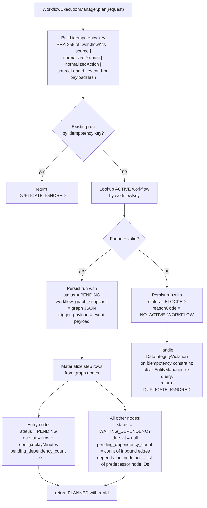

**Input — `WorkflowExecutionPlanRequest`:**

```java
public record WorkflowExecutionPlanRequest(
    String workflowKey,
    String source,           // "FUB" or "INTERNAL"
    String eventId,          // nullable — from webhook
    Long webhookEventId,     // FK to webhook_events
    String sourceLeadId,     // e.g. "12345" — the FUB person ID
    String normalizedDomain, // e.g. "ASSIGNMENT"
    String normalizedAction, // e.g. "CREATED"
    String payloadHash,      // SHA-256 of raw webhook body
    Map<String, Object> triggerPayload  // full event payload for snapshotting
) {}
```

**Output — `WorkflowExecutionPlanningResult`:**

```java
public record WorkflowExecutionPlanningResult(
    PlanningStatus status,  // PLANNED | DUPLICATE_IGNORED | BLOCKED
    Long runId,             // non-null on PLANNED
    String reasonCode       // non-null on BLOCKED
) {}
```

**Example — planning a run:**

Input:
```json
{
  "workflowKey": "ASSIGNMENT_FOLLOW_UP_SLA",
  "source": "FUB",
  "eventId": "evt_abc123",
  "sourceLeadId": "7890",
  "normalizedDomain": "ASSIGNMENT",
  "normalizedAction": "CREATED",
  "triggerPayload": {
    "eventType": "peopleCreated",
    "resourceIds": [7890],
    "uri": "/v1/people"
  }
}
```

Output:
```json
{ "status": "PLANNED", "runId": 42, "reasonCode": null }
```

Database state after planning (using the 3-node graph from §1.2):

**`workflow_runs` row:**

| id | workflow_key | status | idempotency_key | trigger_payload |
|---|---|---|---|---|
| 42 | ASSIGNMENT_FOLLOW_UP_SLA | PENDING | WEM1\|sha256hex... | `{eventType: "peopleCreated", ...}` |

**`workflow_run_steps` rows:**

| run_id | node_id | step_type | status | due_at | pending_dependency_count | depends_on_node_ids |
|---|---|---|---|---|---|---|
| 42 | check_claim | wait_and_check_claim | PENDING | now + 5min | 0 | null |
| 42 | check_comm | wait_and_check_communication | WAITING_DEPENDENCY | null | 1 | ["check_claim"] |
| 42 | do_reassign | fub_reassign | WAITING_DEPENDENCY | null | 1 | ["check_comm"] |

---

### 1.5 Worker claim + step execution flow

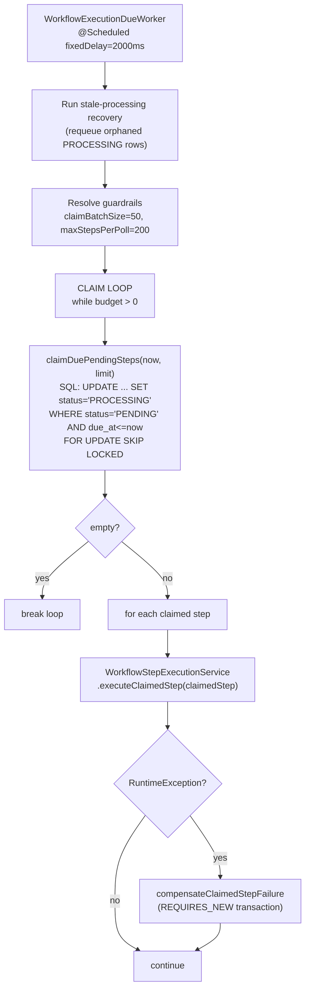

**Step execution detail (`executeClaimedStep`):**

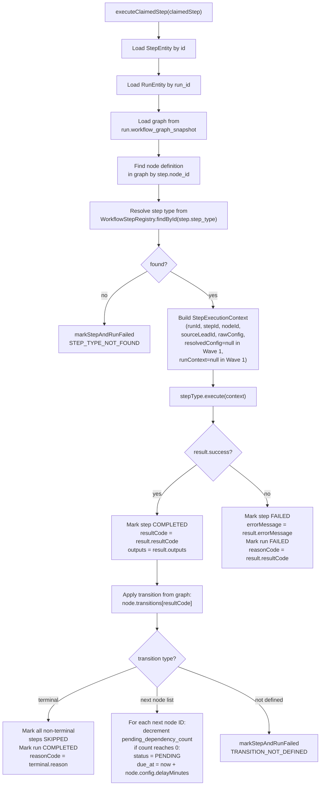

**Example — step execution trace:**

Starting from the database state after planning (§1.4). Worker polls, finds `check_claim` step is due.

Step 1: Worker claims `check_claim`:
```
UPDATE workflow_run_steps SET status='PROCESSING' WHERE id=... AND status='PENDING' FOR UPDATE SKIP LOCKED
```

Step 2: Engine builds context, calls `WaitAndCheckClaimStep.execute(context)`.
The step calls FUB API `GET /v1/people/7890`, gets back `{claimed: true, assignedUserId: 42}`.

Step 3: Step returns:
```java
StepExecutionResult.success("CLAIMED", Map.of("assignedUserId", 42))
```

Step 4: Engine writes to DB:
```
UPDATE workflow_run_steps
SET status='COMPLETED', result_code='CLAIMED', outputs='{"assignedUserId": 42}'
WHERE id=...
```

Step 5: Engine looks up transition: `graph.nodes["check_claim"].transitions["CLAIMED"]`.
The graph says `"CLAIMED": ["check_comm"]` → next node is `check_comm`.

Step 6: Engine activates `check_comm`:
```
UPDATE workflow_run_steps
SET pending_dependency_count = pending_dependency_count - 1
WHERE run_id=42 AND node_id='check_comm'

-- pending_dependency_count is now 0, so:
UPDATE workflow_run_steps
SET status='PENDING', due_at=now() + interval '10 minutes'
WHERE run_id=42 AND node_id='check_comm'
```

Step 7: 10 minutes later, worker picks up `check_comm`. Same pattern repeats.

**Example — terminal transition:**

If `check_claim` returned `NOT_CLAIMED` instead:

Step 5: Engine looks up transition: `graph.nodes["check_claim"].transitions["NOT_CLAIMED"]`.
The graph says `"NOT_CLAIMED": { "terminal": "NON_ESCALATED_CLOSED" }`.

Step 6: Engine applies terminal transition:
```sql
-- Skip all remaining steps
UPDATE workflow_run_steps
SET status='SKIPPED', due_at=null
WHERE run_id=42 AND node_id IN ('check_comm', 'do_reassign')

-- Mark run completed
UPDATE workflow_runs
SET status='COMPLETED', reason_code='NON_ESCALATED_CLOSED'
WHERE id=42
```

**Example — parallel fan-out (branching workflow):**

If `check_comm` returned `COMM_NOT_FOUND` in the branching workflow graph (§1.2):

Transition: `"COMM_NOT_FOUND": ["do_reassign", "notify_slack"]`

Engine activates BOTH nodes:
```sql
-- Activate do_reassign
UPDATE workflow_run_steps
SET pending_dependency_count = pending_dependency_count - 1
WHERE run_id=42 AND node_id='do_reassign'
-- count hits 0 → flip to PENDING
UPDATE workflow_run_steps
SET status='PENDING', due_at=now()
WHERE run_id=42 AND node_id='do_reassign'

-- Activate notify_slack
UPDATE workflow_run_steps
SET pending_dependency_count = pending_dependency_count - 1
WHERE run_id=42 AND node_id='notify_slack'
-- count hits 0 → flip to PENDING
UPDATE workflow_run_steps
SET status='PENDING', due_at=now()
WHERE run_id=42 AND node_id='notify_slack'
```

Both steps become `PENDING` with `due_at=now()`. The worker picks them up (potentially in the same poll cycle, potentially in parallel by two workers).

When both reach terminal transitions independently, the run is marked `COMPLETED` when the **last** terminal fires (engine checks: are all non-skipped steps now terminal?).

---

### 1.6 Graph validator

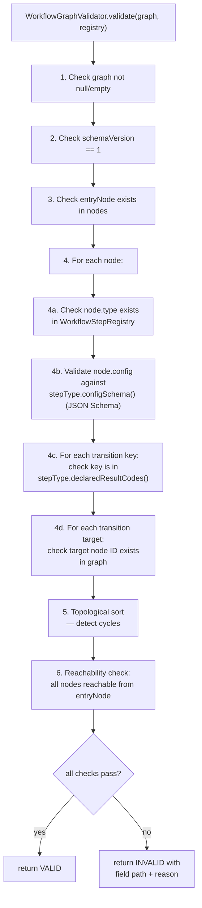

**Output — `GraphValidationResult`:**

```java
public record GraphValidationResult(
    boolean valid,
    GraphValidationCode code,       // VALID, CYCLE_DETECTED, UNREACHABLE_NODE, etc.
    String fieldPath,               // e.g. "nodes[1].transitions.UNKNOWN_CODE"
    String reason                   // human-readable
) {}
```

---

### 1.7 Example step type implementation (`delay`)

```java
@Component
public class DelayWorkflowStep implements WorkflowStepType {

    @Override public String id() { return "delay"; }
    @Override public String displayName() { return "Delay"; }
    @Override public String description() { return "Wait for a specified duration before proceeding."; }

    @Override
    public Map<String, Object> configSchema() {
        return Map.of(
            "type", "object",
            "properties", Map.of(
                "delayMinutes", Map.of(
                    "type", "integer",
                    "minimum", 1,
                    "description", "Minutes to wait"
                )
            ),
            "required", List.of("delayMinutes")
        );
    }

    @Override
    public Set<String> declaredResultCodes() {
        return Set.of("DONE");
    }

    @Override
    public StepExecutionResult execute(StepExecutionContext context) {
        // Delay is handled by due_at at materialization time.
        // By the time execute() is called, the delay has already elapsed.
        return StepExecutionResult.success("DONE");
    }
}
```

---

## Wave 2 — Run Context + Templating

### 2.1 RunContext (what gets built before each step executes)

```java
public record RunContext(
    /** The frozen webhook event payload from workflow_runs.trigger_payload */
    Map<String, Object> triggerPayload,

    /** Source lead ID from the run */
    String sourceLeadId,

    /** Outputs from all completed prior steps, keyed by node ID */
    Map<String, Map<String, Object>> stepOutputs,

    /** Engine metadata */
    RunMetadata metadata
) {

    public record RunMetadata(long runId, String workflowKey, long workflowVersion) {}
}
```

**How it's built (inside `WorkflowStepExecutionService.executeClaimedStep`):**

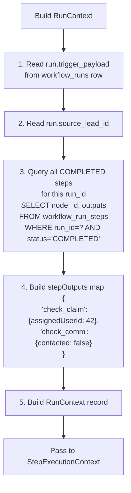

---

### 2.2 Template resolution

**Flow — what happens between "load step config" and "call execute()":**

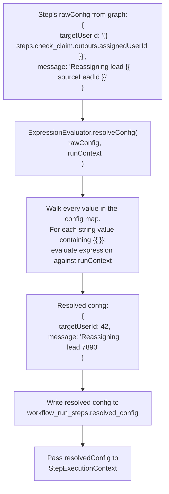

**Expression evaluator interface:**

```java
public interface ExpressionEvaluator {

    /** Resolve a template string. e.g. "Hello {{ sourceLeadId }}" → "Hello 7890" */
    Object resolveTemplate(String template, ExpressionScope scope);

    /** Evaluate a boolean predicate. e.g. "event.payload.lead.source == 'Zillow'" → true/false */
    boolean evaluatePredicate(String expression, ExpressionScope scope);
}
```

**Expression scope (what variables are available):**

```java
public record ExpressionScope(
    Map<String, Object> event,     // trigger payload: event.payload.lead.source, event.eventType, ...
    String sourceLeadId,           // top-level shortcut
    Map<String, Map<String, Object>> steps  // steps.check_claim.outputs.assignedUserId
) {
    public static ExpressionScope from(RunContext ctx) {
        return new ExpressionScope(
            Map.of("payload", ctx.triggerPayload()),
            ctx.sourceLeadId(),
            ctx.stepOutputs()
        );
    }
}
```

**Example — full template resolution trace:**

RunContext:
```json
{
  "triggerPayload": {
    "eventType": "peopleCreated",
    "resourceIds": [7890],
    "lead": { "source": "Zillow", "firstName": "Jane" }
  },
  "sourceLeadId": "7890",
  "stepOutputs": {
    "check_claim": { "assignedUserId": 42, "assignedUserName": "Bob" }
  }
}
```

Raw config:
```json
{
  "targetUserId": "{{ steps.check_claim.outputs.assignedUserId }}",
  "message": "Lead {{ event.payload.lead.firstName }} from {{ event.payload.lead.source }}"
}
```

Resolved config:
```json
{
  "targetUserId": 42,
  "message": "Lead Jane from Zillow"
}
```

Both versions are persisted: `rawConfig` in `config_snapshot`, resolved in `resolved_config`. The run inspector shows both.

---

### 2.3 Updated step execution flow (with context + templating)

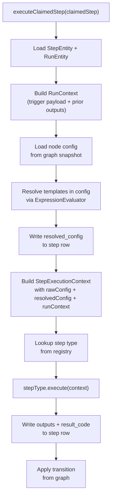

**What changes from Wave 1:**
- Steps 2–6 are new (RunContext, template resolution, resolved_config persistence)
- The `StepExecutionContext.resolvedConfig` and `.runContext` are no longer null

**Why `resolved_config` exists (and why it's optional in v1):**

`config_snapshot` = the raw authored config from the graph node, with template placeholders. e.g. `{ "targetUserId": "{{ steps.check_claim.outputs.assignedUserId }}" }`.
`resolved_config` = the same config after templates are replaced with actual runtime values. e.g. `{ "targetUserId": 42 }`.

The step *could* just look up prior step outputs directly from the run context at runtime — and in Wave 1 that's exactly what happens. The reason we persist the resolved version is purely for **post-mortem debugging**. When a run fails at 3am and you open the run inspector the next morning, you want to see "this step ran with `targetUserId=42`" — not `{{ steps.check_claim.outputs.assignedUserId }}` and guess what that was at the time. The lead's data may have changed since then.

**If you want to simplify Wave 2:** skip `resolved_config` entirely. The step's `execute()` method receives raw config + run context, does its own lookups. Simpler. The tradeoff is you lose the "what did it actually resolve to" audit trail. Add the snapshot column later when ops asks "what did this step actually run with?"

---

## Wave 3 — Dynamic Routing + Retry

### 3.1 Triggers as pluggable step types

Triggers follow the same plugin model as action steps. A trigger type is a class implementing `WorkflowTriggerType` — it declares what events it matches and how to extract entities (leads, calls, etc.) to fan out over. This means adding a new trigger type (schedule, manual, different webhook event shape) is just writing one class — no router changes, no hardcoded extraction logic.

**WorkflowTriggerType interface:**

```java
public interface WorkflowTriggerType {

    /** Unique ID matching the trigger "type" field in the workflow JSON. e.g. "webhook_fub" */
    String id();

    String displayName();

    /** JSON Schema for the trigger's config. Drives validator + builder form. */
    Map<String, Object> configSchema();

    /** Does this trigger match the incoming event? */
    boolean matches(TriggerMatchContext matchContext);

    /**
     * Extract the entities to fan out over.
     * Returns a list of EntityRef — each one becomes a separate workflow run.
     * e.g. for peopleCreated: [{type:"lead", id:"7890"}, {type:"lead", id:"7891"}]
     * e.g. for callsCreated: [{type:"call", id:"555"}]
     * e.g. for a schedule trigger: [{type:"schedule", id:"run_20260412_0900"}]
     */
    List<EntityRef> extractEntities(Map<String, Object> eventPayload);
}
```

```java
public record TriggerMatchContext(
    String source,            // "FUB", "INTERNAL"
    String eventType,         // "peopleCreated", "callsCreated", etc.
    String normalizedDomain,  // "ASSIGNMENT", "CALL"
    String normalizedAction,  // "CREATED", "UPDATED"
    Map<String, Object> payload
) {}

public record EntityRef(
    String entityType,   // "lead", "call", "schedule"
    String entityId      // "7890", "555", "run_20260412_0900"
) {}
```

**Trigger JSON on the workflow (now references a trigger type):**

```json
{
  "type": "webhook_fub",
  "config": {
    "eventDomain": "ASSIGNMENT",
    "eventAction": "*",
    "filter": "event.payload.lead.source == 'Zillow'"
  }
}
```

Other trigger types would look different:

```json
{ "type": "webhook_fub", "config": { "eventDomain": "CALL", "eventAction": "CREATED" } }
```
```json
{ "type": "schedule", "config": { "cron": "0 9 * * MON", "timezone": "America/New_York" } }
```
```json
{ "type": "manual", "config": { "requiredInputs": ["leadId"] } }
```

Each trigger type knows its own config schema. The graph validator validates trigger config the same way it validates step config — via the declared schema.

**Example trigger type implementation (FUB webhook):**

```java
@Component
public class FubWebhookTriggerType implements WorkflowTriggerType {

    @Override public String id() { return "webhook_fub"; }
    @Override public String displayName() { return "FUB Webhook Event"; }

    @Override
    public Map<String, Object> configSchema() {
        return Map.of(
            "type", "object",
            "properties", Map.of(
                "eventDomain", Map.of("type", "string", "description", "e.g. ASSIGNMENT, CALL"),
                "eventAction", Map.of("type", "string", "description", "e.g. CREATED, * for any"),
                "filter", Map.of("type", "string", "description", "Optional expression filter")
            ),
            "required", List.of("eventDomain")
        );
    }

    @Override
    public boolean matches(TriggerMatchContext ctx) {
        // Check domain match
        // Check action match (* = wildcard)
        // Evaluate filter expression if present
    }

    @Override
    public List<EntityRef> extractEntities(Map<String, Object> payload) {
        // Extract resourceIds from payload, return as lead EntityRefs
        List<Integer> ids = (List<Integer>) payload.get("resourceIds");
        return ids.stream()
            .map(id -> new EntityRef("lead", String.valueOf(id)))
            .toList();
    }
}
```

**`WorkflowTriggerRegistry`** — same pattern as `WorkflowStepRegistry`:

```java
@Component
public class WorkflowTriggerRegistry {
    private final Map<String, WorkflowTriggerType> triggerTypesById;

    public WorkflowTriggerRegistry(List<WorkflowTriggerType> triggerTypes) {
        this.triggerTypesById = triggerTypes.stream()
            .collect(Collectors.toMap(WorkflowTriggerType::id, Function.identity()));
    }

    public Optional<WorkflowTriggerType> findById(String id) {
        return Optional.ofNullable(triggerTypesById.get(id));
    }
}
```

**Routing flow:**

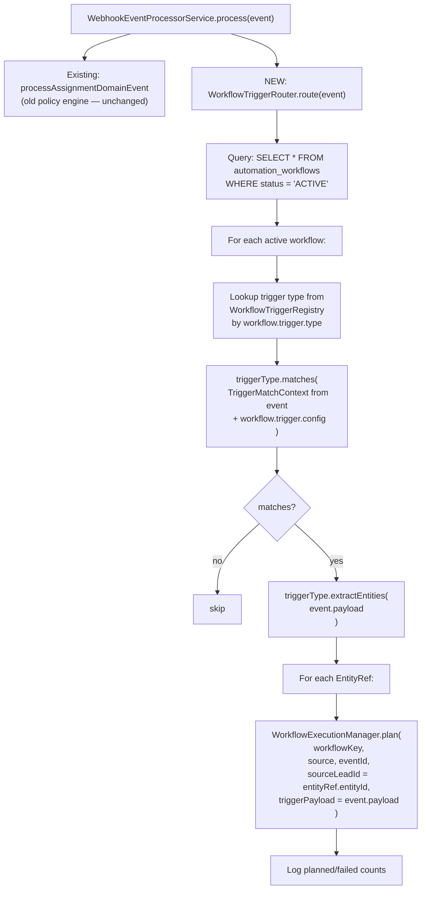

**Key difference from the old design:** the router does NOT know how to extract leads from `resourceIds`. The **trigger type** does. So when you add a `callsCreated` trigger that extracts call IDs differently, or a `schedule` trigger that has no entities at all, you write one class — the router doesn't change.

**Example — routing trace:**

Incoming webhook event:
```json
{
  "source": "FUB",
  "eventType": "peopleCreated",
  "normalizedDomain": "ASSIGNMENT",
  "normalizedAction": "CREATED",
  "payload": {
    "eventType": "peopleCreated",
    "resourceIds": [7890, 7891],
    "lead": { "source": "Zillow" }
  }
}
```

Active workflows in DB:
```
| key                        | trigger                                                                                               |
|----------------------------|-------------------------------------------------------------------------------------------------------|
| ASSIGNMENT_FOLLOW_UP_SLA   | {"type":"webhook_fub","config":{"eventDomain":"ASSIGNMENT","eventAction":"*"}}                         |
| ZILLOW_SPECIAL_ROUTING     | {"type":"webhook_fub","config":{"eventDomain":"ASSIGNMENT","eventAction":"CREATED","filter":"event.payload.lead.source=='Zillow'"}} |
```

Result:
- Router iterates both workflows.
- For each, looks up `webhook_fub` trigger type from registry.
- Calls `matches()` — both match.
- Calls `extractEntities()` — both return `[{lead, "7890"}, {lead, "7891"}]`.
- Plans 4 runs total (2 workflows x 2 leads), each with its own idempotency key.

---

### 3.2 Retry primitive

**RetryPolicy record:**

```java
public record RetryPolicy(
    int maxAttempts,           // total attempts including the first
    long initialBackoffMs,     // e.g. 1000
    double backoffMultiplier,  // e.g. 2.0
    long maxBackoffMs,         // e.g. 30000
    boolean retryOnTransient   // if false, fail immediately
) {
    public static final RetryPolicy NO_RETRY = new RetryPolicy(1, 0, 1, 0, false);
    public static final RetryPolicy DEFAULT_FUB = new RetryPolicy(3, 1000, 2.0, 10000, true);
}
```

**Retry flow (inside `WorkflowStepExecutionService`):**

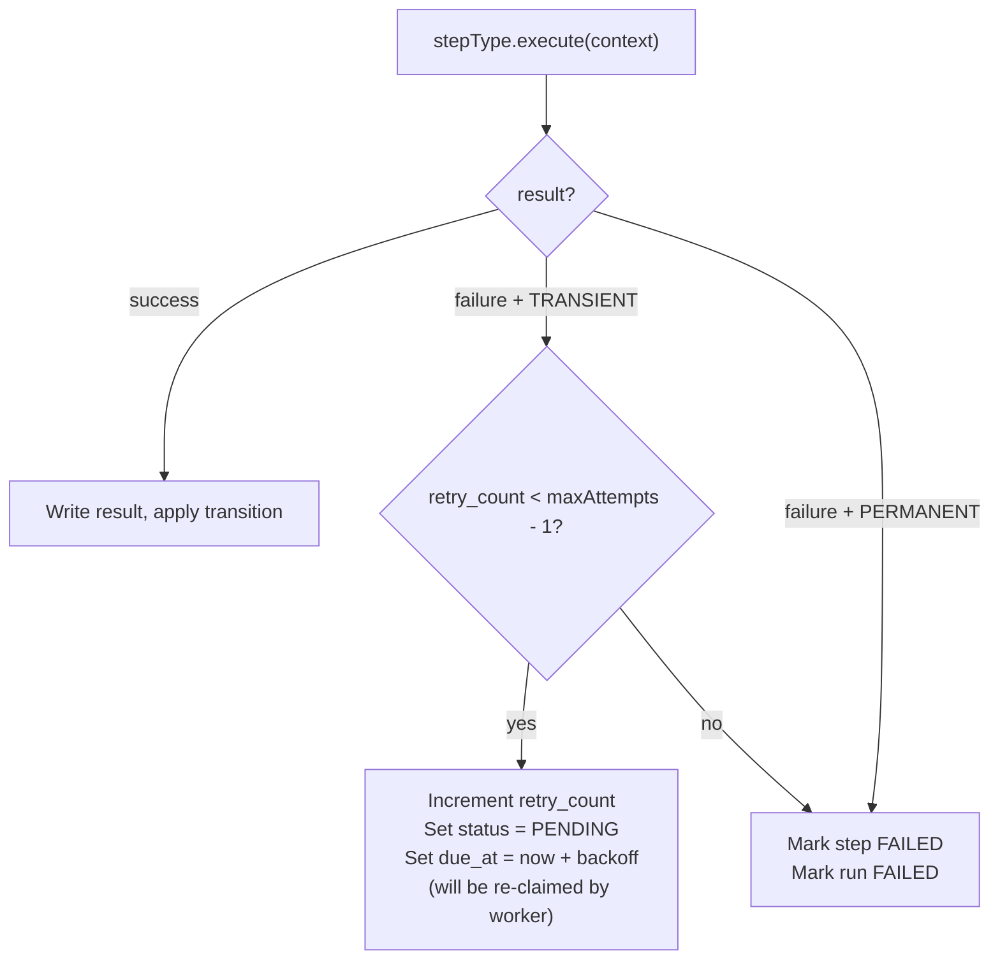

The step type communicates transient vs permanent via the result:

```java
StepExecutionResult.failure("FUB_TRANSIENT", "FUB API returned 503")  // engine will retry
StepExecutionResult.failure("FUB_PERMANENT", "Person not found")      // engine will not retry
```

The engine classifies by checking if the result code contains `TRANSIENT` (or the step type can override via a method). Retry count is persisted on the step row so it survives worker restarts.

---

## Wave 4 — Builder UI

### 4.1 Step types registry endpoint

**`GET /admin/workflows/step-types`**

Response (drives the builder palette + per-node config forms):

```json
[
  {
    "id": "wait_and_check_claim",
    "displayName": "Wait & Check Claim",
    "description": "Wait, then check if the lead has been claimed by an agent.",
    "configSchema": {
      "type": "object",
      "properties": {
        "delayMinutes": {
          "type": "integer",
          "minimum": 1,
          "description": "Minutes to wait before checking"
        }
      },
      "required": ["delayMinutes"]
    },
    "declaredResultCodes": ["CLAIMED", "NOT_CLAIMED"],
    "defaultRetryPolicy": {
      "maxAttempts": 3,
      "initialBackoffMs": 1000,
      "backoffMultiplier": 2.0,
      "maxBackoffMs": 10000
    }
  },
  {
    "id": "fub_reassign",
    "displayName": "Reassign Lead",
    "description": "Reassign a lead to a different agent in FUB.",
    "configSchema": {
      "type": "object",
      "properties": {
        "targetUserId": {
          "type": ["integer", "string"],
          "description": "FUB user ID to reassign to. Accepts template expressions."
        }
      },
      "required": ["targetUserId"]
    },
    "declaredResultCodes": ["SUCCESS", "FAILED"],
    "defaultRetryPolicy": { "maxAttempts": 3, "..." : "..." }
  }
]
```

The builder reads this once and:
1. Renders a palette entry per item (icon derived from `id` prefix like `fub_*`, `slack_*`, `delay`)
2. When a node is dropped on the canvas, uses `configSchema` to render the config form via `@rjsf/core`
3. Uses `declaredResultCodes` to create output handles on the node — one handle per code, labeled with the code name

---

### 4.2 Admin workflow CRUD endpoints

| Method | Path | Request body | Response | Notes |
|---|---|---|---|---|
| `GET` | `/admin/workflows` | — | `WorkflowListResponse` | Filter by `?status=ACTIVE` |
| `GET` | `/admin/workflows/{id}` | — | `WorkflowResponse` | Full graph included |
| `POST` | `/admin/workflows` | `CreateWorkflowRequest` | `WorkflowResponse` | Status = DRAFT |
| `PUT` | `/admin/workflows/{id}` | `UpdateWorkflowRequest` | `WorkflowResponse` | Bumps version |
| `POST` | `/admin/workflows/{id}/activate` | `ActivateWorkflowRequest` | `WorkflowResponse` | Validates graph, deactivates siblings |
| `GET` | `/admin/workflow-runs` | — | `WorkflowRunPageResponse` | Cursor pagination, filters |
| `GET` | `/admin/workflow-runs/{id}` | — | `WorkflowRunDetailResponse` | All steps included |
| `POST` | `/admin/workflow-runs/{id}/retry` | — | `WorkflowRunDetailResponse` | Resume from failed step |

**`CreateWorkflowRequest`:**

```json
{
  "key": "zillow_lead_routing",
  "name": "Zillow Lead Routing",
  "description": "Route Zillow leads to the specialized team",
  "trigger": {
    "eventDomain": "ASSIGNMENT",
    "eventAction": "CREATED",
    "filter": "event.payload.lead.source == 'Zillow'"
  },
  "graph": { "schemaVersion": 1, "nodes": [...], "entryNode": "..." }
}
```

---

### 4.3 Builder → engine round-trip

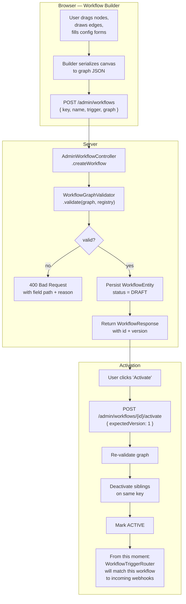

---

## Wave 5 — Migration

### 5.1 Migration flow

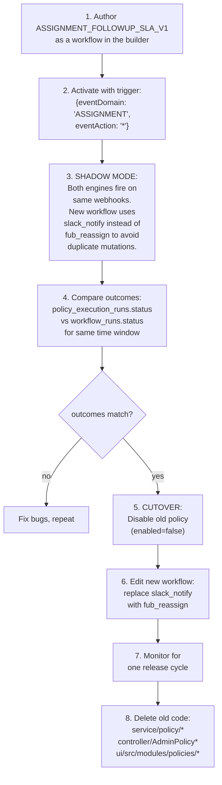

---

## File map — what gets created per wave

### Wave 1

```
src/main/resources/db/migration/
  V{next}__create_workflow_engine.sql

src/main/java/com/fuba/automation_engine/
  service/workflow/
    WorkflowStepType.java                    ← plugin interface
    WorkflowStepRegistry.java                ← auto-discovers step types
    StepExecutionContext.java                ← what a step receives
    StepExecutionResult.java                 ← what a step returns
    RetryPolicy.java                         ← retry config record
    WorkflowGraphValidator.java              ← DAG validation
    GraphValidationResult.java               ← validation output
    WorkflowExecutionManager.java            ← planning + idempotency
    WorkflowExecutionDueWorker.java          ← @Scheduled polling worker
    WorkflowStepExecutionService.java        ← step dispatch + transitions
    WorkflowExecutionPlanRequest.java        ← plan input
    WorkflowExecutionPlanningResult.java     ← plan output
  service/workflow/steps/
    DelayWorkflowStep.java                   ← generic delay step
    WaitAndCheckClaimWorkflowStep.java       ← wraps existing FUB claim check
  persistence/entity/
    WorkflowEntity.java
    WorkflowRunEntity.java
    WorkflowRunStepEntity.java
    WorkflowRunStatus.java                   ← enum
    WorkflowRunStepStatus.java               ← enum
  persistence/repository/
    WorkflowRepository.java
    WorkflowRunRepository.java
    WorkflowRunStepRepository.java
    WorkflowRunStepClaimRepository.java      ← JDBC, holds the claim query

src/test/java/com/fuba/automation_engine/
  service/workflow/
    WorkflowGraphValidatorTest.java
    WorkflowEngineSmokeTest.java             ← end-to-end: plan → worker → COMPLETED
```

### Wave 2

```
src/main/java/com/fuba/automation_engine/
  service/workflow/
    RunContext.java                           ← trigger payload + prior outputs
    ExpressionEvaluator.java                 ← interface
    SimpleExpressionEvaluator.java           ← impl (chosen syntax)
    ExpressionScope.java                     ← available variables
  service/workflow/steps/
    WaitAndCheckCommunicationWorkflowStep.java
    FubReassignWorkflowStep.java
    FubMoveToPondWorkflowStep.java
    BranchOnFieldWorkflowStep.java
    SetVariableWorkflowStep.java
  service/fub/
    FubCallHelper.java                       ← extracted retry/transient helper (shared)

src/test/java/com/fuba/automation_engine/
  service/workflow/
    WorkflowParityTest.java                  ← old engine vs new, same scenarios
    ExpressionEvaluatorTest.java
```

### Wave 3

```
src/main/java/com/fuba/automation_engine/
  service/workflow/
    WorkflowTriggerType.java                 ← trigger plugin interface
    WorkflowTriggerRegistry.java             ← auto-discovers trigger types
    TriggerMatchContext.java                  ← what a trigger receives for matching
    EntityRef.java                            ← entity to fan out over
    WorkflowTriggerRouter.java               ← event → matching workflows fan-out (generic)
  service/workflow/triggers/
    FubWebhookTriggerType.java               ← matches FUB webhook events, extracts resourceIds
  service/workflow/steps/
    FubAddTagWorkflowStep.java
    FubRemoveTagWorkflowStep.java
    FubCreateTaskWorkflowStep.java
    FubCreateNoteWorkflowStep.java
    FubSendTextWorkflowStep.java
    FubSendEmailWorkflowStep.java
    HttpRequestWorkflowStep.java
    SlackNotifyWorkflowStep.java
  controller/
    AdminWorkflowController.java
    AdminWorkflowExecutionController.java
    dto/
      CreateWorkflowRequest.java
      UpdateWorkflowRequest.java
      ActivateWorkflowRequest.java
      WorkflowResponse.java
      WorkflowRunPageResponse.java
      WorkflowRunDetailResponse.java
      StepTypeResponse.java

src/test/java/com/fuba/automation_engine/
  service/workflow/
    WorkflowTriggerRouterTest.java
  controller/
    AdminWorkflowControllerTest.java
```

### Wave 4

```
ui/src/modules/workflows/
  ui/
    WorkflowsPage.tsx                        ← main page with tabs
    BuilderTab.tsx                            ← React Flow canvas
    WorkflowCanvas.tsx                       ← canvas wrapper
    NodePalette.tsx                           ← step type palette
    StepNode.tsx                              ← custom node component
    NodeConfigPanel.tsx                       ← rjsf form panel
    RunsTab.tsx                               ← run list
    RunInspector.tsx                          ← run detail + step data
    StepTimeline.tsx                          ← step-by-step view
  lib/
    workflowSchemas.ts                       ← Zod schemas
    workflowSearchParams.ts
    graphSerializer.ts                       ← canvas → graph JSON
    graphDeserializer.ts                     ← graph JSON → canvas
  hooks/
    useWorkflowsQuery.ts
    useWorkflowMutations.ts
    useStepTypesQuery.ts
    useWorkflowRunsQuery.ts
    useWorkflowRunDetailQuery.ts
ui/src/platform/ports/
  workflowPort.ts
  workflowExecutionPort.ts
```

---

## Summary — data flow through the entire system

For quick reference: what data enters each component and what comes out.

```
Webhook arrives (POST /webhooks/fub)
  IN:  raw HTTP body + headers
  OUT: persisted webhook_events row + async dispatch

WebhookEventProcessorService.process
  IN:  NormalizedWebhookEvent (source, eventType, domain, action, payload, resourceIds)
  OUT: calls WorkflowTriggerRouter.route

WorkflowTriggerRouter.route
  IN:  NormalizedWebhookEvent
  1. queries all ACTIVE workflows
  2. for each: looks up trigger type from WorkflowTriggerRegistry
  3. calls triggerType.matches(event) — trigger type decides if it matches
  4. calls triggerType.extractEntities(payload) — trigger type decides what to fan out over
  OUT: for each matching workflow x each entity → calls WorkflowExecutionManager.plan

WorkflowExecutionManager.plan
  IN:  WorkflowExecutionPlanRequest (workflowKey, source, leadId, eventPayload)
  OUT: WorkflowExecutionPlanningResult (PLANNED/DUPLICATE/BLOCKED + runId)
  DB:  inserts workflow_runs + workflow_run_steps rows

WorkflowExecutionDueWorker (every 2s)
  IN:  polls workflow_run_steps WHERE status=PENDING AND due_at<=now
  OUT: claims steps → calls WorkflowStepExecutionService.executeClaimedStep

WorkflowStepExecutionService.executeClaimedStep
  IN:  claimed step row
  1. builds RunContext (trigger payload + prior step outputs from DB)
  2. resolves templates in step config via ExpressionEvaluator
  3. looks up step type from WorkflowStepRegistry
  4. calls stepType.execute(StepExecutionContext)
  OUT: StepExecutionResult (resultCode + outputs)
  5. writes outputs + resolved_config to step row
  6. applies transition from graph → activates next nodes or marks terminal

WorkflowStepType.execute (plugin)
  IN:  StepExecutionContext (resolvedConfig, runContext, sourceLeadId)
  does: calls FUB API / Slack / HTTP / whatever
  OUT: StepExecutionResult (resultCode, outputs, errorMessage)
```
