# How the Workflow Engine Works — A Walkthrough

**Audience:** You, a stakeholder, or any engineer new to this codebase who needs the whole picture in one sitting before touching the engine.
**Approach:** One realistic example traced end-to-end, from the moment a webhook hits the server to the moment the last step completes. Every mechanism (claiming, delays, branching, retries) is explained against the same example, with file paths and line numbers so you can jump to the code.

**How to read this doc.** If you're totally new, start at "Glossary of Components" below — a flat list of every moving piece with a one-paragraph explanation and a concrete example. Then read "Lifecycle at a Glance," which is a top-to-bottom diagrammed walkthrough of a real run, with the exact data visible at every stage. After those two, the deeper sections (§1 onward) revisit each mechanism in full detail.

---

## Glossary of Components

Each entry: what it is, one example. Skim this list first; you'll recognize every term in the rest of the doc.

### Authoring-time concepts

**Workflow (definition)** — A row in `automation_workflows`. The static, author-edited thing: a name, a key, a status (DRAFT/ACTIVE), a `trigger` blob, and a `graph` blob. *Example:* "Welcome Hot Lead" with key `welcome_hot_lead`, status `ACTIVE`.

**Graph (DAG)** — The shape of the workflow. JSON with `entryNode`, `nodes[]`, and `schemaVersion`. Validated as a cycle-free directed acyclic graph. *Example:* `{ "entryNode": "wait_5m", "nodes": [...], "schemaVersion": 1 }`.

**Node** — One element of `nodes[]` in the graph. Has `id`, `type`, `config`, `transitions`. The authored blueprint of one step. *Example:*
```json
{ "id": "branch_check", "type": "branch_on_field",
  "config": { "expression": "event.payload.priority", ... },
  "transitions": { "HIGH": ["task_urgent"], "LOW": ["task_standard"] } }
```

**Trigger** — The entry condition for a workflow. Stored in `automation_workflows.trigger`. Shape: `{ "type": "<triggerTypeId>", "config": {...} }`. *Example:* `{ "type": "fub_webhook", "config": { "eventDomain": "people", "eventAction": "created", "filter": "event.payload.score > 5" } }`.

**Trigger Type** — A Java component implementing `WorkflowTriggerType`. Knows how to decide whether a webhook event should start a workflow and which entity to start it for. Only one today: `FubWebhookTriggerType`. *Example:* `FubWebhookTriggerType.matches(event)` returns true if domain/action match and the optional JSONata `filter` is truthy.

**Step Type** — A Java component implementing `WorkflowStepType`. Declares an `id`, a `configSchema`, a set of `declaredResultCodes`, and an `execute(ctx)` method. Registered by Spring component scan. *Example:* `DelayWorkflowStep` (id=`delay`), `BranchOnFieldWorkflowStep` (id=`branch_on_field`), `FubCreateTaskWorkflowStep` (id=`fub_create_task`).

**Config** — The per-node configuration authored in the graph (e.g. `{ "delayMinutes": 5 }` for a delay step). May contain `{{ ... }}` JSONata templates that get filled in at run time.

**Config Schema** — A JSON-Schema-shaped description of what keys a step type's config requires. Returned by `WorkflowStepType.configSchema()`. Used by the graph validator and by the admin UI form builder. *Example:* `{ "type": "object", "required": ["delayMinutes"], "properties": { "delayMinutes": { "type": "integer" } } }`.

**Transitions** — A map on each node from result code → next node(s). Values can be `["nextNodeId", ...]` (fan-out or single-next) or `{"terminal": "COMPLETED"}` (end the run). *Example:* `{ "DONE": ["branch_check"] }` says "when this node returns result code `DONE`, activate `branch_check`."

**Result Code** — A short string the step's `execute()` returns to tell the engine *which transition to take*. It does not carry data — it's just a routing label. *Examples:* `"SUCCESS"`, `"HIGH"`, `"LOW"`, `"DONE"`, `"RETRY"`.

**declaredResultCodes** — The set of result codes a step type is allowed to emit. The graph validator rejects any transition keyed by a code the step can't emit. An empty set means "dynamic" (used by `branch_on_field`, whose codes come from its config's `resultMapping`).

**Outputs** — A free-form `Map<String, Object>` the step's `execute()` returns alongside the result code. Persisted to `workflow_run_steps.outputs`. Visible to every downstream step via JSONata at `steps.<nodeId>.outputs.<key>`. *Example:* `{ "assignedUserId": 77, "firstName": "Sarath" }`.

### Expression & data-flow concepts

**JSONata** — A JSON-native expression language. Library: `com.dashjoin:jsonata 0.9.8`. Supports paths, arithmetic, comparisons, conditionals, string functions. *Example:* `event.payload.firstName & ' (' & event.payload.email & ')'` evaluates to `"Sarath (info@2cretiv.com)"`.

**Template** — A string with `{{ ... }}` markers inside a step's config. The engine resolves the markers before calling `execute()`. *Example:* `"Follow up with {{ event.payload.firstName }}"` → `"Follow up with Sarath"`.

**Expression Scope** — The `Map<String, Object>` every JSONata expression evaluates against. Has exactly three keys: `event` (wraps the webhook payload under `event.payload`), `sourceLeadId`, and `steps` (prior step outputs). There is **no `trigger` key** — the payload is always reached via `event.payload.<key>`. *Example:* `{ "event": { "payload": { "firstName": "Sarath", "priority": "high" } }, "sourceLeadId": "42", "steps": { "check_claim": { "outputs": { "assignedUserId": 77 } } } }`.

**Expression Evaluator** — There is exactly **one evaluator**: `JsonataExpressionEvaluator`. It is not multiple evaluators — the same class does everything expression-related in the engine. It has two modes (methods): `resolveTemplate(str, scope)` for fill-in-the-blanks strings with `{{ ... }}` markers, and `evaluatePredicate(expr, scope)` for raw boolean/scalar expressions with no markers. Same class, same scope, two different ways to call it.

**RunContext** — A rebuilt-each-time record carrying metadata (runId, workflowKey), the frozen trigger payload, the sourceLeadId, and a map of every completed step's outputs. Used to build the Expression Scope.

**Resolved Config** — The step's config after all `{{ ... }}` templates are evaluated. Persisted to `workflow_run_steps.resolved_config` for debugging. *Example:* authored `{"name": "Call {{ event.payload.firstName }}"}` becomes resolved `{"name": "Call Sarath"}`.

### Runtime / state concepts

**Run** — A row in `workflow_runs`. One specific execution of a workflow for a specific entity from a specific event. Has `status` (PENDING/COMPLETED/FAILED/...), the `workflow_graph_snapshot`, the `trigger_payload`, and the `idempotency_key`.

**Step (row)** — A row in `workflow_run_steps`. One materialized instance of a graph node, specific to one run. Has `status`, `due_at`, `pending_dependency_count`, `config_snapshot`, `resolved_config`, `result_code`, `outputs`, `retry_count`.

**Graph Snapshot** — The deep-frozen copy of the workflow graph stored on the run row (`workflow_runs.workflow_graph_snapshot`). Every step reads from this, never from the live definition. Authors can edit the workflow mid-flight without affecting in-flight runs.

**Idempotency Key** — `WEM1|<sha256 of "workflowKey|source|sourceLeadId|EVENT|eventId">`. UNIQUE column on `workflow_runs`. Prevents duplicate runs from duplicate webhook deliveries.

**`due_at`** — The timestamp a step becomes claimable. `null` for steps still waiting on dependencies; `now + delayMinutes` for steps that carry a delay. The claim SQL filters `WHERE due_at <= :now` — this is how the engine "waits" without blocking any thread.

**`pending_dependency_count`** — An integer on each step row. Initialized to the count of predecessors in the graph. Decremented by 1 every time a predecessor completes. When it hits 0, the step flips `WAITING_DEPENDENCY → PENDING` and becomes claimable. This is the join mechanism.

### Engine components (the code that makes it go)

**Graph Validator** — `WorkflowGraphValidator`. Enforces ten rules on the graph (cycle-free, entry node exists, transitions reference real nodes, result codes declared, config schema satisfied, etc.). Runs on save and on plan. *Example:* a graph with a cycle is rejected at save with "cycle detected involving node X."

**Workflow Step Registry** — `WorkflowStepRegistry`. A Spring-populated map of `stepTypeId → WorkflowStepType` bean. Used to dispatch to the right step type at execute time. *Example:* `stepRegistry.get("delay")` returns the `DelayWorkflowStep` bean.

**Workflow Trigger Registry** — `WorkflowTriggerRegistry`. Same pattern for trigger types.

**Webhook Ingress Controller** — `WebhookIngressController`. HTTP entry point at `POST /webhooks/{source}`. Verifies signatures, persists the event, and dispatches asynchronously.

**Trigger Router** — `WorkflowTriggerRouter`. For each active workflow, asks the trigger if it matches; for matches, calls `plan()` once per extracted entity.

**Execution Manager** — `WorkflowExecutionManager`. Runs `plan()`: checks idempotency, validates the graph, creates the run row, materializes all step rows. One transaction.

**Due Worker** — `WorkflowExecutionDueWorker`. A single `@Scheduled` method that wakes every ~2 seconds. Runs stale-recovery, then claims and executes batches of due steps.

**Claim Query** — SQL in `JdbcWorkflowRunStepClaimRepository`. A `FOR UPDATE SKIP LOCKED` CTE that atomically transitions PENDING steps to PROCESSING. This is what makes concurrency safe across multiple workers.

**Step Execution Service** — `WorkflowStepExecutionService`. Where `executeClaimedStep()` lives. The heart muscle: builds RunContext, resolves templates, calls `execute()`, persists result, calls `applyTransition()`.

**applyTransition** — Method inside `WorkflowStepExecutionService` that walks the graph after a step succeeds. Reads `transitions` from the graph snapshot, decrements downstream `pending_dependency_count`, flips newly-ready steps to PENDING, or ends the run on a terminal marker.

**Retry Policy** — A per-step-type default (optionally overridden in config) controlling `maxAttempts`, `initialBackoffMs`, `backoffMultiplier`, `maxBackoffMs`. On transient failure, the engine increments `retry_count` and bumps `due_at`.

**Stale Recovery** — A sweep run at the start of every worker tick. Finds rows stuck in PROCESSING past the staleness timeout (worker crashed mid-step) and either requeues them or marks them FAILED.

---

## Lifecycle at a Glance

Everything above, in motion. We'll use the example workflow from §0 (delay → branch → two task paths) and trace it end-to-end with data visible at every stage. If you only read one thing in this doc, read this section.

### T-∞: Author saves the workflow

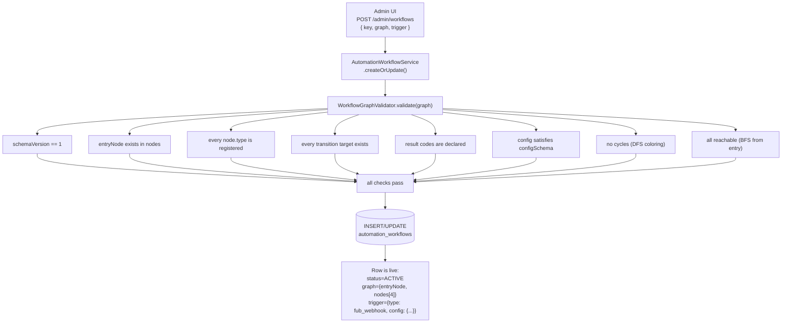

The workflow is now live but nothing is running. It sits in the DB waiting for a webhook.

### T=0: Webhook arrives

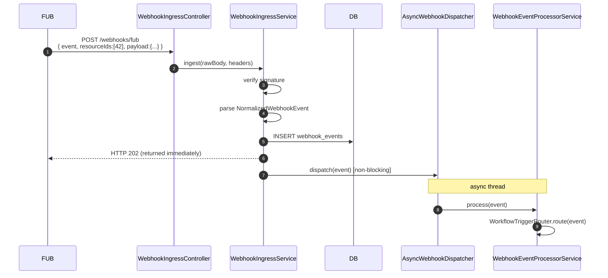

Event payload for our example:

```json
{ "event": "peopleCreated",
  "resourceIds": [42],
  "payload": { "firstName": "Sarath",
               "email": "info@2cretiv.com",
               "stage": "Lead",
               "priority": "high",
               "score": 8 } }
```

### T=0+: Trigger router decides who runs

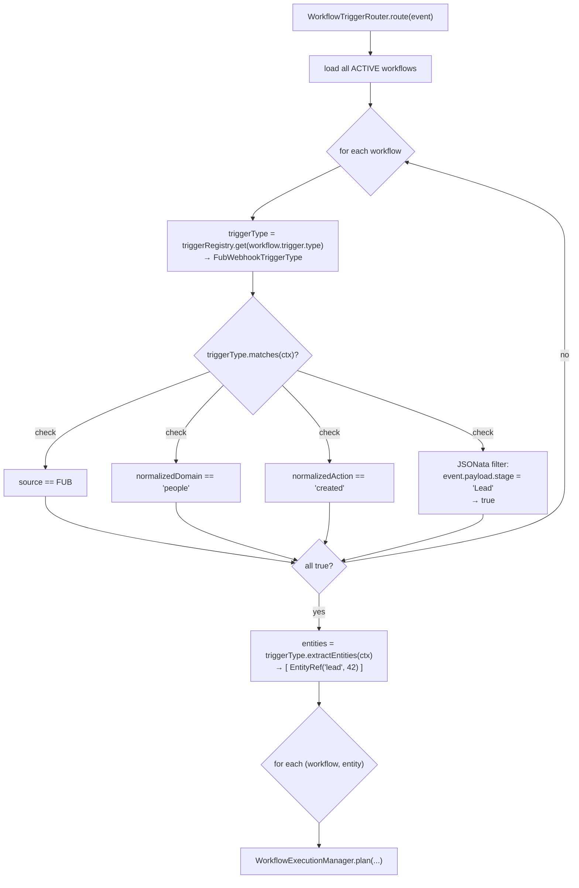

### T=0+: `plan()` creates the run

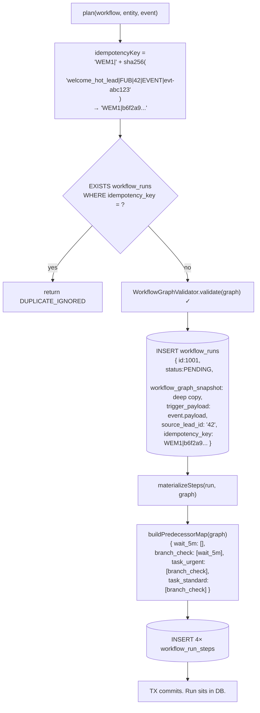

**State of `workflow_run_steps` right after `plan()` commits:**

| node_id       | status             | due_at   | pending_dep_count |
|---------------|--------------------|----------|-------------------|
| `wait_5m`     | PENDING            | T+5min   | 0                 |
| `branch_chk`  | WAITING_DEPENDENCY | null     | 1                 |
| `task_urgent` | WAITING_DEPENDENCY | null     | 1                 |
| `task_std`    | WAITING_DEPENDENCY | null     | 1                 |

Nothing is executing. The run sits until T+5min.

### T+5min: Worker tick — claims `wait_5m`

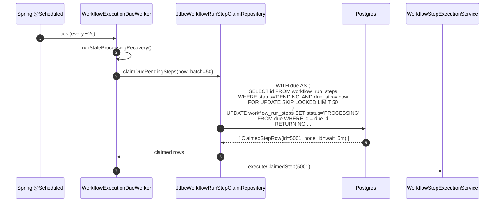

### T+5min: `executeClaimedStep(wait_5m)`

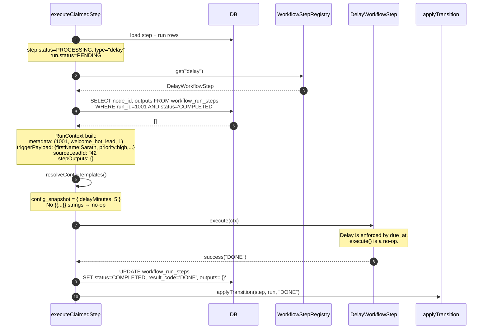

### T+5min: `applyTransition("DONE")` — opens the gate for `branch_check`

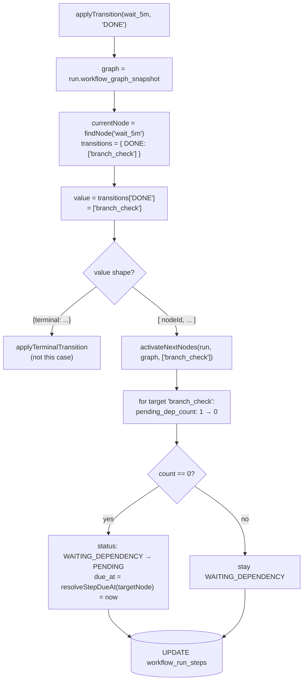

**State of `workflow_run_steps` after the transition:**

| node_id       | status             | due_at | pending_dep_count | note       |
|---------------|--------------------|--------|-------------------|------------|
| `wait_5m`     | COMPLETED          | T+5min | 0                 |            |
| `branch_chk`  | PENDING            | now    | 0                 | ← ready    |
| `task_urgent` | WAITING_DEPENDENCY | null   | 1                 |            |
| `task_std`    | WAITING_DEPENDENCY | null   | 1                 |            |

### T+5min+2s: Next worker tick — claims `branch_check`

Here's where expressions actually matter.

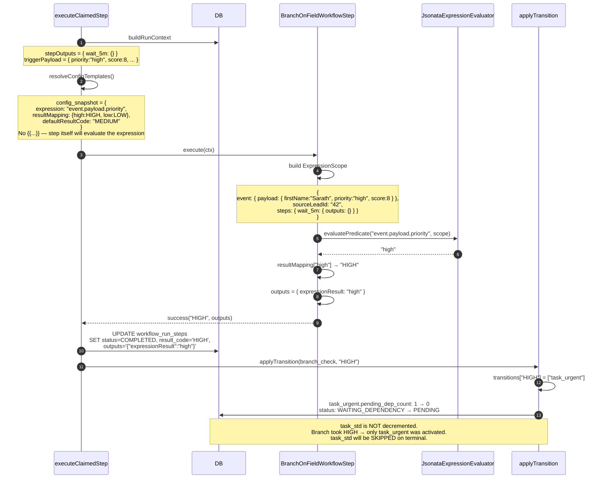

**State of `workflow_run_steps`:**

| node_id       | status             | due_at | pending_dep_count | note                              |
|---------------|--------------------|--------|-------------------|-----------------------------------|
| `wait_5m`     | COMPLETED          | T+5min | 0                 |                                   |
| `branch_chk`  | COMPLETED          | now    | 0                 |                                   |
| `task_urgent` | PENDING            | now    | 0                 | ← ready                           |
| `task_std`    | WAITING_DEPENDENCY | null   | 1                 | ← stays, never activated          |

### T+5min+4s: Worker tick — claims `task_urgent`, runs to terminal

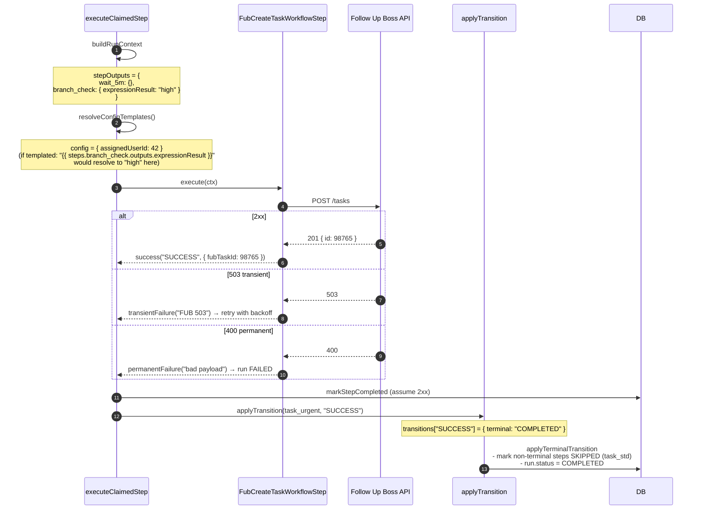

**Final state:**

| node_id       | status    |
|---------------|-----------|
| `wait_5m`     | COMPLETED |
| `branch_chk`  | COMPLETED |
| `task_urgent` | COMPLETED |
| `task_std`    | SKIPPED   |

`workflow_runs.status = COMPLETED`.

### The whole run, one picture

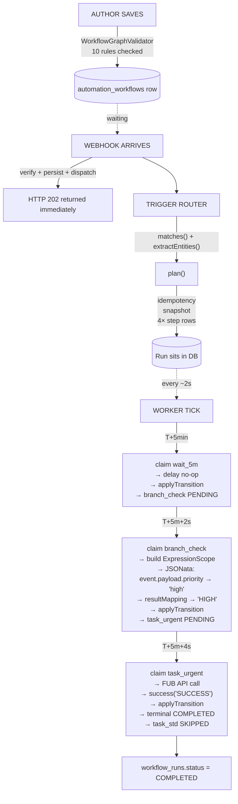

Every mechanism in the engine shows up somewhere in that picture. The rest of this document drills into each box with full code references.

---

## Deep-Dive Diagrams: Evaluators and Validators

The lifecycle section showed *when* the evaluators and validators run. This section zooms in on *how* each one decides, with scenarios that walk real inputs through the logic.

### A. The JSONata / Expression Evaluator

**First, a clarification:** there is only **one evaluator class** — `JsonataExpressionEvaluator`. It is not a family of evaluators. Every expression-related thing in the engine (filling in step configs, evaluating branch conditions, evaluating trigger filters) goes through this single class. What varies is the *mode* — how you call it.

It has **two modes**:

- **`resolveTemplate(String template, ExpressionScope scope)`** — the "fill in the blanks" mode. You hand it a string like `"Hello {{ event.payload.firstName }}"` and it finds the `{{ ... }}` parts, evaluates each one against the scope, and returns the filled-in result.
- **`evaluatePredicate(String expression, ExpressionScope scope)`** — the "is this true?" mode. You hand it a raw expression with no `{{ }}` markers, like `event.payload.score > 5`, and it evaluates it and returns the result (a boolean, a string, a number — whatever JSONata computes).

The **scope** is the context — the map where the answers live. It has exactly three keys: `event.payload` (the webhook payload), `steps.<nodeId>.outputs.<key>` (previous steps' outputs), and `sourceLeadId`. There is no `trigger` key — all webhook data is reached via `event.payload.<key>`. JSONata walks this map to find the value your expression points at.

Both modes evaluate against an `ExpressionScope` — a map with `event`, `sourceLeadId`, and `steps.<nodeId>.outputs.<key>`.

**The decision tree inside `resolveTemplate`:**

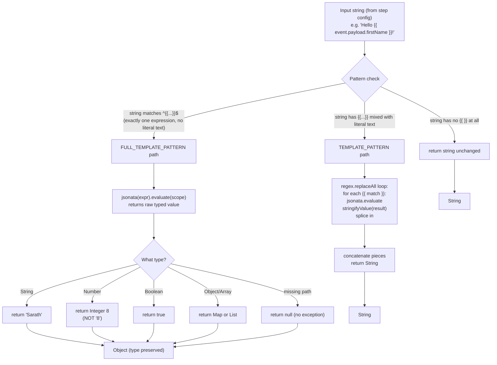

The key behavior to internalize: **a string that is exactly one template preserves types**; a string that mixes literal text and templates always comes out as a string. This is what lets `"{{ steps.a.outputs.userId }}"` flow through as an `Integer` 77, while `"Hello {{ firstName }}"` comes out as the string `"Hello Sarath"`.

**Scenarios against the same scope:**

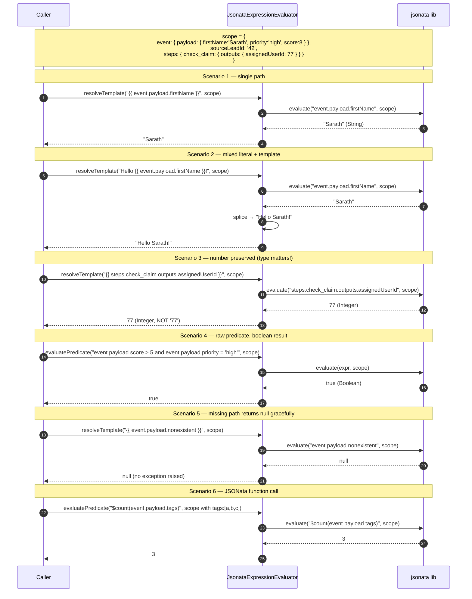

### B. The Trigger Evaluator (`FubWebhookTriggerType.matches`)

The trigger evaluator decides: does this incoming webhook event cause *this workflow* to start? It's a short-circuiting chain of four checks. The first three are cheap constant-time comparisons; the fourth (optional JSONata filter) is only evaluated if the first three pass.

**Decision flow:**

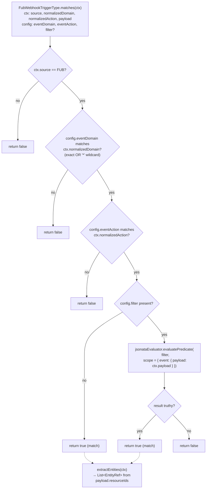

**Scenarios against the same workflow config variations:**

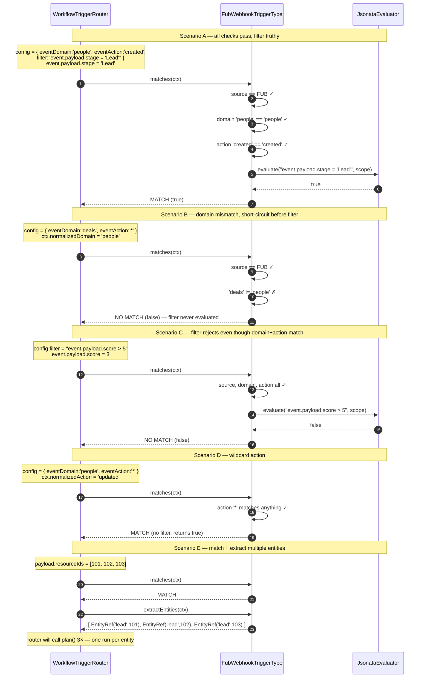

### C. The Graph Validator

`WorkflowGraphValidator.validate()` runs every rule against the graph and collects violations. Ten rules, arranged roughly from cheapest structural checks to the expensive DFS/BFS traversals. If any rule fails, the graph is rejected.

**Decision flow (all ten rules as gates):**

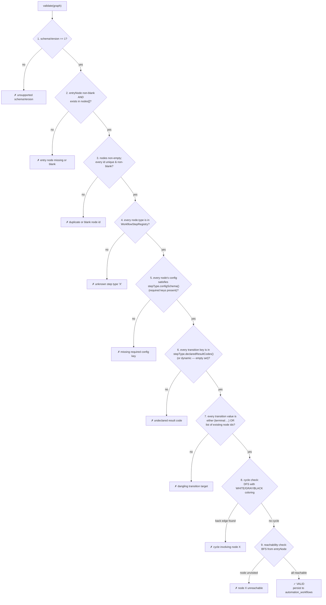

**Scenarios — which rule catches which mistake:**

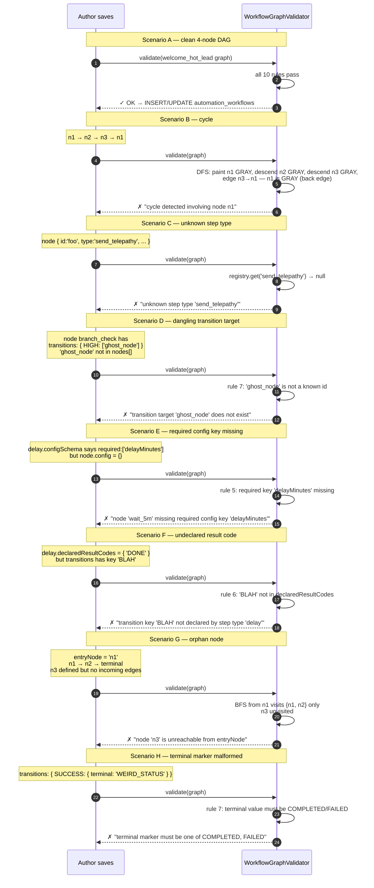

**Where each rule lives in code**, for quick lookup:

| # | Rule                                    | Method in `WorkflowGraphValidator`             |
|---|-----------------------------------------|-------------------------------------------------|
| 1 | `schemaVersion == 1`                    | `validate()` line 31                           |
| 2 | `entryNode` exists                      | `validate()` lines 72–76                       |
| 3 | Nodes non-empty, ids unique             | `validate()` lines 35–70                       |
| 4 | Step type registered                    | `validate()` lines 87–91                       |
| 5 | Config satisfies schema                 | `validateConfig()` lines 152–181               |
| 6 | Result code declared                    | `validateTransitions()` lines 110–150 (line 122) |
| 7 | Transition target / terminal shape      | `validateTransitions()` lines 134–143          |
| 8 | No cycles                               | `checkCycles()` lines 213–225                  |
| 9 | All nodes reachable                     | `checkReachability()` lines 183–211            |

---

## 0. The Example We'll Trace

A four-node workflow: wait 5 minutes, check the lead's priority, then create a FUB task with a different assignee depending on whether the lead is high-priority or not.

```json
{
  "schemaVersion": 1,
  "entryNode": "wait_5m",
  "nodes": [
    { "id": "wait_5m",
      "type": "delay",
      "config": { "delayMinutes": 5 },
      "transitions": { "DONE": ["branch_check"] } },

    { "id": "branch_check",
      "type": "branch_on_field",
      "config": {
        "expression": "event.payload.priority",
        "resultMapping": { "high": "HIGH", "low": "LOW" },
        "defaultResultCode": "MEDIUM"
      },
      "transitions": {
        "HIGH":   ["task_urgent"],
        "LOW":    ["task_standard"],
        "MEDIUM": ["task_standard"]
      } },

    { "id": "task_urgent",
      "type": "fub_create_task",
      "config": { "assignedUserId": 42 },
      "transitions": { "SUCCESS": { "terminal": "COMPLETED" } } },

    { "id": "task_standard",
      "type": "fub_create_task",
      "config": { "assignedUserId": 99 },
      "transitions": { "SUCCESS": { "terminal": "COMPLETED" } } }
  ]
}
```

This workflow is stored in `automation_workflows.graph` as JSONB. Its `status` is `ACTIVE` and it has a `trigger` column describing which webhook events should fire it.

---

## 1. The Two Levels to Keep in Your Head

The engine has **two separate pieces of state** for any workflow, and most confusion comes from mixing them up:

1. **The definition** — the workflow the author drew. Stored in `automation_workflows`. Immutable from the engine's perspective (authors edit it, the engine only reads it).
2. **The run** — one specific execution of that definition, triggered by one specific webhook event. Stored in `workflow_runs` (one row) and `workflow_run_steps` (one row per node). These rows are the *live state machine* — the engine reads and writes them constantly.

Critically: when a run is planned, the engine **freezes a snapshot** of the definition into `workflow_runs.workflow_graph_snapshot`. From that point on, the run refers only to the snapshot. If someone edits the definition five minutes later, in-flight runs are unaffected. This is how we get safe deploys and predictable behavior.

---

## 2. Webhook Arrives → Run Gets Planned

### 2.1 Webhook comes in

File: `src/main/java/com/fuba/automation_engine/controller/WebhookIngressController.java`

The controller exposes `POST /webhooks/{source}` (e.g. `/webhooks/fub`). It reads the raw body, grabs the headers, and hands off to `WebhookIngressService.ingest()`.

### 2.2 Ingest persists and dispatches

File: `src/main/java/com/fuba/automation_engine/service/webhook/WebhookIngressService.java`, method `ingest()` (lines 59–157).

The ingest service does four things:
1. Verifies the webhook signature.
2. Parses the raw body into a `NormalizedWebhookEvent`.
3. **Persists** a row in `webhook_events` — this is the audit trail and the deduplication anchor.
4. If the event type is supported, hands the event to `AsyncWebhookDispatcher`, which calls `WebhookEventProcessorService.process()` asynchronously so the HTTP response returns fast.

### 2.3 Trigger router picks which workflows to run

File: `src/main/java/com/fuba/automation_engine/service/workflow/trigger/WorkflowTriggerRouter.java`, method `route()` (lines 46–193).

Important mental model: **triggers are not steps.** Triggers are evaluated *before* any run exists. A trigger's only job is to answer "does this webhook event cause this workflow to start, and if so, for which entity (lead)?"

The router:
1. Loads all ACTIVE workflows.
2. For each workflow, looks up its trigger type in `WorkflowTriggerRegistry` (today there's just `FubWebhookTriggerType`).
3. Calls `triggerType.matches(...)` with the event — returns true/false.
4. If matched, calls `triggerType.extractEntities(...)` — returns the lead ID(s) this event pertains to.
5. For each `(workflow, lead)` pair, calls `WorkflowExecutionManager.plan(...)` to actually create a run.

For our example, suppose a FUB webhook arrives for a newly-created lead. The trigger matches, the lead ID is extracted, and planning begins.

### 2.4 Planning creates the run and materializes every step

File: `src/main/java/com/fuba/automation_engine/service/workflow/WorkflowExecutionManager.java`, method `plan()` (lines 68–130).

This is the most important method in the whole engine. In one transaction it:

1. **Checks idempotency.** Builds an `idempotencyKey` from `workflow_key + source + sourceLeadId + eventId` (SHA-256). If a run with this key already exists, returns `DUPLICATE_IGNORED`. This is how duplicate webhook deliveries don't cause duplicate runs.
2. **Loads and validates** the workflow graph.
3. **Creates one `workflow_runs` row** with:
   - `status = PENDING`
   - `workflow_graph_snapshot` = a deep copy of the graph (the freeze mentioned earlier)
   - `trigger_payload` = the frozen event payload (step configs will template against this later)
   - `idempotency_key`, `source_lead_id`, `webhook_event_id` — audit / dedupe fields
4. **Materializes every node** as a `workflow_run_steps` row (method `materializeSteps()`, lines 132–170).

After step 4, our example run has **four** `workflow_run_steps` rows sitting in the database:

| node_id         | status              | due_at       | pending_dependency_count |
|-----------------|---------------------|--------------|--------------------------|
| `wait_5m`       | PENDING             | now + 5 min  | 0                        |
| `branch_check`  | WAITING_DEPENDENCY  | null         | 1                        |
| `task_urgent`   | WAITING_DEPENDENCY  | null         | 1                        |
| `task_standard` | WAITING_DEPENDENCY  | null         | 1                        |

Two things to notice:
- **The entry node is the only one that's PENDING.** Everything else is WAITING_DEPENDENCY because it has upstream predecessors.
- **`delayMinutes` from the entry node's config is already baked into `due_at`.** The delay step itself will be a no-op at execution time; the wait is enforced by `due_at` + the claim query's filter. This is the key trick of the engine.

At this point, nothing is running. The transaction commits. The HTTP request that delivered the webhook has long since returned. The run just sits in the database, waiting.

---

## 3. The Worker Claim Loop — How Steps Actually Run

Nothing in the engine is event-driven in-process. Everything is database-polled. This is intentional: it survives restarts, scales horizontally, and every piece of state is inspectable via SQL.

### 3.1 The polling worker

File: `src/main/java/com/fuba/automation_engine/service/workflow/WorkflowExecutionDueWorker.java`, method `pollAndProcessDueSteps()` (lines 39–77).

A `@Scheduled` method wakes up every ~2 seconds (configurable via `workflow.worker.poll-interval-ms`). Each tick it:
1. Runs stale-recovery (rescues steps stuck in PROCESSING from a crashed prior tick).
2. Asks the claim repo for a batch of due, PENDING steps.
3. For each claimed step, calls `WorkflowStepExecutionService.executeClaimedStep(stepId)`.

### 3.2 The claim query — the heart of concurrency safety

File: `src/main/java/com/fuba/automation_engine/persistence/repository/JdbcWorkflowRunStepClaimRepository.java`, method `claimDuePendingSteps()` (lines 96–108).

```sql
WITH due AS (
  SELECT steps.id
    FROM workflow_run_steps steps
    JOIN workflow_runs runs ON runs.id = steps.run_id
   WHERE steps.status  = 'PENDING'
     AND steps.due_at <= :now
     AND runs.status   = 'PENDING'
   ORDER BY steps.due_at, steps.id
   LIMIT :limit
   FOR UPDATE OF steps SKIP LOCKED
)
UPDATE workflow_run_steps steps
   SET status = 'PROCESSING', updated_at = :now
  FROM due
 WHERE steps.id = due.id
RETURNING ...
```

**`In Simple Terms `**

**`Pick some due tasks → lock them so only this worker gets them → mark them as PROCESSING → return them to the worker`**

Two Postgres features do all the heavy lifting:

- **`FOR UPDATE ... SKIP LOCKED`** — if two workers poll at the same time, each grabs a disjoint set of rows. No double-execution, no distributed lock service.
- **`due_at <= :now`** — this is why `delay` works. A step with `due_at = now + 5min` is simply invisible to the claim query until its time arrives.

A successfully claimed step transitions **PENDING → PROCESSING** atomically. If the worker crashes while the step is in PROCESSING, the stale-recovery path (section 6) will eventually rescue it.

---

## 4. Executing a Single Step

File: `src/main/java/com/fuba/automation_engine/service/workflow/WorkflowStepExecutionService.java`, method `executeClaimedStep()` (lines 61–135).

Let's walk the claim of `wait_5m` — the very first step to execute in our example — and then `branch_check`, to see how data flows between them.

### 4.1 Load and sanity-check

The method loads the step row and its parent run. If the run isn't PENDING (already COMPLETED, FAILED, CANCELED), it skips the step. This prevents orphan steps from running after a run has been terminated by another branch.

### 4.2 Look up the step type from the registry

```java
WorkflowStepType stepType = stepRegistry.get(step.getStepType());
```

The registry (`WorkflowStepRegistry`) was populated at Spring startup by scanning every `@Component` that implements `WorkflowStepType` and indexing them by their `id()`. So `"delay"` → `DelayWorkflowStep`, `"branch_on_field"` → `BranchOnFieldWorkflowStep`, etc.

### 4.3 Build RunContext — the data the step sees

Method `buildRunContext()` (lines 197–215). This is how state flows through the run:

```
RunContext {
  metadata:        (runId, workflowKey, workflowVersion)
  triggerPayload:  the frozen webhook event payload
  sourceLeadId:    the entity this run is about
  stepOutputs:     map<nodeId, outputs> of every COMPLETED prior step
}
```

Notice `stepOutputs` is rebuilt from the database on every step execution. No in-memory run-level object. If `wait_5m` ran an hour ago and the worker crashed five times since, the context for `branch_check` is still perfectly reconstructable by querying `workflow_run_steps WHERE run_id = ? AND status = 'COMPLETED'`.

### 4.4 Resolve config templates — the expression system explained

This step is worth taking slowly, because the expression system is what makes the engine *parameterizable* instead of a hard-coded pipeline.

**Why we need an expression language at all.** The graph in `automation_workflows` is authored once, but it has to run against a different webhook payload every time. When an author writes a `fub_create_task` step with `"name": "Follow up with {{ event.payload.firstName }}"`, they're saying "fill this in at run time from whatever triggered the run." Without a template/expression layer, every step type would have to invent its own ad-hoc way of referring to external data. The engine takes the opposite bet: **one expression language, one scope, used everywhere** — in step configs, in branch predicates, and in trigger filters.

**Why JSONata specifically.** JSONata is a JSON-native query and expression language, similar in spirit to JSONPath but with full expression semantics: arithmetic, comparisons, string functions, array transforms, conditionals (`cond ? a : b`), and boolean logic. It's purpose-built for walking and transforming JSON, which is exactly the shape of every piece of data in the engine (webhook payloads, step outputs, configs). The library used is **`com.dashjoin:jsonata` 0.9.8** — a Java port of the JSONata reference implementation. You'll see it in `pom.xml` and imported in `JsonataExpressionEvaluator`.

**Where expressions live — and a key clarification.**

There is **one evaluator, two modes**. Not two evaluators — one class (`JsonataExpressionEvaluator`) that does everything.

File: `src/main/java/com/fuba/automation_engine/service/workflow/expression/ExpressionEvaluator.java` (interface)
Implementation: `JsonataExpressionEvaluator.java`

| Mode | Method | When used | Input shape | Returns |
|------|--------|-----------|-------------|---------|
| Fill-in-the-blanks | `resolveTemplate(template, scope)` | Step config resolution | String with `{{ ... }}` markers | Filled string, or typed value if whole string is one expression |
| Condition / scalar | `evaluatePredicate(expr, scope)` | Branch conditions, trigger filters | Raw expression, no `{{ }}` | Boolean, string, number — whatever JSONata computes |

Both modes take the same `ExpressionScope`. The scope is the context — the map where all the answers live:
- `event.payload` — the webhook payload (no `trigger` key — always `event.payload.<key>`)
- `steps.<nodeId>.outputs.<key>` — every prior step's outputs
- `sourceLeadId` — the entity this run is about

JSONata walks this map. `event.payload.priority` literally means: go to the `event` key, then `payload`, then `priority`, return that value.

**The delimiter.** The template delimiter is **`{{ ... }}`** (two curly braces, not `${...}` — I was sloppy earlier in this doc). The regex in `JsonataExpressionEvaluator` (lines 14–15) is:

```java
TEMPLATE_PATTERN       = "\\{\\{\\s*(.+?)\\s*}}"
FULL_TEMPLATE_PATTERN  = "^\\{\\{\\s*(.+?)\\s*}}$"
```

The distinction between the two matters: if the *entire* string is one `{{ ... }}` expression, the evaluator returns the raw typed value (so `"{{ 5 + 3 }}"` yields the `Integer 8`, not the string `"8"`). If the string mixes literal text with expressions, everything is coerced to string and concatenated. This is how the engine preserves numbers, arrays, and objects through config resolution — critical for things like `"assignedUserId": "{{ steps.check_claim.outputs.assignedUserId }}"` where a number must stay a number.

**The `ExpressionScope` — what expressions can see.**

File: `ExpressionScope.java` (lines 8–29). The scope is a `Map<String, Object>` that every expression evaluates against. Its keys are:

| Scope key        | What it is                                                                |
|------------------|---------------------------------------------------------------------------|
| `event.payload`  | The raw webhook payload — all FUB data lives here                         |
| `sourceLeadId`   | The entity this run is about                                              |
| `steps`          | `{ <nodeId>: { "outputs": <outputs> }, ... }` for every COMPLETED step    |

So **`steps.check_claim.outputs.assignedUserId`** is literally a walk through this map: `steps` → `check_claim` → `outputs` → `assignedUserId`. JSONata handles missing keys by returning `null` without throwing, so partially-populated scopes don't crash — you just get `null` downstream.

**Concrete examples that actually work (from `ExpressionEvaluatorTest`):**

| Expression                                                   | Evaluates to                                              |
|--------------------------------------------------------------|-----------------------------------------------------------|
| `"{{ event.payload.firstName }}"`                            | `"Sarath"` (a string)                                     |
| `"{{ steps.check_claim.outputs.assignedUserId }}"`           | `77` (an `Integer`, not `"77"`)                           |
| `"{{ $count(event.payload.tags) }}"`                         | the number of tags on the event                           |
| `"Hello {{ event.payload.firstName }}, welcome"`             | `"Hello Sarath, welcome"` (concatenation)                 |
| `"steps.check_claim.outputs.assignedUserId > 0"` (predicate) | `true` / `false` (boolean)                                |
| `"event.payload.status = 'hot' and event.payload.score > 5"` | compound condition, boolean                               |

**How conditions (if-style branching) actually work today.** There is no dedicated `if` step type — conditions happen inside `branch_on_field`. The config pattern is:

```json
{
  "expression": "event.payload.priority",
  "resultMapping": { "high": "HIGH", "low": "LOW" },
  "defaultResultCode": "MEDIUM"
}
```

At run time: `evaluatePredicate("event.payload.priority", scope)` runs → gets back a string like `"high"` → `resultMapping` maps it to the result code `"HIGH"` → the graph's `transitions` map sends the run to whichever node is under the `"HIGH"` key. Boolean predicates work too — you can write `"event.payload.score > 5"` as the `expression`, map `true`/`false` in `resultMapping`, and get if/else. It's clunky but it works, and it's the entire reason the control-flow plan proposes a first-class `if` step: not because the engine *can't* branch, but because authoring branches is awkward.

**Where resolution actually runs.**

Method `resolveConfigTemplates()` in `WorkflowStepExecutionService` (lines 218–227) walks the step's `config_snapshot` recursively. For every string value, it calls `resolveTemplate`. For maps and lists, it recurses. The result is persisted to `workflow_run_steps.resolved_config` **before** `execute()` is called. That persistence matters for two reasons:
1. **Debugging.** You can look at the row in the DB and see exactly what the step was handed — the original config and the resolved config, side by side.
2. **Idempotency across retries.** If the step fails transiently and gets re-claimed later, the resolved config is stable for the lifetime of the row (it was frozen at first-execute time). But note: in the current implementation the resolver does re-run on each retry attempt; the stored `resolved_config` is overwritten. That's usually fine because the trigger payload and prior-step outputs are themselves frozen, so the result is deterministic.

For `wait_5m` in our example, `config_snapshot` is `{ "delayMinutes": 5 }` — an integer, no strings, so resolution is a no-op and `resolved_config` equals `config_snapshot`.

### 4.5 Call `execute()` — what the step actually does

After the resolved config and RunContext are ready, the service invokes:

```java
StepExecutionContext ctx = new StepExecutionContext(
    step, run, runContext, resolvedConfig, expressionEvaluator);
StepExecutionResult result = stepType.execute(ctx);
```

The `StepExecutionContext` is the **one and only** thing handed to a step type. Steps do not reach back into the database, do not look up sibling steps, do not call out to other services through back channels. Every piece of data they need is on the context. This is deliberate — it's what makes step types unit-testable without a running Spring context, and what keeps the engine's invariants intact (no stealth writes to `workflow_run_steps`, no second claim of the same row).

A `StepExecutionResult` is one of four shapes (see `StepExecutionResult.java`):

| Shape                                  | Meaning                                               | What the engine does next                 |
|----------------------------------------|-------------------------------------------------------|-------------------------------------------|
| `success(resultCode)`                  | Done, outcome is `resultCode`, no outputs             | Mark COMPLETED, `applyTransition`         |
| `success(resultCode, outputs)`         | Done, outcome + outputs for downstream consumption    | Mark COMPLETED with outputs, transition   |
| `transientFailure(reason)`             | Try again later                                       | Retry with exponential backoff            |
| `permanentFailure(reason)`             | Give up, fail the run                                 | Mark step FAILED, mark run FAILED         |

**Let's look at two real step types against this interface.**

**`DelayWorkflowStep`** (`steps/DelayWorkflowStep.java`). Its entire `execute()` body is effectively `return StepExecutionResult.success("DONE");`. No I/O, no state changes. The delay is *never enforced inside `execute()`* — it's enforced by `due_at` + the claim query's `WHERE due_at <= :now` filter. By the time a delay step is being executed, the wait is already over. This is a very important mental model: **the engine waits by not claiming rows, not by sleeping in Java.**

**`BranchOnFieldWorkflowStep`** (`steps/BranchOnFieldWorkflowStep.java`, lines 69–111). A more interesting flow:

```
1. Read `expression`, `resultMapping`, `defaultResultCode` from resolvedConfig.
2. Build an ExpressionScope from the RunContext (trigger + steps.*.outputs).
3. expressionEvaluator.evaluatePredicate(expression, scope)
     → typically returns a scalar like "high", 5, or true
4. Coerce result to a string key, look it up in resultMapping.
5. If found → resultCode = mapping[value].
   If not found → resultCode = defaultResultCode.
6. Write outputs = { "expressionResult": <rawValue> } — audit trail.
7. return StepExecutionResult.success(resultCode, outputs);
```

Notice the step itself *does not decide which next node to visit*. It returns a **result code string**. The graph's `transitions` map, not the step, picks the next node. This separation is why the engine can analyze and visualize graphs: the routing information lives in the graph, not scattered across step implementations.

**`FubCreateTaskWorkflowStep`** (the third step type touched by our example) is different again — it makes an outbound HTTP call to Follow Up Boss, translates FUB API errors into transient vs. permanent failure, and returns `success("SUCCESS")` on 2xx. The same `StepExecutionResult` contract covers both the trivial `delay` step and a network-bound API step with no special-casing in the engine.

### 4.6 Persist outputs and hand off to transitions

After `execute()` returns, back in `executeClaimedStep()`:

```java
if (result.isSuccess()) {
    markStepCompleted(step, result.resultCode(), result.outputs());  // writes row
    applyTransition(step, run, result.resultCode());                 // walks the graph
}
```

`markStepCompleted` writes `status = COMPLETED`, `result_code`, and `outputs` in one update. Then `applyTransition` takes over — covered in the next section.

---

## 5. Transitions — How the Next Step Is Decided

Method `applyTransition()` lives in `WorkflowStepExecutionService` (lines 259–294). This is where the graph is walked.

**Who calls it.** Exactly one caller: `executeClaimedStep()` at line 122, only on the success path. There is no other call site. Terminal transitions, skips, and run-completion checks all happen *inside* `applyTransition` — there's no bypass path that walks the graph somewhere else. Failure paths don't call it at all: they go straight to `markStepAndRunFailed()` and never consult `transitions`. This is good to know because it means the graph is walked in exactly one place, under one transactional boundary, with the step already marked COMPLETED in the DB.

The method reads the current node's `transitions` map from the **graph snapshot on the run row** (not from `automation_workflows` — see §8.5 on snapshots), then looks up the result code we just produced. There are three possible shapes:

### Case A: A list of next nodes — fan-out or single-next

`"transitions": { "DONE": ["branch_check"] }` — the list has one entry, so "single next." `"transitions": { "DONE": ["notify_slack", "create_task"] }` would be two-way fan-out.

Method `activateNextNodes()` (lines 318–339) does the activation. For each target node:
1. Find its existing `workflow_run_steps` row (remember, it was materialized at plan time with status WAITING_DEPENDENCY).
2. Decrement `pending_dependency_count`.
3. **If the count reached 0**, flip status WAITING_DEPENDENCY → PENDING and set `due_at` from the target node's own `delayMinutes` config (or to now).
4. Save.

This is the **join mechanism**. A node with two predecessors is materialized with `pending_dependency_count = 2`, and becomes runnable only after *both* predecessors complete. No locks, no coordinator — just integer arithmetic on a row.

**The full `pending_dependency_count` lifecycle** — this is worth spelling out because it's the single cleverest trick in the engine and it's easy to miss:

| Stage           | What happens                                                                                                                                                    | Code location                                                                |
|-----------------|-----------------------------------------------------------------------------------------------------------------------------------------------------------------|------------------------------------------------------------------------------|
| **Defined**     | Column on `workflow_run_steps`: `pending_dependency_count INTEGER NOT NULL DEFAULT 0`                                                                           | Migration `V10__create_workflow_engine_tables.sql` (line 76)                 |
| **Initialized** | At run-plan time. The entry node gets `0`. Every other node gets the size of its predecessor set, computed by walking all `transitions` maps in reverse.        | `WorkflowExecutionManager.buildPredecessorMap()` + `materializeSteps()` (lines 132–190) |
| **Decremented** | Every time a predecessor completes and `activateNextNodes` runs. Read-modify-write in Java: `newCount = target.getPendingDependencyCount() - 1; save(target);` | `WorkflowStepExecutionService.activateNextNodes()` (lines 318–339)           |
| **Observed**    | The same method flips `WAITING_DEPENDENCY → PENDING` the moment `newCount == 0` and sets `due_at`. The worker's next poll picks the row up.                     | same method                                                                  |
| **Never read again** | After a row transitions to PENDING, `pending_dependency_count` is not consulted. It is purely a materialization-to-PENDING gate.                           | —                                                                            |

Two subtleties worth calling out:

- The decrement is a read-modify-write in application code, not an atomic SQL `UPDATE ... SET count = count - 1`. In principle, if two predecessors of the same join node complete *at the exact same instant* on two different workers, you could lose an update and strand the join forever at count=1. In practice this is rare because joins are uncommon in current workflows, and retries + stale-recovery hide the effect. It is nonetheless a real edge case and worth being aware of if you add more parallel patterns. A sharper implementation would use `UPDATE workflow_run_steps SET pending_dependency_count = pending_dependency_count - 1 WHERE id = ?` returning the new value.
- A retry of a predecessor does **not** decrement the count a second time. Decrement only happens on `success` — and a step only reaches the success path once, after which its row is COMPLETED. So counts can't go negative through the normal retry path.

### Case B: A terminal marker — the run ends here

`"transitions": { "SUCCESS": { "terminal": "COMPLETED" } }` — the value is the special object `{"terminal": "COMPLETED"}`.

Method `applyTerminalTransition()` (lines 296–316):
1. Marks every non-terminal step (PENDING, WAITING_DEPENDENCY) as SKIPPED.
2. Sets `workflow_runs.status` to COMPLETED (or FAILED).

This is how our example ends: `task_urgent` completes with result `SUCCESS`, the transition is `{"terminal": "COMPLETED"}`, and the run is done.

### Case C: No transition for this result code

An author error or an unmapped `default` branch. The run is marked FAILED with an "unhandled result code" reason.

### Tracing our example

1. `wait_5m` completes → result `DONE` → transition `["branch_check"]` → `branch_check.pending_dependency_count` 1 → 0 → status becomes PENDING → `due_at = now`.
2. Worker claims `branch_check` on its next tick → evaluates `event.payload.priority` → returns result `HIGH` → transition `["task_urgent"]` → `task_urgent` becomes PENDING.
3. Note: `task_standard` is **still sitting in WAITING_DEPENDENCY with count = 1**. Because `branch_check` routed only to `task_urgent`, nothing ever decrements `task_standard`. It will be SKIPPED when the terminal transition runs on `task_urgent`.
4. Worker claims `task_urgent` → `FubCreateTaskWorkflowStep.execute()` makes a real HTTP call to Follow Up Boss → returns `SUCCESS`.
5. Transition is `{"terminal": "COMPLETED"}` → `task_standard` gets marked SKIPPED → run.status = COMPLETED.

---

## 6. Failures, Retries, and Stale Recovery

Three failure modes; all land in `WorkflowStepExecutionService`.

### 6.1 Transient failure → retry with backoff

If `execute()` returns `StepExecutionResult.transientFailure(...)` — typical for an HTTP 503 or a network blip — the service consults the step's effective `RetryPolicy` (merging the step type's default with any `retryPolicy` override in the config). If `retry_count < maxAttempts - 1`:
- `retry_count` is incremented.
- Status stays PENDING.
- `due_at` is bumped to `now + exponentialBackoff(retry_count)`.
- The step will simply be re-claimed when its new `due_at` arrives.

The claim query doesn't care that this is a "retry" — it's just a PENDING row with a future `due_at`, like any other.

### 6.2 Permanent failure or retries exhausted → run fails

`markStepAndRunFailed()` (lines 407–420): step.status = FAILED, run.status = FAILED (if still PENDING). No cascading SKIP of other steps — any in-flight sibling branches will finish their claim and discover the run is no longer PENDING when they try to execute, then no-op out.

### 6.3 Worker crash → stale recovery

If a worker claims a step (PENDING → PROCESSING) and then the JVM dies, the row is stuck in PROCESSING forever. The stale-recovery sweep (method `runStaleProcessingRecovery()` in the worker, lines 95–118) finds rows where `status = PROCESSING AND updated_at <= now - staleTimeout` and either:
- Requeues them (PROCESSING → PENDING, reset `due_at`, increment `stale_recovery_count`) if under the requeue limit, or
- Marks them FAILED if they've been stale-recovered too many times.

This is why `FOR UPDATE SKIP LOCKED` in the claim query is safe: a crashed worker's lock is released by Postgres when the connection dies, so a replacement worker can pick the row up on the next tick.

---

## 7. The Database, in One Table

Three tables do essentially all the work.

### `automation_workflows` — the authored definition

| Column   | Meaning                                             |
|----------|-----------------------------------------------------|
| `key`    | Stable identifier, normalized                       |
| `graph`  | JSONB — `{entryNode, nodes, schemaVersion}`         |
| `trigger`| JSONB — trigger type + config                       |
| `status` | DRAFT / ACTIVE / INACTIVE                           |
| `version`| Optimistic-lock version                             |

### `workflow_runs` — one row per execution

| Column                    | Meaning                                              |
|---------------------------|------------------------------------------------------|
| `workflow_graph_snapshot` | Frozen graph — run reads only this, never the live graph |
| `trigger_payload`         | Frozen event payload                                 |
| `status`                  | PENDING / COMPLETED / FAILED / CANCELED / DUPLICATE_IGNORED |
| `idempotency_key`         | UNIQUE — prevents duplicate runs from duplicate webhooks |
| `source_lead_id`          | The entity this run is about                         |

### `workflow_run_steps` — one row per node per run (the live state machine)

| Column                      | Meaning                                                |
|-----------------------------|--------------------------------------------------------|
| `node_id`                   | Stable ID from the graph                               |
| `step_type`                 | Registry key (`delay`, `branch_on_field`, ...)         |
| `status`                    | WAITING_DEPENDENCY / PENDING / PROCESSING / COMPLETED / FAILED / SKIPPED |
| `due_at`                    | When the step becomes claimable — this is how delays work |
| `pending_dependency_count`  | Decremented as predecessors complete; 0 means ready     |
| `depends_on_node_ids`       | Audit: which nodes we're waiting for                   |
| `config_snapshot`           | The authored config, frozen                            |
| `resolved_config`           | After JSONata template resolution (debugging gold)     |
| `result_code`               | The outcome the step returned                          |
| `outputs`                   | JSONB — downstream steps read these via `steps.<nodeId>` |
| `retry_count`               | For exponential backoff                                |
| `stale_recovery_count`      | For the stale-recovery sweep                           |

Key indexes: `(status, due_at)` on `workflow_run_steps` — this is what makes the claim query fast. `UNIQUE(run_id, node_id)` — one step row per node per run.

---

## 8. Cross-Cutting Concerns — The "Thin Layers" Explained

The previous sections traced one run from webhook to completion. But a production engine has cross-cutting concerns that don't fit neatly into a chronological walk. This section covers them one at a time. None of these are new mechanisms — they're thin layers over the five core moves (delay, branch, join, retry, crash-safety). But they're the parts that usually confuse new readers.

### 8.1 The graph validator — how authors are protected from themselves

File: `src/main/java/com/fuba/automation_engine/service/workflow/WorkflowGraphValidator.java` (class `WorkflowGraphValidator`, main method `validate(Map<String, Object> graph)` at line 23).

**Why it exists.** The graph is a JSONB blob authored by a human (via the admin UI or an API call). Nothing in JSON's structure prevents someone from writing a graph whose entry node doesn't exist, whose transitions point at dead node IDs, or whose cycles make the run loop forever. The validator is the gatekeeper that rejects such graphs before they can harm anything.

**The rules it enforces** (with line numbers so you can see each check):

1. **Schema version is `1`** (line 31). Future-proofing for a migration path.
2. **`entryNode` is non-blank and references an existing node** (lines 72–76).
3. **`nodes` is a non-empty list; every node has a unique non-blank `id`** (lines 35–70).
4. **Every node's `type` is registered in `WorkflowStepRegistry`** (lines 87–91). You can't reference a step type that doesn't exist.
5. **Transitions use declared result codes** (lines 110–150). Each step type declares `declaredResultCodes()`; transitions keyed by codes the step type never emits are rejected. Wildcard declarations (empty set = dynamic) are allowed for steps like `branch_on_field`.
6. **Terminal transitions use the `{"terminal": "COMPLETED" | "FAILED"}` shape** (line 134).
7. **Non-terminal transitions reference existing node IDs** (lines 139–143). No dangling edges.
8. **Per-step config satisfies the step type's schema** (method `validateConfig()`, lines 152–181). Required keys are enforced from `stepType.configSchema()`.
9. **No cycles** (method `checkCycles()`, lines 213–225). Standard DFS with WHITE/GRAY/BLACK coloring to detect back edges. **This is why the current engine can't do loops.**
10. **All nodes reachable from the entry** (method `checkReachability()`, lines 183–211). BFS from `entryNode` — orphan nodes are a bug.

**When it runs.** Two places:

- **At workflow save** — `AutomationWorkflowService.createOrUpdate()` calls `validate()` before writing to `automation_workflows`. Invalid graphs never get persisted.
- **At run plan** — `WorkflowExecutionManager.plan()` calls `validate()` again before creating a run. Belt-and-suspenders: catches the case where a validator rule was added *after* a graph was saved.

Both calls operate on the live graph from `automation_workflows.graph`, not on the snapshot. The snapshot inherits the validated state.

### 8.2 Per-step config schemas — the second level of validation

Separate from the graph validator, each step type declares its *own* config schema via `WorkflowStepType.configSchema()` (returns `Map<String, Object>` — a JSON-Schema-shaped document).

Example from `FubCreateTaskWorkflowStep.configSchema()`:

```java
Map.of(
  "type", "object",
  "required", List.of("name"),
  "properties", Map.of(
    "name",      Map.of("type", "string", "description", "Task name"),
    "personId",  Map.of("type", "integer"),
    "dueInDays", Map.of("type", "integer")
  )
)
```

This schema is consumed in two places:

1. **Graph validation** — `WorkflowGraphValidator.validateConfig()` enforces required keys.
2. **Admin UI** — the workflow builder UI fetches the schema from `AdminWorkflowController` to render form fields, placeholder hints, and inline validation for each step's config.

Runtime validation of ranges, enum values, and cross-field constraints still happens inside the step's `execute()`, not in the schema — JSON Schema is checked for *shape*, not *semantics*.

### 8.3 Triggers in depth — the thing that's not a step

I've called triggers "special" twice already; here's what that actually means in code.

**Registry.** File: `service/workflow/trigger/WorkflowTriggerRegistry.java` (lines 12–34). Same Spring component-scan pattern as step types — every `@Component` implementing `WorkflowTriggerType` is auto-registered, keyed by its `id()`.

**The trigger column.** `automation_workflows.trigger` is a JSONB blob of shape `{ "type": "<triggerTypeId>", "config": { ... } }`. For the one implemented trigger type (`FubWebhookTriggerType`), a typical config looks like:

```json
{
  "type": "fub_webhook",
  "config": {
    "eventDomain": "people",
    "eventAction": "created",
    "filter": "event.payload.stage = 'lead'"
  }
}
```

**What `matches()` actually checks** (`FubWebhookTriggerType.matches()`, lines 54–81):

1. Source is `WebhookSource.FUB` (line 55). Other sources are rejected outright.
2. `eventDomain` from config matches the normalized event domain (e.g. `"people"` vs. the webhook's domain enum). `"*"` is a wildcard.
3. `eventAction` from config matches the normalized event action (e.g. `"created"`). `"*"` is a wildcard.
4. *Optional* `filter` — a JSONata predicate evaluated against the event payload. If it returns truthy, the trigger matches. If falsy, the webhook is rejected even though domain+action match. This is how you get fine-grained matching like "people.created *where* stage = 'lead'".

**What `extractEntities()` does** (lines 84–103). Pulls `payload.resourceIds` (a list), wraps each one as `EntityRef("lead", id)`, and returns the list. The router then calls `plan()` once per entity. So if a FUB webhook arrives with `resourceIds: [101, 102, 103]`, you get three independent runs — each with its own `workflow_runs` row, its own snapshot, its own idempotency key, its own set of step rows. This is the fan-out-across-entities pattern, and it happens at the trigger boundary, not inside any step.

**Trigger config is validated on save** via the trigger type's own `configSchema()`, same pattern as step types.

### 8.4 Idempotency — the exact key construction

File: `WorkflowExecutionManager.buildIdempotencyKey()` (lines 226–239).

The key is a SHA-256 hash of pipe-delimited, normalized components, then prefixed with a version tag:

```
raw     = "<workflowKey>|<source>|<sourceLeadId>|EVENT|<eventId>"
   (or)   "<workflowKey>|<source>|<sourceLeadId>|FALLBACK|NO_EVENT" if eventId is null
key     = "WEM1|" + sha256Hex(raw)
```

Components are normalized (trimmed, uppercased via `KeyNormalizationHelper.normalizeWorkflowKeyOrEmpty`) before hashing — so whitespace and case in the workflow key don't cause false misses.

The column `workflow_runs.idempotency_key` has a UNIQUE constraint. `plan()` does a pre-check (SELECT) before inserting to give a clean `DUPLICATE_IGNORED` return value, but the DB constraint is the real guarantee — if two webhook processors race, one INSERT succeeds, the other gets a constraint violation and returns DUPLICATE_IGNORED.

**The `WEM1|` prefix** is a version tag. If we ever change the hashing scheme, we bump it to `WEM2|` — old and new keys live side by side, no migration needed. Small forethought, meaningful payoff.

### 8.5 The per-run graph snapshot — in more detail

At `plan()` time (line 113), the run row is populated with `workflow_graph_snapshot = workflow.getGraph()` — the same JSONB object that was just validated. This is **not** a deep clone in Java (no `ObjectMapper` round-trip); it's the same in-memory reference that was fetched from `automation_workflows`. It works anyway because:

- Step execution never mutates the graph (read-only traversal).
- JPA persists `workflow_graph_snapshot` as a *separate JSONB column* on `workflow_runs`. Once committed, it's a distinct copy in the database, independent of any future edits to `automation_workflows.graph`.

From that commit forward, every step execution reads `transitions`, `config`, and `entryNode` from `run.getWorkflowGraphSnapshot()` — never from the workflow definition. You can see this in `executeClaimedStep` (line ~263) and `applyTransition` (line ~263). If you edit and re-save the workflow while a run is mid-flight, the in-flight run keeps using the old graph. Only new runs planned after the save use the new graph.

### 8.6 Outputs as downstream inputs — the data-flow contract

You saw in §4.4 that `ExpressionScope` exposes `steps.<nodeId>.outputs.<key>`. Here's the full round trip for a value written by one step and read by another:

1. Step A completes. Its `execute()` returned `StepExecutionResult.success("HIGH", Map.of("assignedUserId", 77))`.
2. The service writes that map to `workflow_run_steps.outputs` (JSONB column) for step A's row, sets status COMPLETED.
3. Later, step B is claimed. `buildRunContext()` runs a query like `SELECT node_id, outputs FROM workflow_run_steps WHERE run_id = ? AND status = 'COMPLETED'` and assembles a `stepOutputs` map.
4. `ExpressionScope.from(runContext)` builds `{ "steps": { "A": { "outputs": { "assignedUserId": 77 } } } }` as part of the scope.
5. Step B's config, say `{ "assignedUserId": "{{ steps.A.outputs.assignedUserId }}" }`, goes through `resolveConfigTemplates()`. The JSONata expression walks the scope and returns the integer `77`.
6. Resolved config is persisted to step B's `resolved_config` JSONB column.
7. Step B's `execute()` reads `resolvedConfig.get("assignedUserId")` and gets `77` as an `Integer`.

The three storage columns involved — don't mix them up:

| Column            | Contents                                                            | Written when                |
|-------------------|---------------------------------------------------------------------|-----------------------------|
| `config_snapshot` | Authored config from the graph node, unchanged                      | Run plan time               |
| `resolved_config` | Same shape, with `{{ ... }}` templates evaluated                    | Start of step execution     |
| `outputs`         | The map the step's `execute()` returned                             | End of step execution       |

### 8.7 The main loop — what the engine is doing when nothing is happening

Tying together what's been covered: the engine is, at heart, a **single scheduled method and one SQL query**. The scheduler is enabled by `@EnableScheduling` in `WorkflowWorkerSchedulingConfig.java` (line 8). The one `@Scheduled` method is `WorkflowExecutionDueWorker.pollAndProcessDueSteps()`:

```java
@Scheduled(fixedDelayString = "${workflow.worker.poll-interval-ms:2000}")
public void pollAndProcessDueSteps() { ... }
```

So every 2 seconds (default), on Spring's default single-threaded `TaskScheduler`, the following happens:

1. **Stale recovery sweep.** Any row stuck in `PROCESSING` past the staleness timeout is either requeued back to `PENDING` or marked `FAILED` (depending on `stale_recovery_count`).
2. **Claim a batch.** The claim SQL from §3.2 runs with a batch size from `workflow.worker.claim-batch-size`. Up to N rows transition `PENDING → PROCESSING` atomically.
3. **For each claimed row, execute it synchronously.** `executeClaimedStep` runs: build RunContext, resolve templates, run `execute()`, mark COMPLETED or retry or fail, then `applyTransition`, which may flip downstream `WAITING_DEPENDENCY` rows to `PENDING` — making them eligible for the *next* tick's claim query.
4. **Repeat claim-and-execute** until either the batch returns empty or `workflow.worker.max-steps-per-poll` is reached (a guardrail so one tick can't monopolize the worker forever).
5. **Return.** Wait for the next tick.

If no webhooks have arrived and no delays are due, step 2's query returns zero rows and the tick is a single ~millisecond SQL query. Idle cost is negligible.

If 10,000 delayed steps all come due at once, step 2 returns `claim-batch-size` rows per iteration of the inner loop, and the worker chews through them in batches until `max-steps-per-poll` is hit; the remainder waits for the next tick (2 seconds later). This is how the engine self-throttles under load without ever blocking the HTTP path that accepts webhooks.

**Config keys that control the loop:**

| Key                                      | Default  | Purpose                                                         |
|------------------------------------------|----------|-----------------------------------------------------------------|
| `workflow.worker.enabled`                | `true`   | Lets you disable the worker entirely (e.g., in one pod)         |
| `workflow.worker.poll-interval-ms`       | `2000`   | Gap between ticks                                               |
| `workflow.worker.claim-batch-size`       | (tuned)  | Rows per claim query                                            |
| `workflow.worker.max-steps-per-poll`     | (tuned)  | Hard ceiling on work per tick                                   |
| `workflow.worker.stale-processing-enabled` | `true` | Whether stale-recovery runs                                     |
| `workflow.worker.stale-processing-timeout-minutes` | (tuned) | How long PROCESSING is allowed before being considered dead |

**One scheduled thread, one method, one query.** Everything else — retries, joins, branches, delays, fan-out — is emergent behavior from that loop plus the DB schema. This is what I meant by "thin layers over the five mechanisms": it's genuinely thin.

---

## 9. The Five Mechanisms, in One Sentence Each

If you want a cheat sheet:

1. **Delays** — a number in config becomes `due_at`; the claim query filters on it.
2. **Branching** — a step returns a string result code; the graph's `transitions` map picks the next node(s) by that string.
3. **Joins** — every node has a pre-computed `pending_dependency_count`; predecessors decrement it; the node runs when it hits 0.
4. **Retries** — same row, incremented `retry_count`, bumped `due_at`.
5. **Crash safety** — `FOR UPDATE SKIP LOCKED` + a stale-recovery sweep that rescues rows stuck in PROCESSING.

Everything else the engine does — triggers, templating, outputs-as-downstream-inputs, idempotency, per-run graph snapshots — is a thin layer over these five.

---

## 10. What's *Not* in the Engine (And Why It Matters for Extensions)

Now you can see clearly what the control-flow plan (`control-flow-step-types-plan.md`) is actually proposing to add:

- **Loops** don't fit anywhere in the picture above because the number of `workflow_run_steps` rows is decided at plan time and never grows. To support loops we'd need to add rows *after* plan time — "runtime expansion." Every other piece (claim query, retries, joins) works unchanged.
- **Sub-workflows** would mean one run spawning another run, with output passing across the boundary. The snapshot mechanism already isolates runs from each other, so this is a natural extension.
- **External-event waits** (wait-for-SMS) would need a new table mapping correlation keys to waiting step IDs, consulted by the webhook ingress path. It's the one proposed feature that *doesn't* fit cleanly into the existing claim-query pattern.

Everything proposed in the control-flow plan is additive — the mechanisms described in this document keep working exactly as they do today.

---

## Appendix — File Map

| Responsibility            | File                                                                                                    |
|---------------------------|---------------------------------------------------------------------------------------------------------|
| Webhook entry             | `controller/WebhookIngressController.java`                                                              |
| Ingest + persist + dedupe | `service/webhook/WebhookIngressService.java`                                                            |
| Async dispatch            | `service/webhook/dispatch/AsyncWebhookDispatcher.java`                                                  |
| Event processing          | `service/webhook/WebhookEventProcessorService.java`                                                     |
| Trigger matching          | `service/workflow/trigger/WorkflowTriggerRouter.java`                                                   |
| Run planning              | `service/workflow/WorkflowExecutionManager.java`                                                        |
| Poll loop                 | `service/workflow/WorkflowExecutionDueWorker.java`                                                      |
| Claim SQL                 | `persistence/repository/JdbcWorkflowRunStepClaimRepository.java`                                        |
| Step execution            | `service/workflow/WorkflowStepExecutionService.java`                                                    |
| Step registry             | `service/workflow/WorkflowStepRegistry.java`                                                            |
| Built-in step types       | `service/workflow/steps/*.java`                                                                         |
| Schema                    | `resources/db/migration/V10__create_workflow_engine_tables.sql`                                         |
