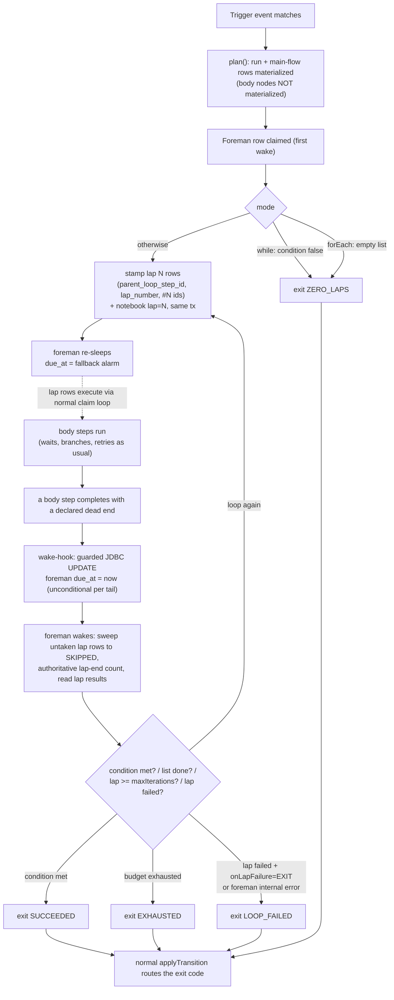

# Loop Primitive — Phased Engineering Plan

> **Changelog**
> - **2026-06-10 (rev 2)** — amended after the adversarial stress-test
>   ([audit](../../../audits/loop-primitive-stress-test-2026-06-10.md), 24 attack
>   iterations). Headline changes: **nesting deferred from v1** (decision #11
>   revised); **supersede×loop decided** (#14: configurable, MVP=RESTART);
>   **authoring is JSON-only in v1** (#15); relation column re-keyed to the
>   foreman **instance** (`parent_loop_step_id` FK); new **normative contract**
>   + **concurrency appendix** sections; lap-aware failure paths; kill-switch;
>   metrics phase; test-infra line items. Feasibility-checked against code:
>   11/17 amendments TRIVIAL/SMALL with in-repo patterns, rest MODERATE.
> - 2026-06-10 (rev 1) — initial plan.
>
> Design decisions: see [README.md](README.md) decision sheet +
> [RD-009](../../../repo-decisions/RD-009-loop-primitive-foreman-cloned-rows.md).
> Phase tracker: [phases.md](phases.md).

## Architecture in one paragraph

A new control-family step type `loop` carries a **nested body sub-graph** in its
config. At runtime the loop node's row (the **foreman**) stays alive across the
whole loop: it stamps one lap at a time by **inserting fresh `workflow_run_steps`
rows** for the body's nodes with lap-suffixed ids (`call#2`) and relation columns
(`parent_loop_step_id` → the foreman's row, `lap_number`), sleeps, and is **woken
by a small engine hook** when a lap reaches a dead end. Between laps it evaluates
the mode's condition (`while` / `until` / `forEach` items) against lap results,
then stamps the next lap or exits via normal result-code transitions
(`SUCCEEDED` / `EXHAUSTED` / `LOOP_FAILED` / `ZERO_LAPS`). All loop bookkeeping
lives in the foreman's `step_state` (durable, crash-safe). The static graph stays
cycle-free; existing claim/retry/stale-recovery machinery is reused **with the
specific lap-aware changes listed below** (the stress test proved "reused
unchanged" was wrong at three seams).

## Run lifecycle

## Key integration points (today's code)

| Mechanism | Where | Why it matters here |
|---|---|---|
| One row per (run, node_id), UNIQUE | `WorkflowRunStepEntity` (~:29) | Lap rows need fresh ids → `#N` suffix; constraint is the idempotency **backstop** (primary = pre-check SELECT) |
| Poller claims `due_at <= now` | `WorkflowExecutionDueWorker`, `JdbcWorkflowRunStepClaimRepository` | Laps and foreman wake-ups ride the existing scheduler; the claim repo's guarded-UPDATE idiom is the pattern for the poke |
| Result codes → transitions | `WorkflowStepExecutionService.applyTransition` (~:295) | Loop exits are ordinary transitions; wake-hook lands here |
| Node lookup by id in snapshot | `findNodeInGraph` (~:422), `resolveStepDueAt` (~:377) | Must resolve `call#2` → body node `call` (suffix strip + body descent) |
| Durable per-step pocket + reschedule | `step_state`, `scheduleReschedule` (~:530) | Foreman's notebook; reschedule gains the min-wins due_at rule |
| Validator | `WorkflowGraphValidator` | Gains body recursion + the new rules; cycle ban stays |
| Run-completion sweep | `checkRunCompletion` (~:394) | PENDING foreman blocks finalization (verified); `anyFailed` must ignore lap rows |
| Supersede | `RunSupersedePolicy` | Gains the `onSupersede` config gate (decision #14) |
| Stale recovery SQL | `JdbcWorkflowRunStepClaimRepository` (~:47-87) | Sets FAILED **in SQL** — lap-aware branch must live partly there |

## Normative graph contract (binding; Phase 1 encodes it)

1. **Dead end (lap end)** = a body node result whose transition value is an
   **explicit empty mapping** for that code, or a node whose `transitions` map is
   explicitly `{}`. An **unmatched result code inside a body is still an error**
   (today's `TRANSITION_NOT_DEFINED`) — it routes to the **lap-failure path**,
   never a silent lap end, and never fails the run directly.
2. **Exit codes are success-typed results.** The foreman catches all internal
   errors (JSONata, bookkeeping) → `LOOP_FAILED`. Only an uncaught foreman
   exception fails the run (engine default). There are no separate
   "config-failure codes".
3. **Mode-dependent mandatory wiring:** `until` wires `SUCCEEDED` + `EXHAUSTED`;
   `while` and `forEach` additionally wire `ZERO_LAPS`; **all modes wire
   `LOOP_FAILED`**. Validator rejects `ZERO_LAPS` wired on `until` (dead edge).
4. **Condition dialect:** conditions/`items` see `lap` (1-based), `item`/`index`
   (forEach), `lastLap.<bodyNodeId>.{resultCode, outputs.*}`, plus
   `person.* / now.* / event.*`. **No `steps.*`** — validator rejects it.
   `lastLap` contains **only nodes that ran in that lap**; absent otherwise
   (JSONata absent → falsy; documented footgun).
5. **Lap-local scope inside a lap:** `steps.<bodyNodeId>` resolves to *this
   lap's* clone. Lap rows are **excluded** from every other step's `steps.*`
   scope (filter on `parent_loop_step_id` in `buildRunContext`).
6. **`lapDelayMinutes`** applies before laps 2..N only; lap 1's entry row is due
   immediately (all modes). Static integer in v1 (no templates). A body node's
   own `delayMinutes` must be a static number in v1 (validator-enforced —
   templated delays silently resolve to 0 today).
7. **Foreman status while sleeping = PENDING** with future `due_at`. Never
   PROCESSING between wakes.
8. **forEach items** are evaluated once at loop start and **pinned into the
   notebook**; laps and crash-recovery read the pinned list, never re-evaluate.
   `person.*` stays live per step — divergence is documented author guidance.
9. **Node ids:** `#` forbidden in author ids. v1 forbids nested loops, so the
   suffix is always a single `#<lap>`; body node ids must be unique within the
   whole workflow in v1 (cheap, removes resolver ambiguity; revisit with nesting).
10. **Ceilings:** `maxIterations` mandatory, 1..100 (engine config); validator
    also caps **total materialized rows per run** (static: Σ body size ×
    maxIterations + main flow ≤ 1000). Runtime guards mirror both.

## Concurrency & durability appendix (binding; Phase 2 implements it)

- **The poke** is a single guarded JDBC UPDATE (pattern:
  `JdbcWorkflowRunStepClaimRepository`):
  `UPDATE workflow_run_steps SET due_at = :now WHERE id = :foremanId AND status = 'PENDING'`.
  Never a JPA entity save (no `@Version` on the entity — a save would clobber
  concurrent notebook writes). Gated by `workflow.loop.poke-enabled` (test hook
  + emergency lever) from day one.
- **Poke fires unconditionally** on *every* body-row completion that hits a
  declared dead end — no lap-end COUNT in the tail's transaction (two parallel
  tails under READ COMMITTED can each see the other unfinished → zero pokes).
  Spurious pokes are harmless: the **foreman performs the authoritative
  lap-end count** on wake and rolls over if rows are still live.
- **Foreman wake algorithm** (one claimed execution, one transaction):
  1. Sweep this lap's still-`WAITING_DEPENDENCY` rows (untaken branch paths)
     to `SKIPPED`.
  2. Authoritative count: unfinished rows for `(run, parent_loop_step_id,
     lap_number = notebook.lap)`. If > 0 → re-sleep (rollover), done.
  3. Read lap results (rows of `notebook.lap` only — never a different lap).
  4. Evaluate failure routing / condition / budget against the contract.
  5. Either: pre-check (SELECT by `parent_loop_step_id` + `lap_number + 1`) →
     stamp next lap rows + notebook `lap = lap+1` + reschedule — **all in this
     same transaction** (UNIQUE constraint stays as backstop only); or finish
     with an exit code.
- **Min-wins `due_at`:** the foreman's re-sleep must not overwrite a concurrent
  poke. All reschedule `due_at` writes for the foreman go through one JDBC
  statement (`SET due_at = LEAST(COALESCE(due_at, :next), :next)` semantics);
  the entity's `dueAt` is not written via dirty-checking on that path.
- **Stale-recovery policy:** `stale_recovery_count` resets in
  `markStepCompleted` and on reschedule (real progress) — **never on claim**
  (would defeat the requeue limit). A long-lived foreman therefore never
  accumulates a lifetime fuse.
- **Lap-aware failure paths:** `markStepAndRunFailed`,
  `markClaimedStepFailedAfterWorkerException`, and stale recovery treat a row
  with `parent_loop_step_id != null` as a **lap failure**: mark the row
  `LAP_FAILED` (new status), poke the foreman, leave the run alone. Note the
  stale-recovery branch lives partly in `RECOVER_STALE_SQL`'s CASE.
  `checkRunCompletion` ignores `LAP_FAILED` rows in `anyFailed` and treats them
  as terminal. (~6 status-comparison touchpoints — inventoried in the audit.)
- **Supersede gate (decision #14):** loop nodes accept
  `onSupersede: "RESTART" | "KEEP"` (workflow-level config; default RESTART —
  matches today's engine behavior, made explicit). `KEEP` exempts a run with a
  live foreman from `RunSupersedePolicy` cancellation. MVP uses RESTART; the
  `loop.supersede.restarts` metric (per person) is the churn-abuse signal;
  carry-budget-across-runs stays deferred.

## Phases

> Done-signal addendum for **every** phase: loop.md sections affected by the
> phase are updated (or marked `⏳ superseded — see phase doc`) before the phase
> closes — the drift-guard for a contract doc written ahead of code.

### Phase 0 — Step-type categories ([RD-010](../../../repo-decisions/RD-010-step-type-categories.md)) — ✅ COMPLETED
See [phase-0-implementation.md](phase-0-implementation.md).

### Phase 1 — Graph contract + validator
**Scope**
- Encode the **normative graph contract** above (it is the review artifact for
  this phase — reviewers approve the contract, then the code that enforces it).
- Loop node JSON: `mode`, `condition` / `items` (+`itemVar`/`indexVar`),
  mandatory `maxIterations`, optional `lapDelayMinutes`, `onLapFailure`,
  `onSupersede`, nested `body { entryNode, nodes[] }`.
- Validator: recurse into bodies (ids unique workflow-wide in v1, known types,
  config schemas, transitions resolve within the body only, terminal markers
  forbidden in bodies, per-body cycle check, body reachability); **reject nested
  loops in v1** (clear message; deferred); forbid `#` in author ids;
  mode-dependent mandatory exit wiring; reject `steps.` in `condition`/`items`;
  numeric-only `delayMinutes` inside bodies; `maxIterations` 1..ceiling;
  total-materialized-rows ceiling; route body-config host validation through the
  existing person-field check without deepening the RD-007 leak.
**Done signal:** contract doc section reviewed; validator accept/reject test
matrix green; zero runtime change.

### Phase 2 — Engine substrate
**Scope**
- **Migration `V24`**: `parent_loop_step_id BIGINT` (FK →
  `workflow_run_steps.id`) + `lap_number INT`, both nullable; index
  `(run_id, parent_loop_step_id, lap_number, status)`. Entity fields. (Pattern:
  V16.) The `#N` suffix remains uniqueness backstop only.
- Suffix-aware node resolution (`call#2` → body node `call`; single-level in
  v1), no-op for normal ids, applied at the `findNodeInGraph` boundary.
- **Implement the concurrency appendix**: guarded-UPDATE poke (+
  `workflow.loop.poke-enabled`), min-wins reschedule write, pre-check stamping
  helper, stale-counter reset, lap-row exclusion in `buildRunContext`,
  `materializeSteps` skips body nodes.
**Done signal:** unit + Postgres-integration tests for poke/stamp/min-wins under
concurrent transactions; full existing suite green — existing workflows provably
unaffected.

### Phase 3 — Foreman v1: `until` / `while`
**Scope**
- `LoopWorkflowStep` (CONTROL): first-claim flow, the **wake algorithm** as
  specified, exit codes per contract, lean outputs (`lapCount`, `exitReason`,
  `lastLap` incl. result codes).
- **Lap-aware failure paths + `LAP_FAILED` status** (all touchpoints incl.
  stale SQL CASE; `checkRunCompletion` exclusions).
- `onLapFailure: CONTINUE | EXIT`; foreman-internal errors → `LOOP_FAILED`.
- **Supersede gate** (`onSupersede`, default RESTART; KEEP exemption in
  `RunSupersedePolicy`).
- **Kill-switch `workflow.loop.enabled`** (runtime check in the foreman: refuse
  to stamp new laps, exit `LOOP_FAILED` with reason; existing laps drain).
- **Test infra (owned here, not Phase 5):** post-crash-state harness —
  hand-constructed crash states via SQL on Testcontainers-Postgres (row stuck
  PROCESSING; poked-but-half-stamped; notebook/lap divergence) + recovery
  assertions; poke-suppression via the existing flag; transaction-boundary
  asserts for S3.
**Done signal:** multi-step-body loop e2e (early exit, exhaustion, both failure
routes, supersede RESTART + KEEP, kill-switch) + crash-state recovery tests green.

### Phase 4 — `forEach` (sequential)
**Scope:** items evaluated once, **pinned into the notebook**; `item`/`index`
lap scope; empty list → `ZERO_LAPS`; list length capped by `maxIterations`;
frozen-items-vs-live-person guidance in loop.md.
**Done signal:** forEach e2e incl. empty list, item scope, crash-resume reading
the pinned list (not re-evaluating).

### Phase 5 — Conformance + scenario suite
**Scope**
- Registry-wide conformance test: every registered step type executes inside a
  loop body (fixture factory for BUSINESS-step collaborators — sized item).
- **Scenario suite** — every behavior pinned in design review + stress test:

| # | Scenario | Proves |
|---|---|---|
| S1 | Lazy lap materialization | only lap N's rows exist after N laps |
| S2 | Foreman is the only brain | same step class identical inside/outside a loop |
| S3 | Poke wakes the foreman | guarded UPDATE in tail's tx → claimed next tick |
| S4 | Fallback alarm self-heals | poke disabled via flag → fallback wake recovers |
| S5 | Early fallback wake harmless | live rows → rollover, no duplicate lap |
| S6 | Lap-end with branching body | untaken rows swept SKIPPED; poke per lap exactly once |
| S7 | Lap-end with fan-out body | unconditional pokes + foreman authoritative count — no lost wake with parallel tails |
| S8 | Relation columns authoritative | correct with multiple loops in one run + concurrent runs |
| S9 | Double-stamp idempotency | pre-check + UNIQUE backstop; duplicate never fails run |
| S10 | Crash states | post-crash DB states (mid-lap / mid-sleep / poked-half-stamped) recover correctly |
| S11 | Run not finalized while foreman sleeps | PENDING foreman blocks finalization |
| S12 | Exhaustion exact | never-true condition + max 3 → exactly 3 laps, EXHAUSTED |
| S13 | Early exit | met on lap 2/10 → SUCCEEDED, lap 3 never stamped |
| S14 | Lap failure both routes | CONTINUE next lap; EXIT → LOOP_FAILED; **run survives both incl. `anyFailed`** |
| S15 | Lap-local + condition scope | `steps.<id>` lap-local; `lastLap` of N; no lap rows in outer scope; absent-node falsy |
| S16 | Cancel/supersede mid-loop | RESTART cancels + sweeps cleanly; KEEP exempts; no orphans |
| S17 | `ZERO_LAPS` paths | `while` false at start / empty forEach |
| S18 | Sibling main-flow branch hits terminal mid-lap | defined outcome (sweep semantics) tested |
| S19 | Late duplicate poke from stale-requeued tail | foreman counts its own notebook lap → rollover, no double-advance |
| S20 | Foreman-internal exception | caught → LOOP_FAILED route; run survives |

**Done signal:** conformance + S1–S20 green in CI.

### Phase 5.5 — Metrics & alerts
**Scope:** add `spring-boot-starter-actuator` (+ security matcher decision —
endpoints are 401'd by current config); counters/gauges:
`loop.foreman.wake.fallback` (smoking gun, SLO ≈ 0), `loop.foreman.wake.latency`,
`loop.foreman.oldest_age_seconds`, `loop.lap.started`, `loop.exit{reason}`,
`loop.supersede.restarts` (per person — churn signal for decision #14).
**Done signal:** metrics visible; foreman-age alert documented in runbook.

### Phase 6 — Observability UI + docs
**Scope:** run-detail lap **grouping client-side** from `parent_loop_step_id` /
`lap_number` already on the step DTO (avoids enlarging the RD-007 L1 leak; the
DTO relocation happens in engine-extraction, not here); finalize loop.md against
shipped behavior; update `create-workflow-json` skill with loop authoring rules;
lifecycle section in `how-the-engine-works.md`.
**Done signal:** MVP acceptance scenario authored + run end-to-end; run-detail
screenshot in phase doc.

## Order & dependencies

0 ✅ → 1 → 2 → 3 → 4 → 5 → 5.5 → 6. Phase 4 depends only on 3; 5.5 can land any
time after 3. The Phase 1 contract is the review gate for everything after it.

## Risks & mid-flight detection signals

| Risk | Signal | Mitigation |
|---|---|---|
| Lost wake (poke vs re-sleep race) | `loop.foreman.wake.fallback` > 0 sustained | min-wins JDBC rule (appendix); S4/S7 tests |
| Double-stamped lap | duplicate-key log on lap insert | pre-check primary, UNIQUE backstop, S9 |
| Run finalized / failed wrongly | run FAILED with LOOP_FAILED routed, or COMPLETED with live foreman | lap-aware paths + `anyFailed` exclusion; S11/S14 |
| Untaken-branch orphan rows | WAITING_DEPENDENCY rows on terminal runs | lap-end sweep; S6/S16 |
| Supersede churn abuse | `loop.supersede.restarts` per person high | decision #14 metric; consider KEEP or carry-budget later |
| Foreman killed by janitor | run FAILED reason STALE_PROCESSING on foreman | stale-counter reset policy; long-lived-foreman test |
| JSONata condition error | LOOP_FAILED spike | contract rule 2; S20 |
| Row-count blowup | validator ceiling hit / run-detail slow | static ceiling + runtime guard; lap grouping |

## Explicit non-goals (v1) — all recorded in loop.md's deferred ledger

- **Nested loops** (deferred 2026-06-10 post stress-test; schema is already
  instance-keyed so lifting the ban later is validator-only)
- **Parallel laps** (`concurrency > 1`)
- **Builder UI authoring of loops** (JSON-only v1 — decision #15; run-detail
  *viewing* is in scope via Phase 6 grouping)
- `break` / `continue`; collected lap history; carry-budget across supersede;
  templated delays; child-run laps; `wait_for_event`
- **Bounded step-execution executor** — pre-existing engine work, tracked
  separately (the worker is architecturally serial; out of loop scope)

## Validation criteria (feature-level)

- MVP acceptance scenario (no nesting needed) runs end-to-end.
- Crash-state suite green (S10); fallback self-heal proven with poke disabled (S4).
- Existing workflow suite untouched and green after every phase.
- Conformance: all registered step types pass inside a body.
- `maxIterations: 3` + never-true condition → exactly 3 laps, `EXHAUSTED`.
- Supersede: RESTART and KEEP both behave per decision #14 (S16).

## Linked decisions & audits

- [RD-009](../../../repo-decisions/RD-009-loop-primitive-foreman-cloned-rows.md) — loop architecture (amended rev 2: instance FK, nesting deferral).
- [RD-010](../../../repo-decisions/RD-010-step-type-categories.md) — step categories (Phase 0, shipped).
- [RD-006](../../../repo-decisions/RD-006-engine-echo-exclusion-safe-by-default.md) — echo gating applies unchanged (verified by audit C2).
- [RD-007](../../../repo-decisions/RD-007-engine-as-standalone-library.md) — loop is kernel code; Phase 6 must not enlarge the L1 leak.
- [Stress-test audit 2026-06-10](../../../audits/loop-primitive-stress-test-2026-06-10.md) — source of rev 2 amendments.
- Related pre-existing work (not loop-owned): FUB client timeouts; retention
  strategy; run-detail pagination; bounded executor.
