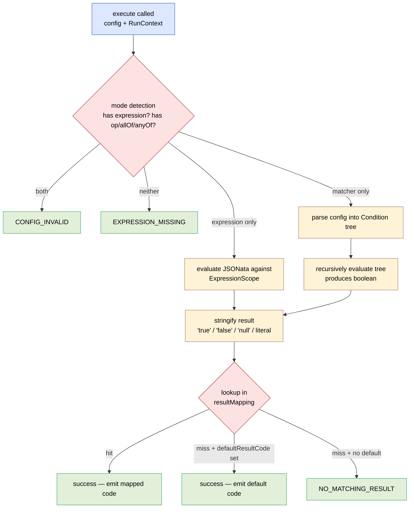
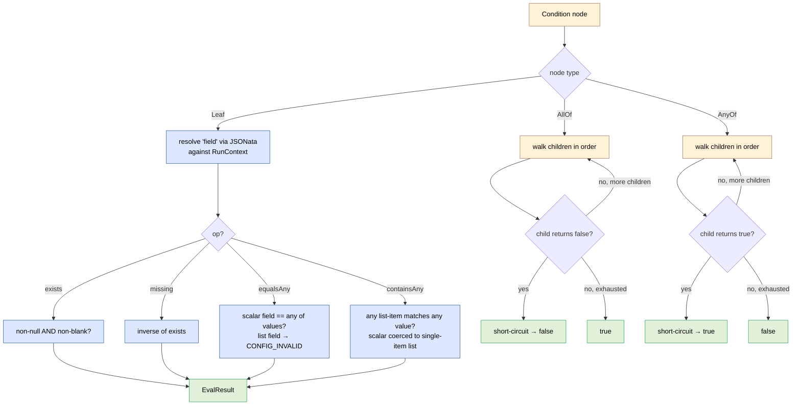
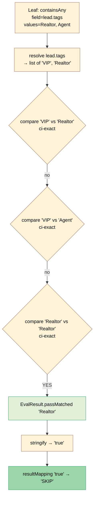
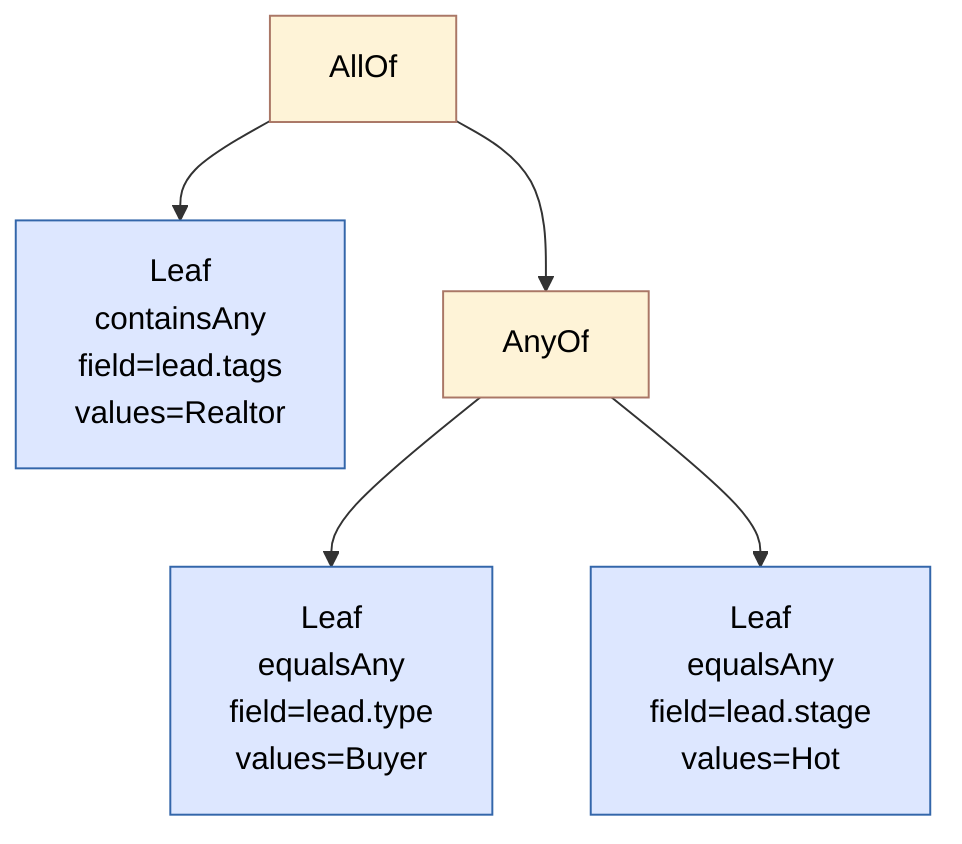
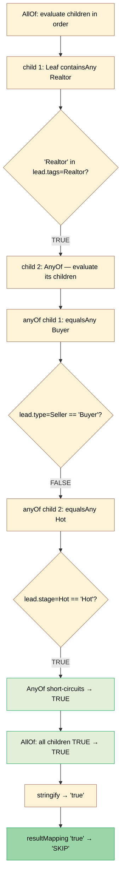

# `branch_on_field` — Reference

Conditional routing step. Evaluates **either** a JSONata expression **or** a
declarative matcher (with `allOf` / `anyOf` composites) against the run
context, stringifies the result, and emits a result code via
`resultMapping` / `defaultResultCode`.

## At a glance

| | |
|---|---|
| **Step ID** | `branch_on_field` |
| **Class** | `BranchOnFieldWorkflowStep` |
| **Side effects** | None — pure routing. No FUB calls, no DB writes. |
| **Result codes** | Dynamic (declared as empty set; codes come from `resultMapping`) plus the fixed failure codes below. |
| **Retry policy** | `NO_RETRY` (default — config errors don't get retried). |
| **Requires `sourceLeadId`?** | No. Works without a lead. |

## The two modes

A single `branch_on_field` node uses **exactly one** of these modes — never both:

- **Expression mode** — supply a JSONata `expression`. Same as before this
  step was extended. Powerful, formula syntax.
- **Matcher mode** — supply `field` + `op` (a leaf), or `allOf` / `anyOf`
  (a composite). Declarative. No JSONata required for the common cases.

Mode is auto-detected:

- `expression` present → expression mode
- `op` / `allOf` / `anyOf` present → matcher mode
- Both present → `CONFIG_INVALID`
- Neither present → `EXPRESSION_MISSING`

## How it evaluates

### Generic — step lifecycle

The dispatcher in `execute(...)` chooses a mode, evaluates, then routes
the boolean/value through `resultMapping`:



### Generic — condition tree evaluation

The matcher mode builds a tree from the config. Each node is one of
three shapes (sealed): `Leaf`, `AllOf`, `AnyOf`. Evaluation is recursive
with short-circuiting:



Leaf comparisons use the configured `match` rule (`ci-exact` /
`ci-contains` / `cs-exact`) for string-vs-string; numeric comparisons
are always lenient cross-type (`Integer 12` matches `Long 12`); other
types fall back to `Objects.equals`.

### Example A — simple leaf

**Config**

```json
{
  "field": "lead.tags",
  "op": "containsAny",
  "values": ["Realtor", "Agent"],
  "match": "ci-exact",
  "resultMapping": { "true": "SKIP", "false": "PROCEED" }
}
```

**Lead data**

```json
{ "tags": ["VIP", "Realtor"] }
```

**Trace**



Final outputs handed to the next step:

```json
{
  "expressionResult": "true",
  "matchResult":      true,
  "matchedValue":     "Realtor"
}
```

`matchedValue` is `"Realtor"` (the config-side value that fired), not
`"Realtor"` from the lead tags — even though they happen to match here.
For a `ci-contains` match where lead tag was `"VIP Realtor"` and config
value was `"Realtor"`, `matchedValue` would still be `"Realtor"`.

### Example B — nested composite with short-circuit

**Rule** *(intent)*: `Realtor AND (Buyer OR stage=Hot)`

**Config**

```json
{
  "allOf": [
    { "field": "lead.tags",  "op": "containsAny", "values": ["Realtor"] },
    {
      "anyOf": [
        { "field": "lead.type",  "op": "equalsAny", "values": ["Buyer"] },
        { "field": "lead.stage", "op": "equalsAny", "values": ["Hot"] }
      ]
    }
  ],
  "resultMapping": { "true": "SKIP", "false": "PROCEED" }
}
```

**Lead data**

```json
{ "tags": ["Realtor"], "type": "Seller", "stage": "Hot" }
```

**Parsed tree**



**Trace**



Final outputs:

```json
{
  "expressionResult": "true",
  "matchResult":      true
}
```

`matchedValue` is **absent** because the top-level node is `AllOf`, not a
leaf — composites can match via many paths and there's no single
canonical value to report.

If the lead had been `{"tags": ["Buyer"], …}` instead, `AllOf`'s first
child would have returned false immediately and the `AnyOf` subtree
would never have been evaluated (short-circuit). The output would be
`matchResult: false`.

## Config schema

### Common (both modes)

| Field | Type | Required | Notes |
|---|---|---|---|
| `resultMapping` | `Map<String, String>` | strongly recommended | Maps stringified evaluation result (`"true"`, `"false"`, `"null"`, or whatever the JSONata returns) to a result code. |
| `defaultResultCode` | `String` | optional | Fallback when no `resultMapping` key matches. If both this and the mapping miss, the step fails with `NO_MATCHING_RESULT`. |

### Expression mode

| Field | Type | Required | Notes |
|---|---|---|---|
| `expression` | `String` | yes | JSONata expression. Evaluated against the [`ExpressionScope`](../how-the-engine-works.md#a-the-jsonata--expression-evaluator) (`lead.*`, `event.payload.*`, `steps.<nodeId>.outputs.*`, `now.*`, `sourceLeadId`). |

### Matcher mode — leaf

| Field | Type | Required | Notes |
|---|---|---|---|
| `field` | `String` (JSONata path) | yes | Same namespaces as `expression`. Typically `lead.tags`, `lead.type`, `now.isDaytime`, etc. |
| `op` | enum | yes | One of `containsAny`, `equalsAny`, `exists`, `missing`. |
| `values` | `List<Object>` | required for `containsAny`/`equalsAny`, forbidden for `exists`/`missing` | Strings, numbers, or booleans. `minItems: 1`. |
| `match` | enum | optional, default `ci-exact` | `ci-exact` \| `ci-contains` \| `cs-exact`. Applied only to string-vs-string comparisons; ignored for numbers/booleans. |

### Matcher mode — composite

| Field | Type | Required | Notes |
|---|---|---|---|
| `allOf` | `List<Condition>` | mutually exclusive with `anyOf` and leaf keys at same level | Non-empty. True iff **all** children true (short-circuits on first false). |
| `anyOf` | `List<Condition>` | mutually exclusive with `allOf` and leaf keys at same level | Non-empty. True iff **any** child true (short-circuits on first true). |

Composites nest arbitrarily: an `allOf` can contain `anyOf` children, and
vice-versa. Each child is itself a full condition (leaf, `allOf`, or
`anyOf`).

### Operator semantics

| Op | Field shape | True when… |
|---|---|---|
| `containsAny` | list (scalar coerced to single-element list; `null` → empty list) | any element of the field matches any of `values` under the `match` rule |
| `equalsAny` | scalar (throws `CONFIG_INVALID` on a list-valued field) | the field equals any of `values` under the `match` rule |
| `exists` | any | field resolves to a non-null value; for strings, also non-blank |
| `missing` | any | inverse of `exists` |

### `match` rules (string compare only)

| Rule | Behaviour | Example |
|---|---|---|
| `ci-exact` *(default)* | Case-insensitive equals | `"Realtor"` matches `"realtor"`, NOT `"VIP Realtor"` |
| `ci-contains` | Case-insensitive substring | `"Realtor"` matches `"VIP Realtor"`, `"Realtor - Buyer Agent"` |
| `cs-exact` | Case-sensitive equals | `"Realtor"` matches `"Realtor"`, NOT `"realtor"` |

Cross-numeric comparisons (`Integer 12` vs `Long 12L`) are always
lenient via `doubleValue()`. Other type mismatches (e.g. `12` vs `"12"`)
never match.

## Result codes

| Code | When |
|---|---|
| *dynamic* | Emitted via `resultMapping` or `defaultResultCode`. These are the codes you actually route on. |
| `EXPRESSION_MISSING` | Neither `expression` nor `op`/`allOf`/`anyOf` was supplied. |
| `EXPRESSION_EVAL_ERROR` | JSONata evaluator threw. **In practice rarely fires** — the upstream evaluator currently degrades malformed expressions to `null` rather than throwing (see Limitations). |
| `NO_MATCHING_RESULT` | Evaluation produced a value that's neither in `resultMapping` nor covered by `defaultResultCode`. |
| `CONFIG_INVALID` | Both modes supplied; or matcher-mode config is malformed (unknown `op`, unknown `match`, missing/forbidden `values`, empty composite, mixed keys at same level, list field with `equalsAny`, non-string `field`, etc.). |

`declaredResultCodes()` returns the empty set — the graph validator
treats this step as emitting dynamic codes and doesn't reject transitions
keyed by codes the step can't statically prove it emits.

## Outputs

Available to downstream steps as `steps.<thisNodeId>.outputs.*`.

| Key | When | Value |
|---|---|---|
| `expressionResult` | always (both modes) | Stringified evaluation result: `"true"`, `"false"`, `"null"`, or the JSONata literal. |
| `matchResult` | matcher mode only | Typed boolean. |
| `matchedValue` | matcher mode, **only when top-level is a leaf and a match fired** | The **config-side** value (from `values`) that triggered the match. Useful for "which rule fired?" auditing. **Not** the lead-side value. |

> Note: `matchedValue` is the value from the config's `values` list, not
> the lead value. E.g. a lead tag `"VIP Realtor"` matched by config
> `"Realtor"` under `ci-contains` → `matchedValue = "Realtor"`.

## Examples

Each example is the full config payload for one `branch_on_field` node.

### Level 1 — single check, single value

**Is this a Buyer?**

```json
{
  "field": "lead.type",
  "op": "equalsAny",
  "values": ["Buyer"],
  "resultMapping": { "true": "PROCEED", "false": "SKIP" }
}
```

**Does this lead have the `Realtor` tag?**

```json
{
  "field": "lead.tags",
  "op": "containsAny",
  "values": ["Realtor"],
  "resultMapping": { "true": "SKIP", "false": "PROCEED" }
}
```

**Is the lead assigned to anyone yet?**

```json
{
  "field": "lead.assignedUserId",
  "op": "exists",
  "resultMapping": { "true": "PROCEED", "false": "WAIT" }
}
```

**Is the lead unclaimed?**

```json
{
  "field": "lead.claimed",
  "op": "equalsAny",
  "values": [false],
  "resultMapping": { "true": "PROCEED", "false": "SKIP" }
}
```

### Level 2 — one field, multiple acceptable values (OR within a leaf)

**Buyer OR Seller**

```json
{
  "field": "lead.type",
  "op": "equalsAny",
  "values": ["Buyer", "Seller"],
  "resultMapping": { "true": "PROCEED", "false": "SKIP" }
}
```

**Any partner-agent tag** *(the original Realtor-skip use case)*

```json
{
  "field": "lead.tags",
  "op": "containsAny",
  "values": ["Realtor", "Agent", "Partner Agent", "Lender"],
  "match": "ci-exact",
  "resultMapping": { "true": "SKIP", "false": "PROCEED" }
}
```

**Loose tag match — catch tag drift**

```json
{
  "field": "lead.tags",
  "op": "containsAny",
  "values": ["realtor", "agent"],
  "match": "ci-contains",
  "resultMapping": { "true": "SKIP", "false": "PROCEED" }
}
```

Matches `"Realtor"`, `"VIP Realtor"`, `"Realtor - Buyer Agent"`, `"AGENT 2025"`, etc.

**Case-sensitive — only exact `Realtor`**

```json
{
  "field": "lead.tags",
  "op": "containsAny",
  "values": ["Realtor"],
  "match": "cs-exact",
  "resultMapping": { "true": "SKIP", "false": "PROCEED" }
}
```

### Level 3 — AND across fields (`allOf`)

**Skip if Realtor AND Buyer**

```json
{
  "allOf": [
    { "field": "lead.tags", "op": "containsAny", "values": ["Realtor"] },
    { "field": "lead.type", "op": "equalsAny",   "values": ["Buyer"] }
  ],
  "resultMapping": { "true": "SKIP", "false": "PROCEED" }
}
```

**Proceed only if claimed AND has phone AND has email**

```json
{
  "allOf": [
    { "field": "lead.claimed", "op": "equalsAny", "values": [true] },
    { "field": "lead.phones",  "op": "exists" },
    { "field": "lead.emails",  "op": "exists" }
  ],
  "resultMapping": { "true": "PROCEED", "false": "SKIP" }
}
```

### Level 4 — OR across fields (`anyOf`)

**Skip if Realtor OR Lender OR Trash stage**

```json
{
  "anyOf": [
    { "field": "lead.tags",  "op": "containsAny", "values": ["Realtor", "Lender"] },
    { "field": "lead.stage", "op": "equalsAny",   "values": ["Trash"] }
  ],
  "resultMapping": { "true": "SKIP", "false": "PROCEED" }
}
```

> `containsAny` already does "OR within one field". Use `anyOf` for OR
> **across different fields**.

### Level 5 — mix AND with OR (nested)

**Skip if Realtor AND (Buyer OR Seller)**

```json
{
  "allOf": [
    { "field": "lead.tags", "op": "containsAny", "values": ["Realtor"] },
    {
      "anyOf": [
        { "field": "lead.type", "op": "equalsAny", "values": ["Buyer"] },
        { "field": "lead.type", "op": "equalsAny", "values": ["Seller"] }
      ]
    }
  ],
  "resultMapping": { "true": "SKIP", "false": "PROCEED" }
}
```

**Skip if (Realtor AND Buyer) OR (Lender AND Seller)**

```json
{
  "anyOf": [
    {
      "allOf": [
        { "field": "lead.tags", "op": "containsAny", "values": ["Realtor"] },
        { "field": "lead.type", "op": "equalsAny",   "values": ["Buyer"] }
      ]
    },
    {
      "allOf": [
        { "field": "lead.tags", "op": "containsAny", "values": ["Lender"] },
        { "field": "lead.type", "op": "equalsAny",   "values": ["Seller"] }
      ]
    }
  ],
  "resultMapping": { "true": "SKIP", "false": "PROCEED" }
}
```

### Level 6 — non-lead namespaces

**Only fire during business hours**

```json
{
  "field": "now.isDaytime",
  "op": "equalsAny",
  "values": [true],
  "resultMapping": { "true": "PROCEED", "false": "WAIT" }
}
```

**Branch on a previous step's output**

```json
{
  "field": "steps.fetchCall.outputs.outcome",
  "op": "equalsAny",
  "values": ["No Answer", "Voicemail", "Wrong Number"],
  "resultMapping": { "true": "RETRY", "false": "DONE" }
}
```

**Branch on the webhook source**

```json
{
  "field": "event.payload.source",
  "op": "equalsAny",
  "values": ["Zillow", "Realtor.com"],
  "resultMapping": { "true": "FAST_PATH", "false": "STANDARD" }
}
```

### Level 7 — realistic combined rules

**Skip note creation for partner-agents during business hours only**

```json
{
  "allOf": [
    {
      "field": "lead.tags",
      "op": "containsAny",
      "values": ["Realtor", "Agent", "Partner Agent", "Lender"],
      "match": "ci-exact"
    },
    { "field": "now.isDaytime", "op": "equalsAny", "values": [true] }
  ],
  "resultMapping": { "true": "SKIP_NOTE", "false": "PROCEED" }
}
```

**Hot-lead alert routing**

```json
{
  "allOf": [
    { "field": "lead.stage", "op": "equalsAny", "values": ["Hot", "New"] },
    {
      "anyOf": [
        { "field": "event.payload.source", "op": "equalsAny", "values": ["Zillow"] },
        { "field": "lead.assignedPondId",  "op": "equalsAny", "values": [42, 43, 44] }
      ]
    }
  ],
  "resultMapping": { "true": "ALERT_AE_TEAM", "false": "STANDARD_FOLLOWUP" }
}
```

### Level 8 — JSONata expression mode (power-user fallback)

For operators the matcher doesn't support — regex, NOT, list-length
checks, arithmetic — fall back to the original expression mode:

```json
{
  "expression": "$count(lead.tags) > 2 and not('DNC' in lead.tags)",
  "resultMapping": { "true": "PROCEED", "false": "SKIP" }
}
```

```json
{
  "expression": "lead.assignedUserId in [12, 14, 30] and $contains(lead.source, /zillow/i)",
  "resultMapping": { "true": "FAST_PATH", "false": "STANDARD" }
}
```

The two modes are mutually exclusive in a **single** node. To combine
declarative-and-power-user logic, chain multiple `branch_on_field` nodes
in the graph.

## Wiring it into a workflow graph

`branch_on_field` is a routing step — its result code drives the
graph's `transitions` map. Pair it with at least one downstream
action.

```jsonc
{
  "entryNode": "guard",
  "nodes": [
    {
      "id": "guard",
      "type": "branch_on_field",
      "config": {
        "field": "lead.tags",
        "op": "containsAny",
        "values": ["Realtor", "Agent", "Partner Agent"],
        "match": "ci-exact",
        "resultMapping": { "true": "SKIP", "false": "PROCEED" }
      },
      "transitions": {
        "SKIP":    { "terminal": "COMPLETED" },
        "PROCEED": { "next": "note" }
      }
    },
    {
      "id": "note",
      "type": "fub_create_note",
      "config": {
        "message": "Auto-followup …",
        "mentionUserIds": [12],
        "mentionUserNames": ["Jane"]
      },
      "transitions": {
        "SUCCESS": { "terminal": "COMPLETED" },
        "FAILED":  { "terminal": "FAILED" }
      }
    }
  ]
}
```

## Limitations and known gaps — as of 2026-05-14

This section is dated because the underlying step is actively evolving.
Items here reflect the state of the step on **2026-05-14**. When any
listed gap is closed, remove the row and re-date the section.

### Missing operators

Each entry below is a declarative capability the step does **not**
have today. Authors who need these rules can fall back to **expression
mode** (raw JSONata in `expression`) — every gap below has a JSONata
workaround.

| Capability | Status (2026-05-14) | JSONata workaround |
|---|---|---|
| `NOT` composite | not implemented | `expression: "not(<inner predicate>)"` or invert the `resultMapping` keys at the outer gate |
| Numeric comparison: `gt`, `gte`, `lt`, `lte` | not implemented | `expression: "lead.assignedUserId > 12"` |
| Range check: `between` | not implemented | `expression: "lead.assignedUserId > 10 and lead.assignedUserId < 20"` |
| Regex on a field | not implemented | `expression: "$contains(lead.source, /zillow/i)"` |
| Length / count ops (`hasAtLeast`, `hasExactly`) | not implemented | `expression: "$count(lead.tags) > 2"` |
| Date arithmetic (`olderThan`, `withinLastNDays`) | not implemented | `expression: "$toMillis(lead.lastActivity) < $millis() - 7*86400000"` |

### Missing engine-level capabilities

These don't live inside the step itself but affect anyone building on
top of it (especially a condition-builder UI):

| Capability | Status (2026-05-14) | Note |
|---|---|---|
| Dry-run / evaluate-condition admin endpoint | not implemented | A UI cannot "test this rule against this lead" without firing a full workflow run. |
| Field catalog endpoint (`GET /admin/lead-fields`) | not implemented | UI has to hardcode knowledge of `lead.*` keys instead of discovering them from `LeadUpsertService.SNAPSHOT_FIELDS`. |
| Per-leaf match tracing inside composites | not implemented | `matchedValue` is emitted only when the top-level condition is a leaf. Inside `allOf` / `anyOf` there is no way to surface "which child condition fired." |
| Mixed-mode authoring (declarative tree with a JSONata leaf) | not implemented | Modes are mutually exclusive at top level — you cannot embed an `expression`-mode leaf inside an `allOf`. Splits forced into multiple gate nodes. |

### Behavioural quirks

| Quirk | Status (2026-05-14) | Note |
|---|---|---|
| Malformed JSONata silently degrades to `null` | upstream issue, not local | `EXPRESSION_EVAL_ERROR` rarely fires in practice — see [`known-issues.md` #10](../../../engineering-reference/known-issues.md). Two tests pin this behaviour so a future fix surfaces as a deliberate change. |
| Numeric precision for large longs | `doubleValue()` is used for cross-numeric comparison | `Long.MAX_VALUE`-range values lose precision. Fine for typical FUB ids (8-digit) and counters. Risky if values exceed ~2^53. |
| `matchedValue` is the **config-side** value, not the lead-side value | by design | Lead tag `"VIP Realtor"` matched by config `"Realtor"` under `ci-contains` → `matchedValue = "Realtor"`. Tells the author *which rule fired*, not what data triggered it. |
| Stale lead snapshot vs live FUB state | structural — local snapshot lags FUB by webhook latency | Conditions evaluate against `RunContext.lead` which is the locally synced `leads.lead_details` JSONB; if a webhook is delayed, evaluation may be slightly out of date. Acceptable for most workflows. |

### Workaround patterns

Until the gaps above are closed, two patterns cover most needs:

1. **Chain a JSONata gate before the matcher gate.** Put expression-mode
   `branch_on_field` first for the capability the matcher can't express
   (e.g. `not`), route its `true`/`false` into the next node which uses
   matcher mode for the declarative part.
2. **Invert at the routing layer, not the condition.** "Skip if Realtor"
   and "proceed if NOT Realtor" produce identical runtime behaviour —
   just flip the `resultMapping`. This sidesteps the missing `not` for
   single-gate cases.

### What is NOT a limitation

A few things have come up as questions but are intentional and unlikely
to change:

- **`matchedValue` returns the config value, not the lead value** —
  see Behavioural quirks. This is the design.
- **`equalsAny` rejects list-valued fields with `CONFIG_INVALID`** —
  use `containsAny` for list fields. The strict-shape behaviour is
  deliberate; lenient coercion would mask user errors.
- **`match` rule is ignored for non-string comparisons** — `match` only
  applies to string-vs-string compares. Number and boolean comparisons
  use type-aware equality.

## Related docs

- [Design / research for matcher mode](../../branch-on-field-matchers/research.md)
- [Implementation plan for matcher mode](../../branch-on-field-matchers/plan.md)
- [`how-the-engine-works.md`](../how-the-engine-works.md) — engine
  lifecycle, expression scope, claim loop
- [Control-flow step-types plan](../control-flow-step-types-plan.md) —
  proposes a future ergonomic `if` step that wraps `branch_on_field`
- Source: `service/workflow/steps/BranchOnFieldWorkflowStep.java`
- Tests: `service/workflow/BranchOnFieldWorkflowStepTest.java` (57 cases)
