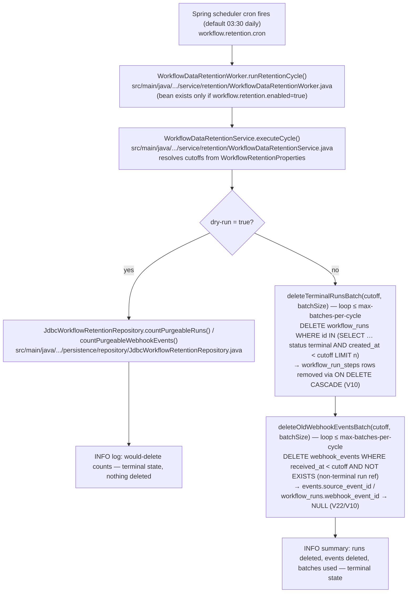

# Workflow run-data retention — plan

## Problem

Nothing in the codebase ever deletes from `workflow_runs`, `workflow_run_steps`, or
`webhook_events` (audit 2026-06-10: no retention/purge/prune code in `src/main`). Every
run and every inbound webhook is kept forever. The upcoming loop primitive multiplies
step-row volume ~7× per run — the stress-test audit
([finding C3](../../audits/loop-primitive-stress-test-2026-06-10.md)) projects ~5M step
rows and 2.5–5 GB/month at 5k runs/day. Without a retention story the tables grow
unbounded, and the fat JSONB columns (`workflow_graph_snapshot`, `trigger_payload`,
`payload`, `resolved_config`, `outputs`) make every row expensive.

## Discovery (research folded in — single-phase feature)

What the schema already gives us:

- `workflow_run_steps.run_id → workflow_runs.id` is **`ON DELETE CASCADE`** (V10): deleting
  a run deletes its steps in the same statement. Steps never need their own purge pass.
- `workflow_runs.webhook_event_id → webhook_events.id` is **`ON DELETE SET NULL`** (V10).
- `events.source_event_id → webhook_events.id` is **`ON DELETE SET NULL`** (V22), and V22's
  own comment states the intent: *"events outlive the webhook ingest rows"*. Purging
  `webhook_events` was anticipated by design.
- `workflow_runs.domain_event_id → events.id` is **`ON DELETE SET NULL`** (V23) — irrelevant
  here since `events` is out of scope, but confirms run rows never block other deletes.
- Terminal run statuses (`WorkflowRunStatus`): `COMPLETED`, `FAILED`, `CANCELED`,
  `DUPLICATE_IGNORED`. `PENDING` and `BLOCKED` are live. A loop-primitive foreman keeps its
  run `PENDING` for the loop's whole life, so a terminal-only purge can never amputate an
  in-flight loop.
- Index `idx_workflow_runs_status_created_at (status, created_at)` (V10) serves the purge
  candidate query as-is. `webhook_events` has no age-only index — one small migration adds it.
- Scheduled-job convention to mirror: `WorkflowExecutionDueWorker` —
  `@Scheduled` + `@ConditionalOnProperty` enable flag + `@ConfigurationProperties` class +
  env-var-backed entries in `application.properties`. `@EnableScheduling` is already on
  (`WorkflowWorkerSchedulingConfig`).

## Decision: purge, not archive (v1)

Hard-delete rows past the retention window. No archive table, no export.

Why purge wins here:

- The data is **operational telemetry** (run history, webhook ingest log), not a business
  record. The admin UI browses recent activity; nothing consumes months-old runs.
- The FK graph was **designed for deletion** (CASCADE on steps, SET NULL everywhere else).
- An archive needs storage infra, a schema for dead data, and a reader — none of which has
  a consumer today (YAGNI). If a compliance need appears later, a pre-purge `pg_dump`
  runbook or an archive sink can be added behind the same job without redesign.

## Retention rules

1. **`workflow_runs`** — delete runs where `status` is terminal
   (`COMPLETED | FAILED | CANCELED | DUPLICATE_IGNORED`) and
   `created_at < now() − runRetentionDays`. Steps go with them via CASCADE.
   Non-terminal runs are **never** deleted, regardless of age. Age is measured from
   `created_at` (run start) — it has the supporting index, and "runs older than N days"
   is the natural reading; a wait-heavy run that *finished* recently but *started* 91 days
   ago is still 91 days old.
2. **`webhook_events`** — delete rows where `received_at < now() − webhookRetentionDays`
   **and** no non-terminal `workflow_run` references them (a live run keeps its trigger
   provenance). Remaining references from `events` / terminal-era data go to NULL by FK
   design. Runs are purged first each cycle so most references are already gone.
3. **Out of scope (v1):** `events` (new, load-bearing audit trail for domain-event
   triggers — its own retention deserves its own decision once volume is observed),
   `processed_calls` (legacy Scenario-1 ledger, low volume, no FK pressure).

Constraint enforced at startup: `webhookRetentionDays ≥ runRetentionDays`, so a run is
never purged after the webhook that triggered it would have survived it pointlessly —
and more importantly, a live run's webhook can't age out before the run itself does.

## Job design

`WorkflowDataRetentionWorker`, `@Scheduled(cron)` — default `03:30` daily, off-peak.
Gated by `@ConditionalOnProperty("workflow.retention.enabled")`, **default `false`**.

Deletes run in **batches, each in its own transaction**
(`DELETE … WHERE id IN (SELECT id … ORDER BY created_at LIMIT :batch)`), looping until no
candidates remain or the per-cycle cap is hit. This bounds transaction size (a single loop
run can cascade thousands of step rows), avoids long lock holds, and lets a huge first
backlog drain over several nightly cycles instead of one monster delete.

**Dry-run mode** (`dry-run`, **default `true`**): the job runs the same candidate queries,
logs would-delete counts (runs, their step rows, webhook events) at INFO, and deletes
nothing. Production rollout is: enable → watch dry-run counts for a few nights → flip
`dry-run=false`. Two explicit flags must change before anything is deleted.

### Configuration (`workflow.retention.*`)

| Property | Default | Meaning |
|---|---|---|
| `enabled` | `false` | master switch for the scheduled job |
| `dry-run` | `true` | log candidate counts, delete nothing |
| `cron` | `0 30 3 * * *` | schedule |
| `run-retention-days` | `90` | terminal-run window |
| `webhook-retention-days` | `90` | webhook-event window (must be ≥ run window) |
| `delete-batch-size` | `200` | rows targeted per DELETE statement (runs or events) |
| `max-batches-per-cycle` | `50` | per-table cap on batches per scheduled cycle |

All exposed as env-var-backed entries in `application.properties`
(`WORKFLOW_RETENTION_*`), matching the `workflow.worker.*` convention.

### Layering

- `config/WorkflowRetentionProperties` + registration alongside the existing
  worker-properties config.
- `persistence/repository/JdbcWorkflowRetentionRepository` — bulk SQL (count + batched
  delete) via `JdbcTemplate`, same style as `JdbcWorkflowRunStepClaimRepository`. Bulk
  age-based deletes are set operations; entity-by-entity JPA deletion would be pathological.
- `service/retention/WorkflowDataRetentionService` — orchestration: runs first, then
  webhook events; dry-run branch; per-cycle summary log line.
- `service/retention/WorkflowDataRetentionWorker` — the `@Scheduled` shell, mirroring
  `WorkflowExecutionDueWorker`'s worker/service split.

### Migration

`V24__add_webhook_events_received_at_index.sql` — `CREATE INDEX … ON webhook_events
(received_at)`. The existing indexes all lead with `status`; the purge candidate query is
age-only.

### Concurrency note

Like the due-step worker, the job assumes the current single-instance deployment. Deletes
are idempotent, and batched candidate selection means two concurrent instances would waste
work, not corrupt data — but no `SKIP LOCKED`/leader-election is added until multi-instance
deployment is a real thing (YAGNI, consistent with the rest of the engine).

### Engine-extraction note (RD-007)

The run/step purge half is kernel-shaped (touches only kernel tables `workflow_runs` /
`workflow_run_steps`); the webhook half is host glue (`webhook_events` is a host table).
The repository keeps the two concerns in separate methods so the kernel half can lift
cleanly into the extracted library later.

## Lifecycle diagram

## Validation

- Repository tests (JPA + Flyway slice): old terminal run deleted **and steps cascade**;
  old non-terminal run survives; young terminal run survives; webhook event referenced by
  a live run survives past its window; unreferenced old event deleted and `events.source_event_id`
  goes NULL; batch size respected.
- Service tests: dry-run deletes nothing and logs counts; runs purged before events;
  per-cycle cap stops the loop.
- Properties test: `webhook-retention-days < run-retention-days` rejected at startup.
- Full existing suite must stay green (≥85% policy).
