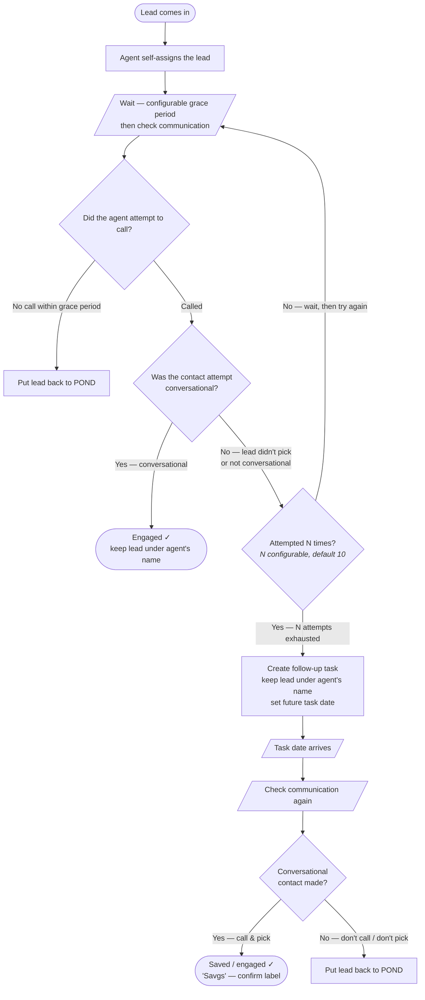

# MVP Workflow — Agent Follow-up Enforcement

> Digitized from the hand-drawn sketch (`MVP WF.jpg`). This is the MVP workflow we want
> to build to prove the system end-to-end.

## Flow

## Notes / decisions

1. **Retry count `N`** — configurable. Default **10**. When the agent calls but the lead
   doesn't pick (or the contact isn't conversational), retry up to `N` times before
   escalating to a task.
2. **Grace period before "no call"** — configurable wait. Only after this window do we
   conclude the agent didn't attempt contact and send the lead back to the POND.
3. **Conversational gate** — the success vs. escalate decision is driven by whether the
   contact attempt was **conversational** (real two-way contact) vs. merely connected /
   not picked up. This maps to the existing `wait_and_check_communication` result codes
   (`CONVERSATIONAL` / `CONNECTED_NON_CONVERSATIONAL` / `COMM_NOT_FOUND`).
4. **Keep-under-agent** — on the task path the lead stays owned by the same agent (their
   name) rather than being reassigned.

## Open questions

- **"Savgs"** node — what should the final success label read? (Saved? Savings? a stage /
  pond name?) Currently labeled generically.
- Should the **task-date re-check** reuse the same configurable wait/lookback as the
  initial check, or its own value?

## Candidate step-type mapping (toward implementation)

| Sketch box | Likely step type |
| --- | --- |
| Wait + check communication | `wait_and_check_communication` |
| Did agent call? / conversational? | result codes from the check (branch) |
| Retry up to N | branch on attempt counter (bounded loop) |
| Create follow-up task, keep under agent | `fub_create_task` |
| Put back to POND | `fub_move_to_pond` |
