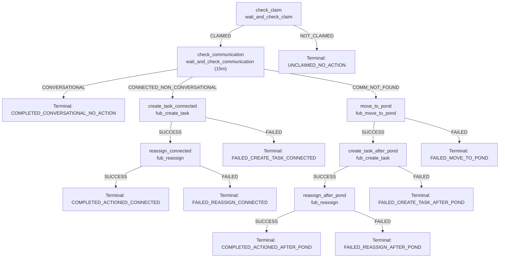

# FUB Lead Claim Contact Follow-up (v1)

## Workflow Key
`fub-lead-claim-contact-followup--v1`

## Trigger
```json
{
  "type": "webhook_fub",
  "config": {
    "eventDomain": "ASSIGNMENT",
    "eventAction": "CREATED"
  }
}
```

## Diagram


